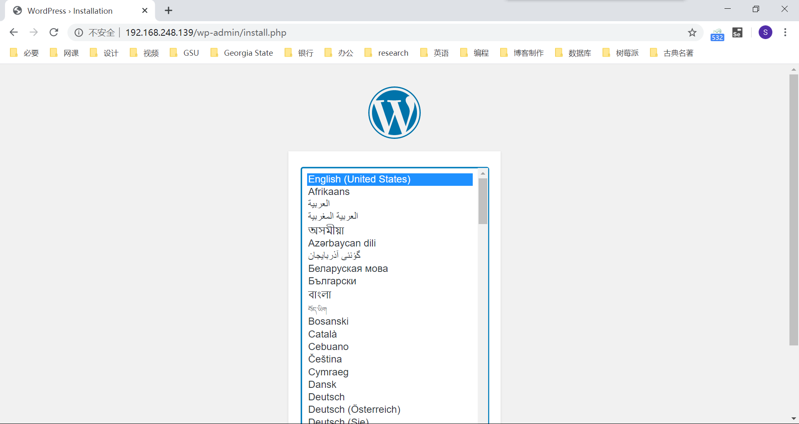
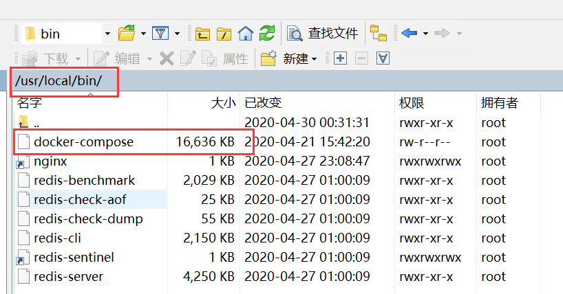
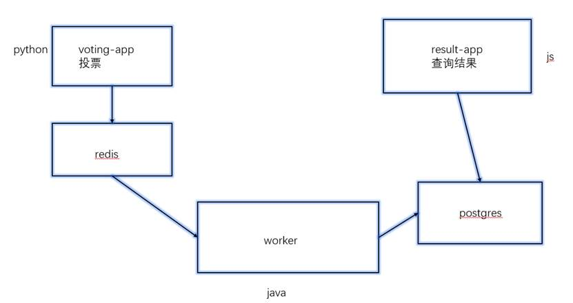
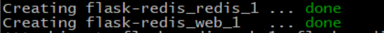
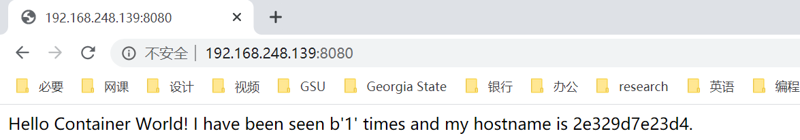
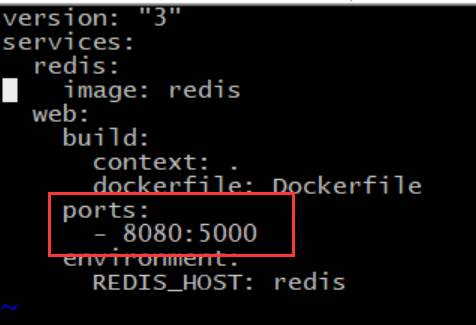
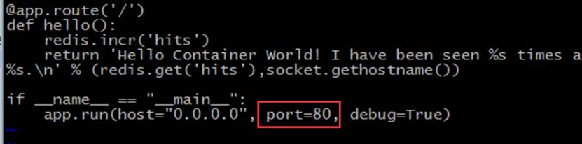
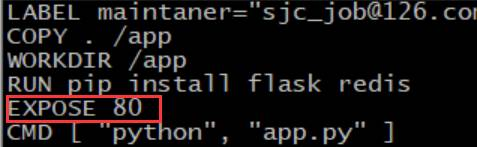
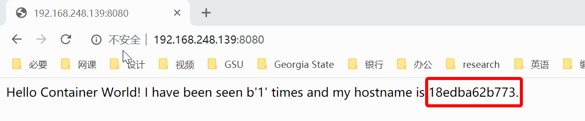
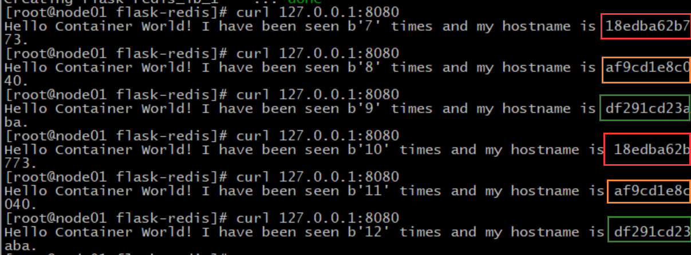

## docker Compose 多容器部署

[TOC]

### docker 部署 WordPress

WordPress 是一个博客网站。使用 docker 部署 WordPress 需要两个镜像：WordPress 镜像和 MySQL 镜像。最新版的 MySQL 似乎不是特别兼容，所以我们使用 5.5 版本的 MySQL：

```bash
docker pull wordpress
docker pull mysql:5.5
```

将 MySQL 5.5 的版本号改成 latest，避免后面可能会自动下载最新版的 MySQL：

```bash
docker tag mysql:5.5 mysql:latest
```

启动 MySQL 镜像：

```bash
docker run -d --name mysql -e MYSQL_ALLOW_EMPTY_PASSWORD=yes mysql:5.5
```

启动 WordPress 镜像，绑定 80 端口：

```bash
docker run -d -e WORDPRESS_DB_HOST=mysql:3306 --link mysql -p 80:80 wordpress
```

就可以用浏览器访问到 WordPress 的配置页面：



 按照指引，就可以创建博客啦！

### docker compose 介绍

上面的这种 WordPress 部署，需要一个一个地下载和开启多个镜像和容器，比较麻烦。这时，我们就可以用到 docker compose。

多容器的 APP 很难部署和管理，docker compose 就类似于批处理。

### docker compose 安装和使用

接下来我们用 docker-compose 的方式部署 WordPress。

先上传文件到目录：



上传好之后，赋予其可执行的权限：

```bash
chmod 777 docker-compose
```

查看版本号，确定 docker compose 是可以使用的：

```bash
[root@node01 bin]# docker-compose version
docker-compose version 1.25.1-rc1, build d92e9bee
docker-py version: 4.1.0
CPython version: 3.7.4
OpenSSL version: OpenSSL 1.1.0l  10 Sep 2019
```

创建文件和文件，编辑 `docker-compose.yml` 文件：

```bash
[root@node01 bin]# cd /home
[root@node01 home]# mkdir wordpress
[root@node01 home]# cd wordpress/
[root@node01 wordpress]# vi docker-compose.yml
```

写入以下内容

```yaml
version: '3'

services:

  wordpress:
    image: wordpress
    ports:
      - 80:80
    environment:
      WORDPRESS_DB_HOST: mysql
      WORDPRESS_DB_PASSWORD: admin
    networks:
      - my-bridge

  mysql:
    image: mysql:5.5
    environment:
      MYSQL_ROOT_PASSWORD: admin
      MYSQL_DATABASE: wordpress
    volumes:
      - mysql-data:/var/lib/mysql
    networks:
      - my-bridge

volumes:
  mysql-data:

networks:
  my-bridge:
    driver: bridge
```

启动 compose，如果配置文件的文件名为 docker-compose.yml 则可以不指定，否则需要使用 -f 参数指定文件名：

```bash
docker-compose -f docker-compose.yml up
# 或
docker-compose up
```

通过浏览器，即可访问到 WordPress 的页面。

对于很复杂的项目，只要编写好 docker-compose，就可以通过类似的方法，很容易地运行起来：



### 容器扩展

如果希望同时开启多个相同的容器，可以使用容器扩展实现。

stop 停止容器，down 是停止并删除，停止的容器可以用 start 开启：

```bash
[root@node01 wordpress]# docker-compose down
Stopping wordpress_wordpress_1 ... done
Stopping wordpress_mysql_1     ... done
Removing wordpress_wordpress_1 ... done
Removing wordpress_mysql_1     ... done
Removing network wordpress_my-bridge
[root@node01 wordpress]# docker-compose stop
Stopping wordpress_wordpress_1 ... done
Stopping wordpress_mysql_1     ... done
[root@node01 wordpress]# docker-compose start
Starting wordpress ... done
Starting mysql     ... done
```

接下来的离辎重，我们会将 docker-compose 结合 Dockerfile 使用。

进入到前边 flask-redis 例子的目录中，里面的文件内容如下：

```bash
[root@node01 flask-redis]# ll
总用量 8
-rw-r--r-- 1 root root 430 4月  30 00:09 app.py
-rw-r--r-- 1 root root 193 4月  30 00:18 Dockerfile
[root@node01 flask-redis]# cat app.py 
from flask import Flask
from redis import Redis
import os
import socket

app = Flask(__name__)
redis = Redis(host=os.environ.get('REDIS_HOST', '127.0.0.1'), port=6379)

@app.route('/')
def hello():
    redis.incr('hits')
    return 'Hello Container World! I have been seen %s times and my hostname is %s.\n' % (redis.get('hits'),socket.gethostname())

if __name__ == "__main__":
    app.run(host="0.0.0.0", port=5000, debug=True)
[root@node01 flask-redis]# cat Dockerfile 
FROM python:3.6
LABEL maintaner="liushuo432@outlook.com"
COPY . /app
WORKDIR /app
RUN pip install flask redis -i https://pypi.tuna.tsinghua.edu.cn/simple
EXPOSE 5000
CMD [ "python", "app.py" ]
```

创建并编辑一个 `docker-compose.yml` 文件：

```bash
vi docker-compose.yml
```

加入如下内容：

```yaml
version: "3"
services:
  redis:
    image: redis
  web:
    build:
      context: .
      dockerfile: Dockerfile
    ports:
      - 8080:5000
    environment:
      REDIS_HOST: redis
```

运行：

```bash
docker-compose up
```

此时，redis 和 web 两个容器都只创建了一个：



可以通过浏览器访问：



停止并删除容器：

```bash
docker-compose down
```

将 docker-compose 里如下两行删掉，我们要创建多个 web，端口不能冲突：



启动时指定需要进行容器扩展的容器和数量：

```bash
[root@node01 flask-redis]# docker-compose up --scale web=3 -d
Creating network "flask-redis_default" with the default driver
Creating flask-redis_redis_1 ... done
Creating flask-redis_web_1   ... done
Creating flask-redis_web_2   ... done
Creating flask-redis_web_3   ... done
```

我们看到，web 容器启动了三个，实现了容器的扩展。

### 负载均衡

首先修改 `app.py`：

```bash
vi app.py
```

设置 flask 运行在 80 端口：



Dockerfile 里面也改一下：

```bash
vi Dockerfile
```

将端口改成 80：



docker-compose.yml 文件，修改成如下内容，实现负载均衡：

```yaml
version: "3"
services:
  redis:
    image: redis
  web:
    build:
      context: .
      dockerfile: Dockerfile
    environment:
      REDIS_HOST: redis
  lb:
    image: dockercloud/haproxy
    links:
      - web
    ports:
      - 8080:80
    volumes:
      - /var/run/docker.sock:/var/run/docker.sock
```

再次启动容器：

```
docker-compose up --scale web=3 -d
```

启动后，访问代码，可以看出是不同的容器返回的信息



