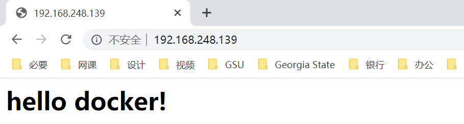
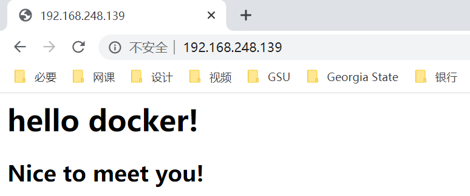

## docker 的持久化存储和数据共享

[TOC]

### 数据持久化的意义

容器中数据存在丢失的风险。因为我们可能会关闭和删除容器。这样容器中的数据也会跟着被删除。所以往往我们都不把数据存放到容器中，而是做一个映射，实现 docker 的持久化存储。

### 数据持久化方案

常用的数据持久化方案有两个：

- 基于本地文件系统的 Volume

- 基于 plugin 的 Volume

### Volume 的类型

- 受管理的 data Volume：由 docker 后台自动创建

- 绑定挂载的 Volume：具体挂载位置可以由用户指定

### 数据持久化 data Volume

在 docker hub 网站 https://hub.docker.com/ 搜 MySQL，可以看到官方的 Dockerfile 中也定义了 VOLUME：


前边的容器和镜像如果没用，可以清理一下：

```bash
docker stop $(docker container ls -q)
docker rm $(docker container ls -aq)
docker rmi $(docker image ls -q)
docker volume rm $(docker volume ls -q)
```

后台启动个 MySQL：

```bash
docker run -d --name mysql -e MYSQL_ALLOW_EMPTY_PASSWORD=yes mysql
```

查看 docker 所有的持久化到本地的数据文件：

```bash
[root@node01 ~]# docker volume ls
DRIVER              VOLUME NAME
local               fc2a378cce707121c183b340db87b975c341468cfd561348471410779b578c99
```

可以看到存到了本地的哪里：

```bash
[root@node01 ~]# docker volume inspect fc2a378cce707121c183b340db87b975c341468cfd561348471410779b578c99
[
    {
        "CreatedAt": "2020-04-30T23:12:11+08:00",
        "Driver": "local",
        "Labels": null,
        "Mountpoint": "/var/lib/docker/volumes/fc2a378cce707121c183b340db87b975c341468cfd561348471410779b578c99/_data",
        "Name": "fc2a378cce707121c183b340db87b975c341468cfd561348471410779b578c99",
        "Options": null,
        "Scope": "local"
    }
]
```

可以看到，数据缓存到了 `/var/lib/docker/volumes/` 目录下。

可以清除不被引用的数据文件：

```bash
docker volume prune
```

启动容器，指定持久化数据目录文件：

```bash
[root@node01 ~]# docker run -d -v mysql:/var/lib/mysql --name mysql1 -e MYSQL_ALLOW_EMPTY_PASSWORD=yes mysql
43980a027b48ca9b4c9e6960ecbdf9d8bc273427f6bc3032e94ffd5259b4cd05
```

进入容器的 MySQL：

```bash
[root@node01 ~]# docker exec -it mysql1 /bin/bash
root@43980a027b48:/# mysql -uroot
```

随便写点东西退出：

```mysql
mysql> create database py;
Query OK, 1 row affected (0.01 sec)
mysql> exit
Bye
root@43980a027b48:/# 
```

关闭并删除容器：

```bash
[root@node01 ~]# docker stop mysql1
mysql1
[root@node01 ~]# docker rm mysql1
mysql1
```

指定与之前相同的数据同步位置，重新开启一个 MySQL 容器：

```bash
docker run -d -v mysql:/var/lib/mysql --name mysql1 -e MYSQL_ALLOW_EMPTY_PASSWORD=yes mysql
```

交互运行，并进入到 MySQL 中：

```bash
[root@node01 ~]# docker exec -it mysql1 /bin/bash
root@28fbe43b1989:/# mysql -uroot
```

可以查看到数据已经自动导入：

```mysql
mysql> show databases;
+--------------------+
| Database           |
+--------------------+
| information_schema |
| mysql              |
| performance_schema |
| py                 |
| sys                |
+--------------------+
5 rows in set (0.01 sec)
```

### 数据持久化 bind mouting

可以指定一个与容器同步的文件夹，容器中的文件如果发生变化，宿主机的文件也会同步发生变化。

找个目录，创建个文件，写点东西：

```bash
[root@node01 ~]# cd /home
[root@node01 home]# mkdir nginx
[root@node01 home]# cd nginx
[root@node01 nginx]# vi index.html
```

在 `index.html` 中写入如下内容：

```html
<h1>hello docker!</h1>
```

编写 dockerfile：

```bash
vi Dockerfile
```

在其中写入如下内容：

```dockerfile0+
FROM nginx:latest
WORKDIR /usr/share/nginx/html
COPY index.html index.html
```

构建镜像：

```bash
docker build -t nginx .
```

启动容器，挂载目录，关联宿主机的 80 端口：

```bash
docker run -d --name web -v /home/nginx/:/usr/share/nginx/html -p 80:80 nginx
```

浏览器访问宿主机 IP，即可看到我们刚刚创建的 HTML 文件：



此时，修改本地 `index.html` 文件：

```bash
[root@node01 nginx]# pwd
/home/nginx
[root@node01 nginx]# vi index.html
```

将其修改为：

```html
<h1>hello docker!</h1>
<h2>Nice to meet you!</h2>
```

刷新页面，发现容器中的文件也发生了改变：



