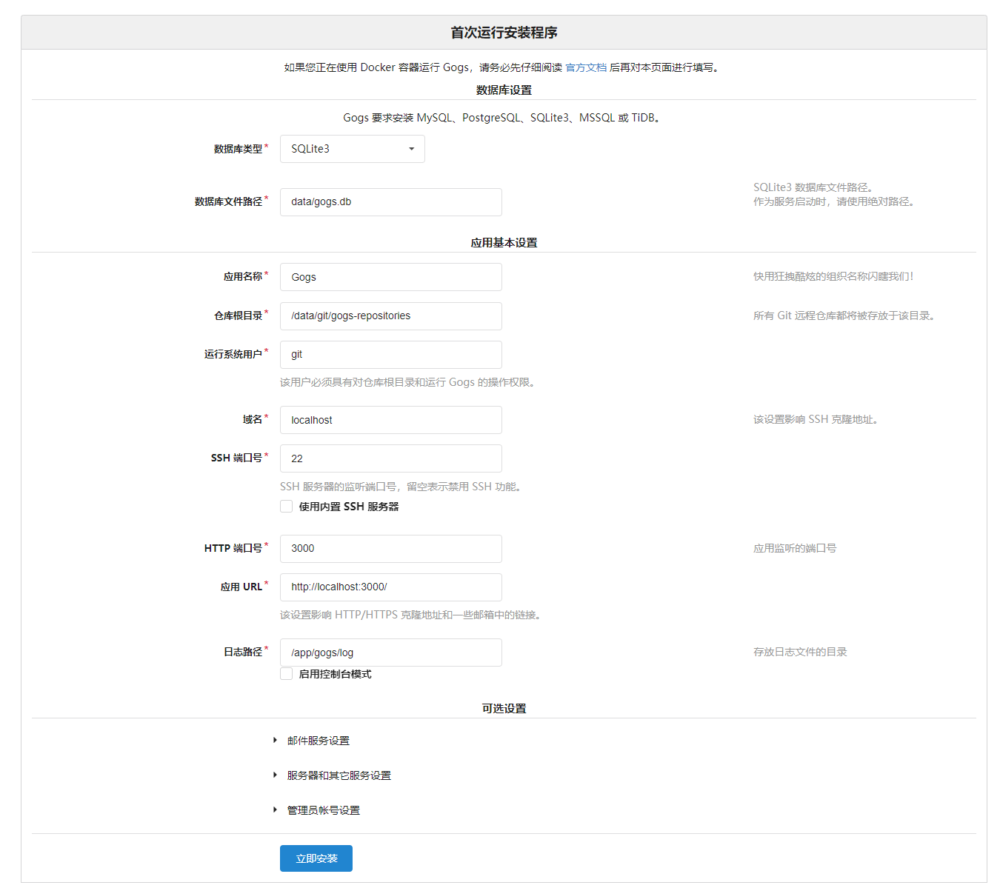

# Docker 安装 Gogs

和 GitLab 类似，Gogs 也是开源的 git 服务器系统。与 GitLab 相比，Gogs 更加轻量，内存和 CPU 占用更低。当然代价是功能上要比 GitLab 少很多。不过对于个人或者小型团队而言，Gogs 已经足够用了。更要紧的是，Gogs 可以很方便地在树莓派的镜像中安装。

更多内容参见 Gogs 的官方文档：https://gogs.io/docs 和 https://github.com/gogs/gogs/tree/main/docker

话不多说，我们开始吧。

## 启动 Gogs 容器服务

首先，拉取镜像：

```bash
sudo docker pull gogs/gogs

# 对于树莓派需要拉取这个：
sudo docker pull gogs/gogs-rpi
```

然后创建保存 git 文件的目录：

```bash
sudo mkdir -p /var/gogs
```

最后，启动镜像就可得到 gogs 容器了：

```bash
sudo docker run --name=gogs -p 10022:22 -p 10080:3000 -v /var/gogs:/data --restart always -d gogs/gogs

# 对于树莓派需则要这样启动：
sudo docker run --name=gogs -p 10022:22 -p 8080:3000 -v /var/gogs:/data --restart always -d gogs/gogs-rpi
```

其中，容器 ssh 的 22 端口映射到了宿主机的 10022 端口，网络服务的 3000 端口则映射到宿主机的 10080 端口。

## 配置 Gogs

在开始配置 Gogs 之前，需要做一项准备工作：决定如何存储数据。Gogs 支持使用 MySQL、PostgreSQL、SQLite3、MSSQL 或 TiDB 存储。如果嫌麻烦，可以直接使用 SQLite3。如果要使用其他的存储方式，需提前配置好相应的环境才可继续。

在浏览器中使用 IP + 端口的方式，访问 Gogs 服务，比如我们的 IP 是 192.168.31.228，而 HTTP 服务的端口则映射到了 10080，所以需要通过 192.168.31.228:10080 访问。

Gogs 的配置都一目了然，按需配置即可：



