## docker 的镜像和容器

[TOC]

### docker 的底层技术实现架构

docker 提供了打包运行 app 的平台，将 app 与底层基础设施隔离。

### docker engine

docker engine 是核心，里面有后台进程 dockerd，提供了 REST API 接口，还提供了 CLI 接口，另外，docker 就是一种 C/S 的架构。

### docker 的整体架构

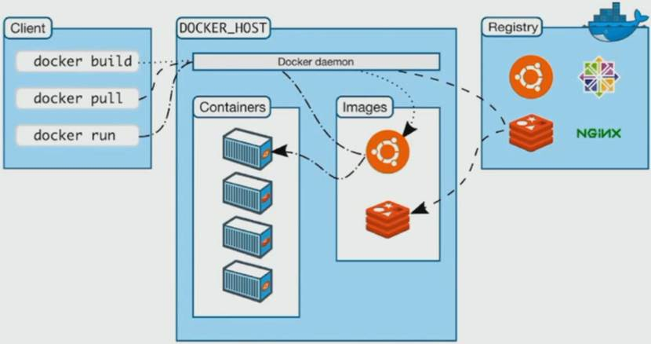

### 底层技术支持

- Namespaces：网络隔离

- Control groups：资源限制

- Union file systems：系统分层

### docker image 概述

docker 镜像是文件和 meta data 的集合。

### 制作 baseImage

baseImage 指的是基于系统的基础镜像。

创建一个名为 Dockerfile 的文件：

```bash
vi Dockerfile
```

在文件中写入如下内容：

```dockerfile
FROM ubuntu
CMD echo "hello docker!"
```

编译镜像，注意最后面有一个点，指代的是当前路径：

```bash
[root@node01 home]# ll
总用量 8
drwxr-xr-x 3 root root  48 4月  28 01:02 dj
-rw-r--r-- 1 root root  37 4月  28 09:21 Dockerfile
drwxr-xr-x 3 root root  68 4月  28 04:52 mysite
-rw-r--r-- 1 root root 170 4月  28 01:04 requirements.txt
drwxr-xr-x 4 root root  43 4月  28 00:55 venv
[root@node01 home]# docker build -t shuoliuchn/hello-docker .
```

查看编译后的镜像：

```bash
[root@node01 home]# docker image ls
REPOSITORY                TAG                 IMAGE ID            CREATED             SIZE
shuoliuchn/hello-docker   latest              d2f1cd35b46f        4 minutes ago       73.8MB
ubuntu                    latest              1d622ef86b13        4 days ago          73.8MB
```

除了我们创建的镜像，还出现了一个 Ubuntu 的镜像，是因为我们的镜像需要使用 Ubuntu。

运行镜像，成为一个容器：

```bash
[root@node01 home]# docker run shuoliuchn/hello-docker
hello docker!
```

顺利打印出 hello docker 来。

### 直接拉取官方镜像

除了我们自己通过 dockerfile 制作 docker 镜像外，我们还可以拉取人家已经做好了的 docker 镜像。

比如拉取 redis 的镜像：

```bash
docker pull redis
```

查看镜像：

```bash
[root@node01 home]# docker image ls
REPOSITORY                TAG                 IMAGE ID            CREATED             SIZE
shuoliuchn/hello-docker   latest              d2f1cd35b46f        10 minutes ago      73.8MB
ubuntu                    latest              1d622ef86b13        4 days ago          73.8MB
redis                     latest              a4d3716dbb72        4 days ago          98.3MB
```

出现了 redis 的镜像。

### container 的概念和使用

container 可以理解为运行时的实例，与 image 不同。

查看所有运行过的 container 容器，命令中 -a 的含义是运行中和未运行的容器都显示出来：

```bash
[root@node01 home]# docker container ls -a
CONTAINER ID        IMAGE                     COMMAND                   CREATED             STATUS                     PORTS               NAMES
f39ba8f54371        shuoliuchn/hello-docker   "/bin/sh -c 'echo \"h…"   7 minutes ago       Exited (0) 7 minutes ago                       trusting_mahavira
```

可以交互运行容器，如果本地没有要运行的容器，默认会自动下载：

```bash
[root@node01 home]# docker run -it centos
Unable to find image 'centos:latest' locally
latest: Pulling from library/centos
8a29a15cefae: Pull complete 
Digest: sha256:fe8d824220415eed5477b63addf40fb06c3b049404242b31982106ac204f6700
Status: Downloaded newer image for centos:latest
[root@1f691b80fbb5 /]# 
```

主机名发生改变，是因为我们已经进入到 CentOS 容器的交互模式中。

不要退出交互模式，另起一个窗口：

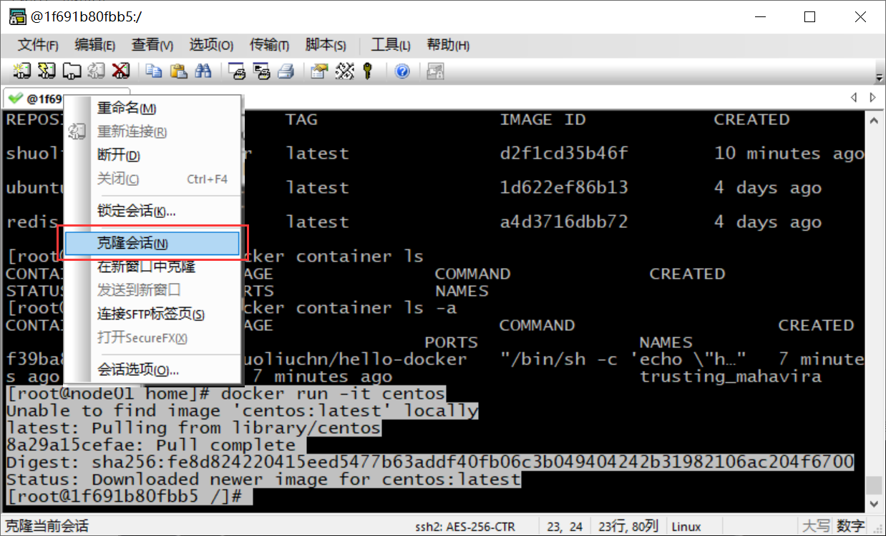

此时，可以查到运行时的容器：

```bash
[root@node01 ~]# docker container ls
CONTAINER ID        IMAGE               COMMAND             CREATED             STATUS              PORTS               NAMES
1f691b80fbb5        centos              "/bin/bash"         2 minutes ago       Up 2 minutes                            nostalgic_johnson
```

指定容器 id 删除某个容器，以下两种方式都可以实现：

```bash
[root@node01 ~]# docker container rm f39ba8f54371
f39ba8f54371
[root@node01 ~]# docker rm 1f691b80fbb5
1f691b80fbb5
```

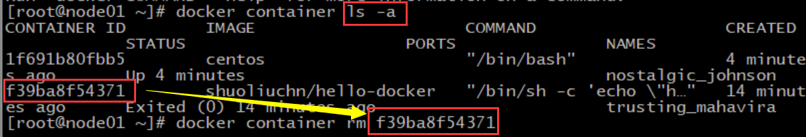

还可以删除所有容器，参数 q 的含义是只显示容器 id：

```bash
[root@node01 ~]# docker rm $(docker container ls -aq)
fd1011499d4c
Error response from daemon: You cannot remove a running container 795bda64e1b6338e15de8c9302ef5356897d4457270523be1bdd39b535fc5b41. Stop the container before attempting removal or force remove
```

我们看到，这种方法是无法删除运行中的容器的。

如下指令可以删除没有在运行的容器：

```bash
[root@node01 ~]# docker rm $(docker container ls -f "status=exited" -q)
5b3382cc152f
795bda64e1b6
```

### 创建 Image 的两种方式

基于 image 创建 container 后，如果在 container 做了一些变化，例如安装了某个软件，可以将这些改变，commit 成一个新的 image，也可以简写为 docker commit。

交互运行一个 centos 实例，给里面装一个 lrzsz：

```bash
[root@node01 home]# docker run -it centos
[root@a1ac5f329f5a /]# yum -y install lrzsz
```

装完之后退出 CentOS 容器：

```bash
[root@a1ac5f329f5a /]# exit
exit
[root@node01 home]# 
```

可以查看到修改后的容器：

```bash
[root@node01 home]# docker container ls -a
CONTAINER ID        IMAGE               COMMAND             CREATED             STATUS                      PORTS               NAMES
a1ac5f329f5a        centos              "/bin/bash"         6 minutes ago       Exited (0) 40 seconds ago                       friendly_shockley
```

将这个新的容器，打包成一个新的镜像，其中 friendly_shockley 是容器的名字，shuoliuchn/centos-lrzsz 是给提交的镜像取的别名：

```bash
[root@node01 home]# docker commit friendly_shockley shuoliuchn/centos-lrzsz
sha256:3792a0bbf35b63e7923f1ad6d99ba73c6f321b58a3b105c70d1b6a2284e98326
```

查看镜像：

```bash
[root@node01 home]# docker image ls
REPOSITORY                TAG                 IMAGE ID            CREATED             SIZE
shuoliuchn/centos-lrzsz   latest              3792a0bbf35b        26 seconds ago      270MB
shuoliuchn/hello-docker   latest              d2f1cd35b46f        About an hour ago   73.8MB
ubuntu                    latest              1d622ef86b13        4 days ago          73.8MB
redis                     latest              a4d3716dbb72        4 days ago          98.3MB
centos                    latest              470671670cac        3 months ago        237MB
```

还可以根据镜像 id 或镜像名，查看到镜像分层信息：

```bash
[root@node01 home]# docker history centos
IMAGE               CREATED             CREATED BY                                      SIZE                COMMENT
470671670cac        3 months ago        /bin/sh -c #(nop)  CMD ["/bin/bash"]            0B                  
<missing>           3 months ago        /bin/sh -c #(nop)  LABEL org.label-schema.sc…   0B                  
<missing>           3 months ago        /bin/sh -c #(nop) ADD file:aa54047c80ba30064…   237MB               
[root@node01 home]# docker history shuoliuchn/centos-lrzsz
IMAGE               CREATED              CREATED BY                                      SIZE                COMMENT
3792a0bbf35b        About a minute ago   /bin/bash                                       33.1MB              
470671670cac        3 months ago         /bin/sh -c #(nop)  CMD ["/bin/bash"]            0B                  
<missing>           3 months ago         /bin/sh -c #(nop)  LABEL org.label-schema.sc…   0B                  
<missing>           3 months ago         /bin/sh -c #(nop) ADD file:aa54047c80ba30064…   237MB  
```

除了通过容器提交生成镜像，我们还可以使用 Dockerfile，通过 build 制作 image，可以简写为 docker build。

定义 Dockerfile 文件：

```bash
vi Dockerfile
```

修改其中的内容为：

```dockerfile
FROM centos
RUN yum -y install lrzsz
```

编译镜像

```bash
docker build -t shuoliuchn/centos-lrzsz2 .
```

可以查看到多出个镜像：

```bash
[root@node01 home]# docker image ls
REPOSITORY                 TAG                 IMAGE ID            CREATED             SIZE
shuoliuchn/centos-lrzsz2   latest              d97c017a0b75        20 seconds ago      270MB
shuoliuchn/centos-lrzsz    latest              3792a0bbf35b        30 hours ago        270MB
shuoliuchn/hello-docker    latest              d2f1cd35b46f        31 hours ago        73.8MB
ubuntu                     latest              1d622ef86b13        5 days ago          73.8MB
redis                      latest              a4d3716dbb72        5 days ago          98.3MB
centos                     latest              470671670cac        3 months ago        237MB
```

### Dockerfile 详解

FROM：从哪开始，一般都是从一个系统开始

```dockerfile
FROM scratch    # 最小系统
FROM centos         
FROM ubuntu:14.04
```

LABEL：注释

```dockerfile
LABEL version=”1.0”
LABEL auther=”sjc”
```

RUN：执行命令，每 RUN 一次，会多一个系统分层，尽量少一些层。为了美观也可以使用 \ 将代码分成多行

```dockerfile
RUN yum -y update && install lrzsz \ 
    net-tools
```

WORKDIR：进入或创建目录，尽量不要用相对路径

```dockerfile
WORKDIR /root    # 进入 /root 目录
WORKDIR /test    # 会在根下，创建 /test 并进入
WORKDIR demo    # 创建demo，进入
RUN pwd    # /test/demo
```

ADD 和 COPY：将本地的文件，添加到 image 里，COPY 和 ADD区别是，ADD 会自动解压压缩包，而 COPY 不会解压

```dockerfile
ADD hello /    # 将当前目录下hello，添加到容器的根下
ADD tt.tar.gz /    # 压缩包扔进去，并解压
```

ENV，相当于变量，增加 Dockerfile 的可读性，健壮性

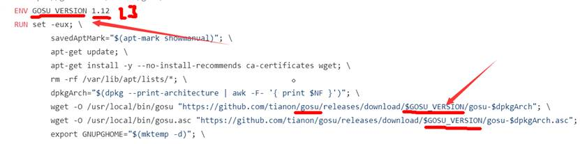

CMD 和 ENTRYPOINT：执行命令或运行某个脚本，接下来详细讨论。

### Dockerfile 的 CMD 和 ENTRYPOINT

Shell 和 Exec 格式：

```dockerfile
FROM centos
# shell 格式
CMD echo "hello docker"
ENTRYPOINT echo "hello docker"
# exec 格式
CMD ["/bin/echo", "hello docker"]
ENTRYPOINT ["/bin/echo", "hello docker"]
```

ENTRYPOINT 与 CMD：容器启动时，运行什么命令

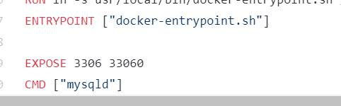

ENTRYPOINT 比 CMD 用得多，因为 CMD 有可能执行完前面的，把后面定义的 CMD 给忽略不执行了

### 分享 docker image

就像我们可以将代码提交到 GitHub 上一样，我们也可以将 docker 镜像共享到 docker 官方的 [docker hub](https://hub.docker.com/) 上。当然，在分享之前，需要有 docker hub 的账号，这个和 docker 官网的账号是相同的。


使用 docker 账号登录 docker：

```bash
[root@node01 home]# docker login
Login with your Docker ID to push and pull images from Docker Hub. If you don't have a Docker ID, head over to https://hub.docker.com to create one.
Username: shuoliuchn
Password: 
WARNING! Your password will be stored unencrypted in /root/.docker/config.json.
Configure a credential helper to remove this warning. See
https://docs.docker.com/engine/reference/commandline/login/#credentials-store

Login Succeeded
```

上传镜像到 docker hub，要分享到 docker hub 上的 image 名字一定要以自己 docker hub 的用户名开头，镜像名后面可以用冒号指定版本号：

```bash
docker image push shuoliuchn/centos-lrzsz2:latest
```

就可以在 docker hub 上面看到刚刚上传的镜像：

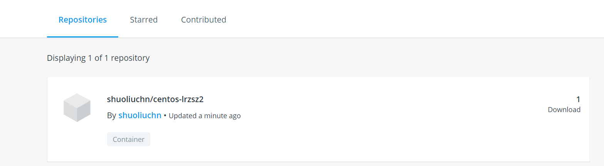

若想从 docker hub 删镜像，可进入到镜像页面，通过 settings 删除：

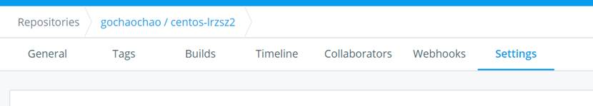

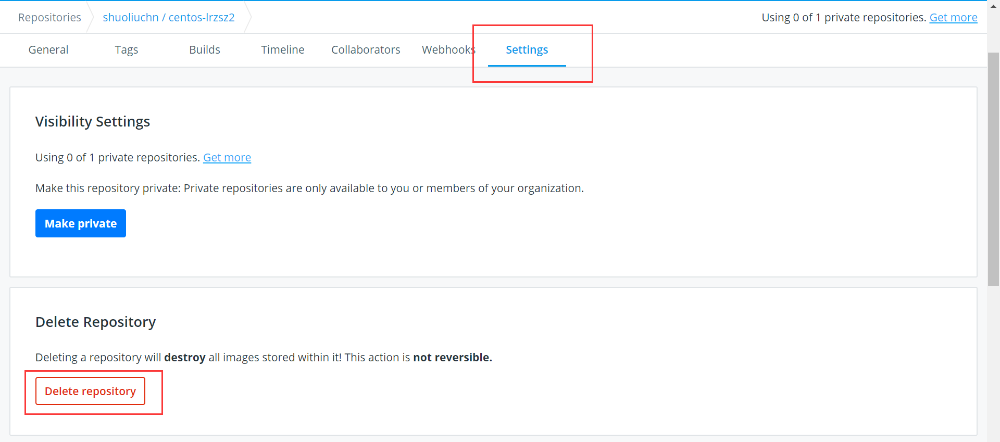

### 分享 Dockerfile

分享 docker image 不如直接分享 Dockerfile。因为 Dockerfile 对每一个步骤都有详细描述，更加安全。而 docker image 中，很难说会不会有什么病毒之类的东西。

### 搭建私有 docker registry

github 是公开的，也可以创建自己的私有仓库。同样地，docker 官方给也提供了私有仓库的镜像。

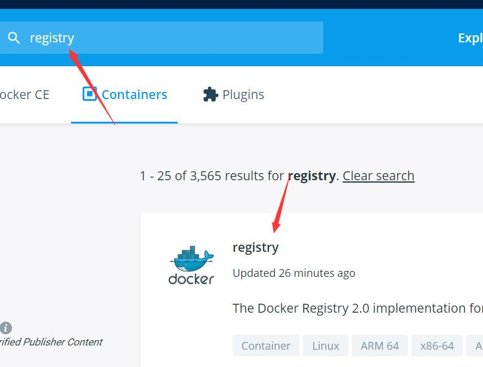

准备第二台机器，作为私有仓库，主机名设置为 node02。

第二台运行如下指令，创建 docker 仓库：

```bash
docker run -d -p 5000:5000 --restart always --name registry registry:2
```

查看进程，运行没问题：

```bash
[root@node02 ~]# docker ps
CONTAINER ID        IMAGE               COMMAND                  CREATED             STATUS              PORTS                    NAMES
7a115707e4ab        registry:2          "/entrypoint.sh /etc…"   8 seconds ago       Up 6 seconds        0.0.0.0:5000->5000/tcp   registry
```

浏览器可以看到第二台机器仓库里，没东西：

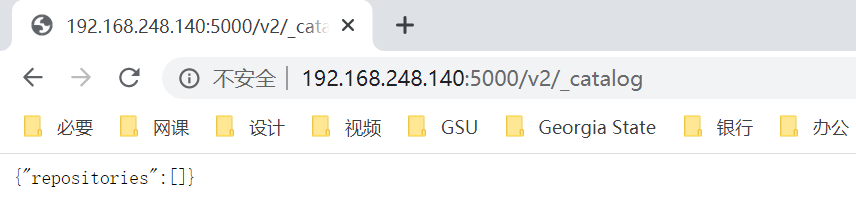

测试端口，第一台可以安装个 telnet：

```bash
yum -y install telnet
```

测试连接：

```bash
[root@node01 ~]# telnet 192.168.248.140 5000
Trying 192.168.248.140...
Connected to 192.168.248.140.
Escape character is '^]'.
```

连接正常，输入 `^` 退出。

编写 dockerfile：

```bash
vi Dockerfile
```

简单制作一个镜像：

```dockerfile
FROM centos
CMD ["/bin/echo", "hello docker"]
```

编译镜像，IP 是私有仓库（node02）的 IP：

```bash
docker build -t 192.168.248.140:5000/centos .
```

接下来，将仓库的 IP 设置为可信任的仓库。

编写配置文件：

```bash
vi /etc/docker/daemon.json
```

在 json 字典中加一行，这里的 IP 是私有仓库的 IP：

```json
"insecure-registries": ["192.168.248.140:5000"],
```

文件中的内容最终是这样的：

```json
{
"registry-mirrors": [
"https://kfwkfulq.mirror.aliyuncs.com",
"https://2lqq34jg.mirror.aliyuncs.com",
"https://pee6w651.mirror.aliyuncs.com",
"https://registry.docker-cn.com",
"http://hub-mirror.c.163.com"
],
"insecure-registries": ["192.168.248.140:5000"],
"dns": ["8.8.8.8","8.8.4.4"]
}
```

重启 docker，应用配置：

```bash
[root@node01 home]# service docker restart
Redirecting to /bin/systemctl restart  docker.service
```

将镜像上传到私有仓库：

```bash
docker push 192.168.248.140:5000/centos
```

刷新页面，私有仓库有内容了

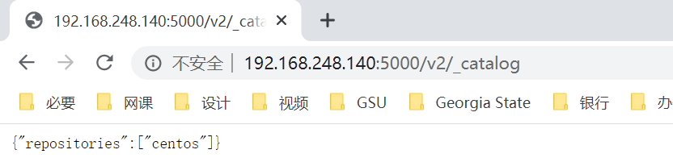

若从私有仓库下东西，如下：

```bash
docker pull 192.168.248.140:5000/centos
```

### Dockerfile 案例

接下来，我们创建一个 Python 的 Web 应用，然后打包成 docker image 运行。

创建一个目录，在其中创建一个 py 文件并编辑：

```bash
[root@node01 home]# mkdir flask-hello-world
[root@node01 home]# cd flask-hello-world/
[root@node01 flask-hello-world]# vi app.py
```

在 py 文件中，写入如下内容，这是一个简易的 Flask 框架服务：

```python
from flask import Flask
app = Flask(__name__)
@app.route('/')
def hello():
    return "hello docker"
if __name__ == '__main__':
    app.run()
```

在此目录下，创建 Dockerfile 并编辑：

```
vi Dockerfile
```

在其中写入如下内容：

```dockerfile
FROM python:3.6
LABEL auth="shuo"
RUN pip install flask -i https://pypi.tuna.tsinghua.edu.cn/simple
COPY app.py /app/
WORKDIR /app
EXPOSE 5000
CMD ["python","app.py"]
```

构建镜像：

```bash
docker build -t shuoliuchn/flask-hello-world .
```

运行镜像：

```bash
docker run shuoliuchn/flask-hello-world
```

窗口会被 flask 占用，另起一个新窗口可以查看到进程：

```bash
[root@node01 ~]# docker ps
CONTAINER ID        IMAGE                          COMMAND             CREATED              STATUS              PORTS               NAMES
e4171e07088c        shuoliuchn/flask-hello-world   "python app.py"     About a minute ago   Up About a minute   5000/tcp
```

因为 flask 默认运行在 127.0.0.1，所以还是不能被外界访问到。

### 运行中对 container 操作

exec 命令用于调用并执行指令的命令

使用 -d 参数后台运行容器：

```bash
docker run -d shuoliuchn/flask-hello-world
```

可以交互运行里面的机器，根据运行时的 container ID

```bash
[root@node01 flask-hello-world]# docker ps
CONTAINER ID        IMAGE                          COMMAND             CREATED             STATUS              PORTS               NAMES
94525da805b4        shuoliuchn/flask-hello-world   "python app.py"     39 seconds ago      Up 38 seconds       5000/tcp            elegant_murdock
[root@node01 flask-hello-world]# docker exec -it 94525da805b4 /bin/bash
root@94525da805b4:/app# 
```

交互运行容器里面机器的 python shell：

```bash
[root@node01 flask-hello-world]# docker exec -it 94525da805b4 python
Python 3.6.10 (default, Apr 23 2020, 15:24:07) 
[GCC 8.3.0] on linux
Type "help", "copyright", "credits" or "license" for more information.
>>> 
```

后台运行一个容器，并使用 `--name` 参数指定容器名字：

```bash
[root@node01 flask-hello-world]# docker run -d --name=demo shuoliuchn/flask-hello-world
f14655f91c3f26856f9358486dd28334251d831ab781bd4e0ddaf46b8a59b82a
[root@node01 flask-hello-world]# docker ps
CONTAINER ID        IMAGE                          COMMAND             CREATED             STATUS              PORTS               NAMES
f14655f91c3f        shuoliuchn/flask-hello-world   "python app.py"     8 seconds ago       Up 7 seconds        5000/tcp            demo
```

容器的名字就成了 demo。

根据名字停止启动容器：

```bash
[root@node01 flask-hello-world]# docker stop demo
demo
[root@node01 flask-hello-world]# docker start demo
demo
```

查看运行时的容器的运行日志：

```bash
[root@node01 flask-hello-world]# docker logs demo
 * Serving Flask app "app" (lazy loading)
 * Environment: production
   WARNING: This is a development server. Do not use it in a production deployment.
   Use a production WSGI server instead.
 * Debug mode: off
 * Running on http://127.0.0.1:5000/ (Press CTRL+C to quit)
 * Serving Flask app "app" (lazy loading)
 * Environment: production
   WARNING: This is a development server. Do not use it in a production deployment.
   Use a production WSGI server instead.
 * Debug mode: off
 * Running on http://127.0.0.1:5000/ (Press CTRL+C to quit)
```

查看运行时容器详细信息：

```bash
docker inspect demo
```

### 对容器资源限制

像虚拟机一样，我们也可以对容器可以使用的计算机资源进行一些限制，包括：

- 对内存的限制

- 对 CPU 的限制

可以指定开启容器占用的内存和 CPU，具体操作，可以查看帮助：

```bash
docker run --help
```

