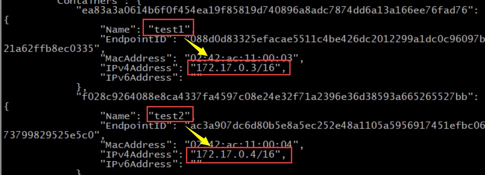
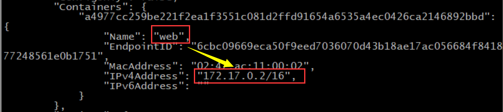
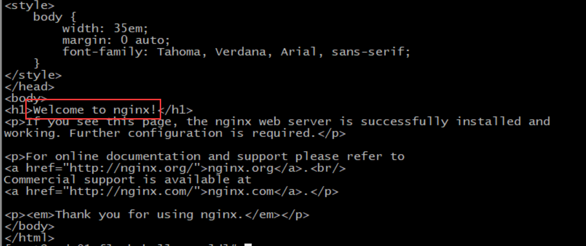
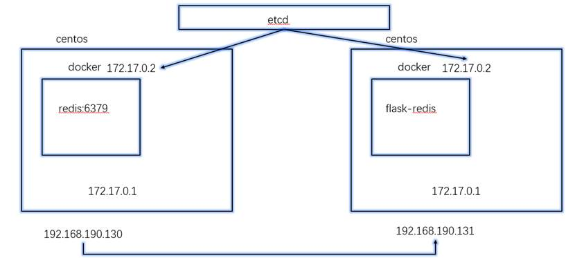
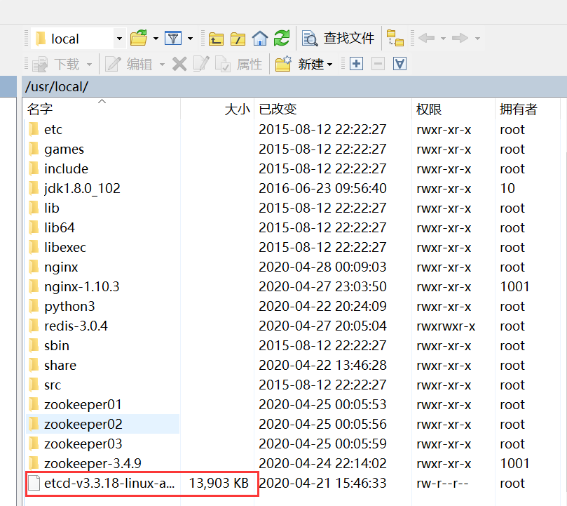
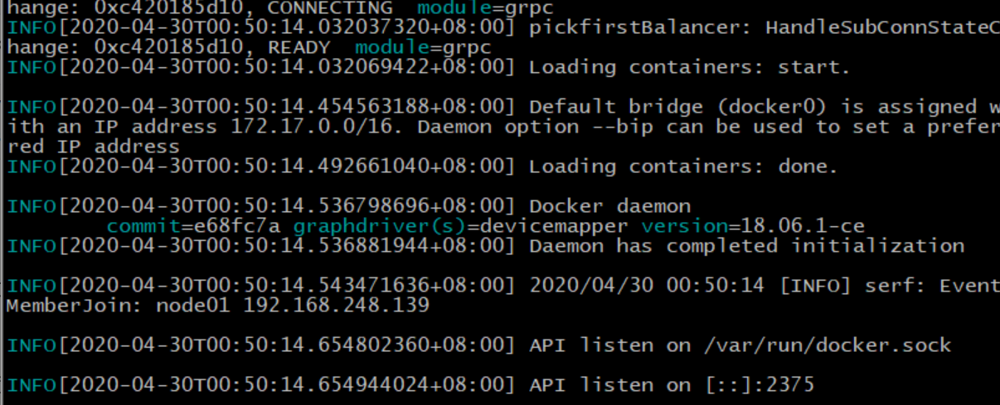
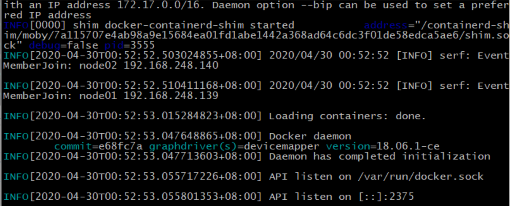

## docker 的网络

[TOC]

### 网络分类

和虚拟机一样，docker 的网络也可以有多种设置模式。

单机中各个容器之间的网络可以有：

- Bridge Network：相当于 VMware 的桥接，默认跑这个

- Host Network：类似于 VM 的 NAT

- None Network：没网

多机组成集群，每台计算机的 docker 容易之间的网络可以是：

- Overlay Network：集群网络

查看网卡信息：

```bash
[root@node01 flask-hello-world]# docker network ls
NETWORK ID          NAME                DRIVER              SCOPE
b53119ad4645        bridge              bridge              local
99ed3990d07e        host                host                local
06a7162d9c0b        none                null                local
[root@node01 flask-hello-world]# docker network inspect b53119ad4645
```

### 容器通信

有时写代码时，并不知道要请求的 IP 地址，这时，我们就需要用到容器通信来解决。

首先运行一个最小系统，并让它在后台一直运行：

```bash
docker run -d --name test1 busybox /bin/sh -c "while true;do sleep 3600;done"
```

再运行一个最小系统，让它链接第一个。

链接类似于配置主机名和映射：

```bash
docker run -d --name test2 --link test1 busybox /bin/sh -c "while true;do sleep 3600;done"
```

因为容器默认的网络连接方式为桥接，所以通过查看桥接网卡的详细信息，可以查看两个容器的 IP：

```bash
[root@node01 flask-hello-world]# docker network ls
NETWORK ID          NAME                DRIVER              SCOPE
b53119ad4645        bridge              bridge              local
99ed3990d07e        host                host                local
06a7162d9c0b        none                null                local
[root@node01 flask-hello-world]# docker network inspect b53119ad4645
```

 我们能容易找到 test1 和 test2 两个容器的 IP：



进入 test1 的交互模式，分别尝试使用 test2 的名字和 IP 连接 test2：

```bash
[root@node01 flask-hello-world]# docker exec -it test1 /bin/sh
/ # ping test2
ping: bad address 'test2'
/ # ping 172.17.0.4
PING 172.17.0.4 (172.17.0.4): 56 data bytes
64 bytes from 172.17.0.4: seq=0 ttl=64 time=0.170 ms
64 bytes from 172.17.0.4: seq=1 ttl=64 time=0.203 ms
64 bytes from 172.17.0.4: seq=2 ttl=64 time=0.124 ms
64 bytes from 172.17.0.4: seq=3 ttl=64 time=0.093 ms
```

使用 IP 可以 ping 通，但是直接使用 test2 的名字不成。因为 test1 并没有连接 test2。于是，我们无法在 test1 中直接使用 test2 的名字连接到 test2。

注：ping 可能会一直连接不停，可以通过 ctrl + C 强制终止，下同。

再进入到 test2 的交互模式，尝试连接 test1：

```bash
[root@node01 flask-hello-world]# docker exec -it test2 /bin/sh
/ # ping test1
PING test1 (172.17.0.3): 56 data bytes
64 bytes from 172.17.0.3: seq=0 ttl=64 time=0.096 ms
64 bytes from 172.17.0.3: seq=1 ttl=64 time=0.212 ms
/ # ping 172.17.0.3
PING 172.17.0.3 (172.17.0.3): 56 data bytes
64 bytes from 172.17.0.3: seq=0 ttl=64 time=0.089 ms
64 bytes from 172.17.0.3: seq=1 ttl=64 time=0.134 ms
```

假设此时，test2 部署了项目，test1 部署了项目用的 MySQL，那么项目访问 MySQL 时，编写项目就可以不指定IP，指定成 test1，就可以通，因为是 link 了。

### 端口映射

docker 容器运行在局域网中，我们是无法从外界访问到的。通过端口映射，可以实现外界访问 docker 容器。

运行一个 Nginx：

```bash
docker run --name web -d nginx
```

可以查到进程：

```bash
[root@node01 flask-hello-world]# docker ps
CONTAINER ID        IMAGE               COMMAND                  CREATED             STATUS              PORTS               NAMES
a4977cc259be        nginx               "nginx -g 'daemon of…"   52 seconds ago      Up 51 seconds       80/tcp              web
```

通过桥接网卡，查看到容器的 IP：

```bash
docker network inspect bridge
```



从本机，可以访问到 Nginx 启动了的主页：

```
curl http://172.17.0.2
```



此时外界是无法访问到的，CentOS 的 IP 或是容器的 IP 都不成。这个问题可以通过端口映射解决。


可以通过端口映射解决

停止并删除前面的容器：

```bash
[root@node01 flask-hello-world]# docker stop web
web
[root@node01 flask-hello-world]# docker rm web
web
```

端口映射启动容器，两个 80 分别表示 CentOS 和容器的端口：

```bash
docker run -d -p 80:80 --name web nginx
```

此时，外界浏览器可以通过 CentOS 的 IP，访问到容器内的内容


### 网络的 none 和 host

- none 应用场景：安全性要求极高，存储绝密数据等

- host 网络类似于 NAT

### 多容器部署和应用

可以清理下前面的容器和镜像：

```bash
docker stop $(docker container ls -q)
docker rm $(docker container ls -aq)
docker image rm $(docker image ls -q)
```

接下来我们通过创建两个容器进行演示，一个用 flask 做 Web 服务，另一个 Redis 做数据存储。

首先，跑起来一台 Redis：

```bash
docker run --name redis -d redis
```

查看 Redis 的运行状态：

```bash
[root@node01 flask-hello-world]# docker ps
CONTAINER ID        IMAGE               COMMAND                  CREATED             STATUS              PORTS               NAMES
6d62d6f25410        redis               "docker-entrypoint.s…"   11 seconds ago      Up 10 seconds       6379/tcp            redis
```

创建一个目录，在其中创建一个 py 文件并编辑：

```bash
[root@node01 home]# mkdir flask-redis
[root@node01 home]# cd flask-redis
[root@node01 flask-redis]# vi app.py
```

在 py 文件中写入如下内容，这是一个简单的 flask 项目，可以读取何修改 Redis 的数据：

```python
from flask import Flask
from redis import Redis
import os
import socket

app = Flask(__name__)
redis = Redis(host=os.environ.get('REDIS_HOST', '127.0.0.1'), port=6379)

@app.route('/')
def hello():
    redis.incr('hits')
    return 'Hello Container World! I have been seen %s times and my hostname is %s.\n' % (redis.get('hits'),socket.gethostname())

if __name__ == "__main__":
    app.run(host="0.0.0.0", port=5000, debug=True)
```

再编写一个 dockerfile：

```bash
vi Dockerfile
```

在其中插入如下内容：

```dockerfile
FROM python:3.6
LABEL maintaner="liushuo432@outlook.com"
COPY . /app
WORKDIR /app
RUN pip install flask redis -i https://pypi.tuna.tsinghua.edu.cn/simple
EXPOSE 5000
CMD [ "python", "app.py" ]
```

编译构建一个镜像：

```bash
docker build -t shuoliuchn/flask-redis .
```

运行构建好的镜像，因为要提供给外界访问，需要加上 `-p 5000:5000` 参数：

```bash
docker run -d --name flask-redis --link redis -e REDIS_HOST=redis -p 5000:5000 shuoliuchn/flask-redis
```

-e 参数用来设置环境变量，而 flask 中通过读取这个环境变量来获取 Redis 服务器的 IP。

成功跑起两个容器：

```bash
[root@node01 flask-redis]# docker container ls
CONTAINER ID        IMAGE                    COMMAND                  CREATED             STATUS              PORTS               NAMES
bd99fe7b7c60        shuoliuchn/flask-redis   "python app.py"          29 seconds ago      Up 27 seconds       5000/tcp            flask-redis
6d62d6f25410        redis                    "docker-entrypoint.s…"   18 minutes ago      Up 18 minutes       6379/tcp            redis
```

进入 flask 容器，访问运行的代码，可以看到调用了 Redis 自增：

```bash
[root@node01 flask-redis]# docker exec -it bd99fe7b7c60 /bin/bash
root@bd99fe7b7c60:/app# curl 127.0.0.1:5000
Hello Container World! I have been seen b'1' times and my hostname is bd99fe7b7c60.
root@bd99fe7b7c60:/app# curl 127.0.0.1:5000
Hello Container World! I have been seen b'2' times and my hostname is bd99fe7b7c60.
root@bd99fe7b7c60:/app# curl 127.0.0.1:5000
Hello Container World! I have been seen b'3' times and my hostname is bd99fe7b7c60.
```

### 多机器多容器通信

不同计算机中的不同容器，很可能会出现容器 IP 一样的情况。这就会导致 IP 冲突，而无法相互访问。可以加一个 etcd 去管理，防止 IP 和其他任何可能的（比如容器名）冲突



开两台机器，把 etcd 安装包分别传到这台机器。



将两台机器的 etcd 安装包都解压：

```bash
tar -zxvf etcd-v3.3.18-linux-amd64.tar.gz
```

第一台机器中，进入解压后的 etcd，运行如下，注意修改 IP（第一台机器的 IP 为 192.168.248.139，第二台为 192.168.248.140）：

```bash
nohup ./etcd --name docker-node1 --initial-advertise-peer-urls http://192.168.248.139:2380 \
	--listen-peer-urls http://192.168.248.139:2380 \
	--listen-client-urls http://192.168.248.139:2379,http://127.0.0.1:2379 \
	--advertise-client-urls http://192.168.248.139:2379 \
	--initial-cluster-token etcd-cluster \
	--initial-cluster docker-node1=http://192.168.248.139:2380,docker-node2=http://192.168.248.140:2380 \
	--initial-cluster-state new&
```

同样进入第二台机器的 etcd 解压好的文件夹中，修改 IP，执行下面的代码：

```bash
nohup ./etcd --name docker-node2 --initial-advertise-peer-urls http://192.168.248.140:2380 \
	--listen-peer-urls http://192.168.248.140:2380 \
	--listen-client-urls http://192.168.248.140:2379,http://127.0.0.1:2379 \
	--advertise-client-urls http://192.168.248.140:2379 \
	--initial-cluster-token etcd-cluster \
	--initial-cluster docker-node1=http://192.168.248.139:2380,docker-node2=http://192.168.248.140:2380 \
	--initial-cluster-state new&
```

etcd 会占用窗口，我们下面的操作需要新开窗口运行。

查看两台机器 etcd 的健康状态（两台机器都可以查到，这里只放了其中一台的结果）：

```bash
[root@node01 etcd-v3.3.18-linux-amd64]# ./etcdctl cluster-health
member 1f96f9828a1f391d is healthy: got healthy result from http://192.168.248.140:2379
member a1b7d2585ad4bb6f is healthy: got healthy result from http://192.168.248.139:2379
cluster is healthy
```

此时，停止第一台机器的 docker：

```bash
[root@node01 etcd-v3.3.18-linux-amd64]# service docker stop
Redirecting to /bin/systemctl stop  docker.service
```

运行被 etcd 管理的 docker，注意修改两个 IP 为第一台机器的 IP：

```bash
/usr/bin/dockerd -H tcp://0.0.0.0:2375 -H unix:///var/run/docker.sock --cluster-store=etcd://192.168.248.139:2379 --cluster-advertise=192.168.248.139:2375&
```



第二台机器一样的，停止 docker，然后运行下面的命令，要修改 IP 为第二台机器的：

```bash
service docker stop
/usr/bin/dockerd -H tcp://0.0.0.0:2375 -H unix:///var/run/docker.sock --cluster-store=etcd://192.168.248.140:2379 --cluster-advertise=192.168.248.140:2375&
```

 

注意两台主机最好不要重名，否则有可能会报错。

上面搞定后，第一台机器创建个虚拟网卡。因为窗口又被占用，所以还需要新开窗口执行下面的命令：

```bash
[root@node01 ~]# docker network create -d overlay demo
e4df7b30c40098ab7c5c82f98a2c8ff68cc4f94dfea4e1bf16060de950e61cfc
[root@node01 ~]# docker network ls
NETWORK ID          NAME                DRIVER              SCOPE
44daf8a401be        bridge              bridge              local
e4df7b30c400        demo                overlay             global
99ed3990d07e        host                host                local
06a7162d9c0b        none                null                local
```

此时，第二台也可以看到这个网络（并没有在第二台机器创建，但是却可以查看到）：

```bash
[root@node02 ~]# docker network ls
NETWORK ID          NAME                DRIVER              SCOPE
adf8954e79c2        bridge              bridge              local
e4df7b30c400        demo                overlay             global
99ed3990d07e        host                host                local
06a7162d9c0b        none                null                local
```

在第一台机器上创建个容器：

```bash
docker run -d --name test --net demo busybox sh -c "while true;do sleep 3600;done"
```

此时第二台运行同样代码，会报错，显示已经存在：

```bash
[root@node02 ~]# docker run -d --name test --net demo busybox sh -c "while true;do sleep 3600;done"
Unable to find image 'busybox:latest' locally
latest: Pulling from library/busybox
e2334dd9fee4: Pull complete 
Digest: sha256:a8cf7ff6367c2afa2a90acd081b484cbded349a7076e7bdf37a05279f276bc12
Status: Downloaded newer image for busybox:latest
05378667514ddd9f4fe9ac812b0b1c8479fd3f8d095876502c6700b390d9930d
docker: Error response from daemon: endpoint with name test already exists in network demo.
```

 这样我们就成功解决了集群间 docker 机器互相不认识的情况。

接下来我们再次使用 Redis 服务器和 Flask 服务器的例子进行测试。

我们可以将第一台机器作为 Redis 服务器，使用 overlay 网络：

```bash
[root@node01 ~]# docker run -d --name redis --net demo redis
5ad4b62814820283ed3d62417d37275989f151bfb10cab55e3248459c752721b
[root@node01 ~]# docker container ls
CONTAINER ID        IMAGE               COMMAND                  CREATED             STATUS              PORTS               NAMES
5ad4b6281482        redis               "docker-entrypoint.s…"   11 seconds ago      Up 10 seconds       6379/tcp            redis
010ceb4d9f91        busybox             "sh -c 'while true;d…"   22 minutes ago      Up 22 minutes                           test
```

在第二台机器中，新建一个目录，在其中创建并编辑 `app.py` 文件：

```bash
[root@node02 home]# mkdir flask-redis
[root@node02 home]# cd flask-redis/
[root@node02 flask-redis]# vi app.py
```

写入如下内容：

```bash
from flask import Flask
from redis import Redis
import os
import socket

app = Flask(__name__)
redis = Redis(host=os.environ.get('REDIS_HOST', '127.0.0.1'), port=6379)

@app.route('/')
def hello():
    redis.incr('hits')
    return 'Hello Container World! I have been seen %s times and my hostname is %s.\n' % (redis.get('hits'),socket.gethostname())

if __name__ == "__main__":
    app.run(host="0.0.0.0", port=5000, debug=True)
```

在同样目录下创建 Dockerfile，并写入如下内容：

```dockerfile
FROM python:3.6
LABEL maintaner="liushuo432@outlook.com"
COPY . /app
WORKDIR /app
RUN pip install flask redis -i https://pypi.tuna.tsinghua.edu.cn/simple
EXPOSE 5000
CMD [ "python", "app.py" ]
```

编译 Dockerfile 生成新镜像：

```bash
docker build -t shuoliuchn/flask-redis .
```

使用 overlay 网络运行镜像：

```bash
docker run -d --name flask-redis2 --link redis --net demo -e REDIS_HOST=redis -p 5000:5000 shuoliuchn/flask-redis
```

进入到 flask 的交互界面，使用 curl 访问 flask：

```bash
[root@node02 flask-redis]# docker exec -it flask-redis2 /bin/sh
# curl http://127.0.0.1:5000
Hello Container World! I have been seen b'1' times and my hostname is 0cdf5309d786.
# curl http://127.0.0.1:5000
Hello Container World! I have been seen b'2' times and my hostname is 0cdf5309d786.
# curl http://127.0.0.1:5000
Hello Container World! I have been seen b'3' times and my hostname is 0cdf5309d786.
```

