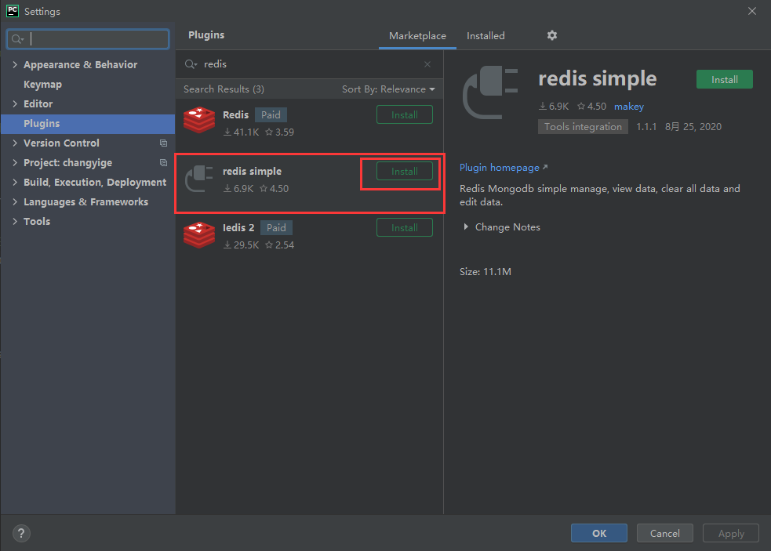
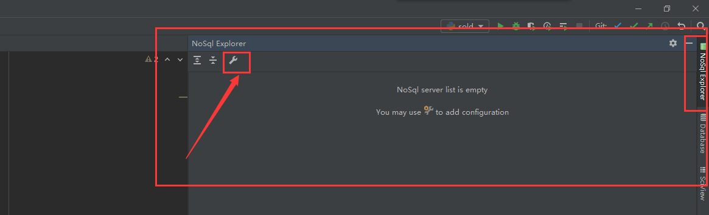
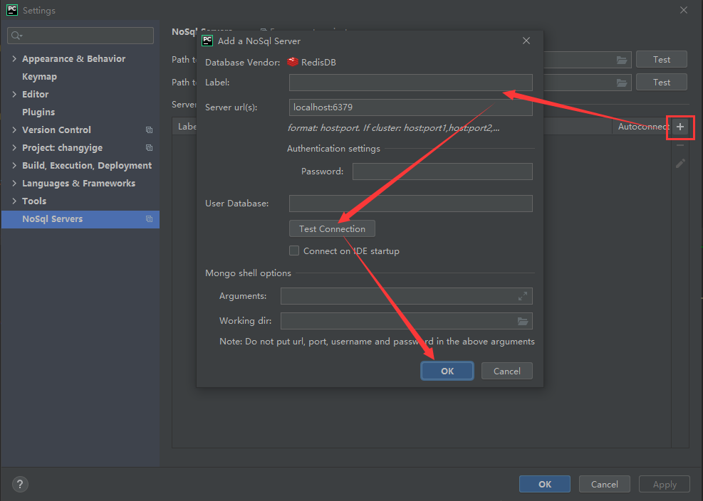

## Docker 安装 Redis

首先，拉取最新版 Redis 官方镜像：

```bash
sudo docker pull redis
```

然后，使用命令，开启有数据持久化的 Redis 容器：

```bash
sudo docker run \
  --name redis \
  --volume ~/mysql/data:/var/lib/mysql \
  --restart=always \
  -p 6379:6379 \
  -d \
  redis redis-server \
  --appendonly yes
```

进入 Redis 内部，即可连接上 Redis：

```bash
sure@ubuntu:~$ sudo docker exec -it redis bash
root@5ad7242d7bf8:/data# redis-cli
127.0.0.1:6379> ping
PONG
```

PyCharm 安装 Redis 插件。依次点击 `File -> Settings`，打开设置页面。在 Plugins 模块的 Marketplace 标签中搜索 Redis 插件。其余两个是收费的，功能多些。简单连接的话，第二个免费的就足够用了。点击 Install 安装即可。



安装好后，重启 PyCharm，右侧侧边栏就会出现 NoSql Exploer 的模块。点击螺丝刀按钮，即可配置 Redis 或者 MongoDB。



弹出的窗口中，点击加号按钮，然后输入信息，测试连接状态。若一切正常，点击 OK 即可。余下的就自己探索吧。

