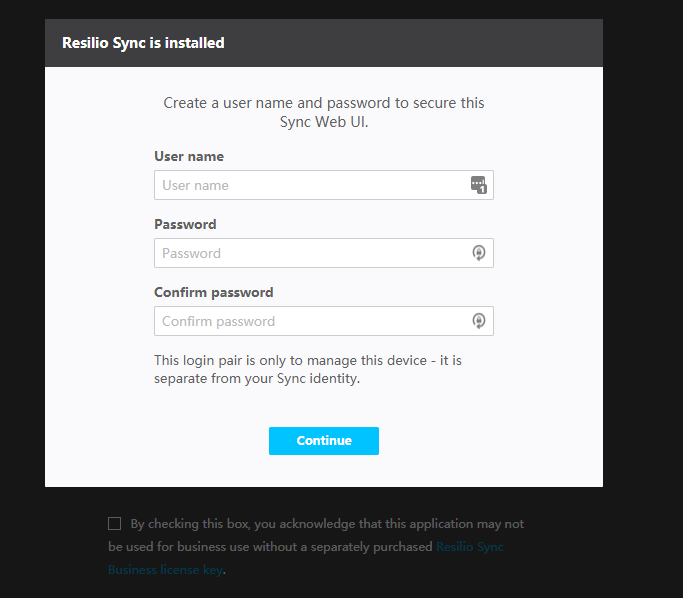

# Docker 安装 Resilio Sync

[toc]

Resilio Sync 是一个十分好用的文件共享工具，使用 Docker 一键安装十分省心。

## 安装 Resilio Sync

按照 [官网](https://hub.docker.com/r/resilio/sync/) 的示例，将命令稍作修改为自己需要的那种：

```bash
docker run -d --name Sync \
           -p 58888:8888 \
           -p 55555 \
           -v /mnt/ele/sync:/mnt/sync \
           --restart always \
           resilio/sync
```

## Web 页面使用

启动后，使用 IP 和端口就可以在浏览器中访问页面了。

初次使用会提示创建用户和密码：



剩下的就和普通使用一个样子啦。