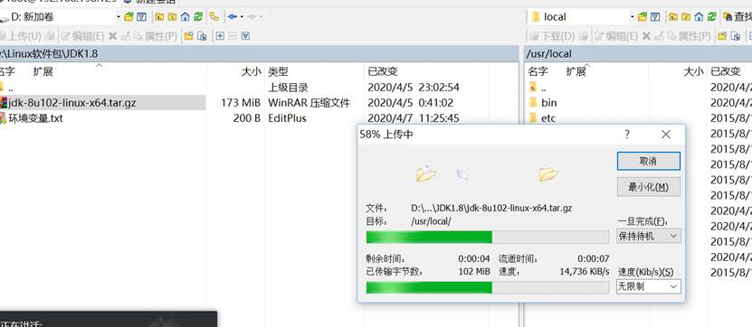

## 解压缩包安装 JDK

Windows 中，有一种软件的安装方式被称为“绿色软件”。也就是将安装好的文件直接拷贝到另一台电脑中运行，而无需额外的安装操作。类似地，CentOS 也可以通过这种方式安装软件。将软件在同样的系统中编译安装好，然后我们直接用编译好的安装包即可使用，而不需要繁复的安装操作。

Java JDK 就可以这样安装。

首先，将压缩包扔到 CentOS 系统中：



然后使用命令解压缩：

```bash
tar -zxvf jdk-8u102-linux-x64.tar.gz
```

接下来，把 Java 命令配置到环境变量里：

```bash
vi /etc/profile
```

拷贝环境变量，保存退出，注意把响应的路径改成 JDK 安装文件所在的位置：

```ini
JAVA_HOME=/usr/local/jdk1.8.0_102
JRE_HOME=/usr/local/jdk1.8.0_102/jre
PATH=$PATH:$JAVA_HOME/bin
CLASSPATH=.:$JAVA_HOME/lib/dt.jar:$JAVA_HOME/lib/tools.jar
export JAVA_HOME JRE_HOME PATH CLASSPATH
```

使环境变量生效（下面两种方法等效，使用其中之一即可）：

```bash
source /etc/profile
. /etc/profile    # 注意点后面有空格
```

查看 Java 的安装状态：

```bash
[root@localhost local]# java -version
java version "1.8.0_102"
Java(TM) SE Runtime Environment (build 1.8.0_102-b14)
Java HotSpot(TM) 64-Bit Server VM (build 25.102-b14, mixed mode)
```

