# LVS + keepalived 实现负载均衡

## 概述

### 负载均衡的类型

负载均衡可以采用硬件设备，也可以采用软件负载。但是商用硬件负载设备成本通常较高，所以一般情况下会采用软件负载。

软件负载解决的两个核心问题是：选谁、转发，其中最著名的是 LVS。

### LVS 概述

LVS 的英文全称是 Linux Virtual Server，即 Linux 虚拟服务器。是由章文嵩博士发起的自由软件项目，它的官方站点是 www.linuxvirtualserver.org

Linux 2.4 内核以后，LVS 已经是 Linux 标准内核的一部分。

lvs 可以将请求分发给后端真实服务器处理

有许多比较著名网站和组织都在使用 LVS 架设的集群系统，例如：Linux 的门户网站（<www.linux.com>）、向 RealPlayer 提供音频视频服务而闻名的 Real 公司（<www.real.com>）、全球最大的开源网站（<https://sourceforge.net/>）等。

LVS 提供了多种调度算法：

- 轮询调度（Round-Robin Scheduling）

- 加权轮询调度（Weighted Round-Robin Scheduling）

- 最小连接调度（Least-Connection Scheduling）

- 加权最小连接调度（Weighted Least-Connection Scheduling）

- 基于局部性的最少链接（Locality-Based Least Connections   Scheduling）

- 带复制的基于局部性最少链接（Locality-Based Least  Connections with Replication Scheduling）

- 目标地址散列调度（Destination Hashing Scheduling）

- 源地址散列调度（Source Hashing Scheduling）

- 最短预期延时调度（Shortest Expected Delay Scheduling）

- 不排队调度（Never Queue Scheduling）对应: `rr|wrr|lc|wlc|lblc|lblcr|dh|sh|sed|nq`

还有三种转发规则：

- NAT：简单理解，就是数据进出都通过 LVS，性能不是很好。

  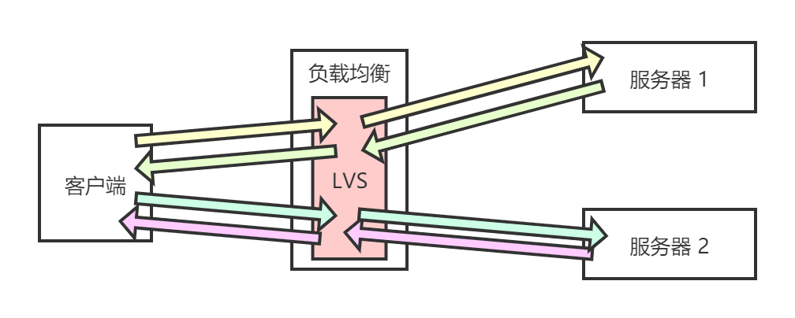

- TUNL：简单理解就是隧道，讲输入输出分离，但实际上效果并不显著。

  

- DR：最高效的负载均衡规则，服务器直接将数据返回给服务端，无需经过负载均衡。

  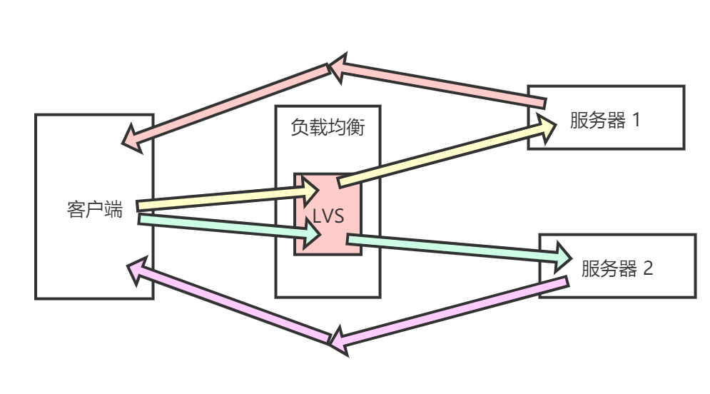

### LVS 的体系结构

- 最前端的负载均衡层，用 Load Balancer 表示

- 中间的服务器集群层，用 Server Array 表示

- 最底端的数据共享存储层，用 Shared Storage 表示

在用户看来，所有的内部应用都是透明的，用户只是在使用一个虚拟服务器提供的高性能服务

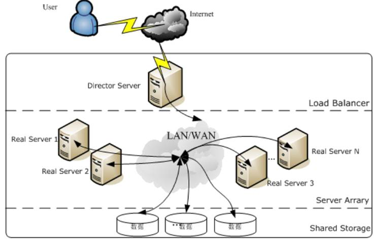

### Keepalived 介绍

因为所有的请求都要经过负载均衡，所以负载均衡必然是非常重要，不能挂掉，说白了就是要keep the lVS alived。

我们这里的演示需要 Keepalived 提供的功能就是可以配置 2 台 LVS，一台主机，一台备机。并且检测任何一个节点是否还活着。

### LVS 的优点

抗负载能力强，因为 LVS 工作方式的逻辑是非常之简单，而且工作在网络 4 层仅做请求分发之用，没有流量，所以在效率上基本不需要太过考虑。

七层网络协议：应用层、表示层、会话层、传输层、网络层、链路层、物理层

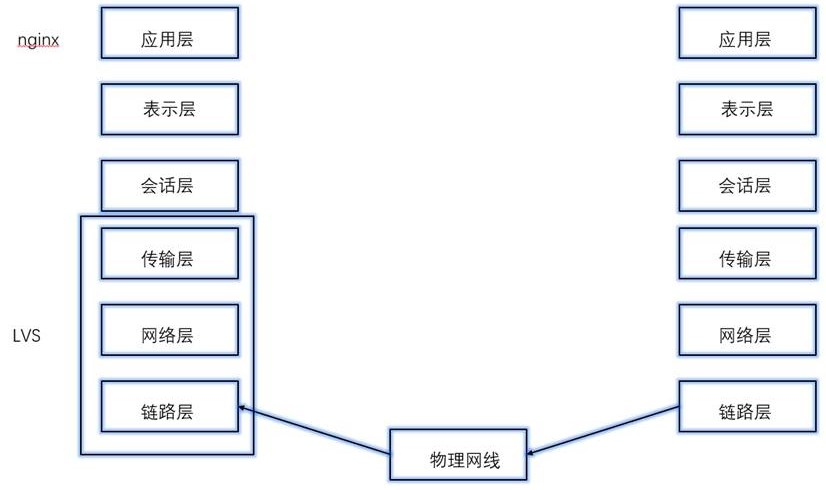

有完整的双机热备方案，当节点出现故障时，LVS 会自动判别，所以系统整体是非常稳定的。

基本上能支持所有应用，因为 LVS 工作在 4 层，所以它可以对几乎所有应用做负载均衡，包括 http、数据库、聊天室等等。

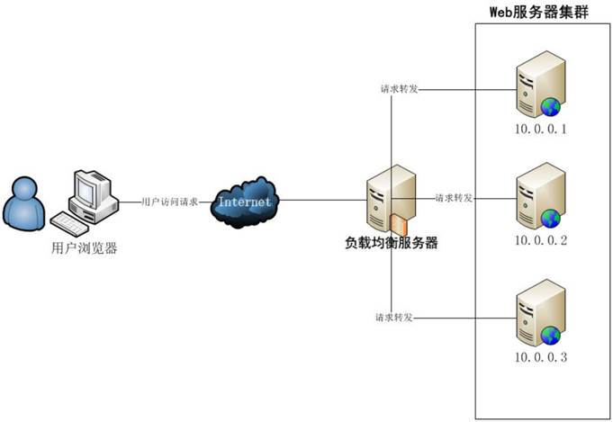

### LVS 与 Nginx 的对比

- 负载度：LVS 优于 Nginx

- 稳定度：LVS 优于 Nginx

- 服务器性能要求：LVS 优于 Nginx

- 网络层数的效率：LVS 优于 Nginx

- 功能多少：Nginx 优于 LVS

### LVS + Keepalived 的应用场景

主要使用在大型网站负载均衡。

## LVS + Keepalived 的安装和负载均衡配置

### 软件环境

CentOS 7（4台），这里用虚拟机演示，包括：

- 2 台负载均衡：LVS + Keepalived（主机名分别为 node01 和 node02）

- 2 台 http 服务器（主机名分别为 node03 和 node04）

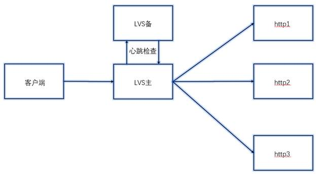

### http 服务器安装配置（2 台）

接下来的配置都是针对两台 http 服务器，也就是 node03 和 node04，进行的操作。每个操作都要对两个服务器分别进行。

首先，给后 2 台服务器装 http 服务器：

```bash
yum -y install httpd
```

设置 http 开机自启动：

```bash
[root@node03 ~]# systemctl enable httpd.service
Created symlink from /etc/systemd/system/multi-user.target.wants/httpd.service to /usr/lib/systemd/system/httpd.service.
```

开启 http 服务：

```bash
systemctl start httpd.service
```


查看 http 服务状态：

```bash
systemctl status httpd.service
```

运行状态为 active 说明运行正常。

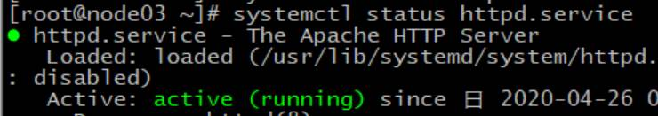

如果一切顺利，此时，可以使用浏览器进行访问测试，输入两台 http 服务器的 IP 即可测试：

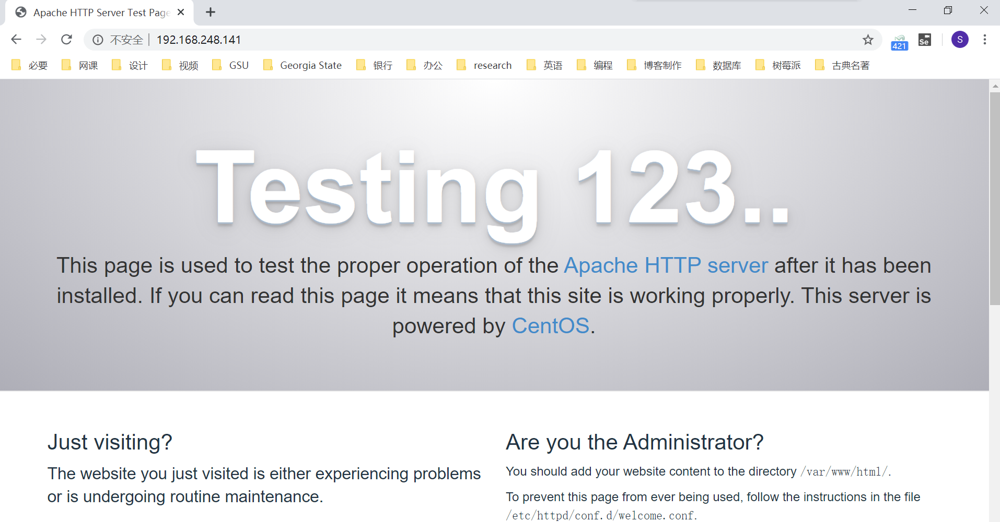

两台机器的页面是一样的，这样的话我们就无法区分究竟是哪一台 http 服务器在提供服务了。因此，我们需要定制两个页面。

对于两台机器，在 `/var/www/html` 目录下，创建 `index.html` 文件，随意写内容，能够区分这两台机器即可。比如在 node03 中写入：

```bash
[root@node03 ~]# vi /var/www/html/index.html

node3333333333333333333
```

而在 node04 中写入：

```bash
[root@node04 ~]# vi /var/www/html/index.html

node444444444444444444
```

此时访问，是可以区分这两台机器的：

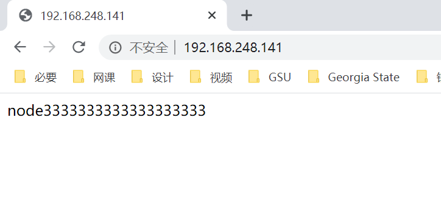

给两台机器创建 realserver 脚本配置文件：

```bash
vi /etc/init.d/realserver
```

在两个配置文件中都粘贴以下内容，其中 192.168.248.100 是虚拟 IP，注意要与其他机器在一个网段，IP 不能冲突，用于后面的访问：

```bash
#!/bin/bash  
#description : start realserver  
SNS_VIP=192.168.248.100 
/etc/rc.d/init.d/functions  
case "$1" in  
start)  
echo " start LVS of REALServer"  
/sbin/ifconfig lo:0 $SNS_VIP broadcast $SNS_VIP netmask 255.255.255.255 up  
echo "1" >/proc/sys/net/ipv4/conf/lo/arp_ignore  
echo "2" >/proc/sys/net/ipv4/conf/lo/arp_announce  
echo "1" >/proc/sys/net/ipv4/conf/all/arp_ignore  
echo "2" >/proc/sys/net/ipv4/conf/all/arp_announce  
;;  
stop)  
/sbin/ifconfig lo:0 down  
echo "close LVS Directorserver"  
echo "0" >/proc/sys/net/ipv4/conf/lo/arp_ignore  
echo "0" >/proc/sys/net/ipv4/conf/lo/arp_announce  
echo "0" >/proc/sys/net/ipv4/conf/all/arp_ignore  
echo "0" >/proc/sys/net/ipv4/conf/all/arp_announce  
;;  
*)  
echo "Usage: $0 {start|stop}"  
exit 1  
esac
```

分别给两台机器中刚刚创建好的 realserver 文件赋予可执行权限（其实只给属主可执行权限即可）：

```bash
chmod ugo+x /etc/init.d/realserver
```

分别启动两台机器的 realserver：

```bash
[root@node03 ~]# service realserver start
/etc/init.d/realserver: line 4: /etc/rc.d/init.d/functions: Permission denied
 start LVS of REALServer
```

ifconfig 查看，此时是多出了一块网卡：

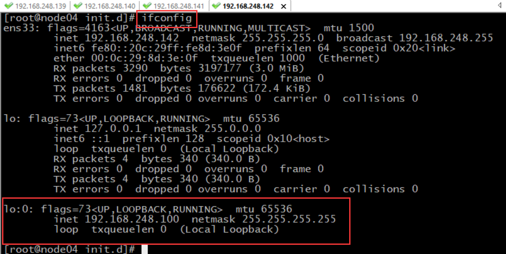

### LVS +Keepalived安装配置（主 LVS）

以下配置针对 node01，node02 也可以顺便配了，因为后面还是要进行相同的配置。

如果系统版本是 2.4 以上，Linux 将内置 LVS。所以，我们可以先查看一下系统版本：

```bash
[root@node01 ~]# uname -a
Linux node01 3.10.0-327.el7.x86_64 #1 SMP Thu Nov 19 22:10:57 UTC 2015 x86_64 x86_64 x86_64 GNU/Linux
```

我的系统内核版本为 3.10.0，显然已经内置了 LVS，无需手动安装。

然后使用 yum 安装 Keepalived：

```bash
yum -y install keepalived
```

若出现了下面的冲突报错，说明 Keepalived 和 5.5.58 版本的 MySQL 不兼容：

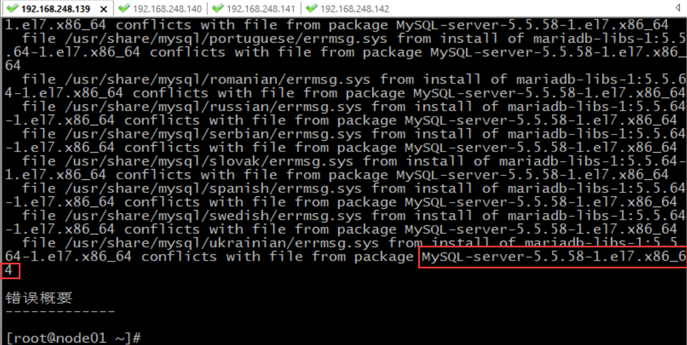

我们可以暂时将其删除。因为是通过 rpm 安装的，所以可以直接通过 rpm 卸载：

```bash
rpm -e MySQL-server-5.5.58-1.el7.x86_64
```

卸载好 MySQL，可以尝试重新安装 Keepalived：

```bash
yum -y install keepalived
```

安装完成后，可以使用 rpm 命令查看到它的配置文件位置：

```bash
rpm -ql keepalived
```

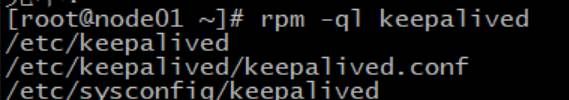

可以猜到，Keepalived 的配置文件应该是 `keepalived.conf` 这个。先将这个配置文件清空覆盖：

```bash
> /etc/keepalived/keepalived.conf
```

编辑这个清空了的配置文件：

```bash
vi /etc/keepalived/keepalived.conf
```

在配置文件中加入以下内容。修改 state 为 MASTER，也就是注 LVS。网卡名是虚拟网卡的名字，我这里是 ens33。然后把 VIP 设置成前面 http 服务器指定的那个 IP，我这里是 `192.168.248.100`。注意有两处需要修改 VIP 的地方。最后还要把真实 IP 修改成两个 http 服务器，也就是 node03 和 node04 的 IP：

```nginx
global_defs {                       
#   notification_email {             
#   }
#   smtp_connect_timeout 30
        router_id LVS_DEVEL             
}
vrrp_instance VI_1 {            
        state MASTER             
        interface ens33            
        virtual_router_id 51        
        priority 100                  
        advert_int 1           
        authentication {        
                auth_type PASS
                auth_pass 1111
        }
        virtual_ipaddress {         
                192.168.248.100
        }
}
virtual_server 192.168.248.100 80 {
        delay_loop 6           
        lb_algo wrr            
        lb_kind DR                          
        nat_mask 255.255.255.0   
        persistence_timeout 0    
        protocol TCP                          
        real_server 192.168.248.141 80 {     
                weight 1                     
                TCP_CHECK {                     
                        connect_timeout 10   
                        nb_get_retry 3
                        delay_before_retry 3
                        connect_port 80
                }
        }
        real_server 192.168.248.142 80 {
                weight 2
                TCP_CHECK {
                        connect_timeout 10
                        nb_get_retry 3
                        delay_before_retry 3
                        connect_port 80
                }
        }
}
```

启动服务：

```
[root@node01 ~]# service keepalived start
Redirecting to /bin/systemctl start  keepalived.service
```

可以查看日志信息：

```bash
tail -f /var/log/messages
```

查看启动状态：

```bash
service keepalived status
```

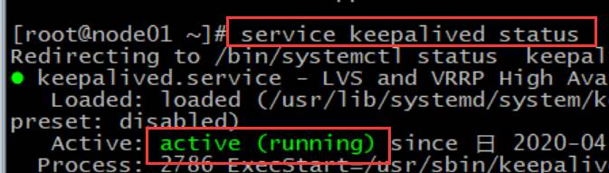

### LVS + Keepalived 负载均衡测试

转发测试，通过 VIP 进行访问，真实处理请求的不一定是哪个 http。IP 后面加一个随机数，这样避免浏览器缓存数据造成结果不准确：

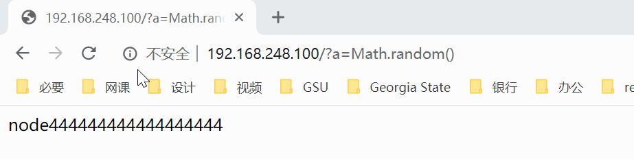

故障移除测试。关掉某台 http 服务器的 http 服务，模拟该服务器挂了。比如停掉 node3 的服务：

```bash
systemctl stop httpd.service
```

此时，挂掉的机器，自动移除。使用浏览器访问虚拟的 VIP，将只能访问到 node04：


故障恢复自动添加测试。重新开启 node03 的服务，模拟故障恢复：

```bash
systemctl start httpd.service
```

此时，可以再次访问到 node03：

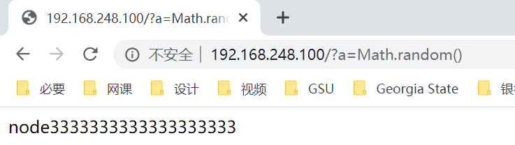

### LVS 备机搭建（备 LVS）

还是先查看一下系统版本，如果系统版本在 2.4 以上，Linux 将内置 LVS：

```bash
[root@node02 ~]# uname -a
Linux node02 3.10.0-327.el7.x86_64 #1 SMP Thu Nov 19 22:10:57 UTC 2015 x86_64 x86_64 x86_64 GNU/Linux
```

当然没问题，版本足够高，系统内核已经内置了 LVS。

然后安装 Keepalived：

```
yum -y install keepalived
```

若有冲突报错，删除一下 MySQL 数据库：

```
rpm -e MySQL-server-5.5.58-1.el7.x86_64
```

再次尝试安装 Keepalived：

```bash
yum -y install keepalived
```

清空覆盖配置文件：

```bash
> /etc/keepalived/keepalived.conf
```

编辑配置文件：

``` bash
vi /etc/keepalived/keepalived.conf
```

在配置文件中加入以下内容，注意修改 VIP 和每个 http 服务器的 IP：

```mysql
global_defs {                       
#   notification_email {             
#   }
#   smtp_connect_timeout 30
        router_id LVS_DEVEL             
}
vrrp_instance VI_1 {            
        state MASTER             
        interface ens33            
        virtual_router_id 51        
        priority 100                  
        advert_int 1           
        authentication {        
                auth_type PASS
                auth_pass 1111
        }
        virtual_ipaddress {         
                192.168.248.100
        }
}
virtual_server 192.168.248.100 80 {
        delay_loop 6           
        lb_algo wrr            
        lb_kind DR                          
        nat_mask 255.255.255.0   
        persistence_timeout 0    
        protocol TCP                          
        real_server 192.168.248.141 80 {     
                weight 1                     
                TCP_CHECK {                     
                        connect_timeout 10   
                        nb_get_retry 3
                        delay_before_retry 3
                        connect_port 80
                }
        }
        real_server 192.168.248.142 80 {
                weight 2
                TCP_CHECK {
                        connect_timeout 10
                        nb_get_retry 3
                        delay_before_retry 3
                        connect_port 80
                }
        }
}
```

启动 Keepalived 服务：

```bash
[root@node02 ~]# service keepalived start
Redirecting to /bin/systemctl start  keepalived.service
```

查看 keepalived 的运行状态：

```bash
service keepalived status
```

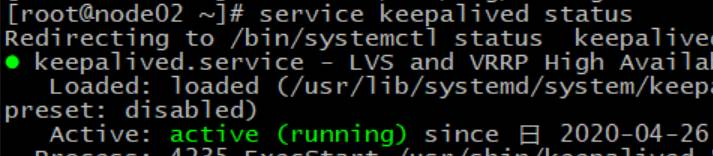

查看日志：

```bash
tail -f /var/log/messages
```

### LVS 主备测试

备机自动切换测试。关闭主 LVS 服务器的 keepalived 服务，模拟主 LVS 挂掉：

```bash
[root@node01 ~]# service keepalived stop
Redirecting to /bin/systemctl stop  keepalived.service
```

访问浏览器VIP，还是照常工作

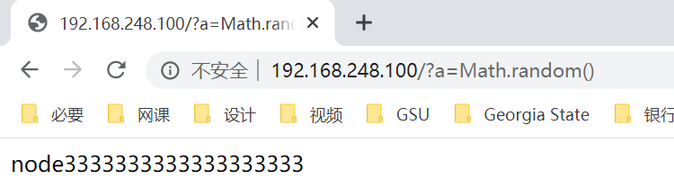

主机启动，主机自动上位：

```bash
[root@node01 ~]# service keepalived start
Redirecting to /bin/systemctl start  keepalived.service
```