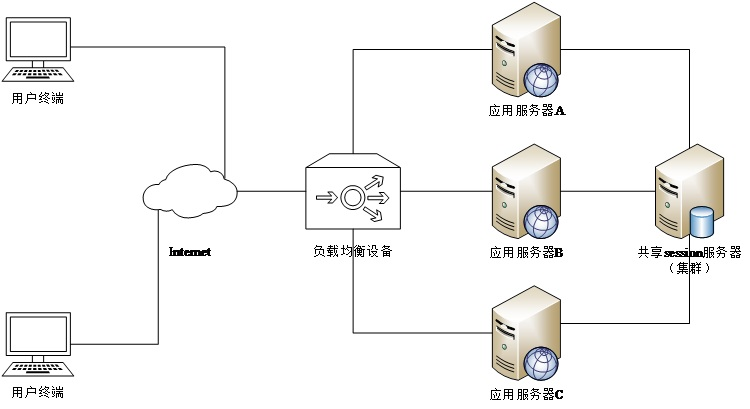
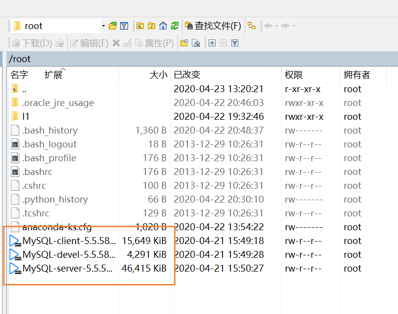

# MySQL 分布式存储

[TOC]

## Web 架构的演变

最基本的 Web 服务如下图所示，也就是 Web 服务和数据库在同一台计算集中。外界请求直接访问到 Web 服务器，然后服务器从数据库拿到数据，返回给客户端。

-1587631110073.png)

对于访问量不大的情况，这种最基本最原始的架构是足够了的。但是如果访问量稍微增长一些，因为 Web 频繁查询数据库，对于效率和稳定性都是一个巨大考验。

为了解决数据库的压力，我们可以将数据库独立开来，由一台服务器专门进行数据库的操作。同时，在 Web 服务器中，引入缓存机制，将使用频繁的数据缓存起来，实现快速查找，并减少数据库的压力。

.png)

将数据库独立开来，并引入缓存机制，确实可以处理很大的并发量。但是如果我们的需求进一步增加，需要处理更大的并发，应该怎么办呢？

或许我们可以使用多个 Web 服务器。但这又涉及到要给问题，用户如何知道自己该访问到哪一台服务器呢？

为了解决这个问题，我们可以使用一台负载均衡服务器。用户访问的是负载均衡服务器，由它将用户的请求分发给不同的 Web 服务器处理数据。

负载均衡可以在硬件上使用 F5 实现，也可以在软件上使用 Nginx 或 LVS 实现。

.png)

像上面这种，多台服务器协同运行的情况，被称为服务器集群。

## 分布式系统理论

### 集群的概念

服务器集群就是指将很多服务器集中起来一起进行同一种服务，在客户端看来就像是只有一个服务器。集群可以利用多个计算机进行并行计算从而获得很高的计算速度，也可以用多个计算机做备份，其中有任何一个机器出故障，其他机器能够顶替并正常运行，提高系统的容灾性。

服务器集群处理提高系统性能，提高响应速度，还可以用作容灾备份，例如 MySQL 的主从复制与双主互备。

### 分布式系统的概念



分布式系统（distributed system）是建立在网络之上的软件系统。正是因为软件的特性，所以分布式系统具有高度的内聚性和透明性。因此，网络和分布式系统之间的区别更多的在于高层软件（特别是操作系统），而不是硬件。

在分布式数据库系统中，用户感觉不到数据是分布的，即用户不须知道关系是否分割、有无副本、数据存于哪个站点以及事务在哪个站点上执行等。

### 集群与分布式的区别

集群指的是将几台服务器集中在一起，实现同一业务。

分布式是指将不同的业务分布在不同的地方。

### 分布式应用的业务场景

分布式存储：HDFS、MySQL、Oracle

分布式缓存：Redis、Memcache

分布式服务：SOA、微服务

分布式webServer：Tomcat、Apache

分布式协调中心：Zookeeper

分布式消息队列：Kafka、RabbitMQ

分布式实时数据平台：Storm、Akka

分布式离线数据平台：Hadoop、Spark

分布式搜索：Elasticsearch、Solr

分布式日志：Flume、ELK

分布式容器：Docker、Kubernetes

负载均衡：Nginx、LVS

## CentOS 通过 rpm 安装 MySQL

rpm 类似于 Windows 的 exe 可执行文件，可以直接安装应用程序。

在安装之前，我们要先卸载掉本地已有的 MariaDB 数据库，解决兼容问题：

```bash
yum -y remove mariadb-libs-1:5.5.44-2.el7.centos.x86_64
```

然后，把三个用来安装 MySQL 的 rpm 文件通过 WinSCP 之类的工具，传到 CentOS 中，位置不限，找得到就成。



切换到 rpm 包所在的位置，运行命令安装 MySQL：

```bash
rpm -ivh MySQL-devel-5.5.58-1.el7.x86_64.rpm MySQL-client-5.5.58-1.el7.x86_64.rpm MySQL-server-5.5.58-1.el7.x86_64.rpm
```

启动 MySQL 服务，提示 SUCCESS 表示服务启动成功：

```bash
[root@localhost ~]# service mysql start
Starting MySQL.Logging to '/var/lib/mysql/localhost.localdomain.err'.
... SUCCESS!
```

我们希望每次开机的时候，MySQL 自动启动，可以设置 MySQL 服务开机自启：

```bash
chkconfig mysql on
```

设置 MySQL root 用户的密码：

```bash
mysqladmin -uroot password 123
```

使用用户名和密码登录 MySQL 查看登陆状态即可。

## MySQL 主从复制（冷备）

### 常见的同步方式

普通文件的同步

常用的普通文件同步方式有：

- NFS 网络文件共享可同步存储数据

- Windows 的 samba

- Linux 定时任务

- ftp 数据同步

- ssh+scp 服务器远程同步

文件系统的同步

- drbd（基于文件系统同步），几乎同步任何业务数据

数据库的同步

- MySQL 主从复制（数据同步）

- Oracle DataGuard（甲骨文推出的一种高可用性数据库方案）

### MySQL 主从复制介绍

主从复制需要至少两台计算机配合，如果使用的是虚拟机，可以通过复制虚拟机来模拟多台计算机的情况。复制虚拟机时，要关闭虚拟机，包括 VMware 的窗口也要关闭。否则由于虚拟机文件占用，复制可能会有问题。打开复制的虚拟机时，可能会询问是复制还是移动了虚拟机，选择复制虚拟机即可。

MySQL 支持单向、双向、链式级联、实时、异步复制，在复制过程中，一台服务器充当主服务器（master），一个或多个其他服务器充当从服务器（slave）。

复制可以是单向：`M --> S`，也可以是双向：`M <--> M`

### 主从复制的应用场景

主从服务器互为备份，加强数据库架构的健壮性

主从服务器读写分离，分担网站压力，从服务器只处理用户的查询请求

将从服务器，按照业务拆分，分担压力

### 主从复制的原理

MySQL 的每次操作都会记录在日志信息中。通过对这些操作的重复，可以实现对数据库操作的复制。

1. Master 将改变记录到二进制日志（binary log）中
2. Slave 将 Master 的二进制日志事件（binary log events）拷贝到它的中继日志（relay log）
3. Slave 重做中继日志（Relay Log）中的事件，将 Master 上的改变反映到它自己的数据库中

这些是由从库在做，所以是异步的数据同步。

### CentOS 7 搭建 MySQL 主从复制

首先，必须检查防火墙是否已经关闭。若防火墙处于开启状态，要先关闭。

```bash
[root@localhost ~]# systemctl status firewalld
● firewalld.service - firewalld - dynamic firewall daemon
   Loaded: loaded (/usr/lib/systemd/system/firewalld.service; disabled; vendor preset: enabled)
   Active: inactive (dead)
```

#### 配置主数据库的 server-id

复制主数据库的 MySQL 配置文件模板到 `/etc/my.cnf`：

```bash
cp /usr/share/mysql/my-medium.cnf /etc/my.cnf
```

因为配置中默认的 server-id 是 1，我们无需修改。重启 MySQL 服务，应用 `my.cnf` 配置：

```bash
[root@localhost ~]# service mysql restart
Shutting down MySQL. SUCCESS! 
Starting MySQL.. SUCCESS!
```

进入 MySQL，查询 `service_id`，发现是 1：

```mysql
mysql> show variables like 'server_id';
+---------------+-------+
| Variable_name | Value |
+---------------+-------+
| server_id     | 1     |
+---------------+-------+
1 row in set (0.00 sec)
```

#### 配置从数据库的 server-id

在从数据库所在的服务器中（注意是另一个服务器了），同样复制 MySQL 配置到 `/etc/my.cnf`：

```bash
cp /usr/share/mysql/my-medium.cnf /etc/my.cnf
```

编辑 `my.cnf` 文件：

```bash
vi /etc/my.cnf
```

将其中的 server-id 改成 2：

```ini
server-id       = 2
```

保存退出后，重启 MySQL 服务，应用配置：

```bash
service mysql restart
```

进入到数据库中，查看 server_id 变量是否改成了 2：

```mysql
mysql> show variables like 'server_id';
+---------------+-------+
| Variable_name | Value |
+---------------+-------+
| server_id     | 2     |
+---------------+-------+
1 row in set (0.00 sec)
```

#### 查看主数据库的日志信息

进入 MySQL 中，使用命令查看主数据库的日志文件信息：

```mysql
mysql> show master status;
+------------------+----------+--------------+------------------+
| File             | Position | Binlog_Do_DB | Binlog_Ignore_DB |
+------------------+----------+--------------+------------------+
| mysql-bin.000001 |      107 |              |                  |
+------------------+----------+--------------+------------------+
1 row in set (0.00 sec)
```

记录下这个 File 和 Position 对应的值，我们稍后会用到。

这个数值后续查找可能会发生更改。不过不用担心，只要我们配置好一次，以后如果更改，会自动匹配。

#### 配置并启动从数据库服务

在从数据库服务器 MySQL 中输入如下命令，注意修改其中的配置信息

- IP 是主数据库 IP

- 日志文件信息，要跟上面查到的信息对应

把如下语句，整个粘贴到从数据库服务器的 MySQL 中执行：

```mysql
change master to 
master_host='192.168.248.139',
master_user='root',
master_password='123',
master_log_file='mysql-bin.000001',
master_log_pos=107;
```

在从数据库的 MySQL 中启动从服务：

```mysql
mysql> start slave;
Query OK, 0 rows affected (0.00 sec)
```

使用命令查看从服务信息（结尾 `\G` 的作用是让显示的结果更清晰）：

```mysql
show slave status\G;
```

此时，虽然已经启动了从服务，但是如果主数据库中进行任何操作，从数据库中仍然不会由任何的响应。这是因为我们还没有在主数据库中授权从数据库对其进行访问。

#### 主数据库授权从数据库访问

因为从数据库没有权限，所以我们需要在主数据库中授予它权限：

```mysql
grant all privileges on *.* to 'root'@'%' identified by '123' with grant option;
```

刷新权限列表，使其生效：

```mysql
mysql> flush privileges;
Query OK, 0 rows affected (0.00 sec)
```

#### 测试

在主数据库中新建一个名为 db_test 的数据库：

```mysql
mysql> create database db_test;
Query OK, 1 row affected (0.00 sec)
```

在从数据库中查询，即可看到也出现了 db_test 数据库：

```mysql
mysql> show databases;
+--------------------+
| Database           |
+--------------------+
| information_schema |
| db_test            |
| mysql              |
| performance_schema |
| test               |
+--------------------+
5 rows in set (0.00 sec)
```

### 主从复制存在的问题

因为是异步同步，有可能丢失极小一部分数据。比如当主数据库刚进行一些修改操作，尚未来得及备份就崩溃了。那么这部分修改是无法被记录的，也就造成了数据的丢失。

### CentOS 7 搭建 MySQL 双主互备（热备）

双主互备就是要保持两个数据库的状态自动同步，对任何一个数据库的操作都自动应用到另外一个数据库，始终保持两个数据库数据一致，这样做的意义是既提高了数据库的容灾性，又可以做负载均衡，可以将请求分摊到其中任何一台上，提高网站吞吐量。

双主互备其实就是两个主从复制合到一起了。接下来的操作，是在上面的主从复制的基础上进行的。我们只需将原来的从数据库作为主数据库，将主数据库作为从数据库，再进行一次主从复制，即可实现双主复制。

#### 查看主数据库的日志信息

使用命令查看主数据库的日志信息，注意，这里的主数据库是前面的从数据库，也就是 server-id 为 2 的那个数据库：

```mysql
mysql> show master status;
+------------------+----------+--------------+------------------+
| File             | Position | Binlog_Do_DB | Binlog_Ignore_DB |
+------------------+----------+--------------+------------------+
| mysql-bin.000001 |      261 |              |                  |
+------------------+----------+--------------+------------------+
1 row in set (0.00 sec)
```

#### 配置并启动从数据库服务

同样地，这里的从数据库是前面的主数据库，也就是 server-id 为 1 的那个数据库。我们在这个数据库中数据下面的命令，注意修改相应的配置数据，IP 为主数据库 IP，日志信息是刚刚查到的：

```mysql
change master to 
master_host='192.168.248.140',
master_user='root',
master_password='123',
master_log_file='mysql-bin.000001',
master_log_pos=261;
```

启动在从数据库中从服务：

```mysql
mysql> start slave;
Query OK, 0 rows affected (0.00 sec)
```

#### 主数据库授权从数据库访问

在主数据库中，授予从数据库访问权限：

```mysql
grant all privileges on *.* to 'root'@'%' identified by '123' with grant option;
```

刷新权限表，应用授权：

```mysql
mysql> flush privileges;
Query OK, 0 rows affected (0.00 sec)
```

#### 测试

此时，对两边的任意数据库进行操作，另一个数据库中也会有同样操作。