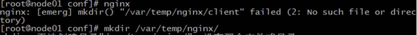
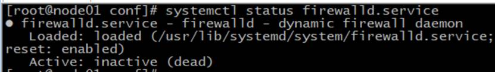
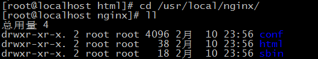
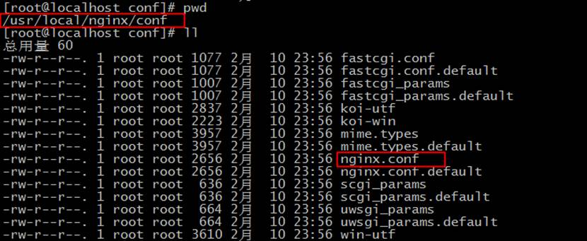
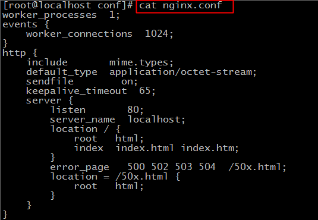
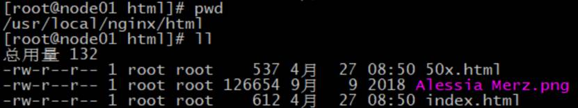
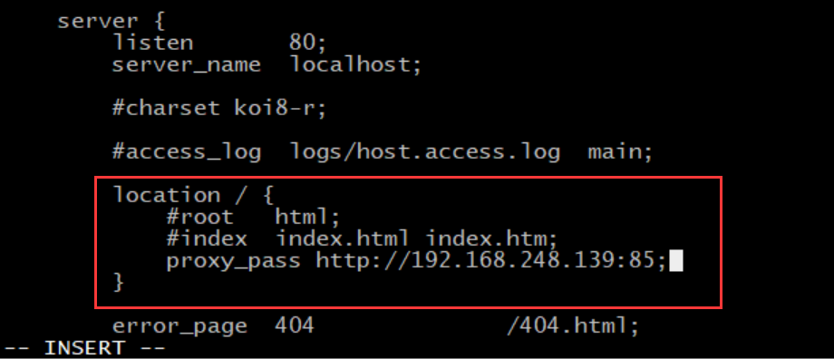

# Nginx 快速入门

[TOC]

## Nginx 简介

### Nginx 概述

Nginx 是一个使用 C 语言开发的高性能的 HTTP 服务器和反向代理服务器以及电子邮件（IMAP/POP3）代理服务器。

Nginx 是俄罗斯的程序设计师 Igor Sysoev 为俄罗斯访问量第二的 `Rambler.ru` 站点开发的。

### Nginx 的优点

- 轻量级

- 在应对高并发情况时，能保持低资源低消耗高性能

- 高度模块化的设计，配置简洁

官方测试 Nginx 能够支撑 5 万并发量，并且 CPU、内存等资源消耗却非常低，运行非常稳定。

### Nginx 的应用场景

- HTTP 服务器。Nginx 可以独立提供 HTTP 服务，可以做网页静态服务器

- 虚拟主机。可以实现在一台服务器虚拟出多个网站

- 反向代理，负载均衡

### Nginx 版本下载

官网下载地址：http://nginx.org/en/download.html


## Nginx 的安装

### 安装准备

首先要安装一些依赖：

```bash
yum -y install gcc-c++ pcre pcre-devel zlib zlib-devel openssl openssl-devel
```

### Nginx 的安装

将下载好的安装包传到 CentOS 的 `/usr/local` 目录下。

解压压缩包：

```bash
tar -zxvf nginx-1.10.3.tar.gz
```

进入解压好的 Nginx 安装目录中：

```bash
cd nginx-1.10.3
```

创建临时文件存放的文件夹：

```bash
mkdir -p /var/temp/nginx/
```

完整复制下面这段，执行 configure，生成 Makefile：

```bash
./configure \
--prefix=/usr/local/nginx \
--pid-path=/var/run/nginx/nginx.pid \
--lock-path=/var/lock/nginx.lock \
--error-log-path=/var/log/nginx/error.log \
--http-log-path=/var/log/nginx/access.log \
--with-http_gzip_static_module \
--http-client-body-temp-path=/var/temp/nginx/client \
--http-proxy-temp-path=/var/temp/nginx/proxy \
--http-fastcgi-temp-path=/var/temp/nginx/fastcgi \
--http-uwsgi-temp-path=/var/temp/nginx/uwsgi \
--http-scgi-temp-path=/var/temp/nginx/scgi
```

编译：

```bash
make
```

安装：

```bash
make install
```

安装完成后，在 `/usr/local` 目录下会出现一个 nginx 文件夹，里面有一个 sbin 目录，存放着 nginx 的启动文件。


创建 Nginx 的软链接：

```
ln -s /usr/local/nginx/sbin/nginx /usr/local/bin/nginx
```

测试验证配置有没有问题：

```bash
[root@node01 sbin]# nginx -t
nginx: the configuration file /usr/local/nginx/conf/nginx.conf syntax is ok
nginx: configuration file /usr/local/nginx/conf/nginx.conf test is successful
```

如果之前没有创建临时文件的文件夹可能会报错。若出现少文件夹的报错，自己创建一下



### Nginx 的启动

首先检查防火墙，是关闭的状态：



启动 Nginx，查看进程：

```bash
[root@node01 sbin]# nginx
[root@node01 sbin]# ps aux | grep nginx
root       7499  0.0  0.0  25016   772 ?        Ss   23:10   0:00 nginx: master process nginx
nobody     7500  0.0  0.1  25436  1224 ?        S    23:10   0:00 nginx: worker process
root       7502  0.0  0.0 112732   960 pts/0    R+   23:10   0:00 grep --color=auto nginx
[root@node01 sbin]# netstat -tunlp | grep 7499
tcp        0      0 0.0.0.0:80              0.0.0.0:*               LISTEN      7499/nginx: master
```

直接输入 nginx 就是启动 Nginx。我们看到，出现了两个进程。一个是 master，也就是主进程，还有一个 worker，也就是工人进程。Nginx 监听的是 80 端口。

浏览器访问 CentOS 的 IP 地址，即可


### Nginx 的停止

关闭 Nginx 并查看进程：

```bash
[root@node01 sbin]# nginx -s stop
[root@node01 sbin]# ps aux | grep nginx
root       7532  0.0  0.0 112732   960 pts/0    R+   23:16   0:00 grep --color=auto nginx
```

### Nginx 刷新配置

启动后，若修改配置，如下刷新即可，不需要重启 Nginx：

```bash
[root@node01 sbin]# nginx -s reload
```

## Nginx 详解

### Nginx 安装目录



- conf：nginx 的配置文件

- html：nginx 默认访问的根目录，存放静态资源

- sbin：存放 nginx 运行脚本

### Nginx 配置文件





- worker_processes：工作进程：数目。根据硬件调整，通常等于 CPU 数量或者 2 倍于 CPU。

- worker_connections：每个工作进程的最大连接数量。根据硬件调整，和前面工作进程配合起来用，尽量大，但是别把 CPU 跑到 100% 就行。

- include：设置支持的文件类型，具体内容在 `mime.types` 中

- sendfile：sendfile 指令指定 nginx 是否调用 sendfile 函数（zero copy 方式）来输出文件，对于普通应用，必须设为 on。如果用来进行下载等应用磁盘 IO 重负载应用，可设置为 off，以平衡磁盘与网络 IO 处理速度，降低系统 uptime。

- keepalive_timeout：keepalive 超时时间。

- server：一个 server 就是一个虚拟机

- listen：server 虚拟机的端口号

- server_name：server 虚拟机的主机名

- location：默认访问的资源

- root html：虚拟主机的根目录

## Nginx 的基本使用

### Web 站点

如下目录，存的东西，外部可直接访问



### 多虚拟主机

多虚拟主机的好处是省钱，省事。我们可以使用一台主机，部署多个不同的项目。这真的是一个特别神奇的功能。可以实现使用不同的域名，定位到同一个 IP 的同一台主机，然后得到不同的项目页面。

直接修改配置：

```bash
[root@node01 conf]# pwd
/usr/local/nginx/conf
[root@node01 conf]# vi nginx.conf
```

在原 server 下，再加一个 server。有两点需要注意，首先千万要注意括号要成对写，不要漏掉，然后每行语句后面都要加上分号：


修改完成后，保存并退出。

把 html 文件夹复制一份，叫 py，跟刚刚我们配置的对应上：

```bash
[root@node01 nginx]# pwd
/usr/local/nginx
[root@node01 nginx]# ll
总用量 4
drwxr-xr-x 2 root root 4096 4月  27 23:30 conf
drwxr-xr-x 2 root root   38 4月  27 23:04 html
drwxr-xr-x 2 root root   18 4月  27 23:04 sbin
[root@node01 nginx]# cp -r html py
[root@node01 nginx]# ll
总用量 4
drwxr-xr-x 2 root root 4096 4月  27 23:30 conf
drwxr-xr-x 2 root root   38 4月  27 23:04 html
drwxr-xr-x 2 root root   38 4月  27 23:31 py
drwxr-xr-x 2 root root   18 4月  27 23:04 sbin
```

修改 index.html，让自己能区分：

```bash
[root@node01 py]# pwd
/usr/local/nginx/py
[root@node01 py]# vi index.html
```

刷新配置：

```bash
[root@node01 py]# nginx -t
nginx: the configuration file /usr/local/nginx/conf/nginx.conf syntax is ok
nginx: configuration file /usr/local/nginx/conf/nginx.conf test is successful
[root@node01 py]# nginx -s reload
```

这时，访问 80 端口还是原来的 Nginx 页面，但是访问 85 端口就成了我们刚刚配置的页面：


### 404 页面设置

Nginx 有默认的 404 页面，但是不是很好看，而且会直接把 Nginx 的版本暴露出来，有一定的安全隐患：


配置里，可以把如下注释打开，自己创建错误页面


创建一个对应的 `404.html`：

```bash
[root@node01 html]# pwd
/usr/local/nginx/html
[root@node01 html]# echo "very sorry" > 404.html
```

刷新 Nginx 配置：

```bash
[root@node01 html]# nginx -t
nginx: the configuration file /usr/local/nginx/conf/nginx.conf syntax is ok
nginx: configuration file /usr/local/nginx/conf/nginx.conf test is successful
[root@node01 html]# nginx -s reload
```

再次访问错误页面，就会出现我们自己指定的 404 页面了：


### Nginx 反向代理

正向代理，代理的是客户端；反向代理，代理的是服务端。

修改 Nginx 配置文件如下，此时，访问 80 端口，实际上会转发到 85 端口：



刷新配置：

```bash
[root@node01 conf]# nginx -t
nginx: the configuration file /usr/local/nginx/conf/nginx.conf syntax is ok
nginx: configuration file /usr/local/nginx/conf/nginx.conf test is successful
[root@node01 conf]# nginx -s reload
```

访问 80，跳转到了 85：


### Nginx 负载均衡

Nginx 的负载均衡其实就是高级版的反向代理，将请求分别代理到多个服务器中，即实现了负载均衡。

修改配置文件，添加负载均衡池，80 端口反向代理到负载均衡池：


在下面还要多创建一个 90 端口的 server：


复制 py，创建个 py2，修改里面的 index.html，有区分就行：

```bash
[root@node01 nginx]# pwd
/usr/local/nginx
[root@node01 nginx]# cp -r py py2
[root@node01 nginx]# cd py2
[root@node01 py2]# vi index.html
```

刷新配置：

```bash
[root@node01 py2]# nginx -t
nginx: the configuration file /usr/local/nginx/conf/nginx.conf syntax is ok
nginx: configuration file /usr/local/nginx/conf/nginx.conf test is successful
[root@node01 py2]# nginx -s reload
```

页面访问，此时实现了反向代理到 85 和 90，也是按照权重去访问的：


