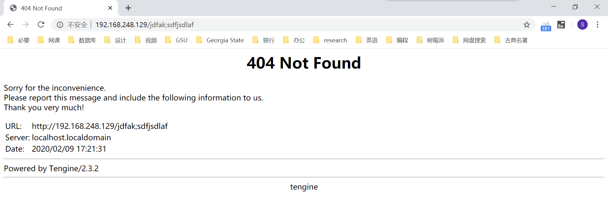
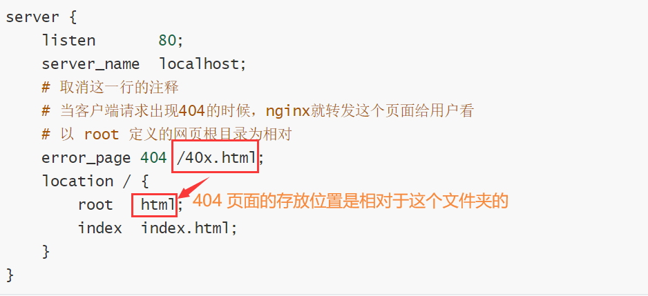
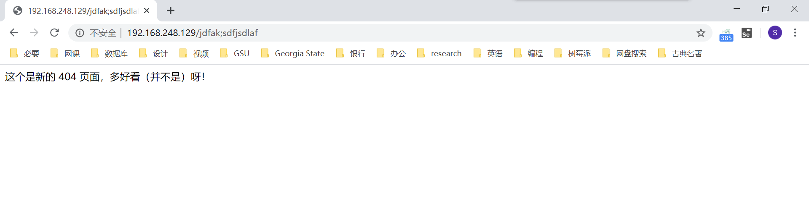

## nginx 的错误页面优化功能

[TOC]

### nginx 的 404 页面功能

当一个页面，访问出错的时候，出现默认的 404 是很难看的，让用户感觉这个网站很不专业：



修改 404 错误页面的方法同样是修改 nginx.conf 配置。

通过源码编译安装的 nginx，配置文件存放在指定的安装目录的 conf 文件夹中；通过 yum 安装的 nginx，配置文件默认存放在 `/etc/nginx/nginx.conf`。

修改 404 错误页面三部曲：

1. 修改 nginx.conf 文件如下，只需取消那一行代码前的注释：

   ```shell
   server {
       listen       80;
       server_name  localhost;
       # 取消这一行的注释
       # 当客户端请求出现404的时候，nginx就转发这个页面给用户看
       # 以 root 定义的网页根目录为相对
       error_page 404 /40x.html;
       location / {
           root   html;
           index  index.html;
       }
   }
   ```

   404 页面的存放位置相对的是 root 指定的文件夹：

   


2. 平滑重启 nginx：

   ```shell
   nginx -s reload
   ```

3. 手动创建 40x.html 文件：

   ```shell
   echo "<meta charset='utf8'>这个是新的 404 页面，多好看（并不是）呀！" > /opt/tengine23/html/40x.html
   ```

4. 访问一个错误网页，即可看见新的 错误页面了：

   

当然，新的页面也并不是那么美观，就需要进一步定制了。

### nginx 的 500 页面优化

nginx 是根据状态码返回页面。于是，500 页面的优化同 404 页面是一致的，只需要在下面加上几乎相同的一行配置即可：

```shell
        # 当客户端请求出现404的时候，nginx就转发这个页面给用户看，以root定义的网页根目录为相对
        error_page 404 /40x.html;
        error_page  500  /50x.html;  
```