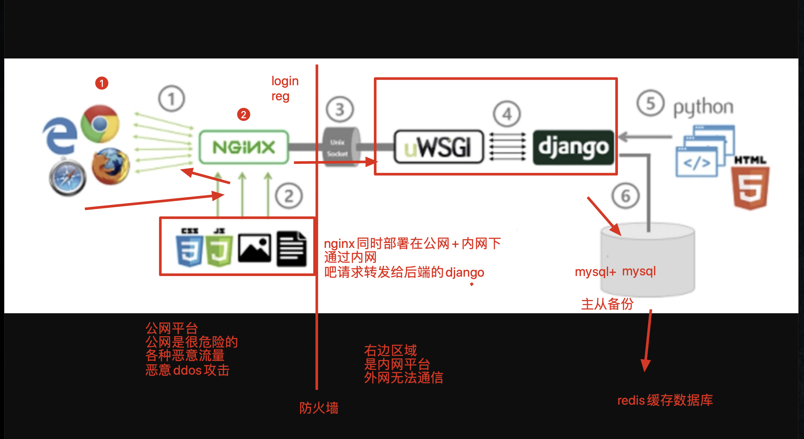

## nginx 介绍

[TOC]

### nginx 初识

目前常用的 web 网络服务器程序有 IIS、Apache、nginx 等。其中，IIS（Internet Information Services，互联网信息服务）是 Windows 默认的 web 服务器程序。

2004 年 10 月 4 日，为俄罗斯知名门户站点而开发的 web 服务程序 nginx 横空出世。 nginx 程序作为一款轻量级的网站服务软件，因其稳定性和丰富的功能而快速占领服务器市场。

- nginx 是 Linux 的一个软件，性能十分强大
- 是一个高性能的 web 服务器软件
- 能够实现 web 服务器功能，展示静态页面

- 实现反向代理，用作项目部署，负载均衡，邮件代理等等

### 小型网站的部署

小型网站一般部署在一台服务器上，不必要过多考虑负载均衡和特别高的并发的情况。即便如此，为了确保网站的正常运行，并且避免恶意攻击，提高运行效率，还是要有一套科学的部署流程。

用户的请求，首先通过浏览器发送给 nginx 这个 web 服务器。nginx 先对这些请求进行简单处理。如果发现请求的是静态文件，就直接返回给浏览器，不进入后端逻辑。nginx 处理静态文件的性能非常高。如果是需要访问数据库等动态请求，就转发给后端的 web 框架处理。

后端的 web 框架使用的是 uwsgi + django 模式实现较高并发。后端运行着多个 uwsgi + django 进程。这样可以更高效地处理并发任务。而且即便有一两个进程崩溃，也不会造成网站的瘫痪。既提高了进程，又提高了稳定性。

这样一来，动静态请求分离，极大减少后端服务器的压力。

小型网站部署可以参考如下图示。


### 为何要用 nginx？

我们知道，公网是很危险的地方，充斥着各种恶意流量和恶意攻击。所以真实的生产环境中，通常会在 web 服务器例如 nginx 和后端的 web 框架例如 django 之间加一道防火墙。nginx 部署在内网和公网，可以随意访问。但是 django 和数据库部署在内网，只能本地访问。这样，外部请求必须经过 nginx 才能访问到我们的 django 项目，极大提高了安全性。



### nginx 和 Tengine

Tengine 是由淘宝网发起的 web 服务器项目。它在 Nginx 的基础上，针对大访问量网站的需求，添加了很多高级功能和特性。Tengine 的性能和稳定性已经在大型的网站如淘宝网，天猫商城等得到了很好的检验。它的最终目标是打造一个高效、稳定、安全、易用的 web 平台。

简而言之，Tengine 就是针对高并发进行了优化的 nginx。Tengine 的安装和使用与 nginx 基本一致，可以按照需求，自主选取。

### nginx 常用功能

- nginx 的虚拟主机功能
  - nginx 支持多虚拟主机
- nginx 的访客日志功能，检测用户的请求来源 IP，请求客户端
  - 检测用户来源客户端，返回移动端/PC 端的站点
  - 运维通过日志分析用户的请求情况，时间点等等
  - 检测恶意的爬虫客户端，进行封禁等
- nginx 的错误页面优化等
- nginx 的反向代理功能，请求转发
  - 实现负载均衡，请求分发

### nginx 的文件夹介绍

通过源代码编译安装的 tengine，可以这样查看目录结构：

```shell
[root@s26linux tengine23]# pwd
/opt/tengine23
[root@s26linux tengine23]# ls
conf  html  logs  sbin
```

- conf，存放 nginx 配置文件的目录
- html，存放 nginx 的网站站点 静态资源的目录
- logs，存放各种日志的目录
- sbin，存放 nginx 可执行脚本的目录

通过 yum 安装的 nginx，其配置文件所在位置为：

```shell
[root@localhost bin]# cat /etc/nginx/nginx.conf
```

在配置文件里面，可以找到日志文件等所在的位置，也可对其进行配置。

### nginx 的常用参数

```shell
nginx -s reload    # 平滑重启，重新读取nginx配置文件，而不重启进程
nginx    # 直接输入nginx，是代表启动，只能首次使用
nginx -s stop    # 杀死nginx进程
nginx -t    # 检测nginx.conf是否编写正确
```