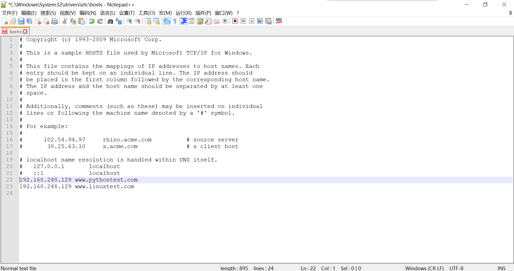
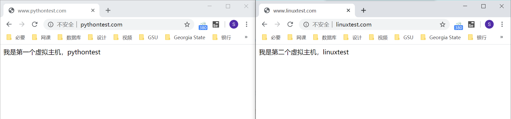

## nginx 的多虚拟主机配置

[TOC]

### nginx 的多虚拟主机功能介绍

从操作上来讲，配置多个 nginx 虚拟主机其实就是在 nginx.conf 中定义多个 server{} 标签而已。

多虚拟主机可以基于

- 基于域名的多虚拟主机，基于域名区分不同的站点配置，直接修改 server_name 配置
- 基于端口的多虚拟主机配置，直接修改 listen 的配置
- 基于 ip 的多虚拟主机配置，这个配置比较复杂，暂不必深究

具体来说，多虚拟主机配置的基本结构为：

```shell
http{
	# 第一个网站
	server{
	}
	# 平级的第二个网站配置
	server{
	
	}
}
```

### 基于域名的多虚拟主机配置流程

对于小型企业和个人来说，为了节约成本，有可能会需要在一台服务器上运行 2 个或更多的网站。我们需要用户输入不同的域名，服务器能自动识别我们要访问的是哪个网站，也就给我们返回不同的页面，具体来说就是：

```
当用户访问 www.pythontest.com    >   /tmp/test/python/index.html
当用户访问  www.linuxtest.com   >  /tmp/test/linux/index.html  
```

好在 nginx 的多虚拟主机功能可以实现这样的需求。

具体配置流程如下：

1. 准备一台服务器，安装好 nginx。

2. 准备好 2 个“域名”。由于资金有限，我们不会当真买两个域名做测试。我们可以通过修改 hosts 文件在本地进行假的解析，供我们测试使用。

   需要注意的是，我们要在浏览器所在的系统中修改 hosts 文件。因为我们想要将浏览器的请求解析为 IP 地址。具体来说，应该在 macOS 或 Windows 的 hosts 文件中添加，而不是 nginx 所在的 Linux 系统中添加。

   关于 dns 域名解析，可以参见 [dns 域名解析](dns.md)。

   Windows 的 hosts 文件存放在 `C:\Windows\System32\drivers\etc`；macOS 和 Linux 系统的 hosts 文件存放在 `/etc/hosts`。
   
   添加如下内容到 hosts 文件中：
   
   ```shell
   192.168.248.129 www.pythontest.com
   192.168.248.129 www.linuxtest.com
   ```
   
   
   
3. 修改 nginx 的配置，支持多域名的虚拟主机。通过源码编译安装的 nginx，配置文件在指定的安装路径下的 conf 文件夹中；通过 yum 安装的 nginx，配置文件在 `/etc/nginx/nginx.conf`。

   修改配置文件为如下配置，注意两个 server 是并列关系而非从属关系：

   ```shell
   # 第一个站点 www.s26python.com ，修改如下server{}标签
   server {
       # 定义网站端口的参数
       listen       80;
       # 填写网站域名的参数
       server_name  www.pythontest.com;
       #charset koi8-r;
       #access_log  logs/host.access.log  main;
       #access_log  "pipe:rollback logs/host.access_log interval=1d baknum=7 maxsize=2G"  main;
       location / {
           # root关键词定义的是 网页根目录的路径
           root   /tmp/test/pythontest;
           # index参数 定义的是首页文件的名字
           index  index.html index.htm;
       }
   }  # 这里就是上一个server标签的闭合点，回括号
   # 第二个虚拟主机站的配置，也就是 www.s26linux.com 再添加一个server{}标签
   # 注意两个 server 是并列关系而非从属关系
   server {
       listen 80;
       server_name www.linuxtext.com;
       location / {
           root  /tmp/test/linuxtest/;
           index   index.html;
       }
   }
   ```

4. 创建 2 个站点的资源文件夹，注意两个文件夹之间的逗号位置不要加空格：

   ```shell
   mkdir -p /tmp/test/{pythontest,linuxtest}
   ```

5. 分别创建 2 个首页文件，并写入相应的内容：

   ```shell
   echo "<meta charset='utf8'>我是第一个虚拟主机，pythontest" > /tmp/test/pythontest/index.html
   echo "<meta charset='utf8'>我是第二个虚拟主机，linuxtest" > /tmp/test/linuxtest/index.html
   ```

6. 平滑重启 nginx，查看页面效果：

   ```shell
   nginx -s reload
   ```

7. 如果不出意外，在浏览器中输入 www.pythontest.com 或 www.linuxtest.com，你就可以访问到两个不同的页面了。

   

至此，我们基于 nginx 实现了不同域名的多虚拟主机。不同域名解析至同一个 IP 的同一台主机，可以找到目标网站项目并顺利返回。

### 基于端口的多虚拟主机配置

基于端口的多虚拟主机配置流程同基于多域名配置基本一致，只是配置文件中，应该修改的是 listen 的参数，而非 server_name 的参数。只需将配置修改为如下形式即可。

```shell
# 第一个站点的配置，监听80端口
server {
    #定义网站端口的参数
    listen       80;
    # 填写网站域名的参数
    server_name  localhost;
    location / {
        # root关键词定义的是 网页根目录的路径
        root   /etc/test/pythontest;
        # index参数 定义的是首页文件的名字
        index  index.html;
    }
}

# 第二个站点的配置，监听81端口
server {
    listen 81;
    server_name  localhost;
    location / {
        root /etc/test/linuxtest;
        index index.html;
    }
}
```