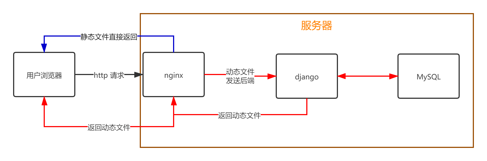
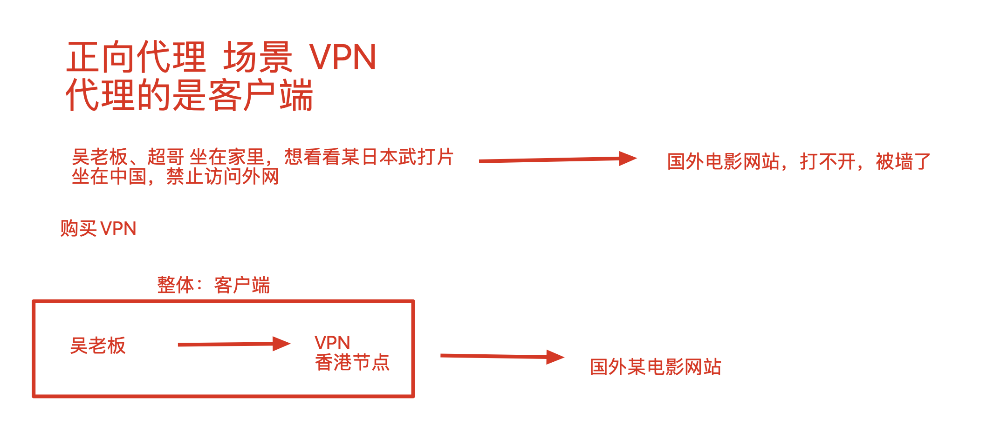
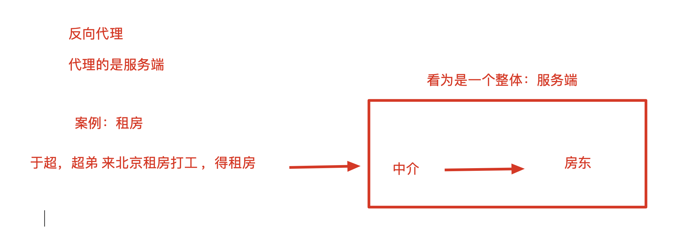
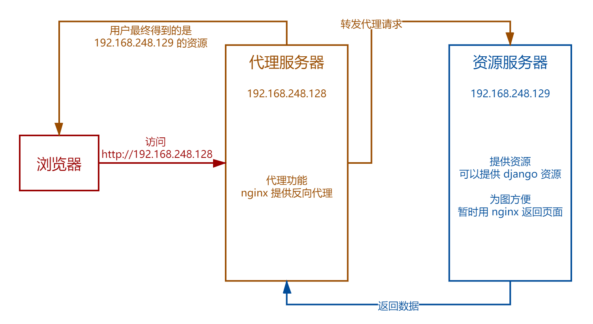
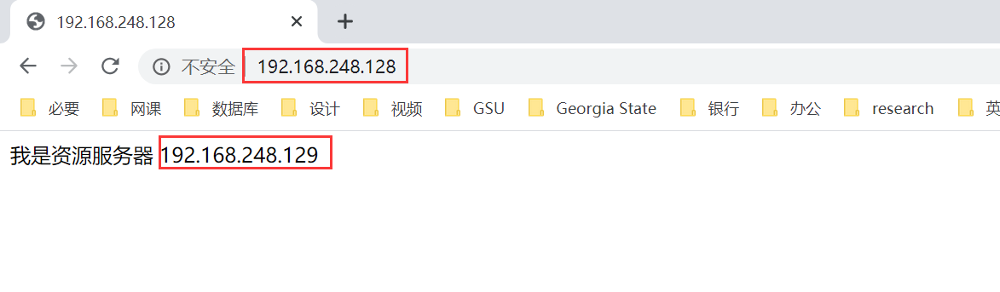

## nginx 的反向代理功能

[TOC]

### 代理的概念

代理，也就请人帮自己做一件事。生活中，代理的情况其实非常常见，比如：

- 房屋中介
- 微商
- 科学上网代理
- 黄牛

接下来，我们就以房屋中介为例，介绍一下代理的概念。

第一种形式，直接联系房东。

按照最直观的思路，我们要租房，当然要去找房东。直接联系到房东，找到我们想要的房屋资源。

这样做自然对用户来说很方便，可以直接联系到房东，不会有中间商赚差价。而且可以直接联系房东，能做的事情就多了。

但是对于房东来说，就不太喜欢这样了。首先，如果房子已经租出去了，就不希望在有人来打扰。但还会有很多人看着广告来向房东询问房屋信息。房东会不胜其烦。而且，一旦房子出了点什么问题，房客首先来找的当然是也只能是房东。这会让房东陷在租房过程中，无法抽身去做其他事，或者为更多人服务。

对于 web 请求来说，也是如此。这种方式就是浏览器直接访问服务器的 django 进程。django 不光处理租房子，也就是动态请求，其他的日常琐事，也就是静态文件也要由 django 处理。后台 django 的压力就很大，就会很吃资源，而且服务的效果也不好。这种方式，就是没有代理的 web 服务模式。

```
老王想租房 ----> 直接找到房东，找到我想要的资源 ---> 没有任何性能丢失，很好

用户浏览器 ----> 请求直接发给后台的django进程去处理  
```

第二种形式，联系中介租房

这次房东将房子托管给中介，委托中介帮忙把房子租出去。房客如果想租房，没办法直接联系到房东。无奈，他只好找中介帮忙。中介找到房东的房屋信息，按照约定的价格租给房客。

具体的流程是这样的：

```
请求过程
老王想租房，找不到房东，找不到资源 ---> 请求发给中介---> 中介拿到房东的房源 
响应过程
老王拿到房源 <---中介给的房源 <---房东给的中介的资源
```

这样做的好处是，房东只需提供住房，不再需要为其他的事情操心。

此时此刻，中介在用户的眼里，就是一个服务器（房东）。

类似地，对于 web 请求，浏览器不直接访问到后端的 django。而是先由 nginx 处理请求，若是静态文件，则直接返回给浏览器，若是需要读取数据库的动态请求，方才将请求转发给后端的 django，django 通过 pymysql 读取数据。处理好数据后，django 将处理好的请求返回给 nginx，再传给浏览器。在浏览器眼里，nginx 就是服务端。

```
反向代理的网站部署中的应用

浏览器 ->  nginx web服务器  ->  django（后端到底有多少的机器，我们无需知道）
```



### 正向代理和反向代理

上面谈到的通过中介租房的代理形式，以及将请求通过 nginx 转发的代理形式，都是一种反向代理。

反向代理，代理的是服务端。

在用户眼里，中介就如同房东；在浏览器眼里，nginx 就是是服务端了，其实请求还是要转发给 django 的。

至于正向代理，代理的是客户端。

一个常见的例子是 vpn 连接。

比如我在北京，但是访问不了国外的某些网站。

但如果我在日本，是可以访问到这些网站的。

那么如果我在北京，伪装成日本的身份，去访问国外网站。在国外网站的服务器眼里，请求是来自于日本的，而不是北京 ，就允许我们进行访问。

这时在服务器看来，客户端是日本的代理服务器，而不是我们。

总而言之，正向代理，代理的是客户端；反向代理，代理的是服务端。

正、反向代理的图解






### nginx 的反向代理配置

反向代理，也就是请求转发。代理服务器将浏览器发出的请求转发给资源服务器。用户通过访问代理服务器，获取到资源服务器的内容。

### 环境准备

首先，需要准备 2 台 Linux 虚拟机（在 VMware 里安装 2 个 Linux机器），一台作为代理服务器，一台作为资源服务器：

```
机器1的ip  ：192.168.248.128    （中介代理）（nginx，配置代理功能）

机器2的ip：  192.168.248.129     （房东，资源服务器）（nginx，返回一个网站页面）
```

按道理讲，资源服务器应该部署的是 django 项目。但是为了方便起见，就先用 nginx 作演示了：



### 中介，代理服务器配置

1. 首先配置中介代理，128 服务器。最先要安装一个 nginx：

   ```shell
   yum install nginx -y
   ```

2. 通过 yum 安装的 nginx，配置文件路径自动的生成在了这：

   ```
   vim /etc/nginx/nginx.conf
   ```

3. 找到第一个 server{} 标签，修改配置如下：

   ```SHELL
   server {
       listen       80 default_server;
       listen       [::]:80 default_server;
       server_name  _;
       root         /usr/share/nginx/html;
   
       # Load configuration files for the default server block.
       include /etc/nginx/default.d/*.conf;
       # 当请求是192.168.248.128，也就是代理服务器的时候，进入这个location路径匹配
       location / {
           # 请求通过proxy_pass参数，转发给资源服务器，也就是129那台机器
       	proxy_pass http://192.168.248.129;
       }
   
       error_page 404 /404.html;
       	location = /40x.html {
       }
   
       error_page 500 502 503 504 /50x.html;
       	location = /50x.html {
       }
   }
   ```

4. 改完 `nginx.conf` 之后，保存退出，启动或平滑重启 nginx：

   ```shell
   nginx
    # 若nginx已经启动，则需要平滑重启
   nginx -s reload
   ```

### 房东，资源服务器配置

1. 还是要安装配置好 nginx。

2. 修改 nginx.conf，返回一个页面，测试使用（其实啥也不用动，直接用默认就好）：

   ```shell
   server {
       listen       80;
       server_name  localhost;
   
       #charset koi8-r;
   
       #access_log  logs/host.access.log  main;
       #access_log  "pipe:rollback logs/host.access_log interval=1d baknum=7 maxsize=2G"  main;
   
       location / {
           root   html;
           index  index.html index.htm;
       }
   
       error_page  404              /40x.html;
   
       error_page   500 502 503 504  /50x.html;
           location = /50x.html {
           root   html;
       }
   }
   ```

3. 因为改了配置文件，所以需要平滑重启 nginx：

   ```shell
   nginx -s reload
   ```

4. 创建首页内容：

   ```shell
   echo "<meta charset='utf8'>我是资源服务器 192.168.248.129" > /opt/tengine23/html/index.html
   ```

### 客户端访问代理服务器

在浏览器中输入代理服务器的 IP，就可以访问到资源服务器了。

