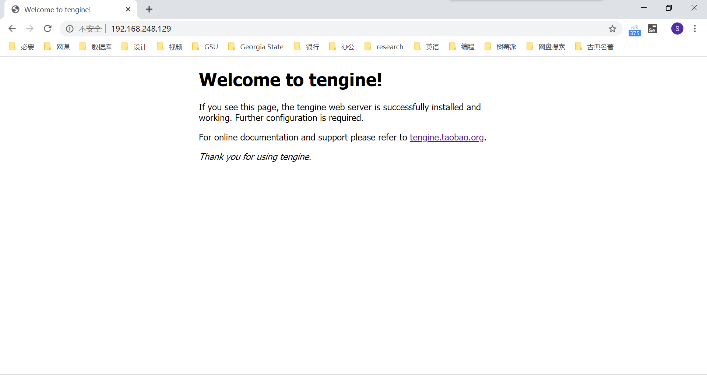
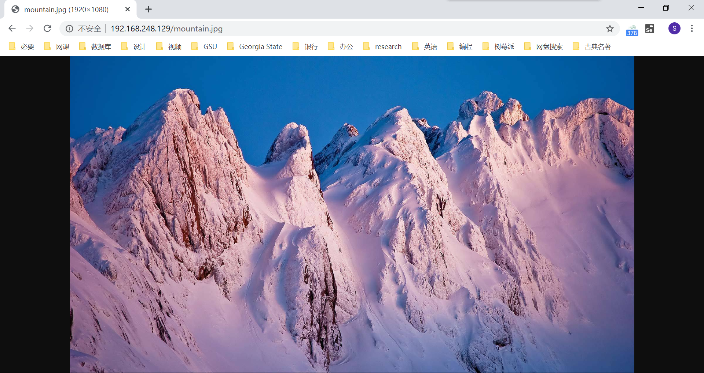

## nginx 的虚拟主机

[TOC]

### nginx 配置文件

前面已经讨论过，通过源代码编译的方式安装的 nginx 配置文件存放在指定的安装位置的 conf 目录下。而通过 yum 安装的 nginx 的配置文件所在位置为 `/etc/nginx/nginx.conf`

`nginx.conf` 简要解析如下

```shell
# 这里是nginx的核心web功能配置点
http{
	
	# 在http内还有一个重要的 server{}标签，定义虚拟主机功能的
	server {
	
				
	}

}   
```

### nginx 的虚拟主机配置

虚拟主机，就是在 `nginx.conf` 里的 server 标签。

找到标签，按照如下说明配置所需的功能参数即可。

```shell
#自上而下，找到第一个 server{}标签，就是你配置的第一个网站了
server {
    #定义网站端口的参数
    listen       80;
    # 填写网站域名的参数
    server_name  www.py.com;

    # 这个locaiton类似于url.py的功能，进行路由匹配
    # location / 代表最低级的匹配，所有的请求都会走到这里
    # 例如 192.168.248.128/hehe.txt
    # 例如  192.168.248.128/index.html
    location / {
        # root参数定义的是网页根目录的路径，相对于nginx的安装目录
        # 这行配置的意思是，网页根目录存放在/opt/tengine23/html这个目录下。
        # 也可以写成绝对路径
        root   html;
        # index参数定义的是首页文件的名字，以root关键词相对，在/opt/tengine23/html这个目录下得有一个index.html文件才行
        # 当浏览器直接输入ip，后不接任何东西，会直接返回首页index.html的内容
        index  index.html;
    }
}
```

### nginx 的虚拟主机站点功能

当我们配置好nginx的配置文件后，输入命令启动或平滑重启nginx：

```shell
nginx    # 启动nginx
nginx -s reload # 若nginx 已经启动，需要平滑重启nginx
```

在浏览器中直接输入 Linux 的 IP，即可访问 nginx 的首页了：



若是通过源码编译的方式安装的 nginx，默认站点的文件夹在 nginx 的安装路径下，名为html的文件夹。这个是可以在 `nginx.conf` 中找到和修改的。

如果我们在 html 目录下，放一个图片，浏览器中输入 `Linux 的 IP/图片名`。可以看见，我们可以成功访问到这张图片：

```shell
[root@s26linux html]# pwd
/opt/tengine23/html
[root@s26linux html]# ls
50x.html  index.html  mountain.jpg

# 浏览器中输入 192.168.248.128/mountain.jpg 即可访问图片资源
```



事实上，可以在 ip 后加上相对路径的形式，任意访问 html 文件夹中的文件了。

