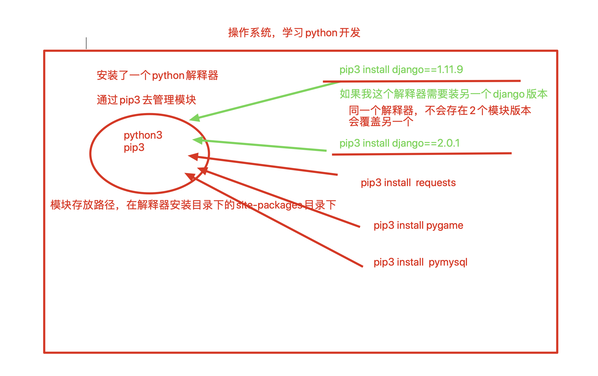
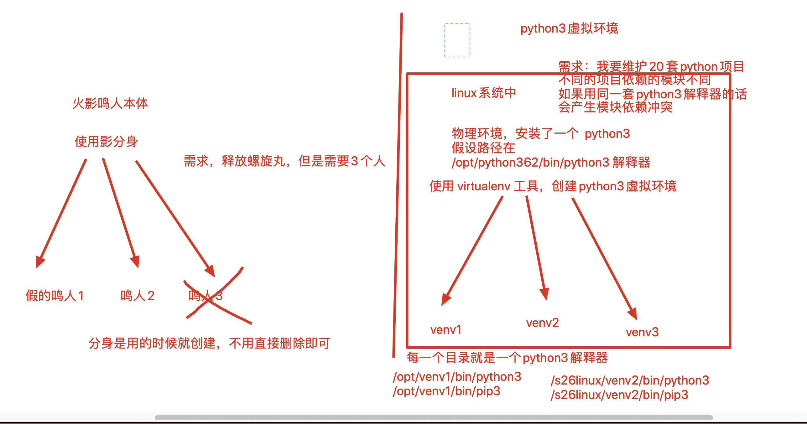
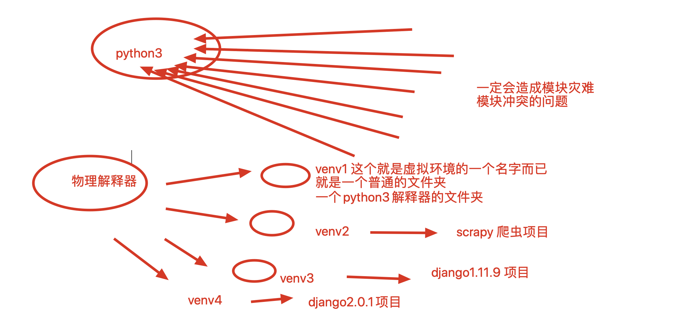
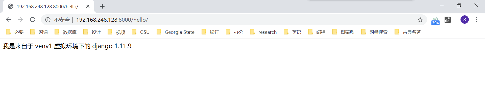
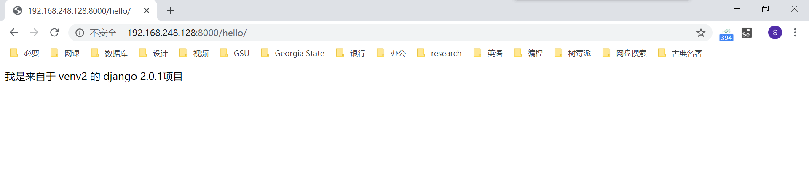

## Python 的虚拟环境

[TOC]

### python虚拟环境介绍

生产环境下的服务器中，可能同时运行多个项目。这些项目或许依赖不同版本的软件包。比如，A 项目依赖 django 1.11.9 版本，而 B 项目使用的是 django 2.0.1 版本。

但是要知道，同一个解释器中，是不可能存在同一个应用的不同版本的。后安装的版本会覆盖掉之前安装的版本。

这样会造成开发的混乱。



这时，我们就可以用到 Python 的虚拟环境了。

Python 的虚拟环境其实就是基于一个编译安装的 Python 3 解释器环境，分身出 N 多个 Python 3 解释器：




基于同一个 Python 3 解释器，创建多个 venv 虚拟环境。一个项目用一个虚拟环境，解决模块依赖冲突，很给力。




### 安装 virtualenv 虚拟环境任务

接下来，我们将要在一台 Linux 机器上：

- 启动 django1.11.9 项目，用 venv1 管理

- 再启动一个 django2.0.1 项目，用 venv2 管理

### 虚拟环境创建流程

了解一下，Python 解释器目录下的一个模块文件夹，所有模块都放在这里：

```
/s26linux/python362/lib/python3.6/site-packages
```

1. 在物理解释器环境下，安装 virualenv：

   ```shell
   [root@localhost ~]# pip3 install -i https://pypi.tuna.tsinghua.edu.cn/simple virtualenv
   ```

2. 通过命令创建虚拟环境，且是一个没有任何模块的，纯净的 Python 3 解释器：

   ```shell
   [root@localhost ~]# mkdir /opt/venvs
   [root@localhost ~]# cd /opt/venvs/
   [root@localhost venvs]# virtualenv --no-site-packages --python=python3 venv1
   ```

   命令解释：

   - `--no-site-packages`，用来创建干净没有模块的虚拟环境，这个是默认的，而且最新版本的 virtualenv 已经没有了这个参数，指定了反而会报错
   - `--python=python3`，指定以 Python 3 创建虚拟环境
   - 最后的 `venv1` 是虚拟环境的名字，是一个相对路径，也可以写成绝对路径的形式
   - venv1 虚拟环境将被安装 django 1.11.9 项目

3. 查看 venv1 文件夹，我们可以看到装有 Python 3 和 pip 3 的可执行文件的 bin 目录。通过命令发现没有多余的第三方包：

   ```shell
   [root@localhost venvs]# ls ./venv1/bin/
   activate      activate.fish  activate_this.py  easy_install      pip   pip3.6  python3    python-config
   activate.csh  activate.ps1   activate.xsh      easy_install-3.6  pip3  python  python3.6  wheel
   (venv1) [root@localhost venvs]# pip3 list
   Package    Version
   ---------- -------
   pip        20.0.2 
   setuptools 45.2.0 
   wheel      0.34.2 
   ```

4. 创建好 venv1 后，我们再创建一个 venv2 虚拟环境，用于安装 django 2.0.1：

   ```shell
   [root@localhost venvs]# virtualenv --no-site-packages --python=python3 /opt/venvs/venv2
   ```

5. 使用命令激活虚拟环境：

   ```
   [root@localhost venvs]# source ./venv1/bin/activate
   (venv1) [root@localhost venvs]# 
   ```

   前面出现了提示符`(venv1)`，说明进入到虚拟环境中。

6. 检查虚拟环境是否正常：

   ```shell
   (venv1) [root@localhost venvs]# which python3
   /opt/venvs/venv1/bin/python3
   (venv1) [root@localhost venvs]# which pip3
   /opt/venvs/venv1/bin/pip3
   ```

   Python 3 和 pip 3 均位于虚拟环境目录下，说明环境运行正常。

7. 可以用命令退出虚拟环境：

   ```shell
   (venv1) [root@localhost venvs]# deactivate
   [root@localhost venvs]# 
   ```

   退出虚拟环境后，系统会自动删除 venv1 的环境变量。

### venv1 虚拟环境的配置

开始试验，先激活 venv1，安装 django 1.11.9，创建项目，运行 hello，返回字符串`“我是来自于venv1虚拟环境下的django1.11.9”`。

具体的配置流程为：

1. 激活虚拟环境 venv1：

   ```shell
   [root@localhost venvs]# source ./venv1/bin/activate
   (venv1) [root@localhost venvs]#
   ```

2. 安装 django 1.11.9：

   ```shell
   (venv1) [root@localhost venvs]# pip3 install -i https://pypi.tuna.tsinghua.edu.cn/simple django==1.11.9
   ```

3. 创建 django 项目，编写 hello 视图函数：

   ```shell
   (venv1) [root@localhost venvs]# django-admin startproject dj1
   ```

   修改 settings.py 的 ALLOWED_HOSTS 配置为：

   ```python
   ALLOWED_HOSTS = ["*"]
   ```

   编写 MTV

4. 访问 venv1 下的 django 1.11.9 项目成功：

   

### venv2 虚拟环境的配置

激活第二个 venv2 虚拟环境，运行另一套 django 2.0.1 项目。

具体流程为：

1. 退出 venv1，激活 venv2：

   ```shell
   (venv1) [root@localhost venvs]# deactivate
   [root@localhost venvs]# source ./venv2/bin/activate
   (venv2) [root@localhost venvs]# 
   ```

2. 检查模块是否干净：

   ```shell
   (venv2) [root@localhost venvs]# pip3 list
   Package    Version
   ---------- -------
   pip        20.0.2 
   setuptools 45.2.0 
   wheel      0.34.2 
   ```

3. 安装 django 2.0.1：

   ```shell
   (venv2) [root@localhost venvs]# pip3 install -i https://pypi.tuna.tsinghua.edu.cn/simple django==2.0.1
   ```

4. 创建django项目，编写MTV，运行页面，返回"我是来自于venv2的django2项目"。

5. 浏览器访问 venv2 下的项目成功：

   

### virtualenvwrapper 的安装和使用

virtualenv 的有一个不足之处在于，每次开启虚拟环境之前都要去虚拟环境所在目录下的 bin 目录下 source 一下 activate。这样一来，操作繁琐不说，还需要我们不得不记住每个虚拟环境所在的目录。可是如果虚拟环境高多了，很容易搞忘虚拟环境给放在哪里了。

一种可行的解决方案是，将所有的虚拟环境目录全都集中起来，例如就像前面例子中，都放在 `/opt/venvs/`，并且针对不同的目录做不同的事。

另一种好的办法就是使用 virtualenvwrapper 管理你的虚拟环境（virtualenv）。其实就是统一管理虚拟环境的目录，并且省去了 source 的步骤。

配置 virtualenvwarapper 的流程为：

1. 要使用 virtualenvwrapper，首先当然要安装它。使用 pip，安装很简单（virtualenvwrapper 依赖 wheel、pbr 和 virtualenv）：

   ```bash
   pip3 install wheel -i https://pypi.tuna.tsinghua.edu.cn/simple
   pip3 install pbr -i https://pypi.tuna.tsinghua.edu.cn/simple
   pip3 install virtualenvwrapper -i https://pypi.tuna.tsinghua.edu.cn/simple
   ```

   对于 Windows 则要安装：

   ```bash
   pip install virtualenvwrapper-win -i https://pypi.tuna.tsinghua.edu.cn/simple
   ```

   Windows 系统默认的虚拟环境安装在 `C:\Users\username\envs` 目录下，如需指定，只需在环境变量中，设置 WORKON_HOME 变量。

2. 设置 Linux 的环境变量，确保计每次开机启动时加载 virtualenvwrapper。

   打开并编辑 `~/.bashrc` 文件：

   ```bash
   vim ~/.bashrc
   ```

   在文件末尾添加下面几行代码，注意修改 Python 解释器和 virtualenvwrapper 的地址为自己的 Python 安装位置，修改好后保存并退出：

   ```bash
   export WORKON_HOME=~/Envs    # 设置virtualenv的统一管理目录，可按需修改
   export VIRTUALENVWRAPPER_PYTHON=/opt/python36/bin/python3    # 指定python解释器
   source /opt/python36/bin/virtualenvwrapper.sh    # 执行virtualenvwrapper安装脚本
   ```
   
读取 `~/.bashrc` 文件，使其生效：
   
```bash
   source ~/.bashrc
   ```
   
执行效果像下面这样，说明运行成功。不出意外的话，完成此步即可使用 virtalenvwrapper。
   
```bash
   [root@localhost ~]# source ~/.bashrc
   virtualenvwrapper.user_scripts creating /root/Envs/premkproject
   virtualenvwrapper.user_scripts creating /root/Envs/postmkproject
   virtualenvwrapper.user_scripts creating /root/Envs/initialize
   virtualenvwrapper.user_scripts creating /root/Envs/premkvirtualenv
   virtualenvwrapper.user_scripts creating /root/Envs/postmkvirtualenv
   virtualenvwrapper.user_scripts creating /root/Envs/prermvirtualenv
   virtualenvwrapper.user_scripts creating /root/Envs/postrmvirtualenv
   virtualenvwrapper.user_scripts creating /root/Envs/predeactivate
   virtualenvwrapper.user_scripts creating /root/Envs/postdeactivate
   virtualenvwrapper.user_scripts creating /root/Envs/preactivate
   virtualenvwrapper.user_scripts creating /root/Envs/postactivate
   virtualenvwrapper.user_scripts creating /root/Envs/get_env_details
   [root@localhost ~]# 
   ```
   
3. virtualenvwrapper 的基本使用操作命令：

   ```bash
   # 创建一个虚拟环境：
   mkvirtualenv my_django111    # 这会在 ~/Envs 中创建 my_django111 文件夹
   
   # 在虚拟环境上工作，激活虚拟环境my_django111
   workon my_django111
   
   # 再创建一个新的虚拟环境
   mkvirtualenv my_django2
   
   # virtualenvwrapper 提供环境名字的tab补全功能。
   # 当有很多环境， 并且很难记住它们的名字时，这就显得很有用。
   
   # workon还可以任意停止你当前的环境，可以在多个虚拟环境中来回切换
   workon django1.11
   workon django2
   
   # 也可以手动停止虚拟环境
   deactivate
   
   # 删除虚拟环境，需要先退出虚拟环境
   rmvirtualenv my_django111
   ```

4. 其他常用命令：

   ```bash
   # 列举所有的环境
   lsvirtualenv
   # 导航到当前激活的虚拟环境的目录中，比如说这样就能够浏览它的 site-packages
   cdvirtualenv
   # 和上面的类似，但是是直接进入到 site-packages 目录中
   cdsitepackages
   # 显示 site-packages 目录中的内容
   lssitepackages
   
   # 完整官网介绍：https://virtualenvwrapper.readthedocs.io/en/latest/command_ref.html
   ```


