# Redis 分布式缓存

[TOC]

## NoSQL 概述

### NoSQL 定义

NoSQL 的英文全称是 Not Only SQL，意即“不仅仅是 SQL”，泛指非关系型的数据库。

随着互联网 web 2.0 网站的兴起，传统的关系数据库在应付 web 2.0 网站，特别是超大规模和高并发的 SNS 类型的 web 2.0 纯动态网站已经显得力不从心，暴露了很多难以克服的问题，而非关系型的数据库则由于其本身的特点得到了非常迅速的发展。

NoSQL 数据库的产生就是为了解决大规模数据集合多重数据种类带来的挑战，尤其是大数据应用难题，包括超大规模数据的存储。例如谷歌或 Facebook 每天为他们的用户收集万亿比特的数据。

### NoSQL 的优点

- 易于扩展

- 大数据量高性能

- 多样灵活的数据模型

### 3V 和 3 高

大数据时代的 3V 指的是：

- 海量 Volume

- 多样 Variety

- 实时 Velocity

互联网需求的 3 高指的是：

- 高并发

- 高可扩

- 高性能

### 当下 NoSQL 的经典应用

当下的应用通常是 SQL 和 NoSQL 配合使用。

比如淘宝的数据存储：

- 商品基本信息：MySQL 等关系型数据库

- 商品详情，描述类：MongoDB，处理大文本

- 商品图片：Hadoop 里的 HDFS，淘宝 TFS

- 关键字：ISearch 搜索引擎，多隆自己写，蔡景现

- 商品高频信息：Redis

### NoSQL 数据模型简介

NoSQL 的聚合模型：

- KV 键值

- BSON

- 列族：顾名思义，是按列存储数据的。最大的特点是方便存储结构化和半结构化数据，方便做数据压缩，对针对某一列或者某几列的查询有非常大的 IO 优势。

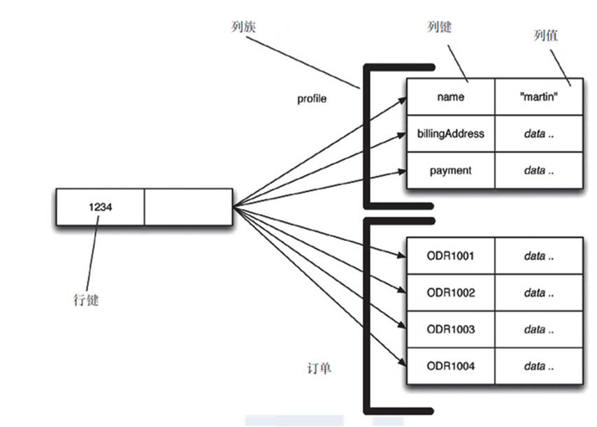

图形：


NoSQL 数据库的四大分类：

- KV键值
  - 新浪的 BerkeleyDB + Redis
  - 美团的 Redis + tair
  - 阿里、百度的 Memcache + Redis

- 文档性数据库（BSON 格式较多）
  - CouchDB
  - MongoDB

- 列存储数据库
  - Cassandra
  - Hbase
  - 分布式文件系统

- 图关系数据库
  - 专注于构建关系图谱
  - Neo4J、InfoGrid

四者对比


## Redis 简介

### Redis 概述

Redis 的英文全称是 REmote DIctionary Server（远程字典服务器）

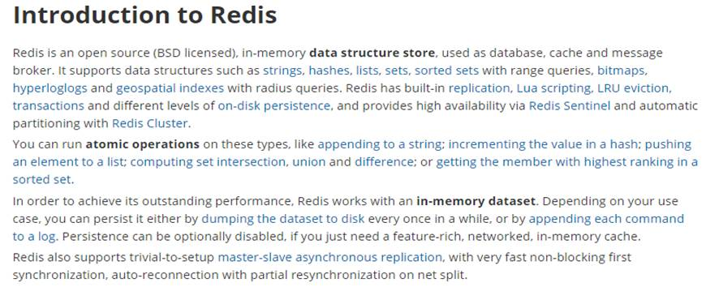

Redis 是完全开源免费的，用 C 语言编写，遵守 BSD 协议，是一个高性能的（key/value）分布式内存数据库，基于内存运行并支持持久化的 NoSQL 数据库，是当前最热门的 NoSQL 数据库之一，也被人们称为数据结构服务器。Redis 能满足对海量数据的读写。

Redis 的键只能是字符串

Redis 的值支持多种数据类型：

- 字符串：string

- 哈希：hash

- 字符串列表：list

- 字符串集合：set

- 有序集合：zset（sorted set）

- HyperLogLog 结构：Redis 2.8.9 版本之后才有，用来做统计的算法

- GEO 结构：Redis 3.2 版本之后才有，是地理位置相关的数据类型

### Redis 的优点

- 高性能（Redis 读的速度是 11W 次/s,写的速度是 8.1W 次/s）

- 原子性（保证数据的准确性）

- 持久存储（两种方式 RDB/快照，AOF/日志）

- 主从结构，主机会自动将数据同步到从机，可以进行读写分离

- 从 3.0 版本开始，支持集群

### Redis 的缺点

由于 Redis 是内存数据库，所以单台机器存储的数据量，跟机器本身的内存大小有关。虽然 Redis 本身有 key 过期策略，但是还是需要提前预估和节约内存。如果内存增长过快，需要定期删除数据。

修改配置文件，进行重启，将硬盘中的数据加载进内存，时间比较久。在这个过程中，Redis 不能提供服务。

### Redis 的应用场景

Redis 主要应用在高并发和实时请求的场景

- 关注列表，粉丝列表

- 微博数，粉丝数

- 热门微博

### Redis 版本下载

Redis 英文官网：https://redis.io/

Redis 中文官网：http://www.redis.cn/

下载最新稳定版，如下图所示：

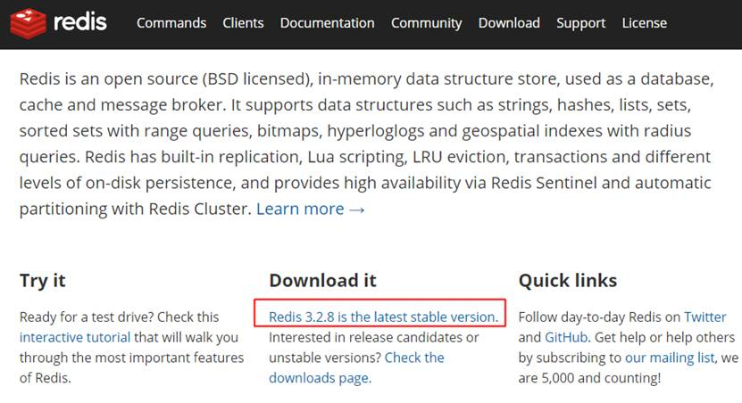

## Redis 安装

### 软件环境

- CentOS 7

- redis 3.2.8

### 安装准备

首先安装一些依赖包，输入如下命令：

```bash
yum -y install cpp binutils glibc glibc-kernheaders glibc-common glibc-devel gcc make tcl
```

### Redis 的 Windows 版安装

下载地址：https://github.com/dmajkic/redis/downloads

下载到的 Redis 支持 32 bit 和 64 bit。根据自己实际情况选择，将 64 bit 的内容复制到自定义盘符安装目录取名 redis。 如 `C:\reids`

打开一个 cmd 窗口 使用 cd 命令切换目录到 `C:\redis` 运行 `redis-server.exe redis.conf` 。

如果想方便的话，可以把 Redis 的路径加到系统的环境变量里，这样就省得再输路径了。后面的那个 `redis.conf` 可以省略。如果省略，会启用默认的。输入之后，会显示如下界面：

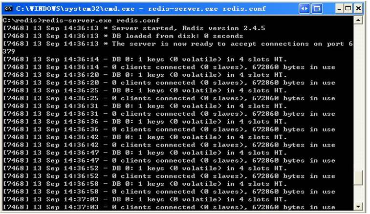

这时候另启一个 cmd 窗口，原来的不要关闭，不然就无法访问服务端了。

切换到 redis 目录下运行 `redis-cli.exe -h 127.0.0.1 -p 6379` 。

设置键值对 set myKey abc

取出键值对 get myKey

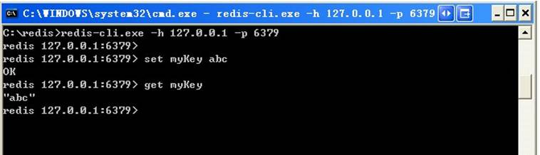

### 官方的安装提示

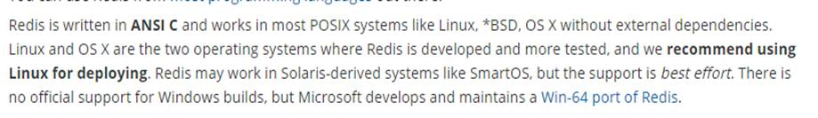

### Redis 的 Linux 版安装

上传 tar 包到 CentOS 的 `/usr/local` 目录并解压：

```bash
cd /usr/local
tar -zxvf redis-3.0.4.tar.gz
```

进入解压好的 Redis 目录，输入 make 编译：

```bash
[root@node01 local]# cd redis-3.0.4
[root@node01 redis-3.0.4]# pwd
/usr/local/redis-3.0.4
[root@node01 redis-3.0.4]# make
```

安装 Redis：

```
make install
```

安装后的 Redis 命令默认在 `/usr/local/bin` 目录

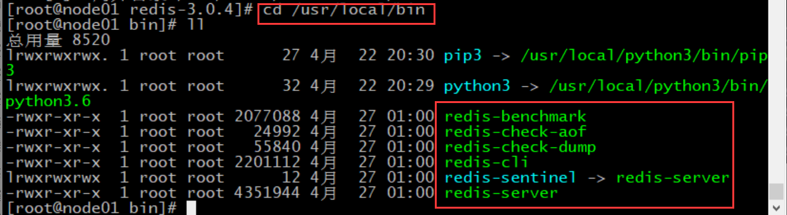

### Redis 的服务端启动

直接使用命令即可启动 Redis 服务：

```bash
redis-server
```

页面中出现经典的 Redis 的 logo，说明安装成功：

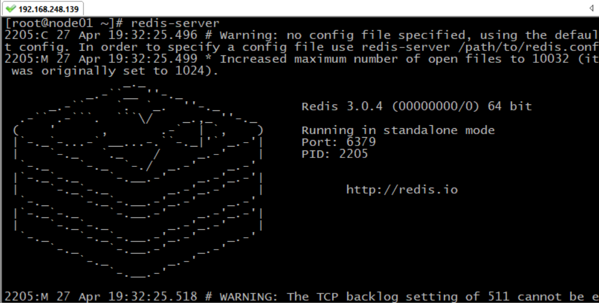

但是现在的问题是，Redis 服务会占用整个窗口。如果我们退出 Redis 服务，又无法使用 Redis。当然可以另起一个窗口，但终究不是长久之计。

我们可以修改配置文件，使之可以后台运行：

```bash
vi /usr/local/redis-3.0.4/redis.conf
```

找到 daemonize，将其配置为 yes：

```bash
daemonize yes
```

保存并退出。

用修改的配置启动 Redis 服务：

```bash
redis-server /usr/local/redis-3.0.4/redis.conf
```

这样启动就不会占用窗口了。查看进程，Redis 服务已经在后台运行了：

```bash
[root@node01 ~]# ps -aux | grep redis
root       2280  0.3  0.7 140908  7460 ?        Ssl  20:05   0:00 redis-server *:6379
root       2285  0.0  0.0 112732   964 pts/0    R+   20:06   0:00 grep --color=auto redis
```

### Redis 的客户端启动

Redis 的客户端只需要一条语句即可启动：

```bash
redis-cli
```

可以使用 exit 命令退出 Redis 客户端。

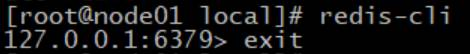 

### Redis 测试

输入一些常用命令，查看 Redis 是否正常运行：

```bash
[root@node01 ~]# redis-cli
127.0.0.1:6379> exit
[root@node01 ~]# redis-cli
127.0.0.1:6379> ping
PONG
127.0.0.1:6379> set username root
OK
127.0.0.1:6379> get username
"root"
127.0.0.1:6379> keys *
1) "username"
127.0.0.1:6379> exit
[root@node01 ~]# 
```

### Redis 服务端停止

使用命令终止 Redis 服务：

```bash
redis-cli shutdown
```

注意，关闭 Redis 服务端使用的方法是 redis-cli 而不是 redis-server。

查看 Redis 服务的进程是否被关闭：

```
[root@node01 ~]# ps aux | grep redis
root       4624  0.0  0.0 112732   964 pts/0    S+   20:23   0:00 grep --color=auto redis
```

没有占用 6379 端口的 Redis 服务了，说明其已经被关闭。

## Redis 杂项知识

### 性能测试

先启动服务端：

```bash
redis-server /usr/local/redis-3.0.4/redis.conf
```

测试 get 和 set 的性能：

```bash
[root@node01 ~]# redis-benchmark -t get,set
====== SET ======
  100000 requests completed in 1.15 seconds
  50 parallel clients
  3 bytes payload
  keep alive: 1

92.98% <= 1 milliseconds
98.17% <= 2 milliseconds
99.87% <= 3 milliseconds
100.00% <= 3 milliseconds
87260.03 requests per second

====== GET ======
  100000 requests completed in 1.16 seconds
  50 parallel clients
  3 bytes payload
  keep alive: 1

93.54% <= 1 milliseconds
97.71% <= 2 milliseconds
99.89% <= 3 milliseconds
100.00% <= 3 milliseconds
86355.79 requests per second
```

### 为什么 Redis 默认端口是 6379？

据说这是作者喜欢的女明星 Merz 的名字在九宫格输入法中对应的数字。


### Redis 的数据库

 Redis 默认有 16 个数据库，刚进入客户端时使用的是 0 号数据库

可以通过 `select 索引` 的命令切换数据库：

```bash
127.0.0.1:6379> select 0
OK
127.0.0.1:6379> select 15
OK
127.0.0.1:6379[15]> select 16
(error) ERR invalid DB index
```

### 清空数据库

Redis 中清空数据库的方式有两个： 

- FLUSHDB 清空当前库

- FLUSHALL 通杀全部库

### 统一密码管理

16 个库都是同样密码，要么都 OK 要么一个也连接不上。

### 判断某个 key 是否存在

使用 exists 命令可查看某个 key 是否存在，如果存在返回 1，否则返回 0：

```bash
127.0.0.1:6379> EXISTS k
(integer) 0
127.0.0.1:6379> set k 1
OK
127.0.0.1:6379> EXISTS k
(integer) 1
```

### 将 key 移动到其他库

 使用 move 命令，可以把 key 移动到其他库中：

```bash
127.0.0.1:6379> move k 2
(integer) 1
127.0.0.1:6379> keys *
(empty list or set)
127.0.0.1:6379> select 2
OK
127.0.0.1:6379[2]> keys *
1) "k"
```

### 为 key 设置过期时间

 使用 expire 命令设置过期时间：

```bash
127.0.0.1:6379[2]> expire k 10
```

### 查看 key 的过期时间

使用 ttl 查看过期时间，-2 代表已经过期，-1 表示不过期

```bash
127.0.0.1:6379[2]> expire k 10
(integer) 1
127.0.0.1:6379[2]> ttl k
(integer) 6
127.0.0.1:6379[2]> ttl k
(integer) -2
```

### 查看 key 的类型

使用 type 查看 key 的类型：

```bash
127.0.0.1:6379[2]> set k 1
OK
127.0.0.1:6379[2]> type k
string
```

## redis.conf 解析

### redis.conf 的位置

redis.conf 位于解压好的安装包中：

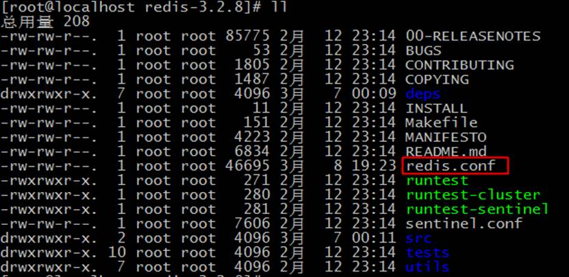

### Units 单位

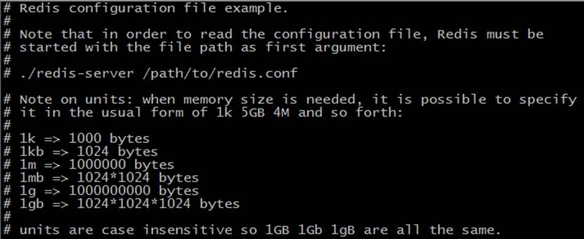

Redis 配置文件，单位不区分大小写。

### INCLUDES 包含

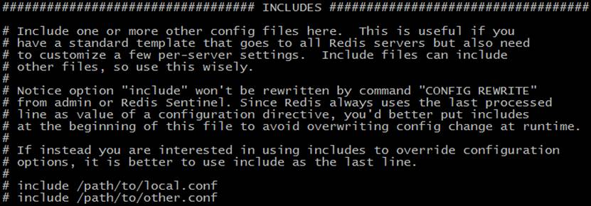

可以加入其他自定义配置文件。

### GENERAL 通用配置

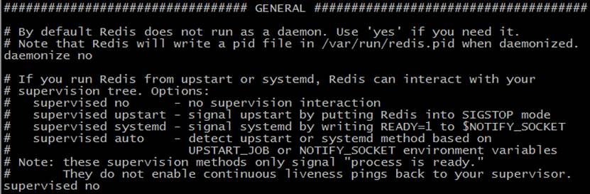

一些基本设置，包括端口号，守护进程等

### NETWORK 网络配置

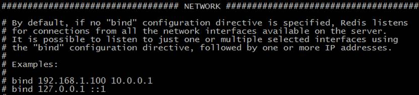

配置一些超时时间等

### SNAPSHOTTING 快照

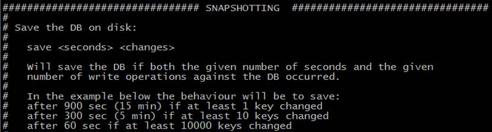

配置 RDB 持久化策略的位置

### REPLICATION 复制

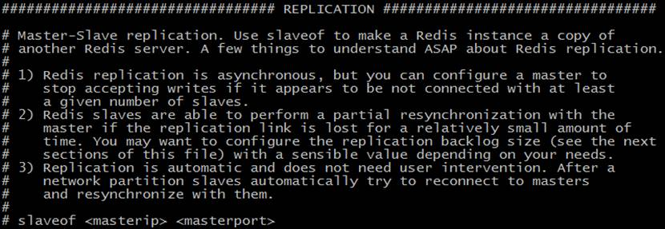

配置主从复制的

### SECURITY 安全

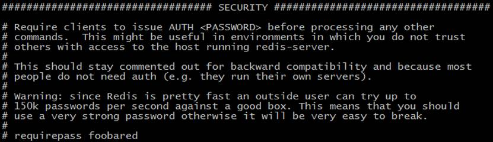

设置 Redis 的密码。

### LIMITS 限制

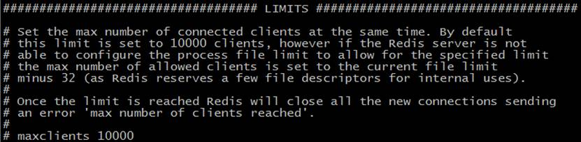

做一些连接和内存等的限制

### APPEND ONLY MODE 追加模式

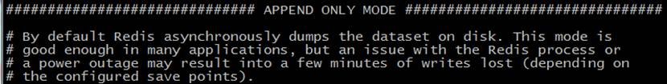

配置 AOF 的位置

## Redis 的持久化 RDB

### 官网介绍

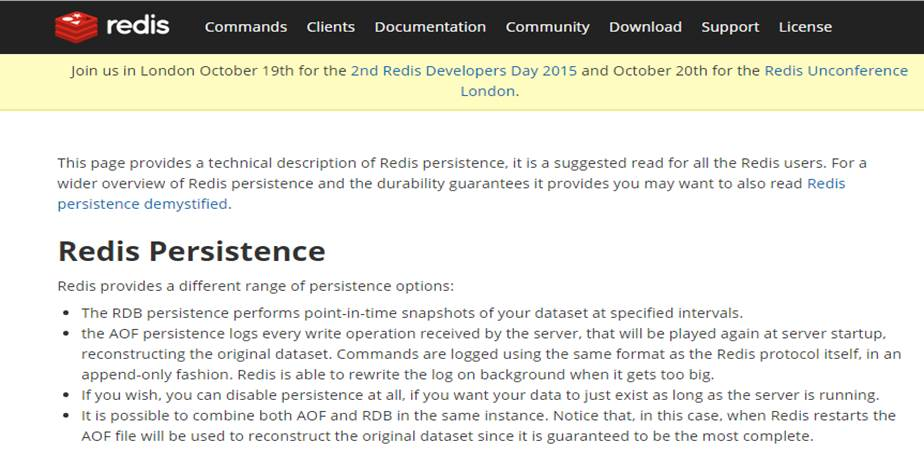

### RDB 的概念

Redis DataBase，在指定的时间间隔内将内存中的数据集快照写入磁盘，也就是 Snapshot 快照，它恢复时是将快照文件直接读到内存里。

Redis 会单独创建一个子进程（fork）来进行持久化，会先将数据写入到一个临时文件中，待持久化过程都结束了，再用这个临时文件替换上次持久化好的文件

整个过程中，主进程是不进行任何 IO 操作的，这就确保了极高的性能如果需要进行大规模数据的恢复，且对于数据恢复的完整性不是非常敏感，那 RDB 方式要比 AOF 方式更加的高效。

RDB 的缺点是最后一次持久化后的数据可能丢失。

### Fork

l  Fork的作用是复制一个与当前进程一样的进程。

l  新进程的所有数据数值都和原进程一致，但是是一个全新的进程，并作为原进程的子进程

### RDB 保存的是 dump.rdb 文件

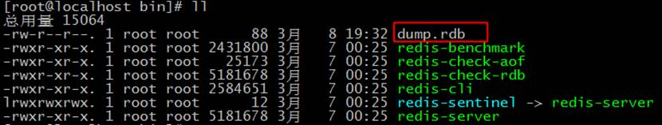

### 配置策略

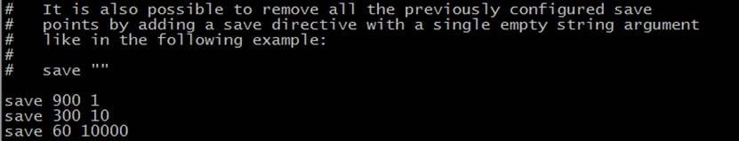

### 触发 RDB

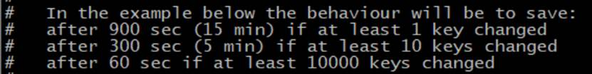

### RDB 的优点

适合大规模的数据恢复

对数据完整性和一致性要求不高

### RDB 的缺点

在一定间隔时间做一次备份，所以如果 Redis 意外崩溃掉的话，就会丢失最后一次快照后的所有修改。

Fork 的时候，内存中的数据被克隆了一份，大致2倍的膨胀性需要考虑。

### 如何动态停止 RDB

在 redis-cli 命令行中，将所有的 RDB 配置都注释掉，并加上下面这句：

```bash
config set save ""
```

## Redis 的持久化 AOF

### AOF 概述

AOF 的全称是 append only file。它以日志的形式来记录每个写操作，将 Redis 执行过的所有写指令记录下来（读操作不记录），只许追加文件但不可以改写文件。

Redis 启动之初会读取该文件重新构建数据。换言之，Redis 重启的话就根据日志文件的内容将写指令从前到后执行一次以完成数据的恢复工作。

### AOF 保存的是 appendonly.aof 文件

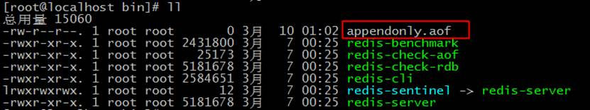

### 配置策略

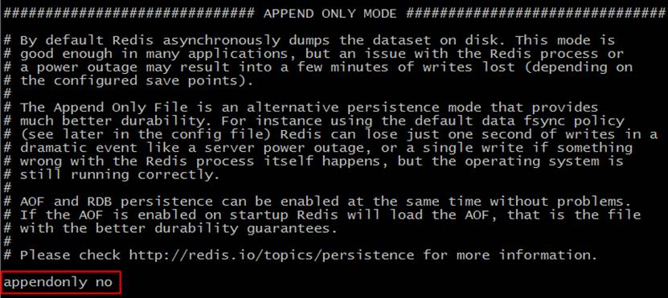

### 触发 AOF

修改配置文件的 appendonly 为 yes。如果 AOF 和 RDB 同时存在，会优先使用 AOF 策略。

### AOF 的数据修复

如果 appendonly.aof 文件损坏，可以尝试使用命令将其修复：

```bash
redis-check-aof --fix appendonly.aof
```

### AOF 的优点

同步持久化 每次发生数据变更会被立即记录到磁盘。

性能较差但数据完整性比较好。

### AOF 的缺点

相同数据集的数据而言 aof 文件要远大于 rdb 文件，恢复速度慢于 rdb。

## Redis 的事务

### 官网介绍

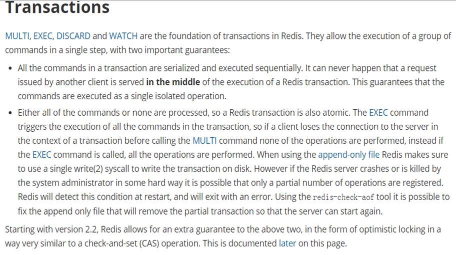

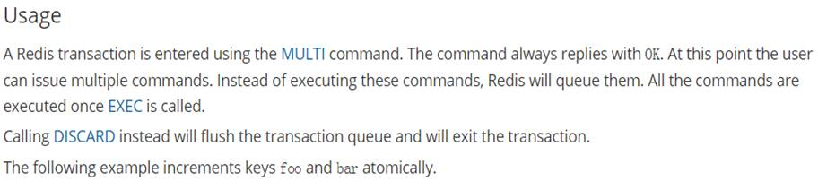

### Redis 的事务概述

Redis 的事务可以一次执行多个命令，批处理，本质是一组命令的集合。一个事务中的所有命令都会序列化，按顺序地串行化执行而不会被其它命令插入，不许加塞。

### Redis 的事务的作用

一个队列中，一次性、顺序性、排他性的执行一系列命令。

### Redis事务的常用命令

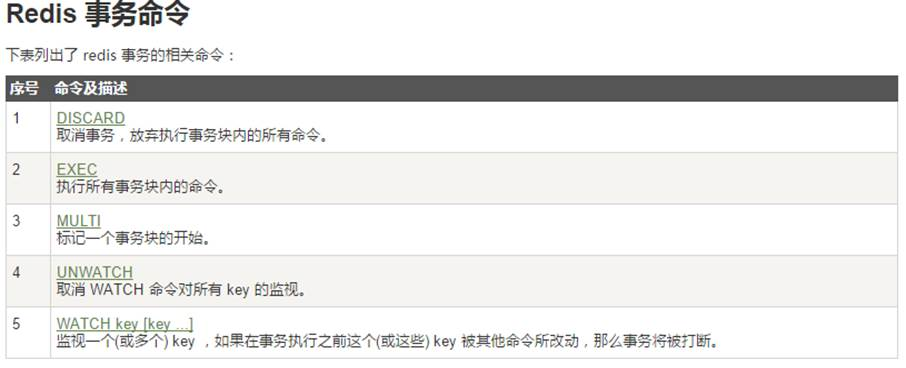

Redis 事务的基本用法是以 multi 开始，以 exec 结束，在这两条命令之间写上数据库的操作：

```bash
127.0.0.1:6379> keys *
(empty list or set)
127.0.0.1:6379> MULTI
OK
127.0.0.1:6379> set k1 1
QUEUED
127.0.0.1:6379> set k2 2
QUEUED
127.0.0.1:6379> get k1
QUEUED
127.0.0.1:6379> EXEC
1) OK
2) OK
3) "1"
```

如果事务中有命令出错，事务中已经执行的操作会被回滚，事务中所有事务都不执行：

```bash
127.0.0.1:6379> MULTI
OK
127.0.0.1:6379> set k4 v4
QUEUED
127.0.0.1:6379> set k5 v5
QUEUED
127.0.0.1:6379> sdjflsd
(error) ERR unknown command 'sdjflsd'
127.0.0.1:6379> get k2
QUEUED
127.0.0.1:6379> EXEC
(error) EXECABORT Transaction discarded because of previous errors.
```

当然，上面的也不绝对，有些小错误也是会顺利执行的：

```bash
127.0.0.1:6379> MULTI
OK
127.0.0.1:6379> set k3 v3
QUEUED
127.0.0.1:6379> incr k3
QUEUED
127.0.0.1:6379> get k3
QUEUED
127.0.0.1:6379> EXEC
1) OK
2) (error) ERR value is not an integer or out of range
3) "v3"
```

