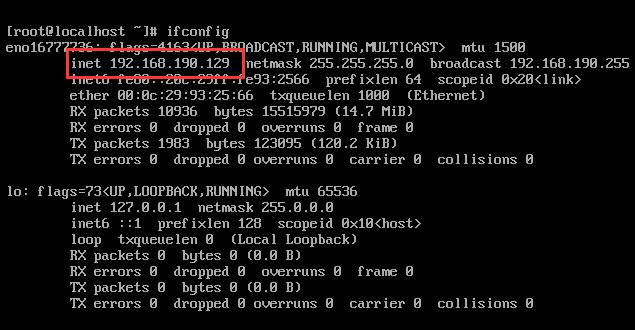
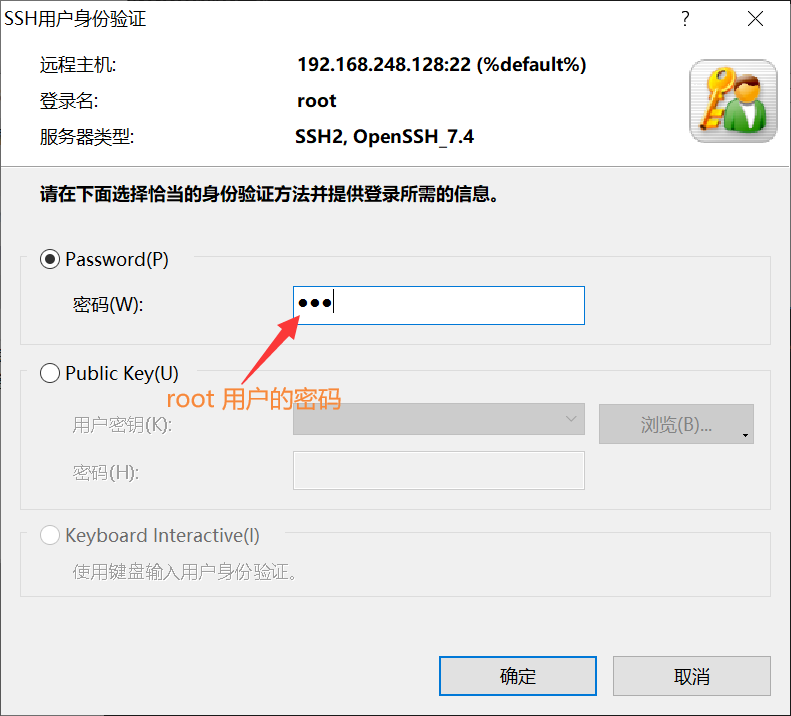
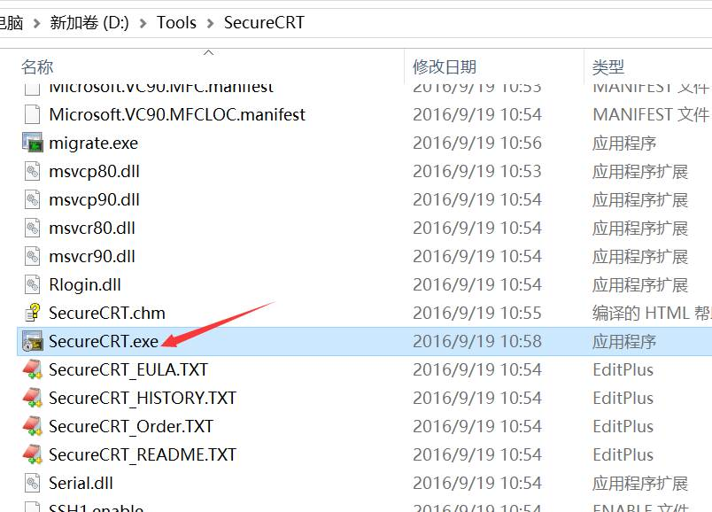
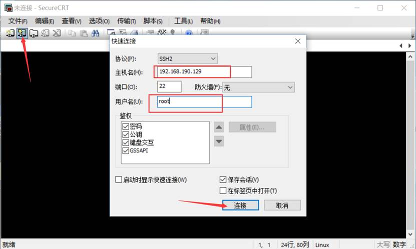
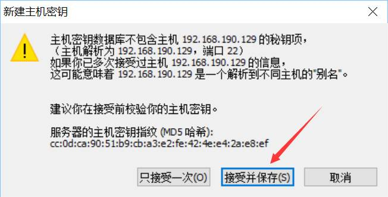
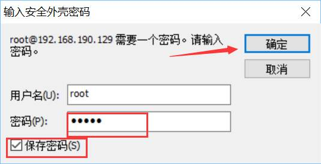
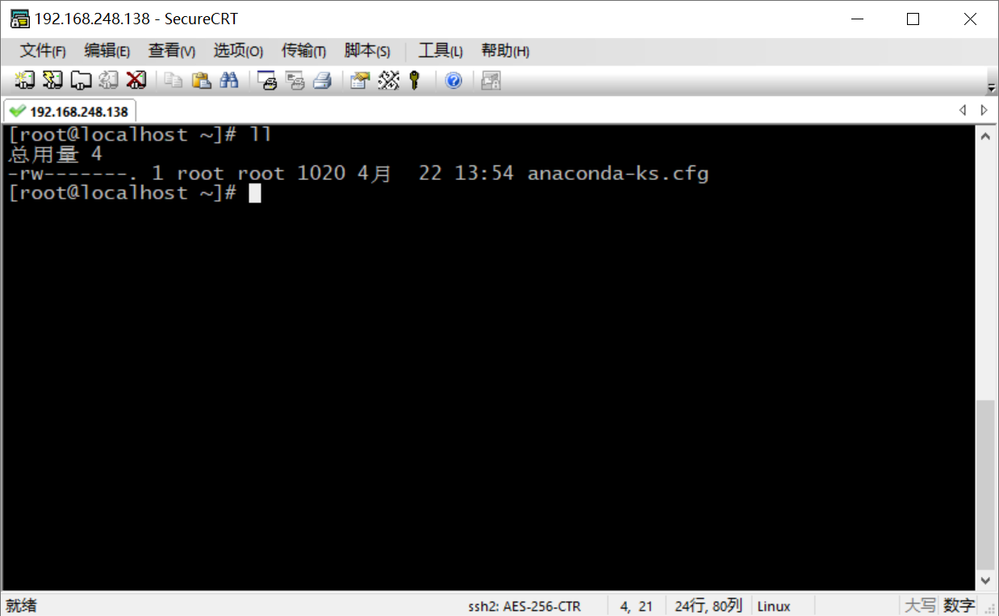
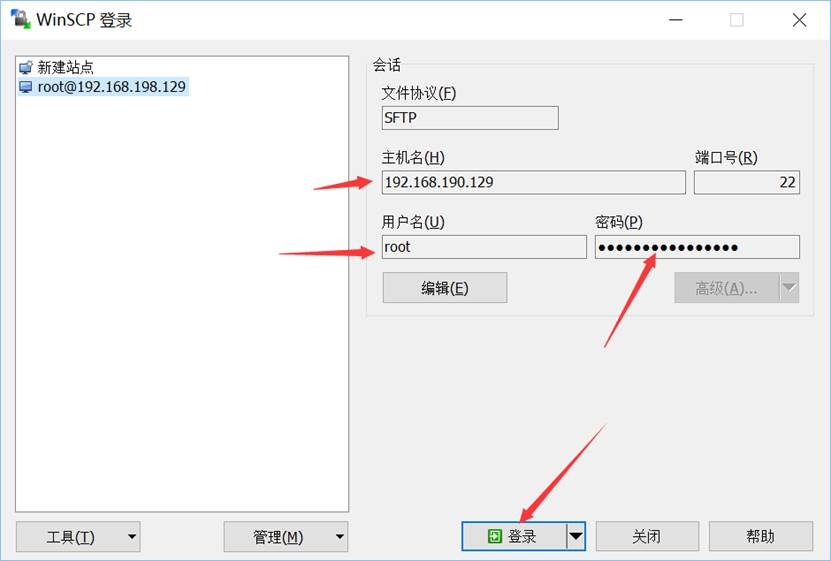
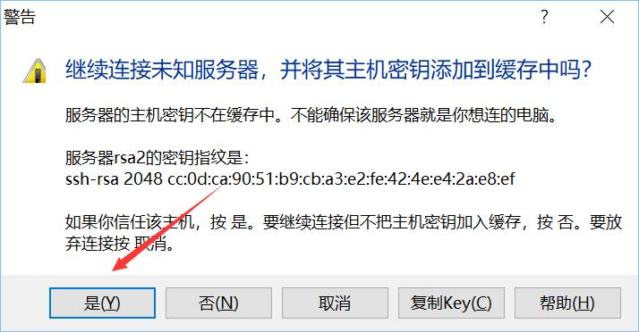
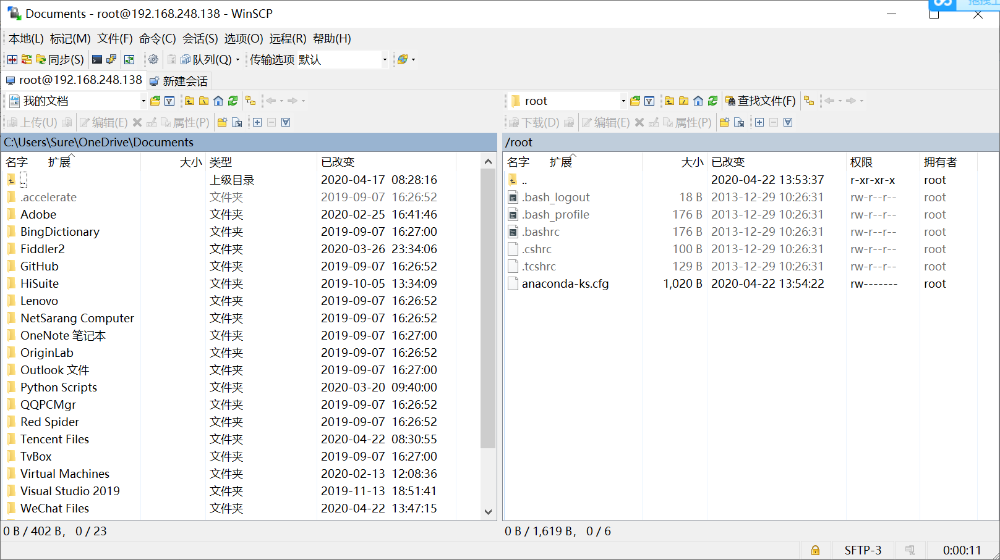

## 远程连接 CentOS

[TOC]

### 安装和使用 Xshell

平时，我们几乎不会之间在 VMware 上使用 CentOS 系统，而是会使用 ssh 工具远程操控。

Windows 平台，可以使用 Xshell 或者 secureCRT 这 2 款软件，都是封装了 ssh 远程连接工具的。

macOS，直接使用 ssh 命令即可，不需要第三方工具了。

按照惯例，还是要去官网下载 Xshell 的安装包。

Xshell 的官方网站为：https://www.netsarang.com/en/xshell/

安装一路按照默认配置，点击“下一步”即可，没啥好说的。

使用命令安装 net-tools，以便使用 ifconfig 查看 IP 地址：

```bash
yum -y install net-tools
```

查询机器 IP：

```bash
ifconfig
```



使用 ssh 连接命令连接我们的虚拟机，其中 `192.168.248.128` 是虚拟机的 IP 地址：

```shell
ssh root@192.168.248.128
```

默认连接的是 22 端口，若日后工作学习中修改了 ssh 端口，在链接的时候就需要指定端口号连接：

```shell
ssh  -p 22   root@192.168.178.253
```

在弹出的页面中输入 root 用户的密码，点击确定即可。



此时，我们便可以使用 Xshell 远程控制虚拟机了。

### 使用 SecureCRT 链接

SecureCRT 是和 Xshell 差不多的连接工具。最显著的区别是，SecureCRT 是要收费的，而 Xshell 对个人使用免费（商业使用还是付费的）。

当然，网上有很多免费试用 SecureCRT 的方法，这里就不介绍了，只是介绍一下它的使用方法。

将安装包解压缩直接用：



点击快速建立链接，输入机器的 IP 地址和用户名，这里直接用 root 登录：



第一次登录会询问是否保存密钥，接收并保存即可：



输入用户密码，可以勾选保存密码，这样以后登录就不需要密码了：



然后就可以正常输入命令使用了：



SecureCRT 会自动复制选中的内容，右键即可粘贴剪贴板中的内容，十分方便。

### WinSCP 的安装和使用

Xshell 和 SecureCRT 都是用来输入命令的，但是远程文件传输并不方便。WinSCP 就是用来解决远程文件传输问题的。除了 WinSCP，与 Xshell 同一家公司制作的 Xftp 也可以实现文件的传输。

具体的下载安装和使用方法参见中文官方文档：https://winscp.net/eng/docs/lang:chs

WinSCP 的安装很简单，只需无脑下一步即可，不再赘述。

与前面的两款工具类似，WinSCP 也是要输入 IP、用户名和密码来连接机器：



第一次登录也是会出现警告，点击是即可：



 这样我们就可以通过拖动的方式，将本地（比如 Windows）的文件传输到 Centos 机器上：

