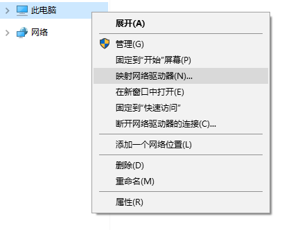
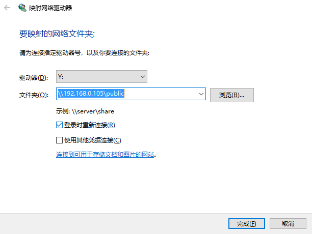
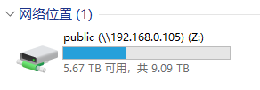

# 安装和配置 Samba

[toc]

Samba 是一个可以从 Windows 或 MacOS 访问到 Linux 磁盘文件的工具。

## 安装 Samba

使用包管理工具一键安装：

```bash
sudo apt-get update
sudo apt-get install samba
```

查看 Samba 是否安装成功：

```bash
whereis samba
```

如果返回结果如下所示，说明一切顺利：

```bash
samba: /usr/sbin/samba /usr/lib/samba /etc/samba /usr/share/samba /usr/share/man/man7/samba.7.gz /usr/share/man/man8/samba.8.gz
```

也可以查看 Samba 的版本：

```bash
samba -V
```

## 配置 Samba

直接修改 Samba 的配置文件：

```bash
sudo vim /etc/samba/smb.conf
```

在最末端插入如下内容：

```ini
[public]
   comment = public storage
   path = /media/pi/MyBook
   valid users = pi
   read only = no
   create mask = 0777
   directory mask = 0777
   guest ok = no
   browseable = yes
```

参数说明：

- comment：共享文件夹说明；
- path：共享文件夹目录；
- valid users：有效用户；
- read only：是否只读；
- create mask：创建文件的权限；
- directory mask：创建文件夹的权限；
- guest ok：是否允许访客访问；
- browseable：是否可见。

保存退出后，我们还需要为 samba 创建一个与 valid users 同名的用户并制定密码：

```bash
sudo smbpasswd -a pi
```

重启 samba 以生效配置：

```bash
sudo samba restart
```

注：samba默认开机自启，无需为重启担心。

## 访问共享文件：

### Windows 系统：

单次访问：

在资源管理器的地址栏中输入： `\\192.168.0.105\public` ，将其中的 `192.168.0.105` 替换为 Linux 系统的 ip。

过程中需要输入用户名和密码。用户名是pi，密码是前面设置的 Samba 的密码。

然后你就可以在局域网内使用任何一台 Windows 设备访问硬盘啦。

永久访问：

上面的方法只能一次性访问移动硬盘，以后需要继续打开相关文件时，还需要重新输入ip和一连串的内容，操作比较繁琐。这里介绍另外一种方法，可以将树莓派上的移动硬盘永久挂载到文件管理器中。

首先，右键“此电脑”图标，或者在文件管理器的“此电脑”点右键，然后选择映射网络驱动器：

[](https://img2018.cnblogs.com/blog/1257172/201907/1257172-20190730102312950-101370420.png)

驱动器符号可以随意选择自己喜欢的，文件夹则依旧输入 \\192.168.0.105\public ，同样地，记得将里面的 192.168.0.105 替换问你的树莓派的ip。

[](https://img2018.cnblogs.com/blog/1257172/201907/1257172-20190730102513235-1481605736.png)

然后输入密码点确定继续之类的就可以了。如果一切顺利，当打开文件资源管理器的时候，就可以看见挂载的树莓派硬盘图标了，以后就可以通过像操作本地磁盘一样使用硬盘啦：

[](https://img2018.cnblogs.com/blog/1257172/201907/1257172-20190730102923387-96414979.png)

### Mac OS：

首先声明，这个方法是网上看到的，估计可行。但是我没有Mac，没有亲自操作，具体细节还是不懂的。

打开Finder，然后快捷键cmd+K，在服务器地址中填写 smb://192.168.0.105/public ，老样子，其中的 192.168.0.105 需要替换为你的树莓派的ip地址。然后点击连接即可。

### iOS：

在iPhone或者iPad上面下载FileExplorer应用。打开应用，点击右上角的+，然后选择Linux。然后输入ip还有账户密码，就可以远程访问了。

另外一款名叫nPlayer的app也是可以用的。

还有很多类似的app，就不赘述了。不过基本上没有发现免费的。