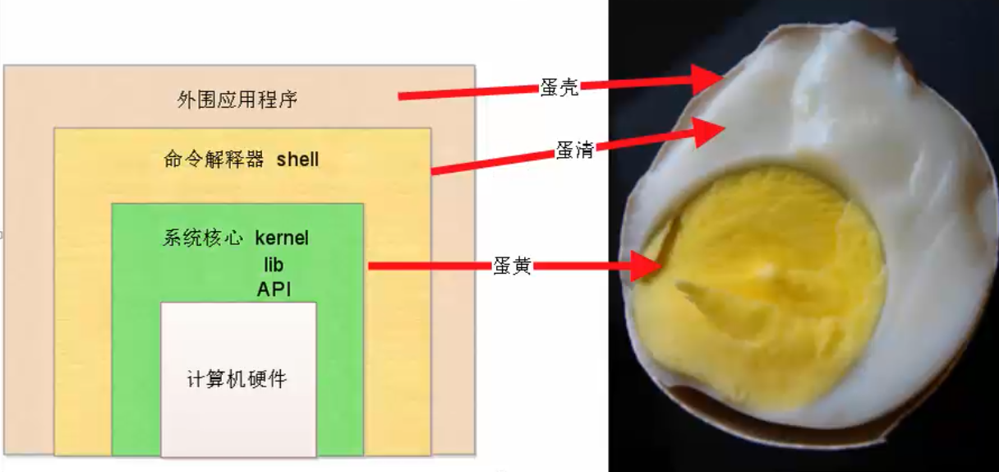

## 服务器与 Linux 基础知识

[TOC]

### 计算机硬件

对于你的笔记本电脑，仅仅通过外观，你都能看到什么？


没错，笔记本的外观主要是一些用于和用户进行交互的输入输出设备，比如屏幕、键盘、触摸板、摄像头、音响等等。

但是如果仅仅有我们眼前能看到的这些输入输出设备，笔记本电脑是无法工作的。因为一台电脑最核心的部分在它的内部。

那么笔记本的内部都有什么呢？

最首先的当然是 CPU，也就是中央处理器 ，相当于人的大脑，进行逻辑运算，用来调度所有其他硬件。计算机之所以称作计算机，就是因为它的核心功能是进行运算。换句话说，CPU 是一台计算机最核心的硬件。

接下来该是内存。应用程序打开之后，数据是先写入到内存。内存数据容易丢失，需要持久化到磁盘上。内存的特点是断电数据丢失，应用重启数据丢失，但是读写速度相当快。

因为内存不能长久保存数据，就需要使用硬盘来实现数据持久化。目前的硬盘主要有两类：机械硬盘和 SSD 固态硬盘。硬盘主要用来进行数据存储。

常用的数据库中，MySQL 用磁盘存储数据，而 Redis 则使用内存存储数据。

显卡，用作图形计算和图形显示。显卡其实与 CPU 很类似，可以看作是有很多核心，但单核性能较差的 CPU。所以显卡也具有一定的运算能力。显卡进行运算的最典型应用是通过显卡挖矿。显卡最主要是用来进行图形计算，减少 CPU 的计算压力。有个很好的比喻是：CPU 就像是 1 个大学教授，而显卡就像是 100 个小学生。如果你有 1 道高数题，你显然要找大学教授去完成，因为小学生不会做。而如果你有 100 道 100 以内的加减法，你就要去找 100 个小学生帮忙。因为这时候，小学生因为人多，很快就能完成计算任务。

网卡，是用来提供上网功能的设备。

电源，相当于人的心脏。如果没有心脏，人应该是活不下去的。同样，没有电源，计算机也没法工作。服务器一般配有双电源，防止突然断电，造成内存数据的丢失。

风扇，用来给 CPU 和计算机内部的其他硬件散热。因为如果温度过高，轻则造成硬件工作效率的下降，重则损坏计算机，造成无法挽回的损失。

主板，类似于人体的骨骼，几乎所有的硬件都插在主板上。

### 服务器简介

计算机按照用途可以这样分类：

- 个人笔记本
- 工作站（性能很强的笔记本）
- 服务器（在网络中对外提供服务的一台计算机，稳定性，安全性，更高）

我们浏览淘宝、京东等网站，任何时候都可以访问到。换句话说，这些网站的 web 服务需要 7 * 24 不间断运行。这些运行着服务的计算机，我们称为服务器。服务器的最基本的要求就是能够长时间稳定运行。

### 服务器和 Linux 系统

我们知道，光有服务器是不够的，还要安装操作系统。一台计算机，只有兼具计算机硬件、操作系统和安装软件，才能正常使用。常用的安装操作系统的方式有：

1. 用光盘安装操作系统
2. 制作U盘启动系统

常见的操作系统无非是 Windows、Mac OS、Unix 和 Linux。

对于服务器来说，更注重的是稳定性，而非娱乐性，故而大家几乎都会选择 Linux 作为服务器的操作系统。

淘宝，京东，都是用的 nginx 这个 web 服务器技术，搭建在 Linux 平台上。

Linux 一切皆文件。你看见的所有东西，都以文件形式，存储在 Linux 上

### 服务器和云计算

存放服务器计算机的房间被称为机房。因为服务器要确保安全稳定运行，一切可能造成设备短路故障的灰尘、湿气、静电等都要严格避免。故而机房要求无尘，无湿，无静电，防止计算机短路，而造成内存数据丢失等事故。

但是并非所有公司都有能力维护自己的机房，不同公司会选择符合自己需求和能力的服务器：

1. 贼有钱的公司，比如苹果公司，会自己买服务器，自己搭建机房。苹果的云上贵州就是个例子。机房得有专业的 IDC 运维人员，服务器得有 Linux 运维人员
2. 中等的公司，也自己买服务器，但是没钱搭建专业的机房，选择服务器托管（比如，世纪互联公司），也得自己招 Linux 运维
3. 初创型的公司，不想买自己的服务器，也不想花钱招人运维，就购买云服务器（阿里云，腾讯云，运维的工作也省去了）

这里就涉及一个问题：什么是云计算，阿里云？

我们日常生活中的水、电、燃气等资源，都是由水厂、电厂、燃气厂，集中提供的资源。我们用户当然不会去净化水，不会去发电，也不会去开采燃气。我们一般都会花钱，按量去购买这些资源。

同样地，阿里云、腾讯云，他们购买大量的硬件实体计算机，购买大量的cpu、内存、磁盘等资源，集中到一起，再去按量去贩卖计算机资源。用户远程使用这些计算机资源，也就是云计算的含义。

思考这样一个场景：你的crm开发完毕了，怎么部署上线，整个过程是?

- 购买计算机
- 安装 Linux，使用 vim 等编辑，没有PyCharm....
- 配置 Python 3 的解释器环境
- crm 的代码，上传到 Linux 服务器
- 解决安装 crm 运行所有的依赖模块
- 安装 MySQL 数据库软件
- 还得安装 nginx，进行项目部署等....

我们发现，诸如安装系统、配置 Python 环境之类的工作，几乎我们每次部署都要用到。重复来重复去太过繁琐。


这时，阿里云卖给你一个服务器，已经配置好了 CentOS，也装好了 Python 3，也装好了 MySQL 数据库。你只需要配置你自己的代码即可，项目上线，真香。这就是云服务的好处。

### SAAS、PAAS 和 IAAS 

- PaaS，即平台即服务（Platform-as-a-Service）
- IaaS，也就是基础设施即服务（Infrastructure-as-a-Service）
- SaaS，软件即服务（Software-as-a-Service） 

### 操作系统、shell 和 Python 解释器

一台计算机的软件，最低下的一个层面就是操作系统（不限于windows，linux，操作系统作用是和计算机硬件进行调度工作）
在操作系统之上，有一个shell壳（翻译官）。当用户输入了 ls、cd、cp、rm 等命令后，会首先将这些命令交给 shell 这个翻译官，然后才交给操作系统执行。

安装了 Python 解释器之后，  打开 cmd，进入 Python 界面，敲下  `print("hello world!")`，Python 解释器将代码翻译为机器码，然后才交给机器去执行。

操作系统、shell 和外围应用程序的关系就好像一颗鸡蛋的样子：



### 开源与闭源

从前大多数代码都是闭源的，也就是企业不会提供软件的源代码。

思考这样一个场景，小明给某个公司开发软件，他偷偷在代码里面写上了这样一行：

```python
time.sleep(2)
```

公司运行代码的时候，发现执行速度很慢，要求小明对代码进行优化，并给了他一笔资金。

小明把代码改成了：

```python
time.sleep(1.6)
```

此后公司每次让小明优化代码，小明就把时间改短一点，捞了一大笔。

从上面的例子我们可以看出闭源的缺点之一：高风险。

小明算是有良心的，只让代码执行慢一点。若不怀好意者在程序中嵌入木马病毒，造成的损失将无法估计。

闭源的另一个弊端是低品质。因为不知道源代码长什么样子，就不特别在意可读性。代码或许很混乱，可移植性、可扩展性都可能偏低。

而若将源代码公开，就没有这些弊端。开源的特点有：软件代码质量高，低风险，低成本。

因为大家都看得见代码，病毒漏洞都一览无余。而且因为是给别人看的，所以程序员也会尽量遵循相同的代码风格。因为大家共同维护代码，开发成本也很低。 

### Linux 的发行版

Linux 的发行版本，其实就是各种厂家，使用 Linux 的核心， 定制的不同的 Linux 系统。
Ubuntu，乌版图，用在个人开发者的电脑，以及物联网居多，也可用于服务器。
RedHat，红帽子，是企业版服务器端的 Linux 系统，收费，用的最多。

CentOS，RedHat 重新编译而来，使用方法与 RedHat 完全一致，但是免费，开源使用。

ArchLinux，集合各种新型技术的 Linux，比较激进。