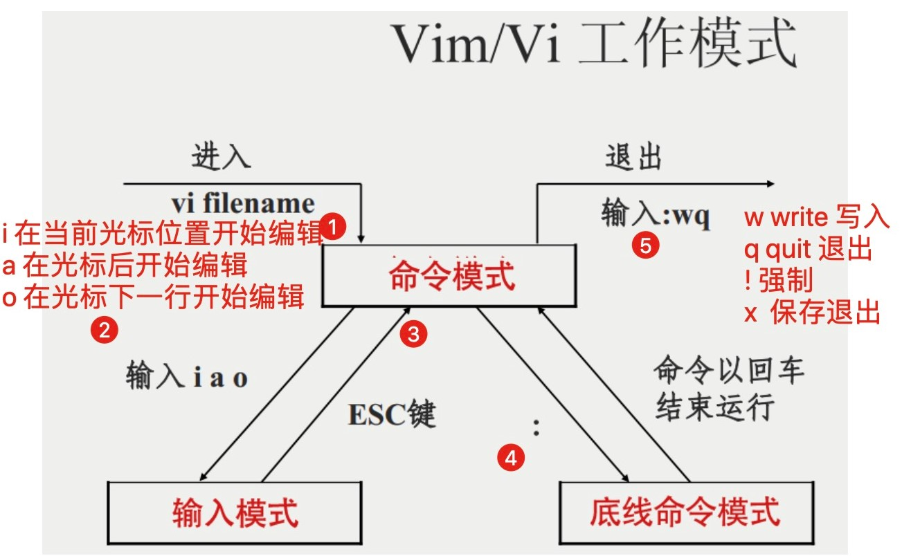

## vim 的基本使用

[TOC]

### vi 和 vim 简单介绍

Windows 系统内置有 `记事本` 作为文本文件的编辑工具。这个工具可以用，但是显示效果很差，而且功能很少还不支持扩展。所以，很多人都会安装一个 `notepad++` 作为文本编辑工具。notepad++ 显示效果很清晰，支持代码高亮显示等功能。

与 Windows 下的记事本很类似，Linux 系统（事实上，类 Unix 系统皆如此）会自带 vi 文本编辑工具。但因为效果太差，功能太 low，所以大家更喜欢安装 vim 作为文本编辑工具。

vim 就相当于 Windows 系统中的 notepad++。它是一个高级编辑器，支持编程、代码高亮、搜索、文件内容替换等功能。

vi 和 vim 的操作和命令基本一致，所以下面统一以 vim 为例进行介绍。

vim 一般不会系统自带，需要单独安装：

```shell
yum install vim -y
```

### vim 的使用步骤

1. 使用命令打开文本文件：

   ```shell
   vim file.txt
   ```

2. 此时会进入命令模式的状态。输入字母 i，进入编辑模式。这时你就可以通过键盘修改文件中的内容了。

3. 按下 esc 键退出编辑模式，返回命令模式（注意要使用英文输入法）。

4. 输入冒号，进入底线命令模式。输入 `:wq!` 保存文件并退出 vim。

   命令解释：

   - w write，写入修改内容
   - q quit，退出 vim
   - ! 感叹号是强制的意思

### vim 的三个模式

从前面的使用实例中可以看到，vim 有三个模式：命令模式（Command mode），输入模式（Insert mode）和底线命令模式（Last line mode）。

#### 命令模式

用户通过 vim 命令打开文件，最先进入的就是命令模式。

在这个状态下，用户敲击键盘会被 vim 识别为命令，而非输入内容。比如我们输入 i，并不会在文档中出现字符 i，而是被 vim 识别为进入插入编辑的模式的命令。

##### 复制、删除、粘贴相关命令

```
yy    拷贝光标所在行
dd    删除光标所在行
D     删除当前光标到行尾的内容
dG    删除当前行到文档尾部的内容（若光标在首行则删除整个文档）
p     粘贴 yy 所复制的内容
x     删除光标所在的字符
u     撤销上一步操作
```

##### 查找

```
/word    在整篇文档中搜索 word 字符串，向下查找，按下 n 前往下一个单词，N 前往上一个
?word    在整篇文档中搜索 word 字符串，向上查找，按下 n 前往下一个单词，N 前往上一个
.、*、[、]、^、%、/、?、~ 和 $ 这十个字符需转义，比如 \.

:nohl    取消搜索后的高亮显示

*        查找整个文档，跳转到下一个光标所在的单词，n 下一个，N 上一个
#        查找整个文档，跳转到上一个光标所在的单词，n 下一个，N 上一个

gd       找到整篇文档中非注释的第一个光标所在单词

%        找到括号的另一半！！
```

##### 替换

```
s/old/new        将本行第一个 old 替换成 new
s/old/new/g      将本行所有 old 替换成 new
%s/old/new/g     将文档中所有 old 替换成 new
%s/old/new/gc    逐个询问是否将文档中的 old 替换成 new
                     y 表示替换
                     n 表示不替换
                     a 表示替换所有
                     q 表示放弃替换
                     l 表示替换第一个并进入插入模式
                     ^E 表示用 Ctrl+e 来滚动屏幕
                     ^Y 表示用 Ctrl+y 来滚动屏幕
5,13s/old/new/g  将第 5 到 13 行所有的 old 替换成 new
```

##### 移动光标

```
w(e)    移动光标到下一个单词
b       移动光标到上一个单词

数字0    移动到本行开头
$       移动光标到本行末尾

H       移动光标到屏幕首行
M       移动光标到屏幕居中行
L       移动光标到屏幕底行
gg      移动光标到文档的尾行
G       移动光标到文档尾行
h       向左移动光标
j       向下移动光标
k       向上移动光标
l       向右移动光标

ctrl + f    下一页
ctrl + b    上一页

`       移动光标到上一次修改行
```

##### 数字与命令

```
3yy    向下方拷贝光标所在的 3 行
5dd    向下删除光标所在的 5 行
```

#### 输入模式

在命令模式下，输入 i、a 或 o 即可进入输入模式。这三种模式的区别为：

```
i    在当前光标位置开始编辑
a    在光标后开始编辑
o    在光标下一行开始编辑
```

进入输入模式后即可使用键盘编辑文件内容。

编辑好之后，按下 esc 键退出输入模式，进入命令模式。

**底线命令模式**

在命令模式下输入英文冒号 `:` 即可进入底线命令模式。常用的底线命令有：

```
:q!        强制退出
:wq!       强制写入推出（一般情况下，不必加感叹号）

:set nu    显示行号
:set nonu  取消显示行号

:数字       跳到数字那一行

:! command 暂时离开 vim 窗口，执行 command 的结果
  # 例如：
:!ip a     临时查看 ip 信息，然后可以回到 vim

:w filename     文件另存为，先按下 v 进入可视模式可保存部分内容
:w! filename    文件另存为并覆盖已存在同名文件

:r filename     将另一个文件内容写入当前光标后面
```

#### vim 操作多个文件

打开文件时，指定 -o 或 -O 参数，即可同时打开多个文件：

```bash
vim -o file1 file2 file3    # 打开后垂直分布
vim -O file1 file2 file3    # 打开后水平分布
```

单个文件的操作命令是一致的。可以使用如下命令将光标切换到不同文件中：

```
ctrl + w + w         将光标切换到下一个文件
对于垂直并排的文件：使用 ctrl + w + 上、下方向（或者 j、k 键），表示上、下切换文件；
对于水平并排的文件：使用 ctrl + w + 左、右方向（或者 h、l 键），表示左、右切换文件。
```

退出 vim：

```
qa     全部退出
qa!    全部强制退出（不保存）
wqa    全部保存后退出
```

### 实例：使用 vim 写一个 Python 脚本

具体流程为：

1. 安装 vim：

   ```shell
   yum install  vim -y
   ```

2. 编写一个文件，内容如下：

   Linux 的文件后缀没有意义，只是文件标识而已

   ```shell
   [root@localhost tmp]# cat first.py 
   #!coding:utf8
   print ("爱的魔力转圈圈，想你想到心花黑天白夜")
   ```

3. 执行脚本：

   ```shell
   python  first.py
   ```

### vim 工作模式切换示意图



### vim 键盘图


更多更详细 vim 命令，参见菜鸟教程 [Linux vi/vim](https://www.runoob.com/linux/linux-vim.html)

