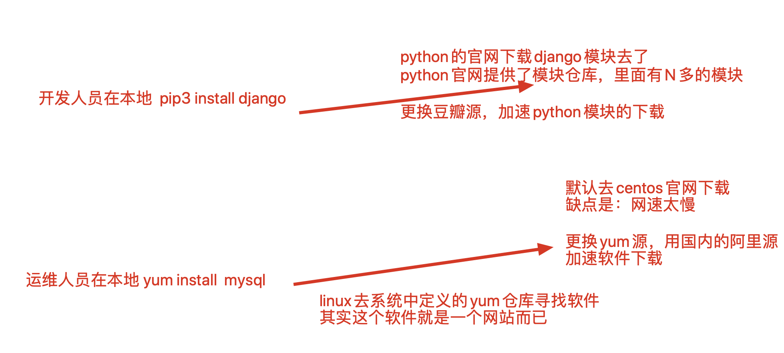
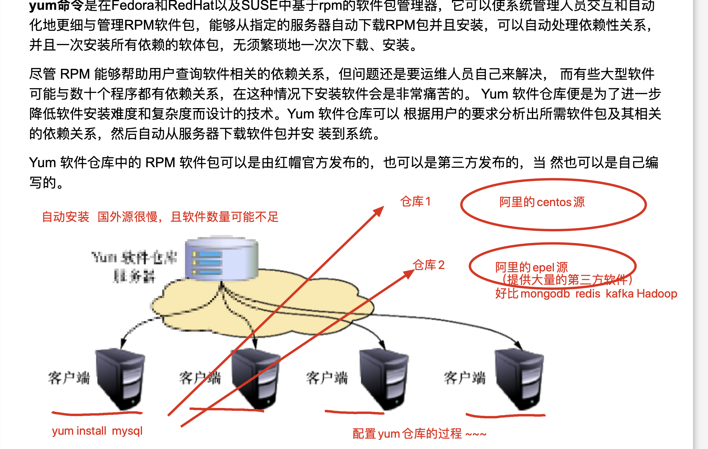

## Linux 的软件包管理工具 yum

[TOC]

### Linux 软件的安装方式

Linux 安装软件有如下几种方式：

1. 源代码编译安装（最好的安装形式，可以自由定义安装路径，第三方功能扩展，以及获取官网最新的代码进行编译安装，缺点是对新手不友好）
2. yum 工具（新手最好的工具，自动化解决程序安装所需的依赖关系，自动下载且安装依赖，要求得配置 yum 仓库源，软件版本可能较低）
3. rpm 软件包手动安装（弃用，需要手动解决依赖关系，贼难受，不用）


每个操作系统都有各自的软件安装包格式：

|  系统   | 格式 |
| :-----: | :--: |
| Windows | exe  |
|  macOS  | dmg  |
|  Linux  | rpm  |

我们软件的依赖关系

```
如何安装django的？
下载django源码进行python3  setup.py  build  

#相比我们都是用的pip安装，为什么呢？
能够自动的解决django模块的依赖关系


#pip3是安装python模块的工具，自动搜索依赖，解决依赖关系

#yum工具是linux系统安装软件的工具，例如安装redis数据库，安装mysql数据库等等
```

### yum 工具

我们前面讨论了软件的依赖关系。这是因为有些软件不能独立存在。例如，django 需要依赖 Python 环境。

我们本可以使用源代码安装 django，使用这样的命令：

```shell
python3 setup.py build
```

但我们没有这样做，而是使用 pip 安装的 django：

```shell
pip3 install django
```

我们之所以这样做，是因为 pip 会自动为我们搜索软件所依赖的环境，并帮我们将其安装好，解决依赖关系，十分方便易用。

类似地，在 Linux 系统中，有一个 yum 工具。当我们使用 yum 安装软件时，会自动帮我们解决软件的依赖问题，对新手来说十分友好。

而且对于 RedHat，CentOS 系列的操作系统，90% 的软件都可以 yum 自动安装，前提是要配置好软件仓库（yum 源）。所以 yum 的覆盖范围十分之广。

而且 yum 的使用十分简单，比如安装，卸载 nginx，只需简简单单两条命令即可：

```
yum install nginx -y 
yum remove nginx -y   #自动解决所有依赖关系，很nice，好用
```

当然 yum 也并非毫无缺陷。比如，用户难以使用第三方的功能扩展，且 yum 中的软件有可能不是最新版本。这时候，或许还是要通过源码编译安装软件。

### yum 仓库的配置

我们从前经常使用 pip，相信大家已经十分熟悉 pip 的换源命令了：

```shell
pip3 install -i https://pypi.douban.com/simple django==1.11.9
```

我们这样做的原因是 pip 默认去 Python 官网下载 django 模块。但是因为 Python 的服务器设在国外，国内访问速度会比较慢。所以我们通过指定下载源的方式，从国内的 pip 镜像，比如豆瓣源，下载 Python 包。这样速度会快一些。

同样道理，我们直接使用 yum 命令，默认的是去 CentOS 官方下载源下载软件。为了加速下载，我们通常会配置 CentOS 的下载源。也就是配置 yum 的仓库。

除了 CentOS 源，我们往往还会同时配置 epel 源。epel 源包含大量的第三方软件。





### 阿里 yum 源配置流程

1. 找到阿里的开源镜像站：

   ```http
   https://developer.aliyun.com/mirror/
    # 或
   https://mirrors.aliyun.com
   ```

2. 进行操作之前，需要确保能正常使用 wget 命令：

   ```shell
   which wget
   ```

   若尚为安装 wget，需要提前安装：

   ```shell
   [root@localhost ~]# yum install wget -y
   ```

3. 备份 Linux 本地现有的 yum 仓库文件

   Linux 的 yum 仓库文件一般默认存放在 `/etc/yum.repos.d/` 这个文件夹。

   注意！只有在这个目录**第一层**的以 `.repo` 结尾的文件才会被识别为是一个 yum 仓库文件，所以我们可以创建一个文件夹，把这些文件存放到这个文件夹中，起到备份的作用：

   ```shell
   [root@localhost ~]# cd /etc/yum.repos.d/    # 进入到yum仓库文件所在的文件夹
   [root@localhost yum.repos.d]# ls
   CentOS-Base.repo  CentOS-Debuginfo.repo  CentOS-Media.repo    CentOS-Vault.repo
   CentOS-CR.repo    CentOS-fasttrack.repo  CentOS-Sources.repo
   [root@localhost yum.repos.d]# mkdir allrepoBak
   [root@localhost yum.repos.d]# mv ./* allrepoBak/    # 备份repo仓库文件
   mv: cannot move ‘./allrepoBak’ to a subdirectory of itself, ‘allrepoBak/allrepoBak’
   [root@localhost yum.repos.d]# ls    # 当前目录下已无.repo 文件
   allrepoBak
   [root@localhost yum.repos.d]# ls allrepoBak/
   CentOS-Base.repo  CentOS-Debuginfo.repo  CentOS-Media.repo    CentOS-Vault.repo
   CentOS-CR.repo    CentOS-fasttrack.repo  CentOS-Sources.repo
   ```

4. 下载新的仓库文件，仓库文件从前面的阿里云镜像站中找到。注意 CentOS 的版本应该与当前操作系统版本一致。

   首先是下载 CentOS 仓库：

   ```shell
   wget -O /etc/yum.repos.d/CentOS-Base.repo http://mirrors.aliyun.com/repo/Centos-7.repo
   ```

   然后下载 epel 仓库：

   ```shell
   wget -O /etc/yum.repos.d/epel.repo http://mirrors.aliyun.com/repo/epel-7.repo
   ```

   参数解释：-O  将下载的文件，指定一个路径存放，且改名

5. 清空之前的 yum 缓存：

   ```shell
   [root@localhost yum.repos.d]# yum clean all
   ```

6. 生成新的 yum 缓存，加快以后的软件下载：

   ```shell
   [root@localhost yum.repos.d]# yum makecache
   ```

7. 可以测试 yum 安装 nginx 软件，或是 redis 数据库软件：

   ```shell
   yum install nginx -y
   yum install redis -y
   ```

8. 只要是通过 yum 安装的软件，都可以用 systemctl 系统服务管理命令，进行启停管理：

   ```shell
   systemctl start/stop/restart/status nginx  #分别是 启动，停止，重启，查看状态
   systemctl start nginx
   systemctl stop nginx
   
   systemctl start/stop/restart redis
   ```

9. 验证 redis 和 nginx 软件是否正常运行

   先查看 redis 是否正常：

   ```shell
   [root@localhost yum.repos.d]# redis-cli
   127.0.0.1:6379> ping
   PONG
   ```

   验证 nginx，直接浏览器访问网站的 80 端口即可

   ```http
   192.168.248.128:80
   ```

   若访问不成功，可以尝试清空防火墙列表：

   ```shell
   [root@localhost yum.repos.d]# iptables -F
   ```

10. 此时可以修改一下 nginx 的首页内容，一分钟做一个 dnf 官网（逗乐）

    nginx 首页页面默认在 `/usr/share/nginx/html/index.html`，我们只需将其替换为 dnf 的源码即可：

    ```shell
    vim /usr/share/nginx/html/index.html  # 自行去复制dnf官网的源码，修改即可
    ```