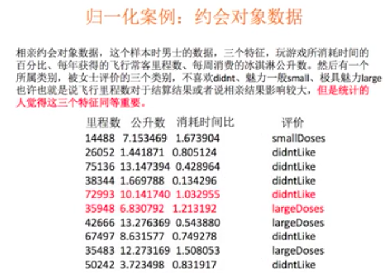
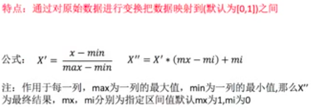

# 特征工程

[TOC]

## 特征工程概述

样本数据中的特征有可能会存在缺失值，重复值，异常值等等，于是我们就需要对特征中的相关的噪点数据进行处理。处理数据的目的就是为了营造出一个更纯净的样本集，让模型基于这组数据可以有更好的预测能力。当然特征工程不是单单只是处理上述操作！

比如 AlphaGo 学习的数据中既有棋谱，又有食谱还有歌词，那么一些干扰的数据绝对会影响 AlphaGo 的学习。我们就需要通过一些处理手段，将这些没有意义的干扰数据清除掉。这就是特征工程的意义。

样本数据往往有两个：特征数据和目标数据。

特征工程是将原始数据转换为更好的代表预测模型的潜在问题的特征的过程，从而提高对未知数据预测的准确性。

特征工程的意义在于，它会直接影响模型预测的结果，而且一般都是积极的影响。

我们可以使用 sk-learn 工具实现特征工程。

sklean 介绍：

- sklearn 是 Python 语言中的机器学习工具，包含了很多知名的机器学习算法的实现，其文档完善，容易上手
- Anaconda 中继承了 sklearn 模块，无需手动安装
- 功能：
  - 分类模型
  - 回归模型
  - 聚类模型
  - 特征工程

## 特征抽取

我们所采集到样本中的特征数据往往很多时候为字符串或者其他类型的数据。然而我们知道电脑只可以识别二进制数值型的数据，如果把字符串给电脑，电脑是看不懂的。如果机器学习学习的数据不是数值型的数据，它是识别不了的。

因此我们需要对数据进行特征抽取，将非数值型的数据转换成计算机更容易处理的数值型数据。

特征值化就是将非数值型的特征转换为数值型的特征。

首先，我们演示一下特征抽取的实例，将字符串转换成数字：

```python
from sklearn.feature_extraction.text import CountVectorizer
vectorizer = CountVectorizer()
res = vectorizer.fit_transform(['lift is short,i love python','lift is too long,i hate python'])
print(res.toarray())
```

返回的结果是一个数组类型的数据，每个元素都是数字：

```python
[[0 1 1 0 1 1 1 0]
 [1 1 1 1 0 1 0 1]]
```

从演示结果我们可以得出结论：特征抽取对文本等数据进行特征值化。特征值化是为了让机器更好的理解数据。

### 字典特征抽取

作用：对字典数据进行特征值化

API：`from sklearn.feature_extraction import DictVectorizer`
- `fit_transform(X)`：X 为字典或者包含字典的迭代器，返回值为 sparse 矩阵
- `inverse_transform(X)`：X 为 sparse 矩阵或者 array 数组，返回值为转换之前的数据格式
- `transform(X)`：按照原先的标准转换
- `get_feature_names()`：返回类别名称

字典特征值提取实例：

```python
from sklearn.feature_extraction import DictVectorizer
alist = [
            {'city': 'BeiJing', 'temp': 33},
            {'city': 'GZ', 'temp': 42},
            {'city': 'SH', 'temp': 40}
        ]
d = DictVectorizer()    # 实例化工具对象
result = d.fit_transform(alist)    # 使用工具将字典中的非数值型数据转换数值型的数据
print(d.get_feature_names())
print(result)    # result是一个sparse矩阵
```

返回的结果为：

```python
['city=BeiJing', 'city=GZ', 'city=SH', 'temp']
  (0, 0)	1.0
  (0, 3)	33.0
  (1, 1)	1.0
  (1, 3)	42.0
  (2, 2)	1.0
  (2, 3)	40.0
```

`get_feature_names()` 的作用是返回类别名称。

fit_transform 方法默认返回的数据类型是 sparse 矩阵，也就是上面返回的结果。相信如果没有了解过这种结构的数据的话，应该是看不懂的，更不会相信这东西会是一个矩阵。

事实上，sparse 矩阵就是一个变相的数组或者列表，目的是为了节省内存。每一行左侧的元组代表的是数组的坐标，指代的是该数据位于矩阵中的位置，即 `(行, 列)`。右面的数据代表的是该位置携带的数据。如果数据为 0，默认不会保存。对于存在很多 0 的矩阵，使用 sparse 会节省空间。

在 DictVectorizer 类的构造方法中中设定 `sparse=False` 则返回的就不是 sparse 矩阵，而是一个数组。

```python
from sklearn.feature_extraction import DictVectorizer
alist = [
            {'city': 'BeiJing', 'temp': 33},
            {'city': 'GZ', 'temp': 42},
            {'city': 'SH', 'temp': 40}
        ]
d = DictVectorizer(sparse=False)    # 指定spasrse参数为False，返回值将会是数组
result = d.fit_transform(alist)
print(d.get_feature_names())
print(result)
```

返回的数据就成了一个数组，看起来也更加直观，更加像矩阵了：

```python
['city=BeiJing', 'city=GZ', 'city=SH', 'temp']
[[ 1.  0.  0. 33.]
 [ 0.  1.  0. 42.]
 [ 0.  0.  1. 40.]]
```

### 特征值化和 One-Hot 编码

至此，我们实现了将字典数据的特征值化处理。所谓特征值化，就是将特征中非数值型的数据转换成数值型的数据。

最终数据里面的 0 和 1 这种的编码方式我们称之为 One-Hot 编码。


为什么需要 One-Hot 编码呢？因为特征抽取主要目的就是对非数值型的数据进行特征值化！如果现在需要对下图中的 human 和 alien 进行手动特征值化 Alien 为 4，human 为1 。则 1 和 4 有没有优先级或者权重大小之分呢？


为了让每个数据的权重和优先级保持一致，我们采用 One-Hot 编码，让所有数据的特征值都是 1，就不会有权重的问题了。


### 基于 Pandas 实现 One-Hot 编码

Pandas 的 `pd.get_dummies(df['col'])` 方法可以实现对 DataFrame 某一列的特征值化处理。

```python
import pandas as pd
df = pd.DataFrame([
    ['green', 'M', 20, 'class1'],
    ['red', 'L', 21, 'class2'],
    ['blue', 'XL',30, 'class3']
])
df.columns = ['color', 'size', 'weight', 'class label']
df1 = pd.get_dummies(df['color'])
pd.concat((df, df1), axis=1).drop(labels='color', axis=1)
```

返回的结果就是：

```python
	size	weight	class label	blue	green	red
0	M	20	class1	0	1	0
1	L	21	class2	0	0	1
2	XL	30	class3	1	0	0
```

### 文本特征抽取

作用：对文本数据进行特征值化

API：`from sklearn.feature_extraction.text import CountVectorizer`

- `fit_transform(X)`：X 为文本或者包含文本字符串的可迭代对象，返回sparse矩阵
- `inverse_transform(X)`：X 为 array 数组或者 sparse 矩阵，返回转换之前的格式数据
- `get_feature_names()`：获取特征名
- `toarray()`：将 sparse 矩阵换成数组

文本特征抽取示例代码：

```python
from sklearn.feature_extraction.text import CountVectorizer
text_list = ['left is is short i love python','left is too long,i hate python']
c = CountVectorizer()
result = c.fit_transform(text_list)
# 使用toarray方法将sparse矩阵转换成数组
arr_res = result.toarray()
print(c.get_feature_names())    # 从文本中提取出来的非数值型的特征数据
print(arr_res)
# 注意：单字符的单词和符号不做特征抽取
```

提取出来的结果为：

```python
['hate', 'is', 'left', 'long', 'love', 'python', 'short', 'too']
[[0 2 1 0 1 1 1 0]
 [1 1 1 1 0 1 0 1]]
```

每个数字指代的是对应的单词在本条字符串中出现的次数。单词以空格和符号分隔，单个的字符和符号不会被统计。因为单个字符往往不会对机器学习的结果造成很大影响，将其省略会节省很多空间和计算量。

### 中文文本特征值抽取

首先，对有标点符号的中文文本进行特征抽取：

```python
from sklearn.feature_extraction.text import CountVectorizer
text_list = ['我喜欢你的鼻子眼睛','我想你了，你有没有也在想我呢？']
c = CountVectorizer()
result = c.fit_transform(text_list)
arr_res = result.toarray()
print(c.get_feature_names())
print(arr_res)
```

返回的结果为：

```python
['你有没有也在想我呢', '我喜欢你的鼻子眼睛', '我想你了']
[[0 1 0]
 [1 0 1]]
```

我们看到，中文文本还是以字符分隔，而不是以我们的词语进行分割。

接下来我们尝试对有标点符合且有空格分隔的中文文本进行特征处理：

```python
from sklearn.feature_extraction.text import CountVectorizer
text_list = ['我 喜欢你,的鼻子-眼睛','我-想你-了，你-有没有,也在 想我呢？']
c = CountVectorizer()
result = c.fit_transform(text_list)
arr_res = result.toarray()
print(c.get_feature_names())
print(arr_res)
```

返回的结果为：

```python
['也在', '喜欢你', '想你', '想我呢', '有没有', '的鼻子', '眼睛']
[[0 1 0 0 0 1 1]
 [1 0 1 1 1 0 0]]
```

我们看到，词语是以空格和符号进行分隔的，而且单个的中文和符号都是没有被统计的。

现在的问题是，我们知道，中文的写作习惯就是一句话连起来写，不会在词语之间加上空格和符号。这样统计中文的词语就是一件相对不容易的事情。

目前 CountVectorizer 只可以对有标点符号和用分隔符对应的文本进行特征抽取，显然这是满足不了我们日常需求的，因为在自然语言处理中，我们是需要将一段中文文本中相关的词语，成语，形容词……都要进行抽取的。

这时，我们就可以用到 jieba 模块，对每个句子进行分词处理。

jieba 分词需要额外安装：

```bash
pip install jieba
```

jieba 模块的使用方法：

```python
import jieba
text = '我喜欢你的鼻子眼睛，我想你了，你有没有也在想我呢？'
jb = jieba.cut(text)    # 分词结果，分词结果需要转成list才可以显示
jb_list = list(jb)
print(jb_list)
```

分词的结果为：

```python
['我', '喜欢', '你', '的', '鼻子眼睛', '，', '我', '想', '你', '了', '，', '你', '有没有', '也', '在', '想', '我', '呢', '？']
```

中文句子以词语为单位被拆分开了，后面我们只需要使用符号将其拼接成新字符串即可使用 sklearn 对其进行特征提取了：

```python
# 使用jieba分词 + CountVectorizer工具类实现对文本数据的特征抽取
import jieba
from sklearn.feature_extraction.text import CountVectorizer
text = '我喜欢你的鼻子眼睛，我想你了，你有没有也在想我呢？'
jb = jieba.cut(text)
new_text = '-'.join(list(jb))
print(new_text)    # 分词后的结果，结果中每一个词都使用了分隔符进行分割
c = CountVectorizer()
result = c.fit_transform([new_text])    # 字符串需要放在可迭代的容器中
arr_res = result.toarray()
print(c.get_feature_names())
print(arr_res)
```

提取到的特征值结果为：

```python
我-喜欢-你-的-鼻子眼睛-，-我-想-你-了-，-你-有没有-也-在-想-我-呢-？
['喜欢', '有没有', '鼻子眼睛']
[[1 1 1]]
```

因为上面的词语中，有很多的单个字符的词语和符号。这些词语和符号会默认被忽略掉。

我们可以随便再找一个词语较多的句子进行测试：

```python
import jieba
from sklearn.feature_extraction.text import CountVectorizer
text = '从“遭遇战”到“阻击战”，从“重中之重”到“人民战争”，从“头等大事”到“全面胜利”……观势、谋局、落子，总书记在亲自指挥这场人民战争的过程中，很多对策、措施与中国古代兵家思想高度契合。央视网《人民领袖》栏目推出系列特稿《习近平战“疫”兵法》，与您一同领悟其中精髓。'
jb = jieba.cut(text)
new_text = '-'.join(jb)
print(new_text)
c = CountVectorizer()
result = c.fit_transform([new_text])
arr_res = result.toarray()
print(c.get_feature_names())
print(arr_res)
```

文本特征抽取的结果为：

```python
从-“-遭遇战-”-到-“-阻击战-”-，-从-“-重中之重-”-到-“-人民战争-”-，-从-“-头等大事-”-到-“-全面-胜利-”-…-…-观势-、-谋局-、-落子-，-总书记-在-亲自-指挥-这场-人民战争-的-过程-中-，-很多-对策-、-措施-与-中国-古代-兵家-思想-高度-契合-。-央视网-《-人民-领袖-》-栏目-推出-系列-特稿-《-习近平-战-“-疫-”-兵法-》-，-与-您-一同-领悟-其中-精髓-。
['一同', '中国', '习近平', '亲自', '人民', '人民战争', '全面', '兵家', '兵法', '其中', '古代', '央视网', '头等大事', '契合', '对策', '很多', '思想', '总书记', '指挥', '推出', '措施', '栏目', '特稿', '精髓', '系列', '胜利', '落子', '观势', '谋局', '过程', '这场', '遭遇战', '重中之重', '阻击战', '领悟', '领袖', '高度']
[[1 1 1 1 1 2 1 1 1 1 1 1 1 1 1 1 1 1 1 1 1 1 1 1 1 1 1 1 1 1 1 1 1 1 1 1
  1]]
```

就抽取到很多词语了。

## 特征的预处理：对数值型的数据进行处理

### 归一化处理

案例分析：



无量纲化：

- 在机器学习算法实践中，我们往往有着将不同规格的数据转换到同一规格，或不同分布的数据转换到某个特定分布的需求这种需求统称为将数据“无量纲化”。譬如梯度和矩阵为核心的算法中，譬如逻辑回归，支持向量机，神经网络，无量纲化可以加快求解速度;而在距离类模型，譬如K近邻，K-Means聚类中，无量纲化可以帮我们提升模型精度，避免某一个取值范围特别大的特征对距离计算造成影响。(一个特例是决策树和树的集成算法们，对决策 树我们不需要无量纲化，决策树可以把任意数据都处理得很好。)
- 那么预处理就是用来实现无量纲化的方式。

含义：特征抽取后我们就可以获取对应的数值型的样本数据啦，然后就可以进行数据的预处理了。

概念：通过特定的统计方法（数学方法），将数据转换成算法要求的数据

方式：

- 归一化
- 标准化

归一化的实现：



归一化后的数据服从正态分布。

API：`from sklearn.preprocessing import MinMaxScaler`

- 参数：feature_range 表示缩放范围，通常使用默认的 `(0,1)`

作用：使得某一个特征对最终结果不会造成很大的影响

```python
import numpy as np
from sklearn.preprocessing import MinMaxScaler
data = np.array(
    [[90, 2, 10, 40],
     [60, 5, 15, 45],
     [73, 3, 13, 45]]
)
mm = MinMaxScaler()
result = mm.fit_transform(data)
result
```

得到的新数组就是归一化的了：

```python
array([[1.        , 0.        , 0.        , 0.        ],
       [0.        , 1.        , 1.        , 1.        ],
       [0.43333333, 0.33333333, 0.6       , 1.        ]])
```

我们可以通过 inverse_transform 方法将归一化的数组转化回原数组：

```python
mm.inverse_transform(result)
```

就得到了原来的数组：

```python
array([[90.,  2., 10., 40.],
       [60.,  5., 15., 45.],
       [73.,  3., 13., 45.]])
```

### 标准化处理

如果数据中存在的异常值比较多，会对结果造成什么样的影响？

结合着归一化计算的公式可知，异常值对原始特征中的最大值和最小值的影响很大，因此也会影响对归一化之后的值。这个也是归一化的一个弊端，无法很好的处理异常值。

在特定场景下最大值和最小值是变化的，另外最大最小值很容易受到异常值的影响，所以这种归一化的方式具有一定的局限性。因此引出了一种更好的方式叫做：标准化。

标准化的处理就是，当数据按均值中心化后，再按标准差缩放，数据就会服从为均值为 0，方差为 1 的正态分布(即标准正态分布)。而这个过程，就叫做数据标准化（Standardization，又称 Z-score normalization），公式如下：


从公式中可以看出，由于平均值和标准差的引入，稀释了异常值对结果的影响。

处理后，每列所有的数据都聚集在均值为 0，标准差为 1 范围附近

标准化 API：`from sklearn.preprocessing import StandardScaler`

- `fit_transform(X)`：对 X 进行标准化
- `mean_`：均值
- `var_`：方差

标准化处理示例：

```python
import numpy as np
from sklearn.preprocessing import StandardScaler
data = np.array(
    [[90, 2, 10, 40],
     [60, 5, 15, 45],
     [73, 3, 13, 45]]
)
ss = StandardScaler()
result = ss.fit_transform(data)
result
```

得到标准化处理的结果为：

```python
array([[ 1.27540458, -1.06904497, -1.29777137, -1.41421356],
       [-1.16685951,  1.33630621,  1.13554995,  0.70710678],
       [-0.10854507, -0.26726124,  0.16222142,  0.70710678]])
```

同样，我们还可以通过 inverse_transform 方法将标准化的数据转换回原数据：

```python
ss.inverse_transform(result)
```

就得到了原始数据：

```python
array([[90.,  2., 10., 40.],
       [60.,  5., 15., 45.],
       [73.,  3., 13., 45.]])
```

### 归一化和标准化小结

归一化和标准化的特点：

- 对于归一化来说，如果出现了异常值则会响应特征的最大最小值，那么最终结果会受到比较大影响
- 对于标准化来说，如果出现异常点，由于具有一定的数据量，少量的异常点对于平均值的影响并不大，从而标准差改变比较少。

总结来说：

- 归一化
  - 优点：计算复杂度较低。
  - 缺点：对异常值过于敏感。
- 标准化
  - 优点：对异常值不敏感
  - 缺点：计算复杂度较高于归一化
- 使用：先使用归一化，效果不好换成标准化

StandardScaler 和 MinMaxScaler 选哪个?

- 看情况。大多数机器学习算法中，会选择 StandardScaler 来进行特征缩放，因为 MinMaxScaler 对异常值非常敏感。
- 建议先试试看 StandardScaler，效果不好换 MinMaxScaler。
- 拓展：在 PCA，聚类，逻辑回归，支持向量机，神经网络这些算法中，StandardScaler 往往是最好的选择。 MinMaxScaler 在不涉及距离度量、梯度、协方差计算以及数据需要被压缩到特定区间时使用广泛，比如数字图像处理中量化像素强度时，都会使用 MinMaxScaler 将数据压缩于 `[0,1]` 区间之中。

## 特征选择

原始的特征中会有相关度较高的特征会造成特征冗余，或者会有一些偏执特征，会形成噪点特征。特征选择，就是从特征中选择出有意义对模型有帮助的特征作为最终的机器学习输入的数据。

切记：

- 在做特征选择之前，有三件非常重要的事:跟数据提供者联系，跟数据提供者沟通，跟数据提供者开会。
- 一定要抓住给你提供数据的人，尤其是理解业务和数据含义的人，跟他们聊一段时间。技术能够让模型起飞，前提是你和业务人员一样理解数据。所以特征选择的第一步，其实是根据我们的目标，用业务常识来选择特征。

特征选择的原因：

- 冗余：部分特征的相关度高，容易消耗计算机的性能，比如楼房的高度和层数
- 噪点：部分特征对预测结果有偏执影响，该特征与预测结果直接几乎没有联系，比如买房者的身高对房价的预测

我们可以人为对不相关的特征进行主观舍弃实现特征多选择。

当然了，在真正的数据应用领域，比如金融，医疗，电商，我们的数据特征非常多，且不是十分明显。那如果遇见极端情况，我们无法依赖对业务的理解来选择特征，该怎么办呢?

在已有特征和对应预测结果的基础上，使用相关的工具过滤掉一些无用或权重较低的特征

选择特征使用的工具：
- Filter（过滤式）：主要讨论
- Embedded（嵌入式）：决策树模型会自己选择出对其重要的特征。后期在讲解模型的时候会补充
- PCA 降维

### Filter 过滤式（方差过滤）

原理：这是通过特征本身的方差来筛选特征的类。比如一个特征本身的方差很小，就表示样本在这个特征上基本没有差异，可能特征中的大多数值都一样，甚至整个特征的取值都相同，那这个特征对于样本区分没有什么作用。所以无论接下来的特征工程要做什么，都要优先消除方差为0或者方差极低的特征。

API：`from sklearn.feature_selection import VarianceThreshold`

- `VarianceThreshold(threshold=x)`：threshold 参数用来指定方差的阈值，删除所有方差低于 x 的特征，默认值为 0 表示保留所有方差为非 0 的特征
- `fit_transform(X)`：X 为特征

方差过滤示例：

```python
import numpy as np
from sklearn.feature_selection import VarianceThreshold
data = np.array(
    [[90, 2, 10, 40],
     [60, 5, 15, 45],
     [73, 3, 13, 45]]
)
vt = VarianceThreshold(threshold=5)
vt.fit_transform(data)
```

所有超过方差阈值的列都被舍弃了：

```python
array([[90, 40],
       [60, 45],
       [73, 45]])
```

如果将方差为0或者方差极低的特征去除后，剩余特征还有很多且模型的效果没有显著提升,则方差也可以帮助我们将特征选择 `一步到位`。留下一半的特征，那可以设定一个让特征总数减半的方差阈值，只要找到特征方差的中位数，再将这个中位数作为参数 threshold 的值输入就好了。

```python
VarianceThreshold(np.median(X.var(axis=0))).fit_transform(X)
```

其中，X 为样本数据中的特征列

完整示例：

```python
import numpy as np
from sklearn.feature_selection import VarianceThreshold
data = np.array(
    [[90, 2, 10, 40],
     [60, 5, 15, 45],
     [73, 3, 13, 45]]
)
vt = VarianceThreshold(threshold=np.median(data.var(axis=0)))
vt.fit_transform(data)
```

就保留了一半的数据列：

```python
array([[90, 40],
       [60, 45],
       [73, 45]])
```

我们这样做了以后，对模型效果会有怎样的影响呢？

下面的两张图片展现了 KNN 在方差过滤前和方差过滤后运行的效果和运行时间的对比。KNN 是 K 近邻算法中的分类算法，其原理非常简单，是利用每个样本到其他样本点的距离来判断每个样本点的相似度，然后对样本进行分类。KNN 必须遍历每个特征和每个样本，因而特征越多，KNN 的计算也就会越缓慢。由于这一段代码对比运行时间过长，所以直接贴出代码和结果。

方差过滤前：


方差过滤后：


可以看出，对于 KNN，过滤后的效果十分明显:准确率稍有提升。平均运行时间减少了 10 分钟，特征选择过后算法的效率上升了 1/3。

注意：方差过滤主要服务的对象是需要遍历特征的算法模型。过滤法的主要目的是在维持算法表现的前提下，帮助算法们降低计算成本。

### PCA 降维（主成分分析）

PCA 降维是一种分析，简化数据集的技术。

降维的维度值的就是特征的种类。

思想：如何最好的对一个立体的物体用二维表示


显而易见，第四张二维图片可以比较好的标识一个立体三维的水壶。但是也要清楚，用一个低维度的方式去表示高维度的物体时，一定会造成一些信息的丢失。PCA 降维可以让低维度也可以能正确的表示高维度的事物，或者信息差异最小。

目的：特征数量达到上百，上千的时候，考虑数据的优化。使数据维度压缩，尽可能降低源数据的维度（复杂度），损失少量信息。

作用：可以削减回归分析或者聚类分析中特征的数量

PCA 大致原理图：


红色为原始的样本特征，为二维的特征，如果降为一维，则可以将二维分散的原始特征，映射到线段上就变成了一维特征。

PCA 语法：

- `from sklearn.decomposition import PCA`
- `pca = PCA(n_components=None)`
  - n_components 可以为小数（保留特征的百分比），整数（减少到的特征数量）。默认为 None，减少一个特征。
- `pca.fit_transform(X)`

PCA 降维示例：

```python
from sklearn.decomposition import PCA
data = [[0, 2, 4, 3],[0, 3, 7, 3],[0, 9, 6, 3]]    # 4维特征，4种特征
pca = PCA()
pca.fit_transform(data)
```

因为没有指定 n_components 参数，默认只减少一个维度：

```python
array([[-2.88362421e+00, -1.25443227e+00,  2.03388303e-16],
       [-1.45140588e+00,  1.56492061e+00,  2.03388303e-16],
       [ 4.33503009e+00, -3.10488337e-01,  2.03388303e-16]])
```

我们也可以指定 n_components 参数，限定减少到的维度数目：

```python
from sklearn.decomposition import PCA
data = [[0, 2, 4, 3],[0, 3, 7, 3],[0, 9, 6, 3]]
pca = PCA(n_components=2)
pca.fit_transform(data)
```

就只保留了两个特征：

```python
array([[-2.88362421, -1.25443227],
       [-1.45140588,  1.56492061],
       [ 4.33503009, -0.31048834]])
```

