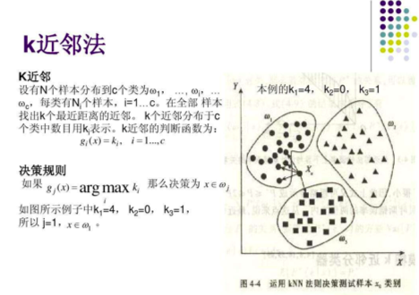

# K-近邻算法和交叉验证

## KNN 分类模型

简单地说，K-近邻算法（k-Nearest Neighbor，KNN）采用测量不同特征值之间的距离方法进行分类。



从下面图中对绿色圆点的分类，我们可以了解 k 值对分类的影响。

如果我们将 k 值设置为 3，也就是找到测试数据最接近的 3 个样本数据。根据样本数据的类别数目，来确定测试数据的类别。我们可以计算出测试数据到所有样本数据的距离，然后进行排序，选择最小的三个数据即可。

下图实线圆圈圈起来的就是我们 k 值设置为 3 的情况下，符合条件的最近的 3 个样本数据。我们发现，这三个样本数据中，红色三角有两个，而蓝色方块只有一个。于是我们断定，绿色圆圈属于红色三角类。

但是如果我们将范围扩大，k 值设置为 5。这时就要以虚线圆圈为基准了。五个最近的样本数据中，蓝色方块有三个，红色三角只有两个。所以此时，绿色圆圈应该划归蓝色方块类。


从上面的例子中我们可以看到，k 值的选取不同将会影响到我们对测试数据类别的划分，所以不能随意选取。

我们通过欧几里得距离来计算两点之间的远近：


## 电影分类

众所周知，电影可以按照题材分类，然而题材本身是如何定义的？由谁来判定某部电影属于哪个题材？也就是说同一题材的电影具有哪些公共特征？这些都是在进行电影分类时必须要考虑的问题。

没有哪个电影人会说自己制作的电影和以前的某部电影类似，但我们确实知道每部电影在风格 上的确有可能会和同题材的电影相近。那么动作片具有哪些共有特征，使得动作片之间非常类似， 而与爱情片存在着明显的差别呢？

动作片中也会存在接吻镜头，爱情片中也会存在打斗场景，我们不能单纯依靠是否存在打斗或者亲吻来判断影片的类型。但是爱情片中的亲吻镜头更多，动作片中的打斗场景也更频繁，基于此类场景在某部电影中出现的次数可以用来进行电影分类。

### 工作原理

存在一个样本数据集合，也称作训练样本集，并且样本集中每个数据都存在标签，即我们知道样本集中每一数据 与所属分类的对应关系。输人没有标签的新数据后，将新数据的每个特征与样本集中数据对应的 特征进行比较，然后算法提取样本集中特征最相似数据（最近邻）的分类标签。

一般来说，我们只选择样本数据集中前 K 个最相似的数据，这就是 K-近邻算法中K的出处，通常 K 是不大于 20 的整数。 最后 ，选择 K 个最相似数据中出现次数最多的分类，作为新数据的分类。

回到前面电影分类的例子，使用K-近邻算法分类爱情片和动作片。有人曾经统计过很多电影的打斗镜头和接吻镜头，下图显示了 6 部电影的打斗和接吻次数。假如有一部未看过的电影，如何确定它是爱情片还是动作片呢？我们可以使用 K-近邻算法来解决这个问题。


首先我们需要知道这个未知电影存在多少个打斗镜头和接吻镜头，上图中问号位置是该未知电影出现的镜头数图形化展示，具体数字参见下表。


即使不知道未知电影属于哪种类型，我们也可以通过某种方法计算出来。首先计算未知电影与样本集中其他电影的距离，如图所示。


现在我们得到了样本集中所有电影与未知电影的距离，按照距离递增排序，可以找到 K 个距离最近的电影。假定 k=3，则三个最靠近的电影依次是 California Man、He's Not Really into Dudes、Beautiful Woman。K-近邻算法按照距离最近的三部电影的类型，决定未知电影的类型，而这三部电影全是爱情片，因此我们判定未知电影是爱情片。

### 在 scikit-learn 库中使用 k-近邻算法

KNN 分类算法 API：`from sklearn.neighbors import KNeighborsClassifier`

首先，从文件中加载电影数据，然后提取特征数据和目标数据：

```python
import pandas as pd
data = pd.read_excel('datasets/my_films.xlsx')
# 提取特征数据和目标数据
feature = data[['Action Lens', 'Love Lens']]    # 特征数据
target = data['target']    # 目标数据
```

然后，将数据拆分成训练集和测试集：

```python
from sklearn.model_selection import train_test_split
x_train, x_test, y_train, y_test = train_test_split(feature, target, random_state=2020, test_size=0.2)
```

其中，x_train 和 y_train 为训练集，x_test 和 y_test 为测试集。

接下来，使用训练集训练模型：

```python
from sklearn.neighbors import KNeighborsClassifier
# n_neighbors就是knn中的k
knn = KNeighborsClassifier(n_neighbors=4)    # 实例化了一个模型对象
# 使用样本数据训练模型（使用训练集训练模型）
knn.fit(x_train, y_train)    # 训练模型，参数X:特征（形状必须是二维），y:目标
```

使用测试集测试模型：

- 测试集中是存在电影真实的分类结果（y_test）
- 我们需要将测试集的特征数据带入模型，让模型对测试集的电影进行分类，然后使用模型分类的结果和测试集电影真实的结果比对。比对的结果就是模型验证的结果。

```python
y_pred = knn.predict(x_test)
print('模型分类结果：',y_pred)
print('真实的分类结果：',y_test)
```

输出的结果为：

```python
模型分类结果： ['Action' 'Action' 'Love']
真实的分类结果： 2     Action
1     Action
11      Love
Name: target, dtype: object
```

我们看到，输出结果和预期的测试结果吻合度很高。

但是这里有一个问题：如果我们测试数据很多的话，如果还这么通过观察到方式来判断模型训练的结果，就很不显示。

这时，我们就可以使用 score 方法，来计算预测正确的测试结果所占的必重：

```python
# 通常可以使用score来对模型进行评分
knn.score(x_test, y_test)    # 参数X，y只的是测试集中的特征和目标数据
```

k 值的不同会导致分类结果的不同，所以模型类的参数 n_neighbors 会直接影响模型的精准度。该参数被称为模型的超参数。

### 鸢尾花分类的实现

鸢尾花有不同的品种，根据花瓣和花蕊的长度和宽度，可以对其进行分类。

首先，读取数据，并提取目标数据和特征数据：

```python
# 读取数据
from sklearn import datasets
data = datasets.load_iris()
# 提取目标和特征
feature = data['data']
target = data['target']
```

当样本数据提取出来后，需要对数据进行简单观测，查看是否需要进行相关的特征工程操作，可以适当对特征进行预处理。这里是 sklearn 的数据，本身就很好了，暂时不需要进行特征工程相关操作。

然后，拆分训练数据和测试数据：

```python
from sklearn.model_selection import train_test_split
x_train, y_train, x_test, y_test = train_test_split(feature, target, test_size=0.2, random_state=10)
```

接下来，就要创建模型对象，并训练数据：

```python
from sklearn.neighbors import KNeighborsClassifier
knn = KNeighborsClassifier(n_neighbors=5)
knn.fit(x_train, y_train)
```

最后，使用测试数据评估模型：

```python
knn.score(x_test, y_test)
```

预测准确率为：0.9666666666666667

我们也可以对单个数据进行预测，需要注意的是，要将数据提前转换陈二维矩阵的形式：

```python
knn.predict(x_test[0].reshape((1, -1)))
```

预测结果为：array([1])

### K 的取值问题：学习曲线

前面的所有例子中，我们都是将 k 也就是 n_neighbors 的参数随意设置一个值。但是我们已经讨论过了，k 的取值会影响到我们的预测结果。选择一个合适的 k 值是很重要的。

我们可以通过使用不同的 K 值训练同一组数据，然后比较预测的结果。结果最好的那个 K 值就是我们采用的。这就是学习曲线的作用

我们还是采用前面鸢尾花分类的数据：

```python
from sklearn import datasets
from sklearn.model_selection import train_test_split
data = datasets.load_iris()
feature = data['data']
target = data['target']
x_train, x_test, y_train, y_test = train_test_split(feature, target, random_state=2020, test_size=0.2)
```

这次，我们使用 1-20 之间的所有整数作为 K 值，训练模型：

```python
from sklearn.neighbors import KNeighborsClassifier
score_list = []
k_list = []
for k in range(1, 21):
    # 每次循环使用不同的k值实例化不同的模型对象
    knn = KNeighborsClassifier(n_neighbors=k)
    knn.fit(x_train, y_train)
    score_list.append(knn.score(x_test, y_test))
    k_list.append(k)
```

将获取到的分值数据绘制成图像：

```python
from pandas import Series
import matplotlib.pyplot as plt
# 不同k对应的分值是Series的数据，k对应的是Series的显示索引
s = Series(score_list, index=k_list)
plt.plot(s)
plt.xlabel('k')
plt.ylabel('score')
```

绘制出来的图像为：


很直观就能看出来，当 k 取 8 的时候，预测的结果是最好的。

### 交叉验证选取 K 值

若 K 值较小，则模型复杂度较高，容易发生过拟合，学习的估计误差会增大，预测结果对近邻的实例点非常敏感。

K 值较大可以减少学习的估计误差，但是学习的近似误差会增大，与输入实例较远的训练实例也会对预测起作用，使预测发生错误，k 值增大模型的复杂度会下降。

在应用中，k 值一般取一个比较小的值，通常采用交叉验证法来来选取最优的 K 值。

适用于小数据场景，样本为几千，几万的情况。

拟合度

- 过拟合：在训练数据表现的好，在测试数据表现的不好
- 欠拟合：在训练数据和测试数据都表现的不好

### K 折交叉验证

如果像上面那样直接使用学习曲线来找到 K 值并不是一个很合理的方案。因为我们使用的是固定的测试数据和训练数据。如果测试数据有较多的异常值，或者样本分布不均匀，则有可能会对 K 值的计算造成误差。

我们可以采用 K 这交叉验证的方式来避免这种误差。

目的：

- 更加科学的选出最为适合的模型超参数的取值，然后将超参数的值作用到模型的创建中。

思想：

- 将样本的训练数据交叉的拆分出不同的训练集和验证集，使用交叉拆分出不同的训练集和验证集测分别试模型的精准度，然就求出的精准度的均值就是此次交叉验证的结果。将交叉验证作用到不同的超参数中，选取出精准度最高的超参数作为模型创建的超参数即可！

实现思路：

- 将数据集平均分割成K个等份
- 使用 1 份数据作为测试数据，其余作为训练数据
- 计算测试准确率
- 使用不同的测试集，重复 2、3 步骤
- 对准确率做平均，作为对未知数据预测准确率的估计


K 折交叉验证的 API

- `from sklearn.model_selection import cross_val_score`
- `cross_val_score(estimator, X, y, cv)`
  - estimator：模型对象
  - X, y：训练集数据
  - cv：折数

我们还是以鸢尾花的分类数据为例，演示交叉验证在 KNN 中的基本使用。

首先，还是获取数据：

```python
from sklearn import datasets
from sklearn.model_selection import train_test_split
data = datasets.load_iris()
feature = data['data']
target = data['target']
x_train, x_test, y_train, y_test = train_test_split(feature, target, random_state=2020, test_size=0.2)
```

然后，使用训练数据，进行交叉验证。

注意，交叉验证需要使用训练集数据中的训练集训练模型，使用训练集中的验证集来测试模型。

```python
from sklearn.model_selection import cross_val_score
from sklearn.neighbors import KNeighborsClassifier
knn = KNeighborsClassifier(n_neighbors=5)
score_arr = cross_val_score(knn, x_train, y_train, cv=5)
score_arr
```

得到的结果是取用不同训练集的结果组成的数组：

```python
array([1.        , 1.        , 1.        , 0.95833333, 1.        ])
```

我们可以对其取均值：

```python
score_arr.mean()    # 0.9916666666666668
```

### 交叉验证的学习曲线

我们在各个的例子中又将 KNN 中的 k 值设置为 5。但这不一定是最佳的选择，所以我们可以来进行选择，找到一个最优的 k。

通过交叉验证结合学习曲线，即可实现这个需求：

```python
import matplotlib.pyplot as plt
from pandas import Series
from sklearn import datasets
from sklearn.model_selection import train_test_split, cross_val_score
from sklearn.neighbors import KNeighborsClassifier
data = datasets.load_iris()
feature = data['data']
target = data['target']
x_train, x_test, y_train, y_test = train_test_split(feature, target, random_state=2020, test_size=0.2)
k_list = []
score_list = []
for k in range(1, 21):
    knn = KNeighborsClassifier(n_neighbors=k)
    # 交叉验证的结果
    score_arr = cross_val_score(knn, x_train, y_train, cv=5)
    score_list.append(score_arr.mean())
    k_list.append(k)
s = Series(score_list, index=k_list)
plt.plot(s)
plt.xlabel('k')
plt.ylabel('score')
```

画出的图像为：


从图像来看，当 k 值为 5 或 9 的时候，效果最好。

### 预测年收入是否大于 50K 美元

knn 中的目标数据可以为字符串，因为目标数据在 knn 中没有参与运算。

首先，加载数据：

```python
data = pd.read_csv('./datasets/adults.txt')
data.head()
```

前五行数据为：

```python
	age	workclass	final_weight	education	education_num	marital_status	occupation	relationship	race	sex	capital_gain	capital_loss	hours_per_week	native_country	salary
0	39	State-gov	77516	Bachelors	13	Never-married	Adm-clerical	Not-in-family	White	Male	2174	0	40	United-States	<=50K
1	50	Self-emp-not-inc	83311	Bachelors	13	Married-civ-spouse	Exec-managerial	Husband	White	Male	0	0	13	United-States	<=50K
2	38	Private	215646	HS-grad	9	Divorced	Handlers-cleaners	Not-in-family	White	Male	0	0	40	United-States	<=50K
3	53	Private	234721	11th	7	Married-civ-spouse	Handlers-cleaners	Husband	Black	Male	0	0	40	United-States	<=50K
4	28	Private	338409	Bachelors	13	Married-civ-spouse	Prof-specialty	Wife	Black	Female	0	0	40	Cuba	<=50K
```

我们看到，这个数据中的特征值太多，而且很多都是非数值型数据，且对结果影响不大。我们可以认为提取其中几个比较重要的数据，针对它们进行运算。这里选择的是 age，occupation，education_num，hours_per_week 这几个特征。而目标值毫无悬念，就是 salary 列：

```python
feature = data[['age', 'occupation', 'education_num', 'hours_per_week']]
target = data['salary']
feature.head()
```

这样数据就简洁很多：

```python
	age	occupation	education_num	hours_per_week
0	39	Adm-clerical	13	40
1	50	Exec-managerial	13	13
2	38	Handlers-cleaners	9	40
3	53	Handlers-cleaners	7	40
4	28	Prof-specialty	13	40
```

但是还有一列，也就是工作职位 occupation，里面的数据都是非数值型的。我们需要对其进行特征工程，抽取特征值，也就是进行 One-Hot 编码：

```python
# 将occupation进行one-hot编码：特征值化
occ_one_hot = pd.get_dummies(feature['occupation'])
occ_one_hot.head()
```

拿到了 occupation 的 One-Hot 编码数据：

```python
	?	Adm-clerical	Armed-Forces	Craft-repair	Exec-managerial	Farming-fishing	Handlers-cleaners	Machine-op-inspct	Other-service	Priv-house-serv	Prof-specialty	Protective-serv	Sales	Tech-support	Transport-moving
0	0	1	0	0	0	0	0	0	0	0	0	0	0	0	0
1	0	0	0	0	1	0	0	0	0	0	0	0	0	0	0
2	0	0	0	0	0	0	1	0	0	0	0	0	0	0	0
3	0	0	0	0	0	0	1	0	0	0	0	0	0	0	0
4	0	0	0	0	0	0	0	0	0	0	1	0	0	0	0
```

接下来，就是把编码后的 occupation 数据合并到原来的数据中，并删除掉原数据中的 occupation 列：

```python
# 经过了特征值化后返回的feature
feature = pd.concat((feature, occ_one_hot), axis=1).drop('occupation', axis=1)
feature.head()
```

编码后的 occupation 数据就添加到了原数据中：

```python
	age	education_num	hours_per_week	?	Adm-clerical	Armed-Forces	Craft-repair	Exec-managerial	Farming-fishing	Handlers-cleaners	Machine-op-inspct	Other-service	Priv-house-serv	Prof-specialty	Protective-serv	Sales	Tech-support	Transport-moving
0	39	13	40	0	1	0	0	0	0	0	0	0	0	0	0	0	0	0
1	50	13	13	0	0	0	0	1	0	0	0	0	0	0	0	0	0	0
2	38	9	40	0	0	0	0	0	0	1	0	0	0	0	0	0	0	0
3	53	7	40	0	0	0	0	0	0	1	0	0	0	0	0	0	0	0
4	28	13	40	0	0	0	0	0	0	0	0	0	0	1	0	0	0	0
```

然后，将数据拆分成训练集和测试集：

```python
# 拆分数据:训练数据，测试数据
from sklearn.model_selection import train_test_split
x_train, x_test, y_train, y_test = train_test_split(feature, target, random_state=2020, test_size=0.2)
```

接下来，基于交叉验证 + 学习曲线选取最优的 k 值

```python
from sklearn.neighbors import KNeighborsClassifier
from sklearn.model_selection import cross_val_score
k_list = []
score_list = []
for k in range(1, 50):
    knn = KNeighborsClassifier(n_neighbors=k)
    score_arr = cross_val_score(knn, x_train, y_train, cv=10)
    score_list.append(score_arr.mean())
    k_list.append(k)
```

绘制学习曲线：

```python
import matplotlib.pyplot as plt
from pandas import Series
s = Series(score_list, index=k_list)
plt.plot(s)
plt.xlabel('k')
plt.ylabel('score')
```

得到学习曲线：


我们看到当 k 值选取到 20 的时候，就已经足够。

这时，我们就可以使用最优的 k 训练模型：

```python
knn = KNeighborsClassifier(n_neighbors=20)
knn.fit(x_train, y_train)
```

最终使用测试集验证模型：

```python
knn.score(x_test, y_test)
```

训练得分为：0.7968678028558268

我们可以得到测试集的预测结果：

```python
knn.predict(x_test)
```

结果为：

```python
array(['<=50K', '<=50K', '<=50K', ..., '<=50K', '<=50K', '<=50K'],
      dtype=object)
```

### 约会网站配对效果判定

还是按照原来的流程，首先读取数据出来：

```python
import pandas as pd
data = pd.read_csv('datasets/datingTestSet.txt', sep='\t', header=None)
data
```

读取来的数据如下：

```python
	0	1	2	3
0	40920	8.326976	0.953952	largeDoses
1	14488	7.153469	1.673904	smallDoses
...	...	...	...	...
998	48111	9.134528	0.728045	largeDoses
999	43757	7.882601	1.332446	largeDoses
1000 rows × 4 columns
```

然后提取特征数据和目标数据：

```python
feature = data[[0, 1, 2]]
target = data[3]
```

将数据拆分成训练集和测试集：

```python
from sklearn.model_selection import train_test_split
x_train, x_test, y_train, y_test = train_test_split(feature, target, random_state=2020, test_size=0.15)
```

使用 K 折正交验证确定合适的 K 值：

```python
from sklearn.neighbors import KNeighborsClassifier
from sklearn.model_selection import cross_val_score
k_list = []
score_list = []
for k in range(1, 50):
    knn = KNeighborsClassifier(n_neighbors=k)
    score_arr = cross_val_score(knn, x_train, y_train, cv=5)
    score_list.append(score_arr.mean())
    k_list.append(k)
```

绘制学习曲线：

```python
%matplotlib inline
from pandas import Series
import matplotlib.pyplot as plt
s = Series(score_list, index=k_list)
plt.plot(s)
plt.xlabel('k')
plt.ylabel('score')
```

学习曲线图为：


使用 Series 的 argmax 方法可以直接找到最大值对应的索引：

```python
s.argmax()
```

当 K 值选取为 20 时，得分最高，效果最好。

最后，将 K 值设置为 20，使用测试集测试训练结果：

```python
knn = KNeighborsClassifier(n_neighbors=20)
knn.fit(x_train, y_train)
knn.score(x_test, y_test)
```

训练的分为：0.8133333333333334

这个得分并不是很高，似乎还有一定的提升空间。

我们看到，三列特征数据数量级差异很大，可以考虑将其进行归一化处理，然后再进行 K 折交叉验证：

```python
from sklearn.preprocessing import MinMaxScaler
mm = MinMaxScaler()
feature = mm.fit_transform(feature)
target = target
x_train, x_test, y_train, y_test = train_test_split(feature, target, random_state=2020, test_size=0.15)
score_list = []
k_list = []
for k in range(1, 50):
    knn = KNeighborsClassifier(n_neighbors=k)
    score_arr = cross_val_score(knn, x_train, y_train, cv=5)
    score_list.append(score_arr.mean())
    k_list.append(k)
```

绘制学习曲线：

```python
s = Series(score_list, index=k_list)
plt.plot(s)
plt.xlabel('k')
plt.ylabel('score')
```

曲线图为：


可以看到当 K 值为 10 附近时，效果最好。找到最大值对应的索引：

```python
s.argmax()
```

索引值为 13。使用这个索引值，训练数据，并用测试集测试数据：

```python
knn = KNeighborsClassifier(n_neighbors=13)
knn.fit(x_train, y_train)
knn.score(x_test, y_test)
```

新得到的分数为：0.9466666666666667

预测效果好了很多。

如果我们使用标准化对数据进行预处理：

```python
from sklearn.preprocessing import StandardScaler
ss = StandardScaler()
feature = data[[0, 1, 2]]
feature = ss.fit_transform(feature)
target = target
x_train, x_test, y_train, y_test = train_test_split(feature, target, random_state=2020, test_size=0.15)
score_list = []
k_list =[]
for k in range(1, 50):
    knn = KNeighborsClassifier(n_neighbors=k)
    score_arr = cross_val_score(knn, x_train, y_train, cv=5)
    score_list.append(score_arr.mean())
    k_list.append(k)
```

绘制学习曲线：

```python
s = Series(score_list, index=k_list)
plt.plot(s)
plt.xlabel('k')
plt.ylabel('score')
```

得到学习曲线为：


结合 argmax 方法，可以得到效果最好的 K 值为：22

使用 22 作为 K 值训练模型，并用测试集测试：

```python
knn = KNeighborsClassifier(n_neighbors=22)
knn.fit(x_train, y_train)
knn.score(x_test, y_test)
```

得到的预测得分为：0.96

效果就更好了。

### 患癌程度分类预测

