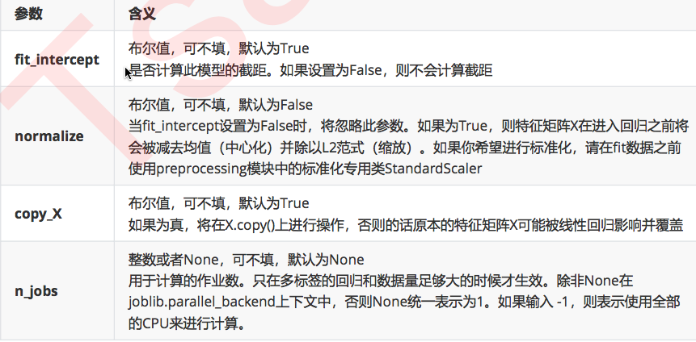

# 线性回归和回归算法的评价指标

[TOC]

## 线性回归概述

线性回归问题的目标值是连续性的值，而分类问题的目标值是离散型的值。

回归处理的问题为预测：

- 预测房价
- 销售额的预测
- 设定贷款额度
- 总结：上述案例中，可以根据事物的相关特征预测出对应的结果值

线性回归在生活中的映射：计算学生的期末成绩：

- 期末成绩的制定：`0.7 * 考试成绩 + 0.3 平时成绩`，则该例子中，特征值为考试成绩和平时成绩，目标值为总成绩。从此案例中大概可以感受到
  - 回归算法预测出来的结果其实就是经过相关的算法计算出来的结果值！
  - 每一个特征需要有一个权重的占比，这个权重的占比明确后，则就可以得到最终的计算结果，也就是获取到最终预测的结果了。

那么这个特征对应的权重如何获取或者如何制定呢？

我们来看一个预测楼房价格的例子。

首先导入需要的模块，并构造数据：

```python
import numpy as np
import pandas as pd
import matplotlib.pyplot as plt
from pandas import DataFrame
dic = {
    '面积': [55, 76, 80, 100, 120, 150],
    '售价': [110, 152, 160, 200, 240, 300]
}
df = DataFrame(dic)
df
```

构造出来的楼房价格数据为：

```python
	售价	面积
0	110	55
1	152	76
2	160	80
3	200	100
4	240	120
5	300	150
```

然后我们对售房数据的分布情况进行可视化展示：

```python
from pylab import mpl
mpl.rcParams['font.sans-serif'] = ['FangSong']    # 指定默认字体
mpl.rcParams['axes.unicode_minus'] = False    # 解决保存图像是负号'-'显示为方块的问题

plt.scatter(df['面积'],df['售价'])
plt.xlabel('面积')
plt.ylabel('售价')
plt.title('面积和价钱的分布图')
```

得到房屋面积和价格关系的散点图：


假如现在有一套房子，面积为 76.8 平米，那么这套房子应该卖多少钱呢？也就是如何预测该套房子的价钱呢？

上图中散点的分布情况就是面积和价钱这两个值之间的关系，那么如果该关系可以用一个走势的直线来表示的话，那么是不是就可以通过这条走势的直线预测出新房子的价格呢？

为了更好地看出散点图之间的联系，我们可以绘制一条趋势线：

```python
plt.scatter(df['面积'],df['售价'])
plt.xlabel('面积')
plt.ylabel('售价')
plt.title('面积和价钱的分布图')
plt.scatter(np.linspace(0, 180, num=100),np.linspace(0, 180, num=100) * 2, alpha=0.3)
```

得到的趋势线如图：


散点的趋势：

- 在上图中使用了一条直线来表示了房子的价格和面子对应的分布趋势，那么该趋势找到后，就可以基于该趋势根据新房子的面积预测出新房子的价格。

线性回归的作用：

- 就是找出特征和目标之间存在的某种趋势。在二维平面中，该种趋势可以用一条线段来表示。

该趋势使用什么表示呢？---> 线性方程：

- 在数学中，线性方程 `y = wx` 就可以表示一条唯一的直线。那么在上述售房数据中，面积和价格之间的关系（二倍的关系）其实就可以映射成
  - `价格 = 2 * 面积` ==> `y=2x`，这个方程就是价格和面积的趋势！也就是说根据该方程就可以进行新房子价格的预测
- 标准的线性方程式为：`y = wx + b`，w 为斜率，b 为截距。那么如果用线性方程表示房价和面积的趋势的话，这个 b 是否需要带上呢？


是否带上 b，得具体情况具体分析。对于函数 `y=wx`，如果 x 为 0，则 y 必定为 0，那就意味着趋势对应的直线必过坐标系的原点（0，0）。如果带上 b 值，则直线不过原点。如果上有图的趋势直线过原点的话，趋势就会不准。加 b 的目的是为了使得趋势对应的直线更加具有通用性。

上述的线性方程 `y=wx+b` 中的 x 为特征，y 为目标，这种方程作为线性关系模型的预测依据的话是否可以满足所有的预测场景呢？

如果现在房价受影响的因素不光是面积了，加入了采光率和楼层了，那么就意味着特征变成了 3 种。在原始的线性方程 `y=wx+b` 中只可以有一个特征，则该方程不具备通用性。

标准线性关系模型为：

- `面积 = (w1面积 + w2采光率 + w3楼层+ b)` ==> `y = (w1x1 + w2x2 + wn * xn)+b`
  - w 又叫做权重。
  - b 可以变换成 `w0 * x0`，`x0=1`
    - `y = w0 * x0 + w1 * x1 + w2 * x2 + wn * xn`
  - 权重向量：`w0, w1,...wn`
  - 特征向量：`x0, x1,...xn`

## 线性回归

线性回归就是找出特征和特征权重之间的一种组合，从而来预测对应的结果。

线性方程式：


## 矩阵基础

矩阵是大多数算法的基础，非常重要

矩阵和数组的区别：

- 数据可以是任意维度的
- 矩阵必须是二维的

矩阵满足了一些特定的需求：

- 矩阵乘法：（m行，b列）*（b行，n列）==（m行，n列），即左行乘右列。

矩阵乘法示例：

```python
x = np.array([[1, 2], [3, 4], [5, 6]])
y = np.array([[1, 1, 1], [2, 2, 2]])
display(x, y)
np.dot(x, y)
```

矩阵 x 和 y 以及它们相乘的结果如下：

```python
array([[1, 2],
       [3, 4],
       [5, 6]])
array([[1, 1, 1],
       [2, 2, 2]])
array([[ 5,  5,  5],
       [11, 11, 11],
       [17, 17, 17]])
```

比如我们有四个权重数据，和两组特征数据，将其进行运算可得预期值：

```python
ws = np.array([[2, 2, 2, 2]])    # 每个特征的权重
xs = np.array([[55, 66, 77, 88], [35, 46, 97, 118]])    #两组特征
display(xs, ws.T)
np.dot(xs, ws.T)    # 计算预期值
```

两组矩阵和乘法结果为：

```python
array([[ 55,  66,  77,  88],
       [ 35,  46,  97, 118]])
array([[2],
       [2],
       [2],
       [2]])
array([[572],
       [592]])
```

## 误差处理

在多数的预测中都会和真实值存在一定的误差。


误差存在，那我们如何处理误差呢？在处理误差之前，我们必须先要知道一个回归算法的特性：

回归算法是一个迭代算法。所谓的迭代就好比是系统版本的迭代，迭代后的系统要比迭代前的系统更好。

- 当开始训练线性回归模型的时候，是逐步的将样本数据带入模型对其进行训练的。
- 训练开始时先用部分的样本数据训练模型生成一组 w 和 b，对应的直线和数据对应散点的误差比较大，通过不断的带入样本数据训练模型会逐步的迭代不好（误差较大）的 w 和 b 从而使得 w 和 b 的值更加的精准。

官方解释：迭代是重复反馈过程的活动，其目的通常是为了逼近所需目标或结果。每一次对过程的重复称为一次“迭代”，而每一次迭代得到的结果会作为下一次迭代的初始值。

通俗点来说，回归算法就是在不断的自身迭代的减少误差来使得回归算法的预测结果可以越发的逼近真实结果

我们可以通过 `损失函数` 来表示误差：


变量解释：

- `yi`：为第 i 个训练样本的真实值
- `hw(xi)`：预测值

误差的大小和我们线性回归方程中的w（权重）系数有直接的关联。那么最终的问题就转化成了，如何去求解方程中的 w 使得误差可以最小？

损失函数也可以表示为：


这个损失函数代表了向量 `yi-y^i` 的 L2 范式的平方结果。L2 范式的本质是就是欧式距离，即是两个向量上的每个点对应相减后的平方和再开平方。我们现在只实现了向量上每个点对应相减后的平方和，并没有开方，所以我们的损失函数是 L2 范式，即欧式距离的平方结果。

在这个平方结果下，我们的 y 和 y^ 分别是我们的真实标签和预测值，也就是说，这个损失函数实在计算我们的真实标 签和预测值之间的距离。因此，我们认为这个损失函数衡量了我们构造的模型的预测结果和真实标签的差异，因此我们固然希望我们的预测结果和真实值差异越小越好。所以我们的求解目标就可以转化为：


其中右下角的 2 表示向量 `y - Xw` 的 L2 范式，也就是我们的损失函数所代表的含义。在 L2 范式上求平方，就是我们的损失函数。我们往往称 呼这个式子为 SSE（Sum of Sqaured Error，误差平方和）或者 RSS（Residual Sum of Squares 残差平方和）。

## 最小二乘法

现在问题转换成了求解让 RSS 最小化的参数向量 w，这种通过最小化真实值和预测值之间的 RSS 来求解参数的方法叫做最小二乘法。

求解极值（最小值）的第一步往往是求解一阶导数并让一阶导数等于0，最小二乘法也不能免俗。因此，我们现在在残差平方和 RSS 上对参数向量 w 求导。

w 表示的是一个列向量（矩阵），我们现在并非是对常数求导，而是对列向量（矩阵）进行求导。矩阵求导的自行掌握即可。

首先将 L2 范式拆开，向量（`y - Xw`）的平方就等于向量的转置乘以向量本身。：


根据向量转置的性质，我们有：


拆分多项式，进行因式分解，然后根据微分的性质可得：


公式就变相为 yTy 对 w 求导，wTXTy 对 w 的求导，yTXw 对 w 的求导，wTXTXw 对 w 的求导。这里的 w 为列向量（矩阵）则就涉及到对矩阵的求导：

在矩阵求导中如果小 a 为常数项，A、B 和 C 为矩阵则有：


由于 y 是一个列向量，为一阶矩阵，那么其本身乘以其转置为一个常数。

将上述规则应用到求导结果中，有：


此时我们就求解出了对 w 求导的一阶导数，接下来让一阶导数为 0 则就求出了最小误差下的 w 的值。


## 最小二乘法的使用

sklearn 封装了最小二乘法计算权重的算法，其 API 为：

- 最小二乘（正规方程）：`from sklearn.linear_model import LinearRegression`
- `coef_` 属性返回的就是最小误差下对应的 w

常用参数：



这些参数中并没有一个是必填的，更没有对我们的模型有不可替代作用的参数。这说明，线性回归的性能，往往取决于数据本身，而并非是我们的调参能力，线性回归也因此对数据有着很高的要求。幸运的是，现实中大部分连续型变量之间，都存在着或多或少的线性联系。所以线性回归虽然简单，却很强大。顺便一提，sklearn 中的线性回归可以处理多标签问题，只需要在 fit 的时候输入多维度标签就可以了。

normalize 参数：如果为 True，则会对特征数据进行归一化处理，如果想对特征数据进行标准化处理则需要在训练模型前调用相关工具类对其进行标准化处理。

接下来，我们将使用最小二乘对加利福尼亚房屋进行预测

特征介绍：

- AveBedrms：该街区平均的卧室数目
- Population：街区人口
- AveOccup：平均入住率
- Latitude：街区的纬度
- Longitude：街区的经度
- MedInc：街区住户收入的中位数
- HouseAge：房屋使用年数中位数
- AveRooms：街区平均房屋的数量

首先，还是导入各种需要的模块：

```python
from sklearn.linear_model import LinearRegression
from sklearn.model_selection import train_test_split, cross_val_score
from sklearn.datasets import fetch_california_housing as fch    # 加利福尼亚房屋价值数据集 
import pandas as pd
```

然后，拿到房屋数据的特征数据和目标数据：

```python
# 下载数据
data = fch()
feature = data.data
target = data.target
```

查看特征数据的形状：

```python
feature.shape    # (20640, 8)
```

查看目标数据形状：

```python
target.shape    # (20640,)
```

为了查看数据，我们可以将其封装到 DataFrame 中：

```python
# 样本数据提取（封装到df中查看）
df = pd.DataFrame(data=feature, columns=data.feature_names)
df['price'] = target
df.head()
```

数据前五行内容为：

```python
	MedInc	HouseAge	AveRooms	AveBedrms	Population	AveOccup	Latitude	Longitude	price
0	8.3252	41.0	6.984127	1.023810	322.0	2.555556	37.88	-122.23	4.526
1	8.3014	21.0	6.238137	0.971880	2401.0	2.109842	37.86	-122.22	3.585
2	7.2574	52.0	8.288136	1.073446	496.0	2.802260	37.85	-122.24	3.521
3	5.6431	52.0	5.817352	1.073059	558.0	2.547945	37.85	-122.25	3.413
4	3.8462	52.0	6.281853	1.081081	565.0	2.181467	37.85	-122.25	3.422
```

接下来，我们将特征数据和目标数据拆分成训练集和测试集：

```python
x_train, x_test, y_train, y_test = train_test_split(feature, target, random_state=2020, test_size=0.1)
```

这样我们就可以使用训练集建模了：

```python
linear = LinearRegression()
linear.fit(x_train, y_train)    # 训练模型：让模型求出误差最小对应最优的w
```

通过 coef_ 属性，即可查看最小二乘法计算出来的回归权重：

```python
linear.coef_
```

这些权重值为：

```python
array([ 4.38210243e-01,  9.66229111e-03, -1.08329143e-01,  6.52754576e-01,
       -4.79939625e-06, -3.60231961e-03, -4.21938498e-01, -4.34993681e-01])
```

数值越大，权重越高，说明该特征对结果的影响越显著，反之越不明显。

我们还可以通过 intercept_ 属性计算截距：

```python
linear.intercept_    # -36.9921104465408
```

我们计算得到的权重系数都是纯数字，看起来并不直观。我们可以通过 zip 函数，将权重和其特征名结合到一起查看：

```python
# 将系数和特征名称结合在一起查看
[*zip(data.feature_names, linear.coef_)]
```

就得到了有特征名的系数：

```python
[('MedInc', 0.4382102431938418),
 ('HouseAge', 0.00966229110734124),
 ('AveRooms', -0.10832914332769084),
 ('AveBedrms', 0.6527545761249733),
 ('Population', -4.799396252223811e-06),
 ('AveOccup', -0.003602319606308055),
 ('Latitude', -0.42193849756433377),
 ('Longitude', -0.43499368106442565)]
```

线性回归中通常是否需要对特征数据进行预处理（归一化，标准化）？

- 先不做，如果模型的评分不好，可以尝试做一下。

是否需要进行交叉验证？

- 在 knn 中我们做交叉验证是为可画出学习曲线找出最优的超参数（k）
- 一般不需要做交叉验证，因为线性模型没有超参数

## 回归模型的评价指标

分类模型我们可以通过测试的结果是否得到正确分类来评价模型的好坏。那我们应该如何评价一个回归模型的效果呢？

回归类算法的模型评估一直都是回归算法中的一个难点，回归类与分类型算法的模型评估其实是相似的法则——找真实标签和预测值的差异。只不过在分类型算法中，这个差异只有一种角度来评判，那就是是否预测到了正确的分类，而在我们的回归类算法中，我们有两种不同的角度来看待回归的效果：

1. 我们是否预测到了正确的数值。
2. 我们是否拟合到了足够的信息。

这两种角度，分别对应着不同的模型评估指标。

### 是否预测到了正确的数值

回忆一下 RSS 残差平方和，它的本质是预测值与真实值之间的差异，也就是从第一种角度来评估回归的效力。所以 RSS 既是我们的损失函数，也是我们回归类模型的模型评估指标之一。

但是，RSS 有着致命的缺点：它是一个无界的和，可以无限地大或者无限的小。我们只知道，我们想要求解最小的 RSS。从 RSS 的公式来看，它不能为负，所以 RSS 越接近 0 越好。但我们没有一个概念，究竟多小才算好，多接近 0 才算好？为了应对这种状况，sklearn 中使用 RSS  的变体，均方误差 MSE（mean squared error）来衡量我们的预测值和真实值的差异：


均方误差，本质是在 RSS 的基础上除以了样本总量，得到了每个样本量上的平均误差。有了平均误差，我们就可以将平均误差和我们的标签的取值范围（最大值和最小值）在一起比较，以此获得一个较为可靠的评估依据。（查看这个错误有多严重）

在 sklearn 当中，我们有两种方式调用这个评估指标：

- 使用 sklearn 专用的模型评估模块 metrics 里的类 mean_squared_error
- 调用 交叉验证的类 cross_val_score 并使用里面的 scoring 参数来设置为 neg_mean_squared_error 使用均方误差

使用测试集查看训练的均方误差：

```python
# 模块实现的均方误差
from sklearn.metrics import mean_squared_error as mse
mse(y_test, linear.predict(x_test))
```

测试集中真实值和预测值的局方误差为：0.527302231957192

单单只看这个数字并不能得出训练结果是好还是坏的结论。我们可以查看测试集中的最大值和最小值，来获得一个直观的参照：

```python
print(y_test.max(), y_test.min())
```

测试集中真实值的最大值和最小值分别为：5.00001 和 0.325

我们看到，即便跟最大值比起来，0.5 的误差也不小了。如果跟 0.3 的最小值比，这个误差是不可接受的（事实上，如果使用最大值和最小值的平方进行比较会更加合适）。

因为均方误差是数据本身的，单独使用训练数据也可以获得均方误差的数值。如果使用特定的训练集可能会有偏差，我们可以通过交叉验证的方式获取训练集的均方误差：

```python
cross_val_score(linear, x_train, y_train, cv=10, scoring='neg_mean_squared_error')
```

我们得到交叉验证的结果：

```python
array([-0.53035714, -0.58620156, -0.52363407, -0.5455884 , -0.49540431,
       -0.59466019, -0.54364472, -0.4760162 , -0.50039178, -0.49117608])
```

均方误差都是负的。但是从公式来看，均方误差不可能为负。原来，sklearn 认为既然是偏差，造成的影响往往是负面的，所以把这些数据转成了负值。这并不影响我们的使用。

均方误差的计算公式中求得的均方误差的值不可能为负。但是 sklearn 中的参数 scoring 下，均方误差作为评判标准时，却是计算”负均方误差“（neg_mean_squared_error）。这是因为 sklearn 在计算模型评估指标的时候，会考虑指标本身的性质。均方误差本身是一种误差，所以被 sklearn 划分为模型的一种损失（loss）。在 sklearn 当中，所有的损失都使用负数表示，因此均方误差也被显示为负数了。真正的均方误差 MSE 的数值，其实就是 neg_mean_squared_error 去掉负号的数字。

我们可以对其取平均值，得到训练集经过交叉验证的均方误差：

```python
cross_val_score(linear, x_train, y_train, cv=10, scoring='neg_mean_squared_error').mean()
```

训练集的均方误差为：-0.5287074454857335

同样，我们可以将其与训练集的最大值和最小值比较：

```python
print(y_train.max(), y_train.min())
```

训练集目标结果的最大值和最小值分别为：5.00001 和 0.14999

差异同样比较大。

### 绝对值误差（了解）

除了 MSE，我们还有与 MSE 类似的 MAE（Mean absolute error，绝对均值误差）：

其表达的概念与均方误差完全一致，不过在真实标签和预测值之间的差异外我们使用的是 L1 范式（绝对值）。现实使 用中，MSE和MAE选一个来使用就好了。

- 在 sklearn 当中，我们使用命令
  - `from sklearn.metrics import mean_absolute_error` 来调用 MAE，
- 同时，我们也可以使用交叉验证中的
  - `scoring = "neg_mean_absolute_error"`， 以此在交叉验证时调用 MAE。

### 均方根误差的使用

方均误差的量纲是预测结果的量纲的平方，将其直接与预测结果比较并不合适。我们可以通过对均方误差开根号，得到均方根误差，也就是 RMSE（Root Mean Squared Error）。

- rmse = np.sqrt(metrics.mean_squared_error(y_true,y_pred))

简单计算一下：

```python
np.sqrt(mse(linear.predict(x_test), y_test))
```

均方根误差为：0.7261557904177257

也是蛮大的。

## 是否拟合了足够的信息

对于回归类算法而言，只探索数据预测是否准确是不足够的。除了数据本身的数值大小之外，我们还希望我们的模型能够捕捉到数据的”规律“，比如数据的分布规律（抛物线），单调性等等。而是否捕获到这些信息是无法使用 MSE 来衡量的。


来看这张图，其中红色线是我们的真实标签，而蓝色线是我们的拟合模型。这是一种比较极端，但的确可能发生的情况。这张图像上，前半部分的拟合非常成功，看上去我们的真实标签和我们的预测结果几乎重合。但后半部分的拟合却非常糟糕，模型向着与真实标签完全相反的方向去了。

对于这样的一个拟合模型，如果我们使用 MSE 来对它进行判 断，它的 MSE 可能并不高，因为大部分样本其实都被完美拟合了，少数样本的真实值和预测值的巨大差异在被均分到每个 样本上之后，MSE 就会很小。

但这样的拟合结果必然不是一个好结果，因为一旦我们的新样本是处于拟合曲线的后半段的，预测结果必然会有巨大的偏差，而这不是我们希望看到的。

我们希望找到新的指标，除了判断预测的数值是否正确之外，还能够判断我们的模型是否拟合了足够多的数值之外的信息。

在我们学习降维特征选择的时候，我们提到我们使用方差来衡量数据上的信息量。如果方差越大，代表数据上的信息量越多，而这个信息量不仅包括了数值的大小，还包括了我们希望模型捕捉的那些规律。为了衡量模型对数据上的信 息量的捕捉，我们定义了 R2 来帮助我们：


可以使用三种方式来计算出 R2 的值：

1. 直接从 metrics 中导入 r2_score，输入预测值和真实值后打分。
2. 直接从线性回归 LinearRegression 的接口 score 来进行调用。
3. 在交叉验证中，输入"r2"来调用。

使用 r2_score 方法对测试集打分：

```python
from sklearn.metrics import r2_score
r2_score(y_test, linear.predict(x_test))   # 参数中真实值在前，预测值在后
```

测试集的 R2 结果为：0.6097458147785049

我们还可以直接计算训练集的 R2：

```python
linear.score(x_train, y_train)
```

训练集的 R2 为：0.6058104322752742

也可以使用交叉验证，获得更加可靠的 R2：

```python
cross_val_score(linear, x_train, y_train, cv=10, scoring='r2').mean()
```

R2 的值为：0.6012662971377246

我们看到，这几个 R2 的值都不很接近 1，所以线性拟合的并不好。

我们可以绘制曲线，更直观地观察：

```python
%matplotlib inline
import matplotlib.pyplot as plt
y_pred = linner.predict(x_test)
plt.figure(figsize=(20,20))
plt.plot(range(len(y_test)),sorted(y_test),c="black",label= "y_true")
plt.plot(range(len(y_pred)),sorted(y_pred),c="red",label = "y_predict")
plt.legend()
plt.show()
```


可见，虽然我们的大部分数据被拟合得比较好，但是图像的开头和结尾处却又着较大的拟合误差。如果我们在图像右侧分布着更多的数据，我们的模型就会越来越偏离我们真正的标签。这种结果类似于我们前面提到的，虽然在有限的数据集上将数值预测正确了，但却没有正确拟合数据的分布，如果有更多的数据进入我们的模型，那数据标签被预测错误的可能性是非常大的。

