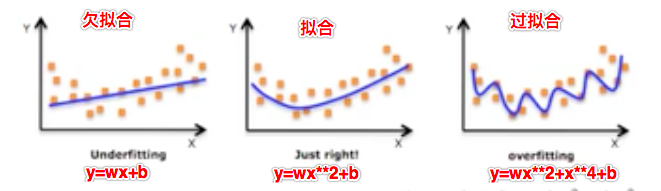

# 多项式回归和过拟合与欠拟合的处理

[TOC]

直接使用线性回归，拟合出来的函数图像为一条直线。但有些时候，真实数据并不是线性相关的，这时，我们就可以使用多项式回归的方式，来获得一条更合适的你和曲线。其原理是，函数可以通过泰勒展开转换成多项式的形式。

## 实例：房地产估价数据集数据集

我们来通过房地产估价的实例来演示一下，使用初级线性拟合有可能拟合效果不好的情况。

数据集信息：

- 房地产估值的市场历史数据集来自台湾新北市新店区。“房地产估价” 是一个回归问题。

属性信息：

- 输入如下：
  - X1：交易日期（例如，2013.250 = 2013 年 3 月，2013.500 = 2013 年 6 月，等等）
  - X2：房屋年龄（单位：年）
  - X3：到最近的捷运站的距离（单位：米） 
  - X4：步行生活圈中的便利店的数量（整数）
  - X5：地理坐标，纬度。（单位：度）
  - X6：地理坐标，经度。（单位：度）
- 输出结果如下：
  - Y：单位面积的房价（10000 新台币/Ping，其中 Ping 是本地单位，1 Ping = 3.3 平方米）

最开始，读取 excel 文件中的数据：

```python
import pandas as pd
data = pd.read_excel('house.xlsx').drop('No', axis=1)
data.head()
```

读取到的前五条数据为：

```python
	X1 transaction date	X2 house age	X3 distance to the nearest MRT station	X4 number of convenience stores	X5 latitude	X6 longitude	Y house price of unit area
0	2012.916667	32.0	84.87882	10	24.98298	121.54024	37.9
1	2012.916667	19.5	306.59470	9	24.98034	121.53951	42.2
2	2013.583333	13.3	561.98450	5	24.98746	121.54391	47.3
3	2013.500000	13.3	561.98450	5	24.98746	121.54391	54.8
4	2012.833333	5.0	390.56840	5	24.97937	121.54245	43.1
```

查看数据信息：

```python
data.info()
```

数据全部为数值型的数据，无需额外处理：

```python
<class 'pandas.core.frame.DataFrame'>
RangeIndex: 414 entries, 0 to 413
Data columns (total 7 columns):
X1 transaction date                       414 non-null float64
X2 house age                              414 non-null float64
X3 distance to the nearest MRT station    414 non-null float64
X4 number of convenience stores           414 non-null int64
X5 latitude                               414 non-null float64
X6 longitude                              414 non-null float64
Y house price of unit area                414 non-null float64
dtypes: float64(6), int64(1)
memory usage: 22.7 KB
```

提取特征数据和目标数据：

```python
feature = data.loc[:, data.columns != 'Y house price of unit area']
target = data['Y house price of unit area']
feature.shape, target.shape
```

特征数据和目标数据的形状为：`((414, 6), (414,))`

拆分训练集和测试集：

```python
from sklearn.model_selection import train_test_split
x_train, x_test, y_train, y_test = train_test_split(feature, target, random_state=2020, test_size=0.2)
```

使用普通的线性回归算法训练模型：

```python
from sklearn.linear_model import LinearRegression
linear = LinearRegression(fit_intercept=True, normalize=True)
linear.fit(x_train, y_train)
```

注意 LinearRegression 的两个参数：

- fit_intercept：是否带截距
- normalize：是否对训练集进行归一化处理

查看模型在训练集中的表现：

```python
from sklearn.metrics import mean_squared_error as mse
mse(y_train, linear.predict(x_train))
```

训练集的均方误差为：83.00347064630735

对比目标数据中的最大值和最小值：

```python
y_train.max(), y_train.min()
```

结果为：`(117.5, 7.6)`

再计算 R2：

```python
from sklearn.metrics import r2_score
r2_score(y_train, linear.predict(x_train))
```

R2 的值为：0.5750984249253495

可见，模型在测试集中的表现十分糟糕。

再来看训练集的表现：

```python
mse(y_test, linear.predict(x_test))
```

均方误差为：55.33406050091154

对比测试集的最大值和最小值：

```python
y_test.max(), y_test.min()
```

测试集目标数据的最大值和最小值为：`(63.2, 13.8)`

最后计算测试集的 R2：

```python
r2_score(y_test, linear.predict(x_test))
```

测试集的 R2 为：0.6108181277767202

测试集的结果也不尽人意。

上述的样本训练好的模型在测试集和训练集表现的都很糟糕！那我们该怎么办呢？

1. 更换模型
2. 坚持使用线性模型（多项式模型）

## 使用多项式回归处理欠拟合的情况

这次，我们预先获得特征数据的多项式数据，然后再训练线性回归模型：

```python
from sklearn.preprocessing import PolynomialFeatures
pf = PolynomialFeatures(degree=3)    # 使用工具类给特征数据添加高次项特征数据
poly_x_train = pf.fit_transform(x_train)    # 工具类就返回了添加好的高次项的特征
linear = LinearRegression(normalize=True)
linear.fit(poly_x_train, y_train)    # 使用高次项特征训练模型
```

还是先查看训练集的表现：

```python
mse(y_train, linear.predict(poly_x_train))
```

训练集的均方误差为：61.01696657854985

比前面的 83 要好很多了。再来看看训练集的 R2：

```python
r2_score(y_train, y_pred)
```

训练集的 R2 值为：0.687649142817421

然后再来看看测试集的表现：

```python
poly_x_test = pf.fit_transform(x_test)
y_test_pred = linear.predict(poly_x_test)
mse(y_test, y_test_pred)
```

测试集的均方误差为：30.190660768072284

```python
r2_score(y_test, y_test_pred)
```

测试集的 R2 值为：0.7876595757655859

可见，通过多项式回归拟合得到的拟合曲线比直接使用直线拟合要好很多。

## 欠拟合和过拟合

训练好的模型在训练集上表现的预测效果很好，但是在测试集上却有很大的问题和误差，这是因为什么呢？

案例 1：

- 现在有一组天鹅的特征数据然后对模型进行训练，然后模型学习到的内容是有翅膀，嘴巴长的就是天鹅。然后使用模型进行预测，该模型可能会将所有符合这两个特征的动物都预测为天鹅，则肯定会有误差的，因为鹦鹉，秃鹫都符合有翅膀和嘴巴长的特征。

  原因：模型学习到的天鹅的特征太少了，导致区分标准太粗糙，不能准确的识别出天鹅。

案例 2：

- 更新了样本的特征数据了，增加了一些特征，然后训练模型。模型这次学习到的内容是，有翅膀、嘴巴长、白色、体型像 2、脖子长且有弯度的就是天鹅。然后开始使用模型进行预测，现在一组测试数据为鹦鹉，因为鹦鹉的体型小，脖子短不符合天鹅的特征，则预测结果为不是天鹅。然后又有一组特征为黑天鹅，结果因为颜色不是白色，预测成了黑天鹅。

  原因：现在模型学习到的特征已经基本可以区分天鹅和其他动物了。但是学习到的特征中有一项是羽毛是白色，那么就会导致将黑天鹅无法识别出来。也就是机器学习到的特征太依赖或者太符合训练数据了。

通过上面两个案例，我们可以大致得出欠拟合和过拟合的含义：

欠拟合：案例 1 中的场景就可以表示欠拟合

- 一个假设在训练数据上不能获得很好的拟合，但是在训练数据以外的数据集上也不能很好的拟合数据，此时认为这个假设出现了欠拟合的现象。（模型过于简单）

过拟合：案例 2 中的场景就可以表示过拟合

- 一个假设在训练数据上能够获得比其他假设更好的拟合，但是在训练数据以外的数据集上却不能很好的拟合数据，此时认为这个假设出现了过拟合现象（模型过于复杂）。



那么如何解决欠拟合和过拟合的问题呢？

欠拟合：

- 原因：模型学习到样本的特征太少
- 解决：增加样本的特征数量（多项式回归）

过拟合：

- 原因：原始特征过多，存在一些嘈杂特征。
- 解决：
  - 进行特征选择，消除关联性大的特征（很难做）
  - 正则化之岭回归（掌握）

模型的复杂度 --> 回归出直线或者曲线：

我们的回归模型最终回归出的一定是直线吗（`y = wx + b`）？有没有可能是曲线（非线性）呢（`y = wx**2 + b`）？

我们都知道回归模型算法就是在寻找特征值和目标值之间存在的某种关系，那么这种关系越复杂则表示训练出的模型的复杂度越高，反之越低。

模型的复杂度是由特征和目标之间的关系导致的！特征和目标之间的关系不仅仅是线性关系！

### 欠拟合的处理：多项式回归

为了解决欠拟合的情 经常要提高线性的次数（高次多项式）建立模型拟合曲线，次数过高会导致过拟合，次数不够会欠拟合。

- `y = w*x + b` 一次多项式函数
- `y = w1*x^2 + w2*x + b` 二次多项式函数
- `y = w1*x^3 + w2*x^2 + w3*x + b` 三次多项式函数
- 。。。

高次多项式函数的表示的是曲线。

相对于线性回归模型 `y = wx + b` 只能解决线性(回归出的为直线)问题，多项式回归能够解决非线性回归（回归出的为曲线）问题。

拿最简单的线性模型来说，其数学表达式可以表示为：`y = wx + b`，它表示的是一条直线，而多项式回归则可以表示成：`y = w1x^2 + w2x + b`，它表示的是二次曲线。实际上，多项式回归可以看成特殊的线性模型，即把 `x^2` 看成一个特征，把x看成另一个特征，这样就可以表示成 `y = w1z + w2x + b`，其中 `z = x^2`。这样多项式回归实际上就变成线性回归了。

其中的 `y = w1x^2 + w2x + b` 就是所谓的二次多项式：`aX^2 + bX + c (a ≠ 0)`。

当然还可以将 `y = wx + b` 转为更高次的多项式。是否需要转成更高次的多项式取决于我们想要拟合样本的程度了，更高次的多项式可以更好的拟合我们的样本数据，但是也不是一定的，很可能会造成过拟合。

高次项的次越大，则拟合出的曲线越弯曲

- 曲线越弯曲就可以表示更好的拟合效果
- 在样本中添加的高此项的特征的次越高，则模型会有更好的拟合。
- 注意：如果次无限增大，则一定会出现模型的过拟合。

### 示例：根据蛋糕的直径大小预测蛋糕价格

我们是用少量数据简单模拟一下根据蛋糕的直径大小预测蛋糕价格的情况。我们知道，蛋糕的面积是要和直径的平方成正比的，所以价格一般也会和直径成平方正比的关系。如果使用普通的线性回归的话，拟合效果可能欠佳。

首先，导入模块，构造数据，使用普通线性回归训练模型：

```python
import numpy as np
import matplotlib.pyplot as plt
from sklearn.linear_model import LinearRegression
# 样本的训练数据，特征和目标值
x_train = [[6], [8], [10], [14], [18]] #大小
y_train = [[7], [9], [13], [17.5], [18]]#价格
#一次线性回归的学习与预测y=wx+b
linear = LinearRegression()
linear.fit(x_train, y_train)
```

然后，画出线形拟合曲线和数据散点：

```python
# 画出一次线性回归的拟合曲线
xx = np.linspace(0, 25, 100)
xx = xx.reshape(-1, 1)
yy = linear.predict(xx)
plt.plot(xx, yy)
plt.scatter(x_train, y_train)    # 原始样本数据的分布规律
```

拟合结果的图像为：


可以看到，各个点距离直线的距离还是比较远的。

接下来，我们建立二次多项式线性回归模型进行预测。

根据二次多项式公式可知，需要给原始特征添加更高次的特征数据 `x^2`.

- `y = w1x^2 + w2x + b`

如何给样本添加高次的特征数据呢？

使用 `sklearn.preprocessing.PolynomialFeatures` 来进行更高次特征的构造

它是使用多项式的方法来进行的，如果有a，b两个特征，那么它的2次多项式为 `1, a, b, a^2, ab, b^2`

PolynomialFeatures 有三个参数：

- degree：控制多项式的度
- interaction_only：默认为 False，如果指定为 True，那么就不会有特征自己和自己结合的项，上面的二次项中没有 `a^2` 和 `b^2`。
- include_bias：默认为 True。如果为 False 的话，那么就不会有上面的 1 那一项

接下来，我们建立二次多项式线性回归模型进行预测：

```python
from sklearn.preprocessing import PolynomialFeatures
poly2 = PolynomialFeatures(degree=2)    # 二次多项式特征生成器
poly2_x_train = poly2.fit_transform(x_train)
# 建立模型预测
poly2_regression = LinearRegression()
poly2_regression.fit(poly2_x_train, y_train)
```

画二次多项式线性回归的图：

```python
xx_poly2 = poly2.fit_transform(xx)
yy_poly2 = poly2_regression.predict(xx_poly2)
plt.scatter(x_train, y_train)
plt.plot(xx, yy)
plt.plot(xx, yy_poly2)
```

绘制出来的图像为：


多项式拟合出来的曲线，显然要比直线更好地吻合数据，距离数据点更近。

如果我们更进一步，使用三次多项式来拟合，效果会如何呢？

```python
poly3 = PolynomialFeatures(degree=3)    # 三次多项式特征生成器
poly3_x_train = poly3.fit_transform(x_train)
# 建立模型预测
poly3_regression = LinearRegression()
poly3_regression.fit(poly3_x_train, y_train)
```

绘制拟合曲线：

```python
xx_poly3 = poly3.fit_transform(xx)
yy_poly3 = poly3_regression.predict(xx_poly3)
plt.scatter(x_train, y_train)
plt.plot(xx, yy)
plt.plot(xx, yy_poly3)
```

拟合到的曲线为：


我们看到，三次多项式拟合曲线几乎完美通过所有点。但是如果我们进一步观察这条曲线就会看到，当尺寸进一步增加时，价格会急剧下降，这显然是与现实不符的。这条曲线就出现了过拟合的现象。

### 过拟合处理：正则化

将过拟合的曲线的凹凸幅度减少就可以将过拟合曲线趋近于拟合曲线了。那么过拟合曲线的凹凸肯定是由 `y = wx**2 + x**3 + x**4` 中的高次项导致的，那么正则化就可以通过不断的尝试发现高次项的特征然后这些特征的权重 w 调小到 0，则高次项的特征没有了，那么凹凸幅度就减少了，就越趋近于拟合曲线了！

可以使得高次项的w权重减小，趋近于 0。

LinnerRegression 是没有办法进行正则化的，所以该算法模型容易出现过拟合，并且无法解决。

L2正则化：

- 使用带有正则化算法的回归模型（Ridge 岭回归）处理过拟合的问题。

Ridge 岭回归是具备 L2 正则化的线性回归模型。

API：`from sklearn.linear_model import Ridge`

`Ridge(alpha=1.0)` 的相关参数：

- alpha：正则化的力度，力度越大，则表示高次项的权重 w 越接近于 0，导致过拟合曲线的凹凸幅度越小。
  - 取值：0-1 小数或者 1-10 整数
- coef_：回归系数

我们先查看一下使用三次多项式线性回归曲线的回归系数：

```python
poly3_regression.coef_
```

回归系数为：

```python
array([[ 0.        , -1.42626096,  0.31320489, -0.01103344]])
```

二次项和三次项的系数还是蛮高的。

然后，通过岭回归 Ridge 重新拟合：

```python
from sklearn.linear_model import Ridge
poly3 = PolynomialFeatures(3)
poly3_x_train = poly3.fit_transform(x_train)
poly3_regression = Ridge(alpha=0.5)
poly3_regression.fit(poly3_x_train, y_train)
poly3_regression.coef_
```

得到新的回归系数：

```python
array([[ 0.        , -0.14579637,  0.19991159, -0.00792083]])
```

我们看到，高次项的系数低了很多。

岭回归的优点：

- 获取的回归系数更符合实际更可靠
- 在病态数据（异常值多的数据）偏多的研究中有更大的存在意义

## 模型的保存和加载

每次训练好模型，我们当然不希望关闭程序后，下次再次重启还要重新训练。因为很多时候，训练过程是十分耗时的。这时，我们就可以将训练好的模型保存起来，下次需要的时候加载即可。

模型保存加载的 API：

- `from sklearn.externals import joblib`
  - `joblib.dump(model,'xxx.m')`：保存
  - `joblib.load('xxx.m')`：加载

比如，我们把三次多项式模型保存，然后加载：

```python
from sklearn.externals import joblib
joblib.dump(poly3_regression, 'poly3.m')
p = joblib.load('poly3.m')
p.coef_
```

成功读取到拟合的系数：

```python
array([[ 0.        , -0.14579637,  0.19991159, -0.00792083]])
```

