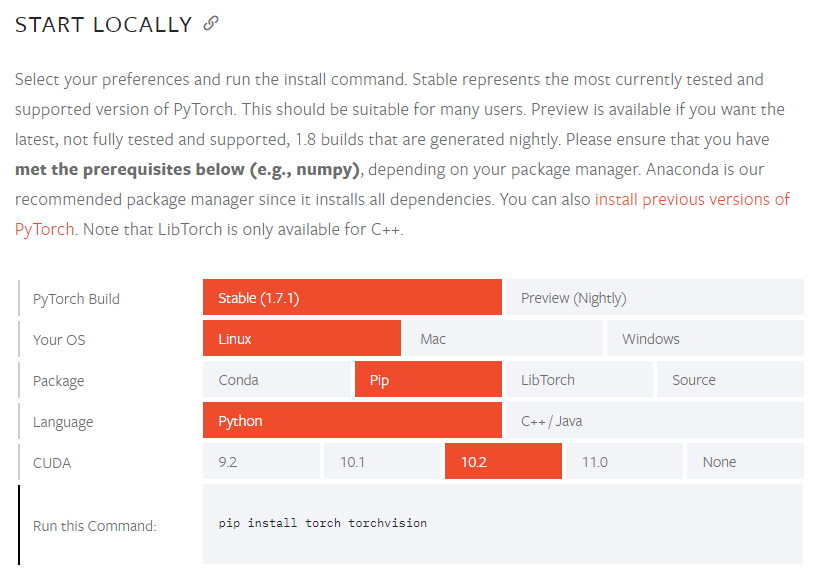

# Pytorch 基本使用

[toc]


## Pytorch 简介

Pytorch 是一个基于 Numpy 的科学计算包, 向它的使用者提供了两大功能：
- 作为 Numpy 的替代者，向用户提供使用 GPU 强大功能的能力
- 做为一款深度学习的平台，向用户提供最大的灵活性和速度

## Pytorch 的安装

在 [Pytorch 的官网](https://pytorch.org/get-started/locally/) 可以找到在各种系统中的每个版本安装 Pytorch 的安装方法，直接把命令复制粘贴即可。



## Pytorch 的导入

Tensors 张量：张量的概念类似于 Numpy 中的 ndarray 数据结构，最大的区别在于 Tensor 可以使用 GPU 的加速功能。

要使用 Pytorch，首先当然是导入 torch：

```python
import torch
```

## 创建矩阵

创建一个没有初始化的矩阵：

```python
x = torch.empty(5, 3)
print(x)
```

输出结果：

```python
tensor([[1.1969e+14, 7.0906e-43, 1.1968e+14],
        [7.0906e-43, 1.1969e+14, 7.0906e-43],
        [1.1969e+14, 7.0906e-43, 1.1970e+14],
        [7.0906e-43, 1.1970e+14, 7.0906e-43],
        [1.1970e+14, 7.0906e-43, 1.1970e+14]])
```

创建一个有初始化的矩阵：

```python
x = torch.rand(5, 3)
print(x)
```

输出结果：

```python
tensor([[0.3609, 0.0462, 0.3337],
        [0.7504, 0.5656, 0.4597],
        [0.6819, 0.5227, 0.1335],
        [0.1322, 0.6620, 0.7412],
        [0.9584, 0.2407, 0.5613]])
```

对比有无初始化的矩阵，当声明一个未初始化的矩阵时，它本身不包含任何确切的值。当创建一个未初始化的矩阵时，分配给矩阵的内存中有什么数值就赋值给了这个矩阵，本质上是毫无意义的数据。

创建一个全零矩阵并可指定数据元素的类型为 long：

```python
x = torch.zeros(5, 3, dtype=torch.long)
print(x)
```

输出结果：

```python
tensor([[0, 0, 0],
        [0, 0, 0],
        [0, 0, 0],
        [0, 0, 0],
        [0, 0, 0]])
```

直接通过数据创建张量：

```python
x = torch.tensor([2.5, 3.5])
print(x)
```

输出结果：

```python
tensor([2.5000, 3.5000])
```

通过已有的一个张量创建相同尺寸的新张量：

```python
# 利用 news_methods 方法得到一个张量
x = x.new_ones(5, 3, dtype=torch.double)
print(x)

# 利用 randn_like 方法得到相同张量尺寸的一个新张量，并且采用随机初始化来对其赋值
y = torch.randn_like(x, dtype=torch.float)
print(y)
```

输出结果：

```python
tensor([[1., 1., 1.],
        [1., 1., 1.],
        [1., 1., 1.],
        [1., 1., 1.],
        [1., 1., 1.]], dtype=torch.float64)

tensor([[ 0.5226, -0.0198, -0.0517],
        [-0.9955,  2.3185,  0.3311],
        [ 2.5638,  2.2326, -0.2921],
        [ 1.8113,  1.4482,  0.5797],
        [-0.0119, -1.4594,  1.7458]])
```

可用如下命令查询张量的尺寸：

```python
print(x.size())
```

输出结果:

```python
torch.Size([5, 3])
```

`torch.Size` 函数本质上返回的是一个 tuple，因此它支持一切元组的操作：

```python
rows, cols = x.size()
print(rows, cols)
```

输出结果：

```python
5 3
```

## Pytorch 的基本运算操作

加法操作:

```python
y = torch.rand(5, 3)
print(x + y)
```

输出结果：

```python
tensor([[1.7137, 1.1927, 1.5771],
        [1.5449, 1.4120, 1.4977],
        [1.7687, 1.6640, 1.1035],
        [1.3856, 1.5892, 1.4725],
        [1.8309, 1.7624, 1.3352]])
```

第二种加法方式:

```
print(torch.add(x, y))
```

输出结果：

```python
tensor([[1.7137, 1.1927, 1.5771],
        [1.5449, 1.4120, 1.4977],
        [1.7687, 1.6640, 1.1035],
        [1.3856, 1.5892, 1.4725],
        [1.8309, 1.7624, 1.3352]])
```

第三种加法方式：

```python
# 提前设定一个空的张量
result = torch.empty(5, 3)
# 将空的张量作为加法的结果存储张量
torch.add(x, y, out=result)
print(result)
```

输出结果：

```python
tensor([[1.7137, 1.1927, 1.5771],
        [1.5449, 1.4120, 1.4977],
        [1.7687, 1.6640, 1.1035],
        [1.3856, 1.5892, 1.4725],
        [1.8309, 1.7624, 1.3352]])
```

第四种加法方式：in-place（原地置换）

```python
y.add_(x)
print(y)
```

输出结果：

```python
tensor([[1.7137, 1.1927, 1.5771],
        [1.5449, 1.4120, 1.4977],
        [1.7687, 1.6640, 1.1035],
        [1.3856, 1.5892, 1.4725],
        [1.8309, 1.7624, 1.3352]])
```

注意:
- 所有可以 in-place 操作函数都有一个下划线的后缀的方法，调用此方法会直接在原张量中修改
- 比如 x.copy\_(y), x.add\_(y)，都会直接改变 x 的值

用类似于 Numpy 的方式对张量进行操作：

```python
print(x[:, 1])
```

输出结果：

```python
tensor([1., 1., 1., 1., 1.])
```

改变张量的形状：torch.view()

```python
x = torch.randn(4, 4)
# tensor.view() 操作需要保证数据元素的总数量不变
y = x.view(16)
# -1 代表自动匹配个数
z = x.view(-1, 8)
print(x.size(), y.size(), z.size())
```

输出结果：

```python
torch.Size([4, 4]) torch.Size([16]) torch.Size([2, 8])
```

如果张量中只有一个元素，可以用 `.item()` 将值取出，作为一个普通的 python 数字：

```python
x = torch.randn(1)
print(x)
print(x.item())
```

输出结果:

```python
tensor([-2.2173])
-2.2172560691833496
```

## Torch Tensor 和 Numpy array 之间的相互转换

Torch Tensor 和 Numpy array 共享底层的内存空间，也就是说改变其中一个的值，另一个也会随之被改变。

创建一个 tensor：

```python
a = torch.ones(5)
print(a)
```

输出结果：

```python
tensor([1., 1., 1., 1., 1.])
```

将 Torch Tensor 转换为 Numpy array：

```python
b = a.numpy()
print(b)
```

输出结果：

```python
[1. 1. 1. 1. 1.]
```

对其中一个进行加法操作，另一个也随之被改变：

```python
a.add_(1)
print(a)
print(b)
```

输出结果：

```python
tensor([2., 2., 2., 2., 2.])
[2. 2. 2. 2. 2.]
```

将 Numpy array 转换为 Torch Tensor：

```python
import numpy as np
a = np.ones(5)
b = torch.from_numpy(a)
print(a)
print(b)
np.add(a, 1, out=a)
print(a)
print(b)
```

输出结果：

```python
[1. 1. 1. 1. 1.]
tensor([1., 1., 1., 1., 1.], dtype=torch.float64)
[2. 2. 2. 2. 2.]
tensor([2., 2., 2., 2., 2.], dtype=torch.float64)
```

所有在 CPU 上的 Tensors，除了 CharTensor，都可以转换为 Numpy array 并可以反向转换.

## Cuda Tensor 在 GUP 上的 Tensor

Pytorch 的一大优势是其可以在 GPU 上运行。多核心的 GPU 会很高效地运算机器学习相关数据。

Tensors 可以用 `.to()` 方法来将其移动到任意设备上：

```python
# 如果服务器上已经安装了 GPU 和 CUDA
if torch.cuda.is_available():
    # 定义一个设备对象，这里指定成 CUDA，即使用 GPU
    device = torch.device('cuda')
    # 可以在创建 tensor 的时候通过 device 参数指定数据存放设备
    y = torch.ones_like(x, device=device)
    # 也可以通过 tensor 的 to 方法将数据转移到指定设备
    x = x.to(device)
    # x 和 y 都在同一设备（如：都在 GPU）上面，才能支持运算
    z = x + y
    # 此处的张量 z 在 GPU 上面
    print(z)
    # 也可以将 z 转移到 CPU 上面，并同时指定张量元素的数据类型
    print(z.to('cpu', torch.double))
```

输出结果：

```python
tensor([1.5561], device='cuda:0')
tensor([1.5561], dtype=torch.float64)
```
