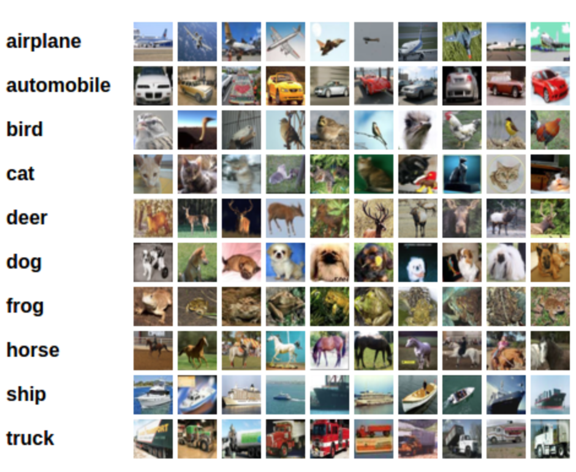

# 使用 Pytorch 构建分类器

[toc]

## 分类器任务和数据介绍

在这里，我们将构造一个把不同图像进行分类的神经网络分类器，对输入的图片进行判别并完成分类。本案例采用 CIFAR10 数据集作为原始图片数据。

CIFAR10 数据集中每张图片的尺寸是 3 * 32 * 32，也就是每张图片都是彩色 3 通道，纵横像素都是 32。CIFAR10 数据集总共有 10 种不同的分类，分别是：airplane、automobile、bird、cat、deer、dog、frog、horse、ship、truck。

CIFAR10 数据集的样例如下图所示：



## 训练分类器的步骤

通常，训练分类器总共可以分如下几个步骤：

1. 使用 torchvision 下载 CIFAR10 数据集
2. 定义卷积神经网络
3. 定义损失函数
4. 在训练集上训练模型
5. 在测试集上测试模型

接下来，我们逐步完成分类器的编写。

## 使用 torchvision 下载 CIFAR10 数据集

首先，导入 torchvision 包来辅助下载数据集：

```python
import torch
import torchvision
from torchvision import transforms
```

下载数据集并对图片进行调整，因为 torchvision 数据集的输出是 PILImage 格式，数据域在 `[0, 1]`。我们需要将其转换为标准数据域 `[-1, 1]` 的张量格式：

```python
transfom = transforms.Compose(
    [transforms.ToTensor(),
     transforms.Normalize((0.5, 0.5, 0.5), (0.5, 0.5, 0.5))])

# 构造训练集
trainset = torchvision.datasets.CIFAR10(root='./data', train=True,
                                        download=True, transform=transform)
trainloader = torch.utils.data.DataLoader(trainset, batch_size=4,
                                          shuffle=True, num_workers=2)

# 构造测试集
testset = torchvision.datasets.CIFAR10(root='./data', train=False,
                                       download=True, transform=transfom)
testloader = torch.utils.data.DataLoader(testset, batch_size=4,
                                         shuffle=False, num_workers=2)

# CIFAR10 数据的十种分类
classes = ('plane', 'car', 'bird', 'cat', 'deer',
           'dog', 'frog', 'horse', 'ship', 'truck')
```

输出结果类似这种，大约就是下载一些数据之类的，等等就好：

```bash
Downloading https://www.cs.toronto.edu/~kriz/cifar-10-python.tar.gz to ./data\cifar-10-python.tar.gz
Extracting ./data\cifar-10-python.tar.gz to ./data
Files already downloaded and verified
```

如果你是在 Windows 系统下运行上述代码，并且出现报错信息 BrokenPipeError，可以尝试将 `torch.utils.data.DataLoader()` 中的 num_workers 设置为 0。

展示若干训练集的图片：

```python
# 导入画图包和 numpy
import numpy as np
from matplotlib import pyplot as plt

# 构建展示图片的函数
def imshow(img):
    img = img / 2 + 0.5
    npimg = img.numpy()
    plt.imshow(np.transpose(npimg, (1, 2, 0)))
    plt.show()


# 从数据迭代器中读取一张图片
dataiter = iter(trainloader)
images, labels = dataiter.next()

# 展示图片
imshow(torchvision.utils.make_grid(images))

# 打印标签 label
print(' '.join('%5s' % classes[labels[j]] for j in range(4)))
```

输出图片结果：


输出标签结果：

```
plane plane  deer horse
```

## 定义卷积神经网络

仿照 [使用 Pytorch 构建神经网络](pytorch-nn.md) 中的类来构造此处的类，唯一的区别是此处采用 3 通道 3-channel：

```python
from torch import nn
from torch.nn import functional as F


class Net(nn.Module):
    def __init__(self):
        super(Net, self).__init__()
        self.conv1 = nn.Conv2d(3, 6, 5)
        self.pool = nn.MaxPool2d(2, 2)
        self.conv2 = nn.Conv2d(6, 16, 5)
        self.fc1 = nn.Linear(16 * 5 * 5, 120)
        self.fc2 = nn.Linear(120, 84)
        self.fc3 = nn.Linear(84, 10)

    def forward(self, x):
        x = self.pool(F.relu(self.conv1(x)))
        x = self.pool(F.relu(self.conv2(x)))
        x = x.view(-1, 16 * 5 * 5)
        x = F.relu(self.fc1(x))
        x = F.relu(self.fc2(x))
        x = self.fc3(x)
        return x


net = Net()
```

## 定义损失函数

采用交叉熵损失函数和随机梯度下降优化器：

```python
from torch import optim

criterion = nn.CrossEntropyLoss()
optimizer = optim.SGD(net.parameters(), lr=0.001, momentum=0.9)
```

## 在训练集上训练模型

采用基于梯度下降的优化算法，需要多个轮次的迭代训练方可达到最优点（此处以 2 次为例）：

```python
for epoch in range(2):    # 数据集迭代轮次

    running_loss = 0.0
    for i, data in enumerate(trainloader, 0):
        # data 中包含输入图像张量 inputs，标签张量 labels
        inputs, labels = data

        # 首先将优化器梯度归零
        optimizer.zero_grad()

        # 输入图像张量进网络，得到输出张量 outputs
        outputs = net(inputs)

        # 利用网络的输出 outputs 和标签 labels 计算损失值
        loss = criterion(outputs, labels)

        # 反向传播 + 参数更新，是标准代码的标准流程
        loss.backward()
        optimizer.step()

        # 打印轮次和损失值
        running_loss += loss.item()
        if (i + 1) % 2000 == 0:
            print('[%d, %5d] loss: %.3f' %
                  (epoch + 1, i + 1, running_loss / 2000))
            running_loss = 0.0

print('Finished Training')
```

输出结果：

```
[1,  2000] loss: 2.140
[1,  4000] loss: 1.820
[1,  6000] loss: 1.691
[1,  8000] loss: 1.589
[1, 10000] loss: 1.503
[1, 12000] loss: 1.458
[2,  2000] loss: 1.403
[2,  4000] loss: 1.375
[2,  6000] loss: 1.358
[2,  8000] loss: 1.331
[2, 10000] loss: 1.330
[2, 12000] loss: 1.290
Finished Training
```

保存模型：

```python
# 首先设定模型的保存路径
PATH = './cifar_net.pth'
# 保存模型的状态字典
torch.save(net.state_dict(), PATH)
```

## 在测试集上测试模型

第一步，展示测试集中的若干图片：

```python
dataiter = iter(testloader)
images, labels = dataiter.next()

# 打印原始图片
imshow(torchvision.utils.make_grid(images))
# 打印真实的标签
print('真实值：', ' '.join('%5s' % classes[labels[j]] for j in range(4)))
```

输出图片结果：


输出标签结果:

```
真实值：   cat  ship  ship plane
```

第二步，加载模型并对测试图片进行预测：

```python
# 首先实例化模型的类对象
net = Net()
# 加载训练阶段保存好的模型的状态字典
net.load_state_dict(torch.load(PATH))

# 利用模型对图片进行预测
outputs = net(images)

# 共有 10 个类别, 采用模型计算出的概率最大的作为预测的类别
_, predicted = torch.max(outputs, 1)

# 打印预测标签的结果
print('预测值：', ' '.join('%5s' % classes[predicted[j]] for j in range(4)))
```

输出结果：

```
预测值：   cat truck   car  ship
```

接下来看一下在全部测试集上的表现：

```python 
correct = 0
total = 0
net = Net()
net.load_state_dict(torch.load(PATH))
with torch.no_grad():
    for data in testloader:
        images, labels = data
        outputs = net(images)
        _, predicted = torch.max(outputs.data, 1)
        total += labels.size(0)
        correct += (predicted == labels).sum().item()
        
print('10000 个测试数据的准确率为：%d%%' % (correct / total * 100))
```

输出结果：

```
10000 个测试数据的准确率为：54%
```

结果分析：对于拥有 10 个类别的数据集，随机猜测的准确率是 10%，我们的模型预测准确率达到了 53%，说明模型学到了真实的东西。

为了更加细致的看一下模型在哪些类别上表现更好，在哪些类别上表现更差，我们还可以分类别地进行准确率计算：

```python
class_correct = list(0. for i in range(10))
class_total = list(0. for i in range(10))
net = Net()
net.load_state_dict(torch.load(PATH))
with torch.no_grad():
    for data in testloader:
        images, labels = data
        outputs = net(images)
        _, predicted = torch.max(outputs, 1)
        c = (predicted == labels).squeeze()
        for i in range(len(labels)):
            label = labels[i]
            class_correct[label] += c[i].item()
            class_total[label] += 1


for i in range(10):
    print('%5s 的准确率为：%2d%%' % (
        classes[i], class_correct[i] / class_total[i] * 100 if class_total[i] else 0))
```

输出结果：

```
plane 的准确率为：43%
  car 的准确率为：68%
 bird 的准确率为：42%
  cat 的准确率为：30%
 deer 的准确率为：32%
  dog 的准确率为：58%
 frog 的准确率为：63%
horse 的准确率为：69%
 ship 的准确率为：67%
truck 的准确率为：68%
```

## 在 GPU 上训练模型

为了真正利用 Pytorch 中 Tensor 的优秀属性，加速模型的训练速度，我们可以将训练过程转移到 GPU 上进行。

首先要定义设备，如果 CUDA 是可用的则被定义成 GPU，否则被定义成 CPU：

```python
device = torch.device('cuda:0' if torch.cuda.is_available() else 'cpu')
print(device)
```

输出结果：

```bash
cuda:0
```

当训练模型的时候，只需要将模型转移到 GPU 上，同时将输入的图片和标签页转移到 GPU 上即可：

```python
# 将模型转移到 GPU 上
net.to(device)

# 将输入的图片张量和标签张量转移到 GPU 上
inputs, labels = data[0].to(device), data[1].to(device)
```

训练模型完整代码：

```python
net = Net()
net.to(device)

creterion = nn.CrossEntropyLoss()
optimizer = optim.SGD(net.parameters(), lr=0.001, momentum=0.9)

for epoch in range(2):
    
    running_loss = 0.0
    for i, data in enumerate(trainloader, 0):
        images, labels = data[0].to(device), data[1].to(device)
        
        optimizer.zero_grad()
        
        outputs = net(images)
        
        loss = criterion(outputs, labels)
        
        loss.backward()
        
        optimizer.step()
        
        running_loss += loss.item()
        if (i + 1) % 2000 == 0:
            print('[%d, %5d] loss: %.3f' % (epoch + 1, i + 1, running_loss / 2000))
            running_loss = 0.0
            

print('Finished Training')
```