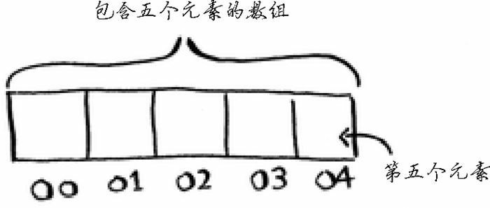
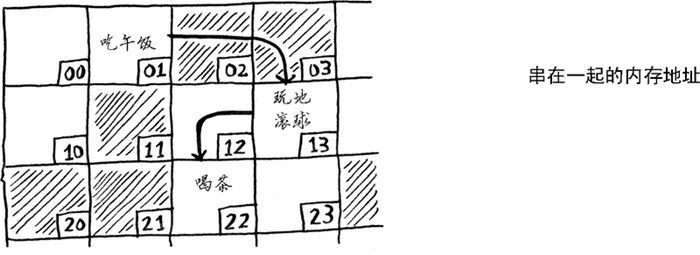

## 数组和链表

- 数组

  - 在内存中连续存储

  - 同一个数组中，所有元素类型必须相同（都为 int、double 等）

  - 使用不灵活，若在中间插入数据，需要先把该位置以后的元素全部后移，删除数据同理

  - 若当前位置剩余的空间不能容纳插入后的列表，整个列表需要重新在内存中找一块空间，整体转移

  - 可以通过预留空间的方式减缓上述问题，但不可避免，且预留空间会造成空间占用过多的问题

  - 查找元素效率高，直到起始位置和元素索引，通过简单计算即可确定所需数据的内存地址

    

    

- 链表

  - 在内存中不必连续，前一个元素会记录下一个元素的内存地址

    

  - 使用灵活，随意增删数据。增加数据只需让前一个数据记录这个数据内存地址，然后这个数据记录到下一个数据的内存地址即可。删除数据只需让前一个数据记录的内存地址改为下一个数据的内存地址即可

  - 不会因预留空间而浪费内存

  - 查找元素效率低，需要从第一个开始，逐次查找

常见的数组和链表操作的运行时间如下：

| 操作 |  数组  |  链表  |
| :--: | :----: | :----: |
| 读取 | $O(1)$ | $O(n)$ |
| 插入 | $O(n)$ | $O(1)$ |
| 删除 | $O(n)$ | $O(1)$ |

其中，$O(1)$ 为常量时间，$O(n)$ 为线性时间。

需要指出的是，仅当能够立即访问要删除的元素时，删除操作的运行时间才为 $O(1)$。通常我们都记录了链表的第一个元素和最后一个元素，因此删除这些元素时运行时间为 $O(1)$。

数组和链表哪个用得更多呢？显然要看情况。但数组用得很多，因为它支持随机访问。有两种访问方式：随机访问和顺序访问。顺序访问意味着从第一个元素开始逐个地读取元素。链表只能顺序访问：要读取链表的第十个元素，得先读取前九个元素，并沿链接找到第十个元素。随机访问意味着可直接跳到第十个元素。本书经常说数组的读取速度更快，这是因为它们支持随机访问。很多情况都要求能够随机访问，因此数组用得很多。数组和链表还被用来实现其他数据结构，这将在本书后面介绍。