## 广度优先搜索

广度优先搜索让我们能够找出两样东西之间的最短距离。不过最短距离的含义有很多，使用广度优先搜索可以：

- 编写国际跳棋 AI，计算最少走多少步就可获胜
- 编写拼写检査器，计算最少编辑多少个地方就可将错拼的单词改成正确的单词，如将 READED 改为 READER 只编辑一个字母改如何操作
- 根据你的人际关系网络找到关系最近的医生。

### 图简介

假设你居住在旧金山，要从双子峰前往金门大桥。你想乘公交车前往，并希望换乘最少。可乘坐的公交车如下：

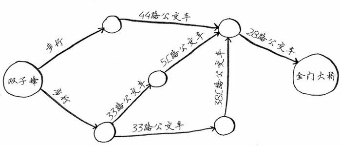

显然，我们至少需要三步才能从双子峰走到金门大桥：

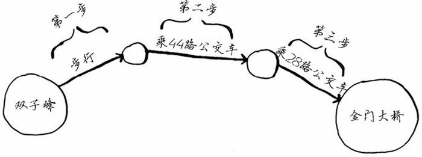

当然还有其他前往金门大桥的路线，但它们更远（需要四步）。这种问题被称为最短路径问题（shortest-path problem）。

我们经常要找出最短路径，这可能是前往朋友家的最短路径，也可能是国际象棋中把对方将死的最少步数。解决最短路径问题的算法被称为广度优先搜索。

要确定如何从双子峰前往金门大桥，需要两个步骤：

1. 使用图来建立问题模型。
2. 使用广度优先搜索解决问题。

图模拟一组连接。例如，假设你与朋友玩牌，并要模拟谁欠谁钱，可像下面这样指出 Alex 欠 Rama 钱：


完整的欠钱关系图可能是这样的：

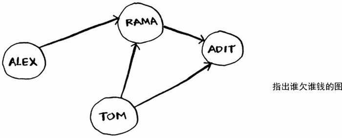

Alex欠 Rama 钱，Tom 欠 Adit 钱，等等。图由节点（node）和边（edge）组成：

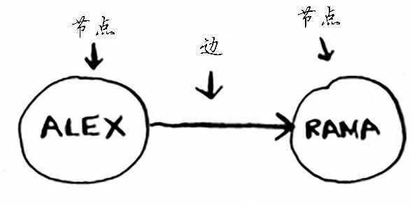

一个节点可能与众多节点直接相连，这些节点被称为邻居。在前面的欠钱图中，Rama 是 Alex 的邻居。Adit 不是 Alex 的邻居，因为他们不直接相连。但 Adit 既是 Rama 的邻居，又是 Tom 的邻居。

图用于模拟不同的东西是如何相连的。

### 广度优先搜索

广度优先搜索是一种用于图的查找算法，可帮助回答两类问题：

1. 从节点 A 出发，有前往节点 B 的路径吗？
2. 从节点 A 出发，前往节点 B 的哪条路径最短？

前面计算从双子峰前往金门大桥的最短路径的问题，就属于第二类问题：哪条路径最短？

假设你经营着一个芒果农场，需要寻找芒果销售商，以便将芒果卖给他。在 Facebook，你与芒果销售商有联系吗？为此，你可以在朋友中查找。

首先，创建一个朋友的清单，然后依次检查每个朋友，看他是否是芒果经销商。如果是，则大功告成，否则查看下一个朋友。

如果你的朋友没有任何一个人是芒果经销商，你就需要在朋友的朋友中寻找：

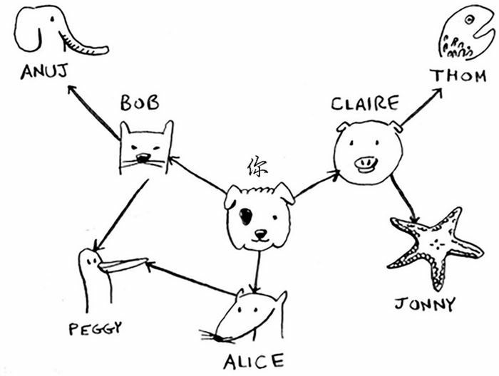

这次，你还是从自己的朋友开始找起。不同的是，如果你的朋友不是经销商，你就把朋友的人际关系，也就是朋友的所有朋友也加入到查找清单中。

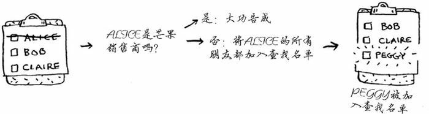

这样一来，你不仅在朋友中查找，还在朋友的朋友中查找。别忘了，你的目标是在人际关系网中找到一位芒果销售商。因此，如果 Alice 不是芒果销售商，就将其朋友也加入到名单中。这意味着你将在她的朋友、朋友的朋友等中査找。使用这种算法将搜遍你的整个人际关系网，直到找到芒果销售商。这就是广度优先搜索算法

### 查找最短路径

再说一次，广度优先搜索可回答两类问题：

1. 从节点 A 出发，有前往节点 B 的路径吗？（在你的人际关系网中，有芒果销售商吗？）

2. 从节点A出发，前往节点B的哪条路径最短？（哪个芒果销售商与你的关系最近？）

刚刚我们讨论了如何回答第一类问题，下面来尝试回答第二类问题——谁是关系最近的芒果销售商。例如，朋友是一度关系，朋友的朋友是二度关系

显而易见，一度关系胜过二度关系，二度关系胜过三度关系，以此类推。因此，你应先在一度关系中搜索，确定其中没有芒果销售商后，才在二度关系中搜索。

广度优先搜索就是这样做的！在广度优先搜索的执行过程中，搜索范围从起点开始逐渐向外延伸。即先检查一度关系，再检查二度关系。

Claire 是一度关系，而 Anuj 是二度关系，因此将先检查 Claire，后检查 Anuj。你也可以这样看，一度关系在二度关系之前加入查找名单。你按顺序依次检査名单中的每个人，看看他是否是芒果销售商。这将先在一度关系中查找，再在二度关系中查找，因此找到的是关系最近的芒果销售商。广度优先搜索不仅査找从 A 到 B 的路径，而且找到的是最短的路径。


注意，只有按添加顺序査找时，才能实现这样的目的。换句话说，如果 Claire 先于 Anuj 加入名单，就需要先检查 Claire，再检查 Anuj。如果 Claire 和 Anuj 都是芒果销售商，而你先检查 Anuj 再检查 Claire，结果将如何呢？找到的芒果销售商并非是与你关系最近的，因为 Anuj 是你朋友的朋友，而 Claire是你的朋友。因此，你需要按添加顺序进检查。

这种先添加先检查的数据结构，就是队列。

### 队列

队列类似于栈，你不能随机地访问队列中的元素。队列只支持两种操作：入队和出队。

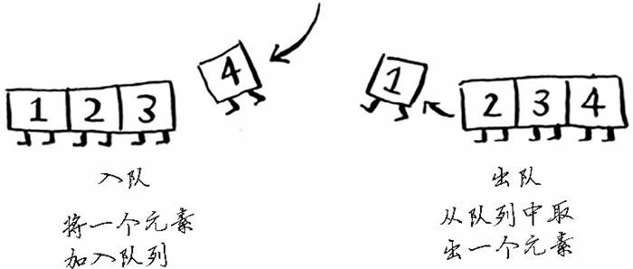

如果你将两个元素加入队列，先加入的元素将在后加入的元素之前出队。因此，你可使用队列来表示査找名单，这样，先加入的人将先出队并先被检查。

队列是一种先进先出（First in first out，FIFO）的数据结构，而栈是种后进先出（Last in first out，LIFO）的数据结构。


### Python 代码实现图

接下来，我们要用 Python 代码实现图。

图由多个节点组成。节点之间有相互关联的关系。我们可以通过散列表来表示这种关系。

我们要将我们和朋友建立起一种映射关系。


这种映射关系可以用散列表表示：

```python
graph = {}
graph['you'] = ['alice', 'bob', 'claire']
```

图不过是一系列的节点和边，因此在 Python 中，只需使用上述代码就可表示一个图。

对于像下面这种比较复杂的图，我们同样可以采用上面的思路，只不过需要多写几个中间节点而已。

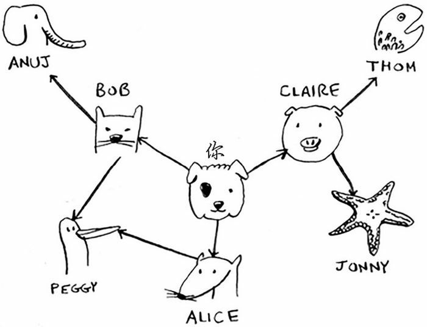

用 Python 代码表示这个图中的关系就是：

```python
graph = {}
graph['you'] = ['alice', 'bob', 'claire']
graph['bob'] = ['anuj', 'peggy']
graph['alice'] = ['peggy']
graph['claire'] = ['thom', 'jonny']
graph['anuj'] = []
graph['peggy'] = []
graph['thom'] = []
graph['jonny'] = []
```

Anuj、 Peggy、Thom 和 Jonny 都没有邻居，这是因为虽然有指向他们的箭头，但没有从他们出发指向其他人的箭头。这被称为有向图（directed graph），其中的关系是单向的。因此，Anuj 是 Bob 的邻居，但 Bob 不是 Anuj 的邻居。无向图（undirected graph）没有箭头，直接相连的节点互为邻居。例如，下面两个图是等价的。


### 实现算法

算法的工作原理为：

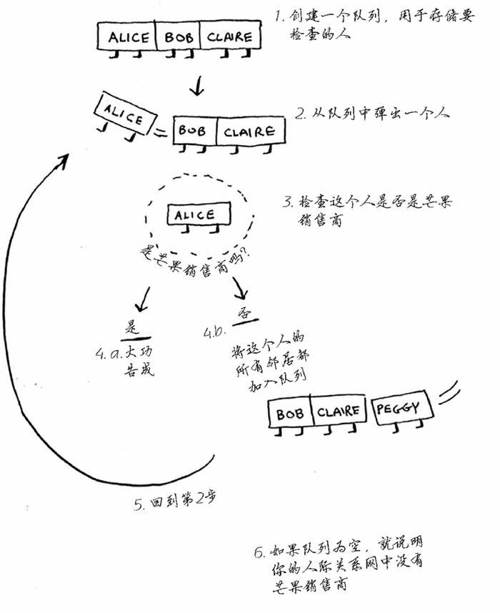

 首先，创建一个队列。在 Python 中，可使用函数 deque 来创建一个双端队列：

```python
from collections import deque
search_queue = deque()    # 创建一个队列
search_queue += graph['you']    # 将你的邻居加入到队列中
```

下面是查看朋友圈中是否有芒果经销商的完整函数代码：

```python
def search(graph):
    search_queue = deque()  # 创建一个队列
    search_queue += graph['you']  # 将你的邻居加入到队列中
    while search_queue:    # 只要队列不为空
        person = search_queue.popleft()    # 就取出队列中的第一个人
        if person_is_seller(person):    # 检查这个人是否是芒果经销商
            print(person, 'is a seller!')    # 是芒果经销商
            return True
        else:
            search_queue += graph[person]    # 不是芒果经销商，把这个人的朋友圈都加入到队列中
    return False    # 如果到达这里，就说明队列中没有芒果经销商
```

我们可以定义一个判断一个人是否是芒果经销商的函数：

```python
def person_is_seller(name):
    return name[-1] == 'm'
```

通过一个人名字是否是以 m 结尾来判断他是不是芒果经销商，这在现实中很荒谬，但是给我们做例子已经足够了。

下面是广度优先搜索的执行过程：

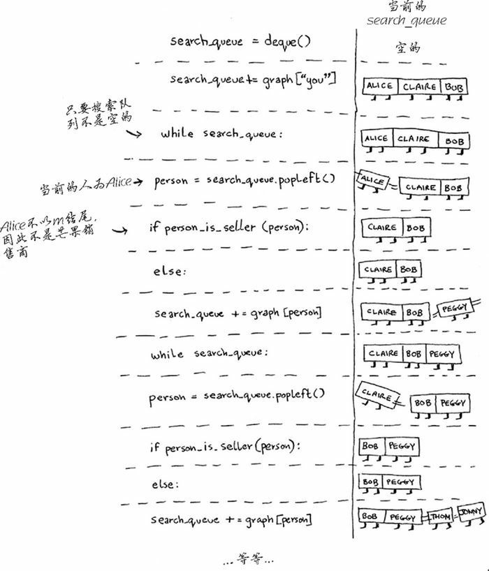

这个算法将不断执行，直到满足以下条件之一：

- 找到一位芒果销售商；
- 队列变成空的，这意味着你的人际关系网中没有芒果销售商。

我们前面的代码并不完善，比如 Peggy 既是 Alie 的朋友又是 Bob 的朋友，因此她将被加入队列两次：一次是在添加 Alice 的朋友时，另一次是在添加 Bob 的朋友时。因此，搜索队列将包含两个 Peggy。

在这个问题中不会出现差错，但是对于有循环关系网的时候，我们有可能会陷入无限循环中。

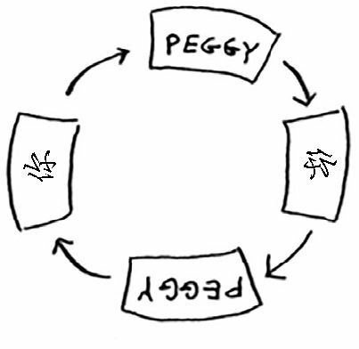

为了避免这种情况发生，我们需要限制，已经处检查的人将不会被重复检查。

这时，我们可以创建一个列表，专门存放已经检查过的人。如果下一个要检查的人出现在这个列表中，我们可以直接跳过，不去检查。

考虑到这一点，广度优先搜索算法的最终版本为：

```python
from collections import deque


graph = {}
graph['you'] = ['alice', 'bob', 'claire']
graph['bob'] = ['anuj', 'peggy']
graph['alice'] = ['peggy']
graph['claire'] = ['thom', 'jonny']
graph['anuj'] = []
graph['peggy'] = []
graph['thom'] = []
graph['jonny'] = []

def person_is_seller(name):
    return name[-1] == 'm'

def search(graph, name='you'):
    search_queue = deque()  # 创建一个队列
    search_queue += graph[name]  # 将你的邻居加入到队列中
    searched = []    # 这个数组用于存放已经检查过的人
    while search_queue:    # 只要队列不为空
        person = search_queue.popleft()    # 就取出队列中的第一个人
        if person not in searched:    # 仅当这个人没有被检查的时候，才会被检查
            if person_is_seller(person):    # 检查这个人是否是芒果经销商
                print(person, 'is a seller!')    # 是芒果经销商
                return True
            else:
                search_queue += graph[person]    # 不是芒果经销商，把这个人的朋友圈都加入到队列中
                searched.append(person)    # 将这个人标记为已经检查过
    return False    # 如果到达这里，就说明队列中没有芒果经销商

search(graph, 'you')
```

### 运行时间

如果你在你的整个人际关系网中搜索芒果销售商，就意味着你将沿每条边前行（记住，边是从一个人到另一个人的箭头或连接），因此运行时间至少为 $O(边数)$。你还使用了一个队列，其中包含要检查的每个人。将一个人添加到队列需要的时间是固定的，即为 $O(1)$，因此对每个人都这样做需要的总时间为 $O(人数)$。所以，广度优先搜索的运行时间为 $O(人数+边数)$，这通常写作 $O(V+E)$，其中 V 为顶点（vertice）数，E 为边数。