## 大 O 表示法

### 大 O 表示法的概念

大 O 表示法指出了算法有多快。例如，假设列表包含 n 个元素。简单査找需要检查每个元素，因此需要执行 n 次操作。使用大 O 表示法，这个运行时间为 `O(n)`。单位秒呢？没有——大 O 表示法指的并非以秒为单位的速度。大 O 表示法让你能够比较操作数，它指出了算法运行时间的**增速**。

同样地，为检查长度为 n 的列表，二分查找需要执行 $log_2(n)$ 次操作。使用大 O 表示法，这个运行时间可以用 $O(log\space n)$表示一般而言大 O 表示法像下面这样。之所以称为大 O 表示法，是因为操作数前有个大 O。

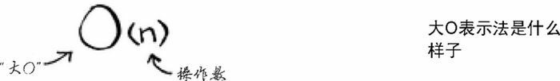

大 O 表示法表示的是最糟情况下的运行时间。当然，除了最糟情况，有时也会考虑平均情况。

一些常见的大 O 运行时间如下：

- $O(log\space n)$ ，也叫对数时间，这样的算法比如 [二分查找](grokking-algorithms-binary-search.md) 
- $O(n)$，也叫线性时间，比如简单查找
- $O(n * log\space n)$ ，比如快速排序——一种速度较快的排序算法
- $O(n^2)$，比如选择排序——一种速度较慢的排序算法
- $O(n!)$，比如旅行商问题的解决方案——一种非常慢的算法
- $O(1)$，常量时间，不意味着马上，而是意味着无论数据量多大，所需时间都是相同的

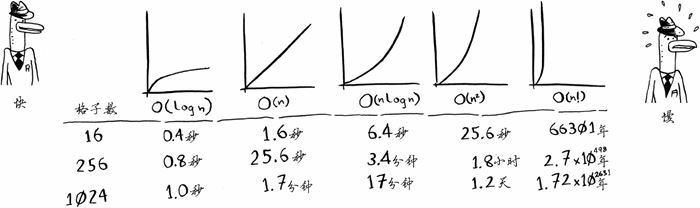

上述图表中的时间是基于每秒执行10 次操作计算得到的。这些数据并不准确，这里提供它们只是想让你对这些运行时间的差别有大致认识。实际上，计算机每秒执行的操作远不止10次。

还有其他的运行时间，但这五种是最常见的。

小结如下：

- 算法的速度指的并非时间，而是操作数的增速。
- 谈论算法的速度时，我们说的是随着输入的增加，其运行时间将以什么样的速度增加。
- 算法的运行时间用大 O 表示法表示。
- $O(log \space n)$ 比 $O(n)$ 快，当需要搜索的元素越多时，前者比后者快得越多。

### 排序算法的运行时间

选择排序的运行时间为 $O(n^2)$，速度非常慢。合并排序（merge sort）的排序算法运行时间为 $O(n \space log \space n)$，比选择排序快得多！快速排序的情况比较棘手，在最糟情况下，其运行时间为 $O(n^2)$ 与选择排序一样慢！但这是最糟情况。在平均情况下，快速排序的运行时间为 $O(n \space log \space n)$。

你可能会有如下疑问：这里说的最糟情况和平均情况是什么意思呢？若快速排序在平均情况下的运行时间为 $O(n \space log \space n)$，而合并排序的运行时间总是  $O(n \space log \space n)$，为何不使用合并排序？它不是更快吗？

来看下面两个打印列表中元素的简单函数：

```python
def print_items(arr: list):
    for i in arr:
        print(i)


print_items([2, 4, 6, 8, 10])
```

这个函数遍历列表中的每个元素并将其打印出来。它迭代整个列表一次，因此运行时间为 $O(n)$。现在我们对这个函数进行修改，使其在打印每个元素前都休眠 1 秒钟：

```python
import time


def print_items2(arr: list):
    for i in arr:
        time.sleep(1)
        print(i)


print_items2([2, 4, 6, 8, 10])
```

这个函数每次打印元素前都要休眠 1 秒。

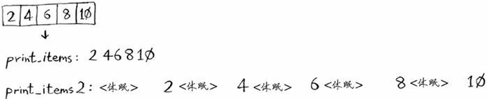

这两个函数的时间都是 $O(n)$，但是很明显，第一个函数运行速度要快很多。这是因为，事实上，我们使用大 O 表示法表示时间时，n 的含义是有一个常数系数的。

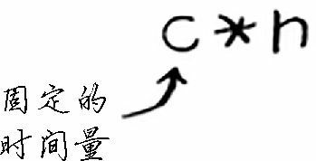

C 是算法所需的固定时间量，被称为常量。例如，print_items 所需的时间可能是 10 毫秒 \* n，而 print_items2 所需的时间为 1 秒 \* n。

通常不考虑这个常量，是因为对于时间复杂度不同的算法而言，当数据量很大时，这个常熟造成的影响微乎其微。

比如假设时间复杂度为 $O(n)$ 的简单查找的时间常数为 10 毫秒，时间复杂度为 $O(log \space n)$ 的二分查找时间常数为 1 秒。

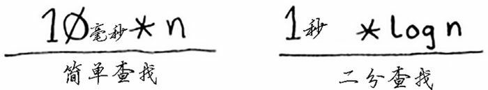

那么如果在含有 40 亿个数据中查找数据的话，两种方法所需时间为：

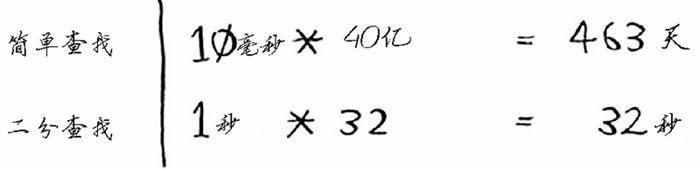

二分查找依然快很多，即便他的常量是简单查找的 100 倍。

但有时候，常量的影响可能很大，对快速査找和合并査找来说就是如此。快速査找的常量比合并查找小，因此即便它们的运行时间都为 $O(n \space log \space n)$，快速査找的速度仍有可能会更快。实际上，快速査找的速度确实更快——因为相对于遇上最糟情况，它遇上平均情况的可能性要大得多。

### 平均情况和最糟情况

快速排序的性能髙度依赖于你选择的基准值。假设你总是将第一个元素用作基准值，且要处理的数组是有序的。由于快速排序算法不检查输入数组是否有序，因此它依然尝试对其进行排序。

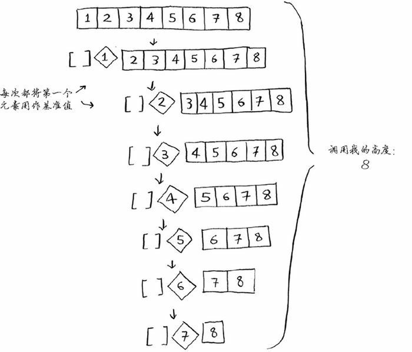

注意，数组并没有被分成两半，相反，其中一个子数组始终为空，这导致调用栈非常长。

现在假设你总是将中间的元素用作基准值，在这种情况下，调用栈如下。

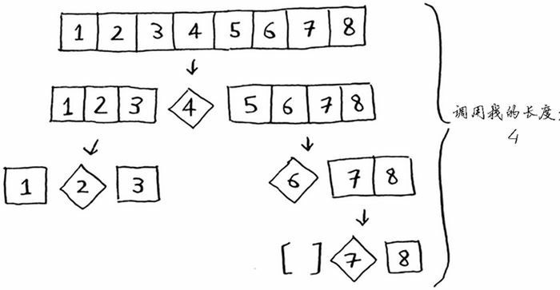

调用栈短得多！因为每次都将数组分成两半，所以不需要那么多递归调用。你很快就到达了基线条件，因此调用栈短得多。
第一个示例展示的是最糟情况，而第二个示例展示的是最佳情况。在最糟情况下，栈长为 $O(n)$，而在最佳情况下，栈长为 $O(n \space log \space n)$。
现在来看看栈的第一层。你将一个元素用作基准值，并将其他的元素划分到两个子数组中。这涉及数组中的全部 8 个元素，因此该操作的时间为 $O(n)$。在调用栈的第一层，涉及全部 8 个元素，但实际上，在调用栈的每层都涉及 $O(n)$ 个元素。

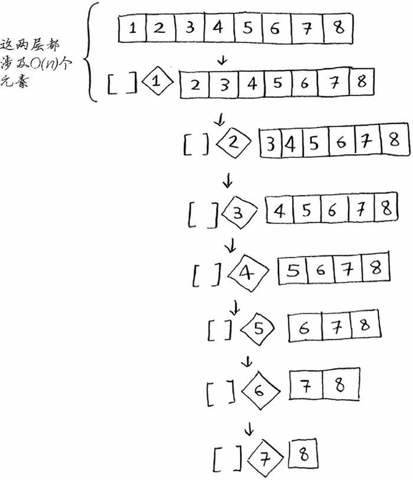

对于最佳情况，每次也是涉及 $O(n)$ 个元素。

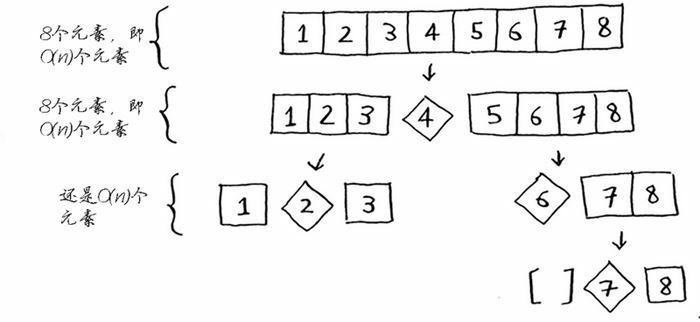

因此，完成每层的任务，所需要的时间都为 $O(n)$。

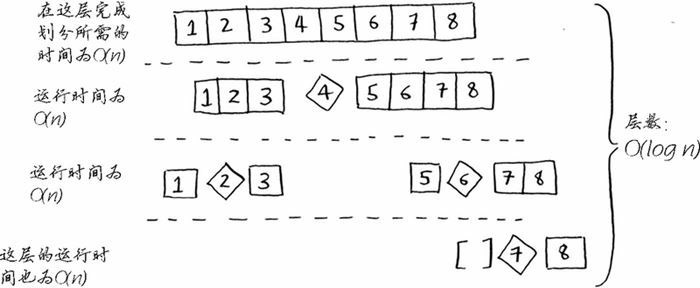

对于最理想情况，总层数为 $O(log \space n)$（用技术术语来讲，就是调用栈的高度为 $O(log \space n)$）。又因为每一层需要的时间为 $O(n)$，所以整个算法所需要的总时间为 $O(n) \space * \space O(log \space n)=O(n \space log \space n)$。

对于最早情况，有 $O(n)$ 层，于是算法的运行时间为 $O(n) \space * \space O(n)$。

知道吗？这里要告诉你的是，最佳情况也是平均情况。只要你每次都随机地选择一个数组元素作为基准值，快速排序的平均运行时间就将为 $O(n \space log \space n)$。快速排序是最快的排序算法之一，也是 D&C 的典范。

小结：

1. 实现快速排序时，请随机地选择用作基准值的元素。快速排序的平均运行时间为 $O(n \space log \space n)$
2. 大 O 表示法中的常量有时候事关重大，这就是快速排序比合并排序快的原因所在
3. 比较简单査找和二分查找时，常量几乎无关紧要。因为列表很长时， $O(log \space n)$ 的速度比 $O(n)$ 快得多

