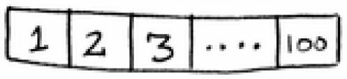
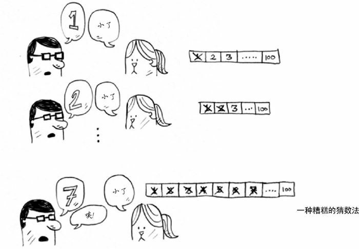
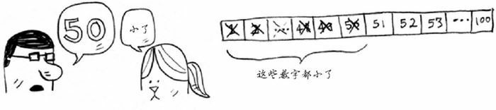
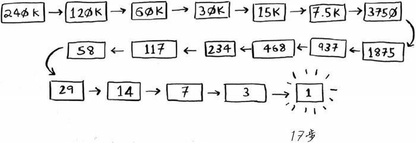

## 二分查找

二分査找是一种算法，其输入是一个有序的元素列表（必须有序的原因稍后解释）。如果要査找的元素包含在列表中，二分査找返回其位置，否则返回 null。

通过实例了解二分查找：

有一个数字，处在 1 - 100 之间。如何通过最少的次数猜到这个数字？当每次猜测后，会告诉你猜测的值是大了，小了，还是刚好猜中。



我们当然可以从 1 开始，逐个猜测，但显然，这是相当耗时的。这种方法被称为简单查找，或者更准确来讲，是傻找。如果这个数字是 100，需要猜 100 次才能找到！



更好的方式是从给定范围的中间位置开始猜。上面这里个例子就是 100/2 = 50。如果我们得知，猜的数字小了。虽然没有直接得到想要的结果，但是一次性就派出了一半的可能。这样每次排除一半，很快就能找到结果了。




不管这个数字是什么，我们总会在 7 次之内找到答案，因为每次猜测都能排除很多数字。


假设你要在字典中查找一个单词，而该字典包含 240000 个单词，你认为每种查找最多需要多少步？

使用简单查找最多要 240000 步，而使用二分查找，最多只需要 17 步。



一般而言，对于包含 n 个元素的列表，用二分査找最多需要 $log_2(n) + 1$ 向下取整步，而简单查找最多需要 n 步。

用代码表示二分算法：

```python
def binary_search(ordered_list: list, item: int):
    low = 0    # low 和 high 用来记录未被检索到的列表范围
    high = len(ordered_list) - 1
    while low <= high:    # 只要范围内还有元素
        mid = (low + high) // 2   # 找到中间的元素去检查
        guess = ordered_list[mid]
        if guess == item:    # 刚好猜中，把值返回
            return mid
        elif guess > item:    # 猜的数字大了
            high = mid - 1   # 修改范围，因为 mid 已经猜过，可以排除
        else:               # 猜的数字小了
            low = mid + 1
    return None        # 若没有找到元素，返回 None

test_list = [1, 3, 5, 7, 9]

print(binary_search(test_list, 3))    # 1 --- 返回的是 3 的索引
print(binary_search(test_list, -1))   # None --- 没有找到
```

