## 分而治之

分而治之，divide and conquer，D&C，一种著名的递归式解决问题的方法。这不是一个解决特定问题的算法，而是一种解决问题的思路。面对问题时，不再束手无策，而是会自问：“使用分而治之能解决吗？”

D&C 算法是递归的，使用 D&C 解决问题的过程包括两个步骤：

1. 找出基线条件，这个条件要尽可能简单
2. 不断将问题分解（或者说缩小规模），直到符合基线条件

举个例子，假如你是农场主，你有一块土地，尺寸如下。

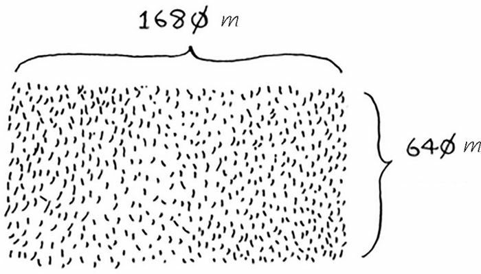

你要将这块地均匀地分成方块，且分出的方块要尽可能大。显然，下面的分法都不符合要求。

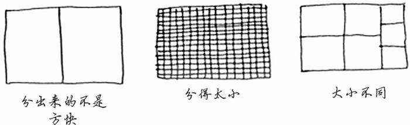

首先，找出基线条件。最容易处理的情况是：一条边的长度是另一条边的整数倍。

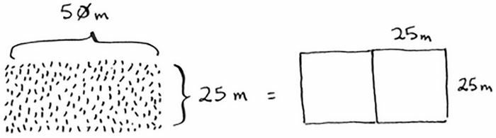

然后，缩小问题的规模。按照规定，合适的小正方形的边长是长方形短边的约数。那么我们其实就可以从原来的长方形中，切掉边长为短边长的大正方形，而对于剩余的小长方形来说，在里面找到我们所需要的小正方形大小也是一样的。

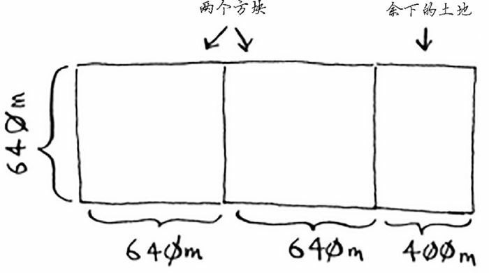

采用同样方法，继续切割，继续裁掉大正方形，得到小长方形。

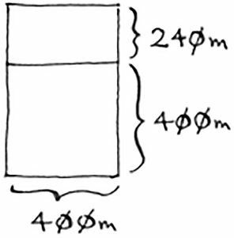

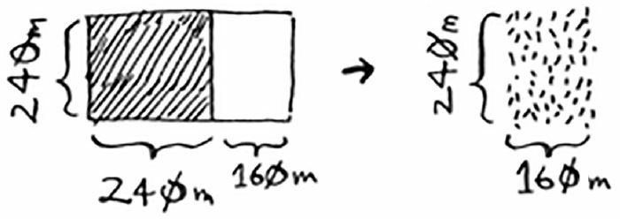

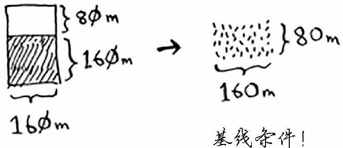

最终达到了基线条件，最终的土地就是这种满足基线条件的土地：

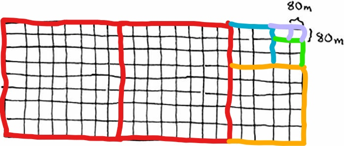

上面问题的本质，就是求长和宽的最大公约数。使用的算法，就是著名的欧几里得辗转相除法。

这里重申一下D&C 的工作原理：

1. 找出简单的基线条件
2. 确定如何缩小问题的规模，使其符合基线条件

D&C 并非可用于解决问题的算法，而是一种解决问题的思路。我们再来看一个例子给定一个数字数组，求这个数组里面所有数字的和。

用循环可以很容易地解决问题：

```python
def sum_array(arr: list):
    total = 0
    for i in arr:
        total += i
    return total


arr = [1, 2, 3, 4]
print(sum_array(arr))    # 10
```

不过这里我们要讨论的是分而治之的思想，接下来，我们看一看，如何使用递归来实现数组元素求和。

第一步：找出基线条件。最简单的数组什么样呢？如果数组不包含任何元素或只包含一个元素，计算总和将非常容易，这就是基线条件。

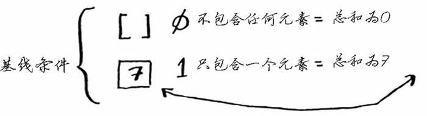

第二步，缩小问题的规模，也即是如何让每次递归调用都更接近空的数组。我们发现，下面两个运算是等效的：

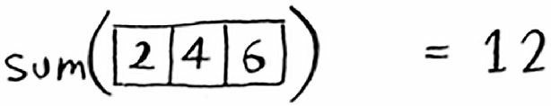

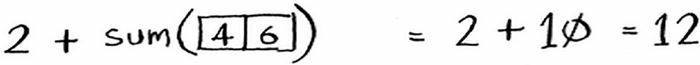

也就是，数组的总和等于第一个元素加上剩余元素的总和。看起来似乎是废话，但我们完成了关键的一步——减少了数组长度，使其更接近空数组。这也就是我们的递归条件。

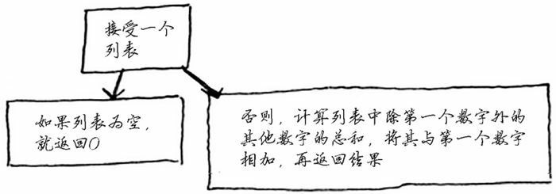

整个算法的流程可以这样表示：

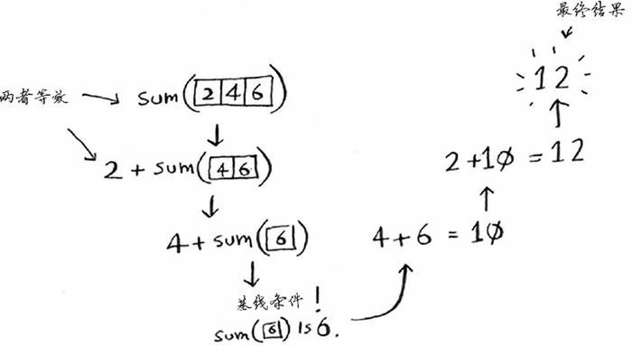

别忘了，递归记录了我们之前函数的状态，数据都储存在栈底端的函数中：

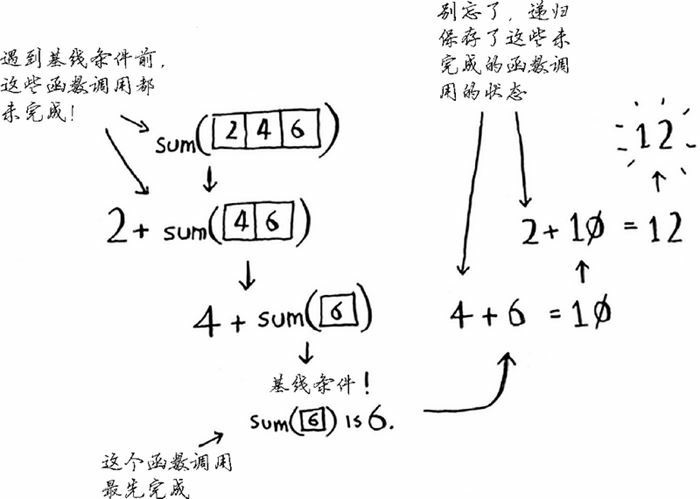

用代码实现上面的算法就是：

```python
def sum_array(arr: list) -> int:
    if len(arr) == 0:
        return 0
    elif len(arr) == 1:
        return arr.pop()
    else:
        return arr.pop() + sum_array(arr)


arr = [1, 2, 3, 4]
print(sum_array(arr))    # 10
```

练习题里面有一道，很有趣，也写出来。题目是：找出数组中最大的数字。

思路：

1. 基线条件：一个数字，返回当前元素；空数组，返回 0。

2. 递归条件：取出数组中的一个数字，将它同剩余数组中的最大值比较，谁更大，谁就是最大值。

```python
def get_max(arr: list) -> int:
    if len(arr) == 0:
        return 0
    elif len(arr) == 1:
        return arr.pop()
    else:
        num = arr.pop()
        max_num = get_max(arr)    # 这里一定要小心，因为函数里涉及列表的删除，要避免循环删除的坑
        return num if num > max_num else max_num


arr = [1, 2, 8, 9, 3, 4]
print(get_max(arr))    # 9
```

总结：D&C 将问题逐步分解。使用 D&C 处理数组时，基线条件很可能是空数组或只包含一个元素的数组。