## 狄克斯特拉算法

[TOC]

狄克斯特拉算法用来找到加权图中的最短路径。

 [广度优先搜索](grokking-algorithms-bfs.md) 可以找到段数最少的路径，但是如果我们要找到用时最少的路径，就要使用狄克斯特拉算法（Dijkstra's Algorithm）。

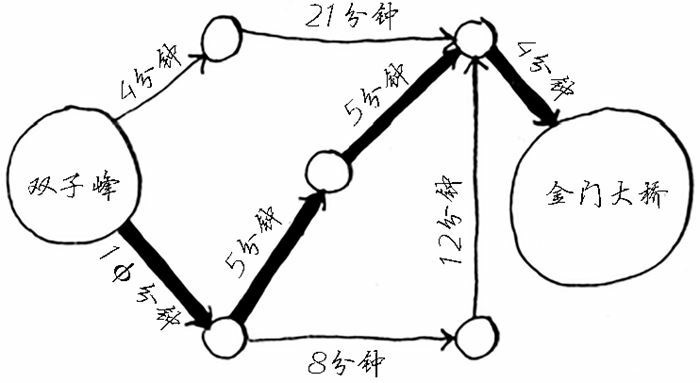

### 狄克斯特拉算法的使用思路

下面这张图中，每个数字表示的都是时间，单位分钟。为找出从起点到终点耗时最短的路径，我们需要使用狄克斯特拉算法。

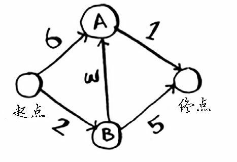

如果使用广度优先搜索，将得到下面这条段数最少的路径。

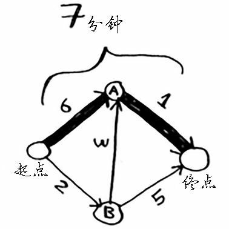

这条路径耗时 7 分钟。下面来看看能否找到耗时更短的路径。

狄克斯特拉算法包含 4 个步骤：

1. 找出“最便宜”的节点，即可在最短时间内到达的节点。
2. 更新该节点的邻居的开销，其含义将稍后介绍。
3. 重复这个过程，直到对图中的每个节点都这样做了。
4. 计算最终路径。

第一步：找出最便宜的节点。你站在起点，不知道该前往节点 A 还是前往节点 B。前往这两个节点都要多长时间呢？

前往节点 A 需要 6 分钟，而前往节点 B 需要 2 分钟。至于前往其他节点，我们暂且还不知道需要多长时间。

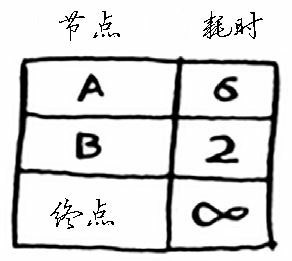

由于我们还不知道前往终点需要多长时间，因此先假设为无穷大。节点 B 是最近的——2 分钟就能达到。

第二步：计算经节点 B 前往其各个邻居所需的时间。

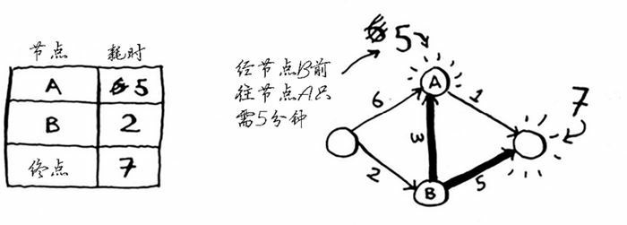

这时，我们发现了到 A 点和终点的更短时间，前往 A 点的时间从 6 分钟缩短到 5 分钟，前往重点的时间降低到 7 分钟。然后我们就把这两个新的更短的时间更新到表格中。

第三步：重复。

重复第一步，找出可在最短时间内前往的节点。我们已经对节点 B 执行了前两步，除节点 B 外，可在最短时间内前往的节点是节点 A。

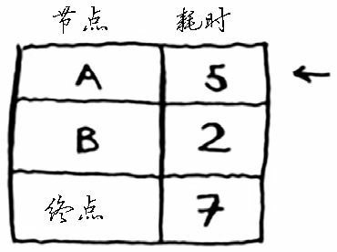

重复第二步，更新节点 A 的所有邻居的开销：

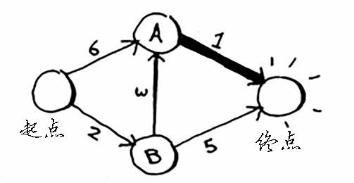

这时我们发现从节点 A 前往终点的时间只需要 6 分钟！

至此，我们对每个节点都运行了狄克斯特拉算法（无需对终点这样做）。现在，我们知道：

- 前往节点 B 需要 2 分钟；
- 前往节点 A 需要 5 分钟；
- 前往终点需要 6 分钟。

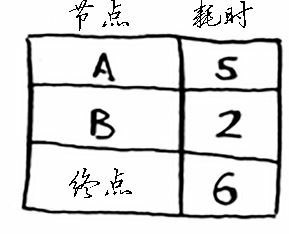

最后一步，计算得到最终路径。

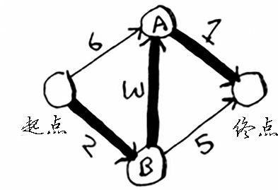

如果使用广度优先搜索，找到的最短路径将不是这条。因为这条路径包含 3 段，而有一条从起点到终点的路径只有 2 段。

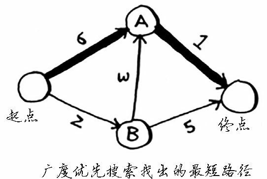

使用广度优先搜索可以査找两点之间的最短路径。这里的 `最短路径` 的意思是段数最少。在狄克斯特拉算法中，我们给每段都分配了一个数字或权重，因此狄克斯特拉算法找出的是总权重最小的路径。

#### 狄克斯特拉算法流程小结

狄克斯特拉算法包含 4 个步骤：

1. 找到最便宜的节点，即从起点开始，可在最短时间内前往的节点；
2. 对于该节点的邻居，检査是否有前往它们的更短路径，如果有，就更新其开销；
3. 重复这个过程，直到对图中的每个节点都这样做了，终点是不需要计算的；
4. 计算最终路径。

### 术语

狄克斯特拉算法用于每条边都有关联数字的图，这些数字称为权重（weight）。

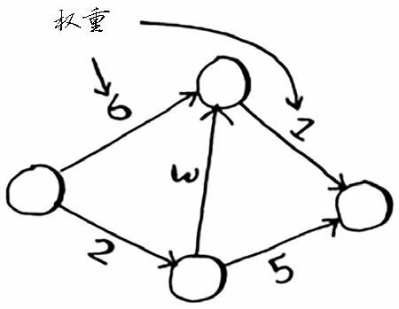

带权重的图称为加权图（weighted graph），不带权重的图称为非加权图（unweighted graph）。

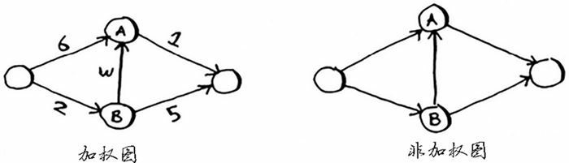

要计算非加权图中的最短路径，可使用广度优先搜索。要计算加权图中的最短路径，可使用狄克斯特拉算法。

图还可能有环，环类似下面这样：

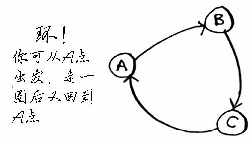

如果路径中出现了环，使用狄克斯特拉算法将会进入一个死循环：

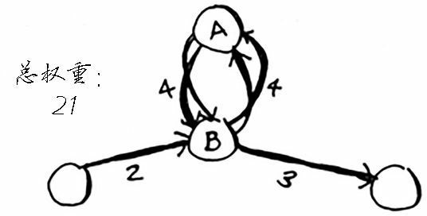

无向图意味着两个节点都指向对方，本质上也是一个环。

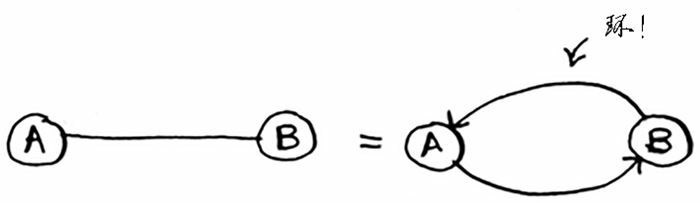

在无向图中，每条边都是一个环。狄克斯特拉算法只适用于**有向无环图**（directed acyclic graph，DAG）。

### 示例：乐谱换钢琴

Rama 想要用一本乐谱换钢琴。

Alex 说：“这是我最喜欢的乐队 Destroyer 的海报，我愿意拿它换你的乐谱。如果你再加 5 美元，还可拿乐谱换我这张稀有的 Rick Astley 黑胶唱片。”

Amy 说：“哇，我听说这张黑胶唱片里有首非常好听的歌曲，我愿意拿我的吉他和架子鼓换这张海报和黑胶唱片。”

Beethoven 惊呼：“我一直想要吉他，我愿意拿我的钢琴换 Amy 的吉他或架子鼓。”

太好了！只要再花一点点钱，Rama 就能拿乐谱换架钢琴。现在他需要确定的是，如何花最少的钱实现这个目标。我们来绘制一个图，列出大家的交换意愿。

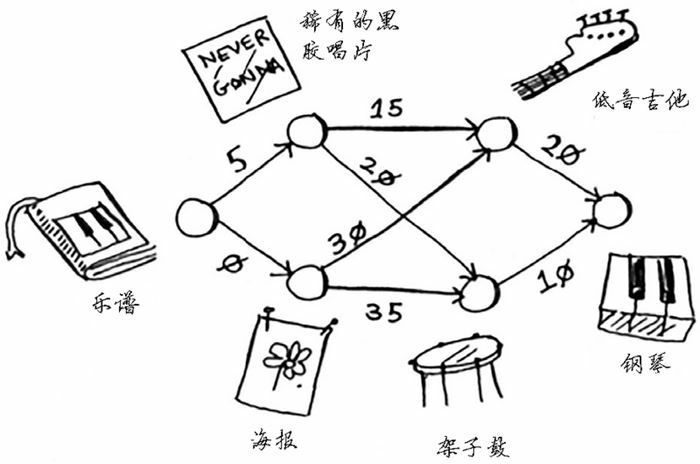

这个图中的节点是大家愿意拿出来交换的东西，边的权重是交换时需要额外加多少钱。比如，拿海报换吉他需要额外加 30 美元，拿黑胶唱片换吉他需要额外加 15 美元。

Rana 需要确定采用哪种路径将乐谱换成钢琴时需要支付的额外费用最少。为此，可以使用狄克斯特拉算法！

别忘了，狄克斯特拉算法包含四个步骤。在这个示例中，我们将完成所有这些步骤，因此我们也将计算最终路径。

动手之前，我们先做些准备工作：创建一个表格，在其中列出每个节点的开销。这里的开销指的是达到节点需要额外支付多少钱。

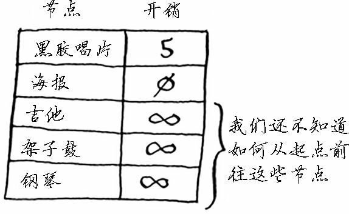

在执行狄克斯特拉算法的过程中，我们将不断更新这个表。

为计算最终路径，还需在这个表中添加表示父节点的列。

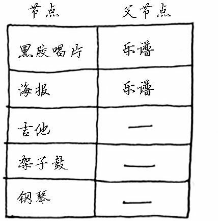

第一步：找出最便宜的节点。在这里，换海报最便宜，不需要支付额外的费用。

还有更便宜的换海报的途径吗？这一点非常重要，决定了狄克斯特拉算法是否能够为我们找到花费最少的方法。Rama 能够通过一系列交换得到海报，还能额外得到钱吗？

答案是不能，因为海报是 Rama 能够到达的最便宜的节点，没法再便宜了。下面提供了另一种思考角度。假设你要从家里去单位。

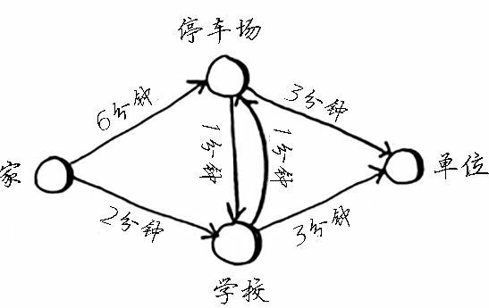

如果你走经过学校的路，到学校需要 2 分钟。如果走经过停车场的路，到停车场需要 6 分钟。

如果经停车场前往学校，能不能将时间缩短到少于 2 分钟呢？不可能，因为只前往停车场就需要 6 分钟。

另一方面，有没有能更快到达停车场的路呢？有。

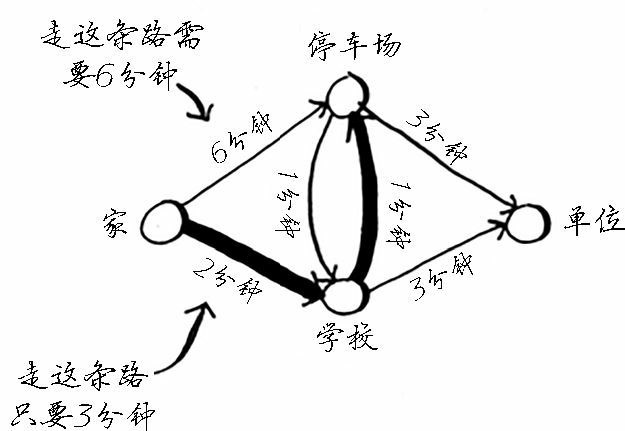

这就是狄克斯特拉算法背后的关键理念：找出图中最便宜的节点，并确保没有到该节点的更便宜的路径！

第二步：计算前往该节点（也就是海报）的各个邻居的开销。

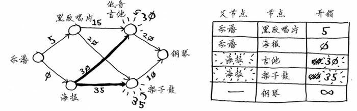

现在的表中更新了低音吉他和架子鼓的开销。这些开销是用海报交换它们时需要支付的额外费用，因此父节点为海报。这意味着，要到达低音吉他，需要沿从海报出发的边前行，对架子鼓来说亦如此。

再次执行第一步：下一个最便宜的节点是黑胶唱片——需要额外支付 5 美元。

再次执行第二步：更新黑胶唱片的各个邻居的开销。

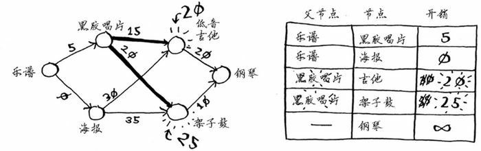

我们更新了架子鼓和吉他的开销！这意味着经“黑胶唱片”前往“架子鼓”和“吉他”的开销更低，因此我们将这些乐器的父节点改成了黑胶唱片。

再次重复。下一个最便宜的是吉他，我们接下来就要更新吉他的邻居的开销。

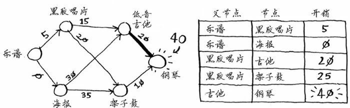

最后，对最后一个节点，架子鼓，进行同样的处理。

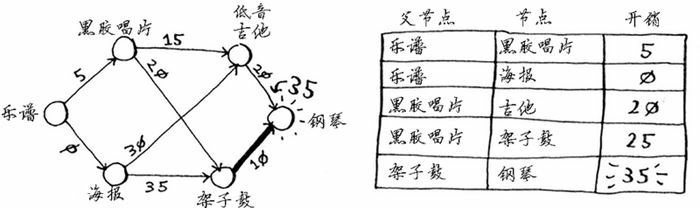

如果用架子鼓换钢琴，Rama 需要额外支付的费用更少。因此，采用最便宜的交换路径时，Rama 需要额外支付 35 美元。

现在我们要确定最终的路径。当前，我们已经知道最短路径的开销为 35 美元，但如何确定这条路径呢？为此，先找出钢琴的父节点。

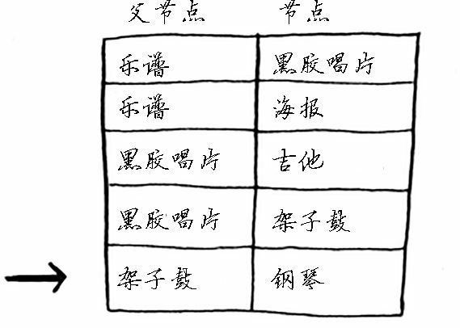

钢琴的父节点为架子鼓，架子鼓的父节点为黑胶唱片，黑胶唱片的父节点为乐谱。通过沿父节点回溯，我们就找到了完整的交换路径。

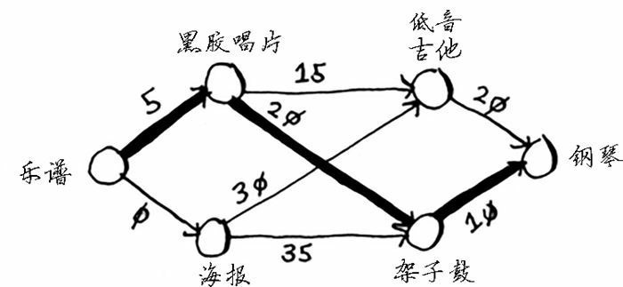

前面使用的都是术语最短路径的字面意思：计算两点或两人之间的最短路径。但希望这个示例让你明白，最短路径指的并不一定是物理距离，也可能是让某种度量指标最小。

在这个示例中，最短路径指的是 Rama 想要额外支付的费用最少。这都要归功于狄克斯特拉！

### 负权边

前面的例子中，所有的权重都是正的。如果有一个边的权重为负，会怎么样呢？

假设黑胶唱片不是 Alex 的，而是 Sarah 的，且 Sarah 愿意用黑胶唱片和 7 美元换海报。换句话说，换得 Alex 的海报后，Rama 用它来换 Sarah 的黑胶唱片时，不但不用支付额外的费用，还可得 7 美元。对于这种情况，如何在图中表示出来呢？

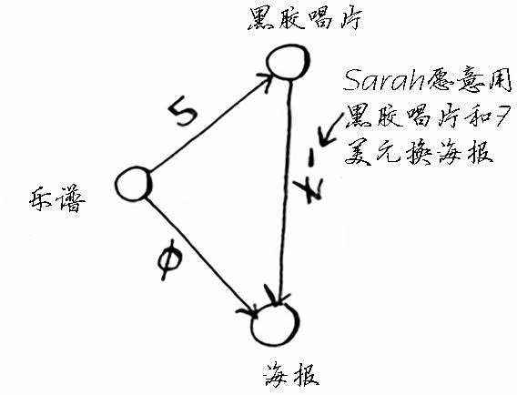

从黑胶唱片到海报的边的权重为负！即这种交换让 Rama 能够得到 7 美元。现在，Rama 有两种获得海报的方式。

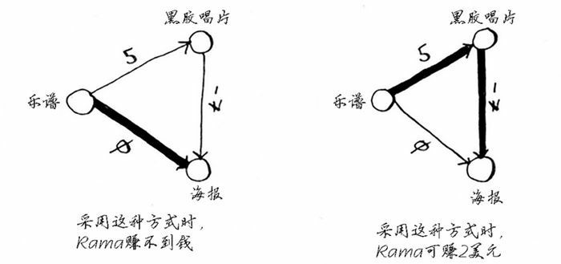

第二种方式更划算——Rama 可赚 2 美元！你可能还记得，Rama 可以用海报换架子鼓，但现在有两种换得架子鼓的方式。

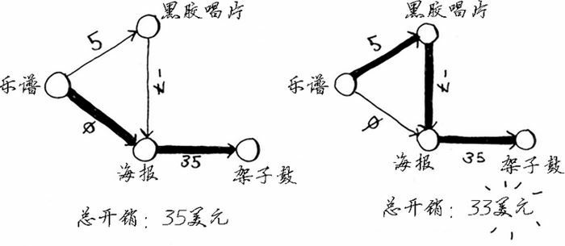

第二种方式的开销少 2 美元，他应采取这种方式。

然而，如果我们对这图运行狄克斯特拉算法，Rama 将选择错误的路径—更长的那条路径。如果有负权边，就不能使用狄克斯特拉算法。因为负权边会导致这种算法不管用。

下面来看看对这个图执行狄克斯特拉算法的情况。首先，创建开销表。

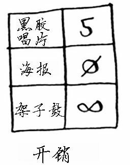

接下来，找出开销最低的节点，并更新其邻居的开销。在这里，开销最低的节点是海报。根据狄克斯特拉算法，没有比不支付任何费用获得海报更便宜的方式。（但其实这并不对！）无论如何，我们来更新其邻居的开销。

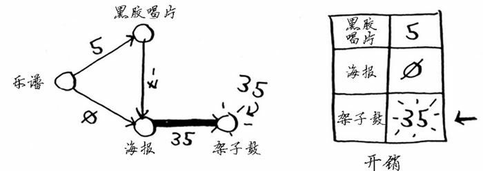

现在，架子鼓的开销变成了 35 美元。
我们来找出最便宜的未处理节点，也就是黑胶唱片。

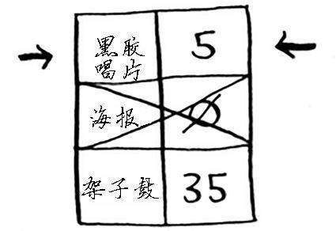

更新黑胶唱片邻居节点。

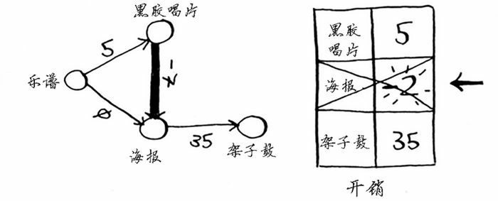

海报节点已处理过，这里却更新了它的开销。这是一个危险信号：节点一旦被处理，就意味着没有前往该节点的更便宜途径。但我们刚才却找到了前往海报节点的更便宜途径！

架子鼓没有任何邻居，因此算法到此结束，最终开销如下。

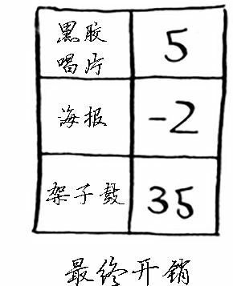

换得架子鼓的开销为 35 美元。但我们知道其实还有一种交换方式只需 33 美元，但狄克斯特拉算法没有找到。这是因为狄克斯特拉算法这样假设：对于处理过的海报节点，没有前往该节点的更短路径。这种假设仅在没有负权边时才成立。因此，不能将狄克斯特拉算法用于包含负权边的图。在包含负权边的图中，要找出最短路径，可使用另一种算法——贝尔曼 · 福德算法（Bellman-Ford algorithm）。

