## 散列表（哈希表）

查找无序数组或者链表中的数据，我们只能从头往后逐个查找。这种简单查找的方式需要消耗的时间为 $O(n)$。而查找有序数组中的数据时，我们可以通过二分查找，快速定位到某个元素，此时消耗的时间为 $O(log\space n)$。

虽然相较于简单查找而言，二分查找能够节省大量的时间。但随着数据量的增多，查找的速度还是会变得很慢。我们希望有一种数据结构，查找数据时总能一下子就定位到我们要找的数据。换句话说，这种数据结构查找数据所需要的时间为 $O(1)$。数组和链表做不到这一点，散列表可以做到。

### 散列函数

散列函数（哈希函数）是这样的函数，即无论你给它什么数据，它都还你一个数字。

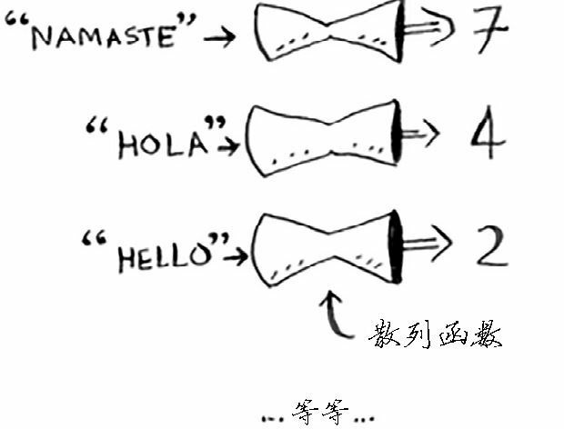

如果用专业术语来表达的话，我们会说，散列函数是将输入映射到数字。你可能认为散列函数输出的数字没什么规律，但其实散列函数必须满足一些要求：

- 它必须是一致的。例如，假设你输入 apple 时得到的是 4，那么每次输入 apple 时，得到的都必须为 4。如果不是这样，散列表将亳无用处
- 它应将不同的输入映射到不同的数字。例如，如果一个散列函数不管输入是什么都返回 1，它就不是好的散列函数。最理想的情况是，将不同的输入映射到不同的数字

### 散列表

散列函数可以将不同的输入映射为数字，使用它，我们就可以打造一款查找速度超快的数据结构，散列表（哈希表）。

首先创建一个空的数组，数组的每个位置都对应一个索引。

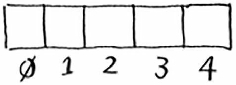

我们将要在这个数组中存储商品的价格。下面首先来将苹果的价格加入到这个数组中。为此，将 apple 作为输入交给散列函数。

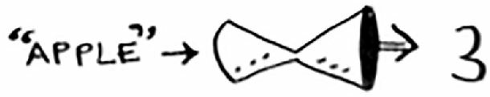

散列函数输出的值是 3，于是我们就把苹果的价格存放到数组索引为 3 的位置。

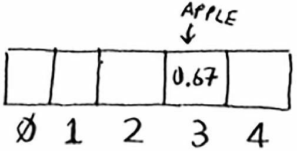

下面将牛奶（milk）的价格存储到数组中。为此，将 milk 作为散列函数的输入，得到结果为 0。

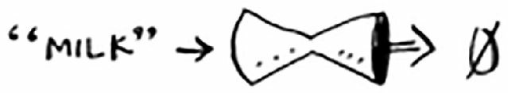


散列函数的输出结果为 0，因此我们将牛奶的价格存储在索引 0 处。

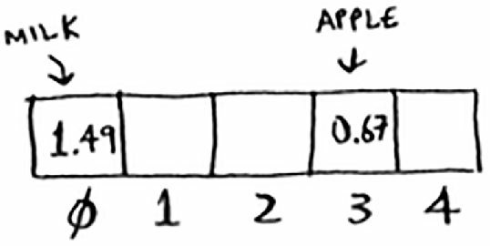

不断重复这个过程，直到整个数组都塞满价格。

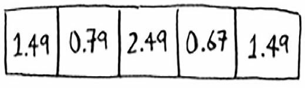

现在假设需要知道鳄梨（avocado）的价格。你无需在数组中査找，只需将 avocado 作为输入交给散列函数。

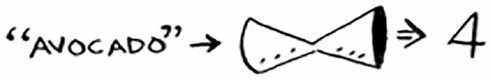

从而我们得知，鳄梨的价格存放在数组索引为 4 的位置。果然，我们再那里找到了鳄梨的价格。

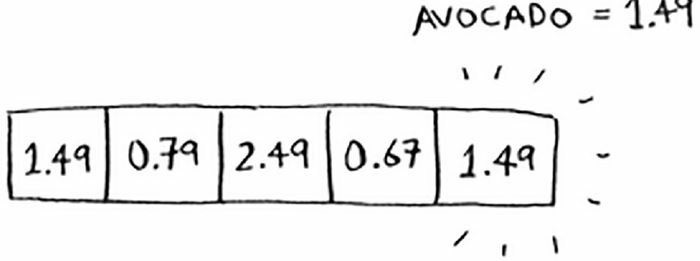

散列函数准确地指出了价格的存储位置，我们根本不需要进行査找！之所以能够做到这一点，具体原因如下：

- 散列函数总是将同样的输入映射到相同的索引。每次你输入 avocado，得到的都是同一个数字。因此，我们可首先使用它来决定将鳄梨的价格存储在什么地方，并在以后使用它来得知鳄梨的价格存储在什么地方。
- 散列函数将不同的输入映射到不同的索引。 avocado 映射到索引 4，milk 映射到索引 0。每种商品都映射到数组的不同位置，让你能够将其价格存储到这里。
- 散列函数知道数组有多大，只返回有效的索引。如果数组包含 5 个元素，散列函数就不会返回无效索引 100。

我们刚刚结合使用散列函数和数组创建了一种被称为散列表（hash table）的数据结构。散列表是我们学习的第一种包含额外逻辑的数据结构。数组和链表都被直接映射到内存，但散列表更复杂，它使用散列函数来确定元素的存储位置。

在我们将要学习的复杂数据结构中，散列表可能是最有用的，也被称为哈希表、散列映射、映射、字典和关联数组。

散列表的速度很快！散列表也使用数组来存储数据，因此其获取元素的速度与数组一样快。

### Python 的字典是散列表

我们已经看到，散列表就是使用类似于键值对的数据存储方式。事实上，Python 中的字典就是一种散列表数据结构。于是，Python 字典的如下性质就很好解释了：

- 字典的键必须是可哈希（不可变）的数据类型。因为必须要通过散列函数把字典的键转换成数字索引才能找到值。如果键不可哈希，就无法应用散列函数。
- 字典是无序的（Python 3.6 以后的版本字典通过其他手段默认有序，但不影响这里的讨论）。因为值的索引只和键与散列函数有关，不介意键的顺序。换句话说，值的存储是有序的，但是键不需要顺序。
- 字典的键不能重复。因为相同内容经过散列函数映射得到的数字一定是相同的。同一个键只能对应数组的一个索引，只能对应存储一个值。

### 应用案例

#### 将散列表用于查找，模拟映射关系

在下述情况下，使用散列表是很不错的选择：

- 创建映射
- 查找频繁

电话簿是很符合上面的条件的。我们要电话簿将姓名映射到电话号码。该电话簿需要提供如下功能：

- 添加联系人及其电话号码。
- 通过输入联系人来获悉其电话号码

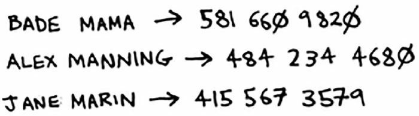


散列表被用于大海捞针式的查找。例如，你在访问像 http://adit.io 这样的网站时，计算机必须将 adit.io 转换为 IP 地址。

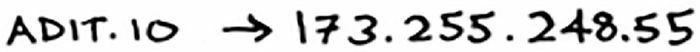

事实上，无论你访问哪个网站，其网址都必须先转换为 IP 地址。

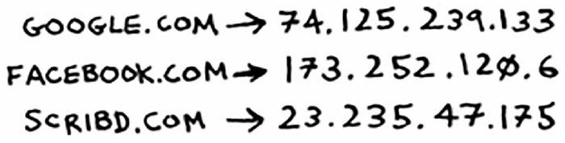

这不是将网址映射到 IP 地址吗？好像非常适合使用散列表啰！这个过程被称为 DNS 解析（DNS resolution），散列表是提供这种功能的方式之一。

#### 防止重复

假设你负责管理一个投票站。显然，每人只能投一票，但如何避免重复投票呢？有人来投票时，你询问他的全名，并将其与已投票者名单进行比对。

如果名字在名单中，就说明这个人投过票了，因此将他拒之门外！否则，就将他的姓名加入到名单中，并让他投票。现在假设有很多人来投过了票，因此名单非常长。


每次有人来投票时，你都得浏览这个长长的名单，以确定他是否投过票。但有一种更好的办法，那就是使用散列表！

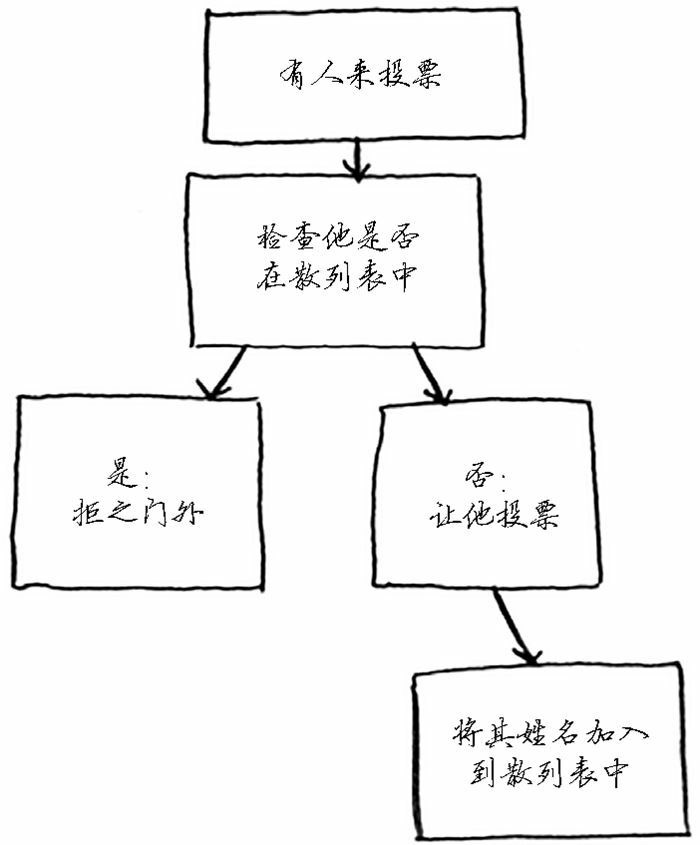

用代码表示就是：

```python
voted = {}

def check_voter(name: str):
    if voted.get(name):  # 若已经投过票，让他出去
        print('kick them out!')
    else:
        voted[name] = True  # 若字典中插入此人，让他投票
        print('let them vote!')

# 测试
check_voter('tom')
check_voter('mike')
check_voter('mike')
```

首先来投票的是 Tom，上述代码打印 `let them vote!`。接着 Mike 来投票，打印的也是 `let them vote!`。然后，Mike 又来投票，于是打印的就是 `kick them out!`。

别忘了，如果你将已投票者的姓名存储在列表中，这个函数的速度终将变得非常慢，因为它必须使用简单查找搜索整个列表。但这里将它们存储在了散列表中，而散列表让你能够迅速知道来投票的人是否投过票使用散列表来检查是否重复，速度非常快。

#### 将散列表用作缓存

假设你有个侄女，总是没完没了地问你有关星球的问题。火星离地球多远？月球呢？木星呢？每次你都得在 Google 搜索，再告诉她答案。这需要几分钟。现在假设她老问你月球离地球多远，很快你就记住了月球离地球 238900 英里。因此不必再去 Google 搜索，你就可以直接告诉她答案。这就是缓存的工作原理：网站将数据记住，而不再重新计算。

缓存是一种常用的加速方式，所有大型网站都使用缓存，而缓存的数据则存储在散列表中！

### 冲突

大多数语言都提供了散列表实现，我们没有必要知道如何实现它们。有鉴于此，就不再过多地讨论散列表的内部原理。

但我们依然需要考虑性能！要明白散列表的性能，得先搞清楚什么是冲突。

理想的散列函数需要将不同的键映射到数组的不同位置。但是这种散列函数几乎是不存在的。有的时候，不同的数据对应的散列函数的映射值是相同的，这就产生了**冲突**。

假设我们有一个长度为 26 的数组，我们使用的散列函数很简单，按照商品名称的首字母分配位置。

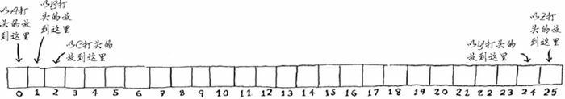

这时候会出现一个问题：苹果和鳄梨都是以 A 开头，它们的散列函数的映射值都是 0。这下可糟了，一个位置无法存放两个价格信息呀。

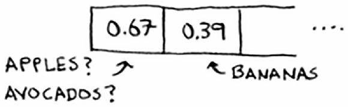

这种情况被称为冲突（collision）：给两个键分配的位置相同。这是个问题。如果我们将鳄梨的价格存储到这个位置，将覆盖苹果的价格，以后再査询苹果的价格时，得到的将是鳄梨的价格！

冲突很糟糕，必须要避免。处理冲突的方式很多，最简单的办法为：如果两个键映射到了同一个位置，就在这个位置存储一个链表。

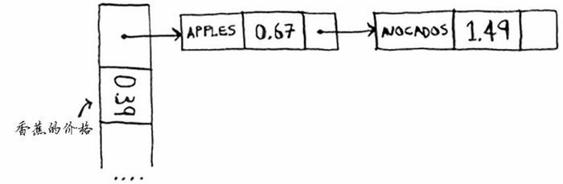

在这个例子中，apple 和 avocado 映射到了同一个位置，因此在这个位置存储一个链表。

在需要査询香蕉的价格时，速度依然很快。但在需要査询苹果的价格时，速度要慢些：我们必须在相应的链表中找到 apple。

如果这个链表很短，也没什么大不了——只需搜索三四个元素。但是，假设你工作的杂货店只销售名称以字母 A 打头的商品，这颗就很糟糕了。

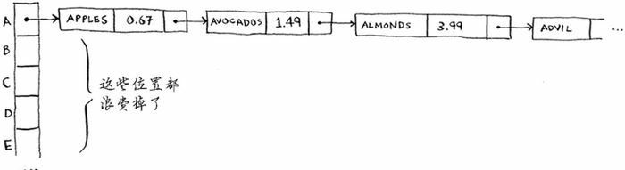

除第一个位置外，整个散列表都是空的，而第一个位置包含一个很长的列表！换言之，这个散列表中的所有元素都在一个链表中，这与开始就将所有元素存储到一个链表中一样糟糕：散列表的速度会很慢。

这里的经验教训有两个：

- 散列函数很重要。前面的散列函数将所有的键都映射到一个位置而最理想的情况是，散列函数将键均匀地映射到散列表的不同位置。
- 如果散列表存储的链表很长，散列表的速度将急剧下降。然而，如果使用的散列函数很好，这些链表就不会很长！

### 性能

散列表、数组和链表的运行时间对比如下。

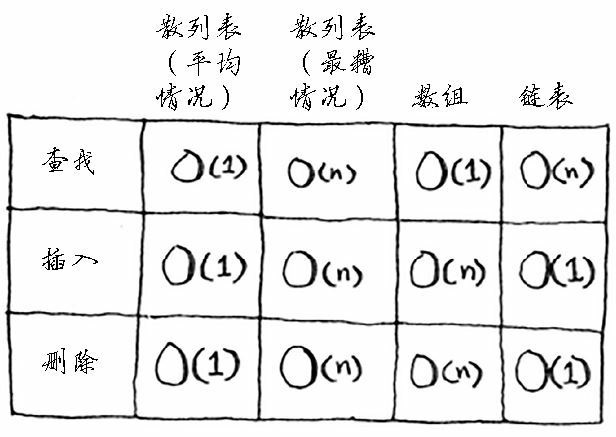

在平均情况下，散列表执行各种操作所需要的时间都为 $O(1)$。$O(1)$ 被称为常量时间。常量时间并不意味着马上，而是说不管散列表多大，所需的时间都相同。

在平均情况下，散列表的査找（获取给定索引处的值）速度与数组一样快，而插入和删除速度与链表一样快，因此它兼具两者的优点！但在最糟情况下，散列表的各种操作的速度都很慢。

因此，在使用散列表时避开最糟情况至关重要。为此，需要避免冲突。而要避免冲突，需要：

- 较低的填装因子
- 良好的散列函数

#### 填装因子

散列表的填装因子很容易计算：

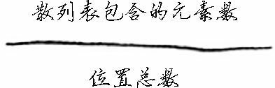

散列表使用数组来存储数据，因此我们需要计算数组中被占用的位置数。例如，下述散列表的填装因子为 2/5，即0.4。

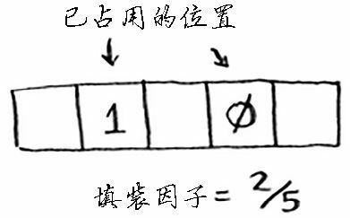

填装因子大于 1 意味着商品数量超过了数组的位置数。一旦填装因子开始增大，就需要在散列表中添加位置，这被称为调整长度（resizing）。例如，假设有一个像下面这样相当满的散列表。

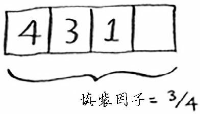

我们就需要调整它的长度。为此，首先创建一个更长的新数组：通常将数组增长一倍。

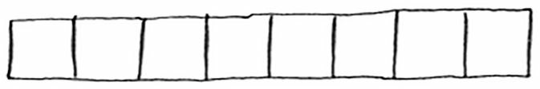

接下来，我们需要使用散列函数将所有的元素都插入到这个新的散列表种。

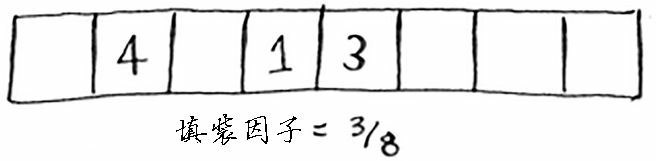

这个新散列表的填装因子为 3/8，比原来低多了！填装因子越低，发生冲突的可能性越小，散列表的性能越高。一个不错的经验规则是：一旦填装因子大于0.7，就调整散列表的长度。

调整散列表长度的工作需要很长时间。但平均而言，即便考虑到调整长度所需的时间，散列表操作所需的时间也为 $O(1)$。

#### 良好的散列函数

良好的散列函数让数组中的值呈均匀分布。

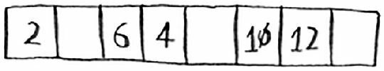

糟糕的散列函数让值扎堆，导致大量冲突。

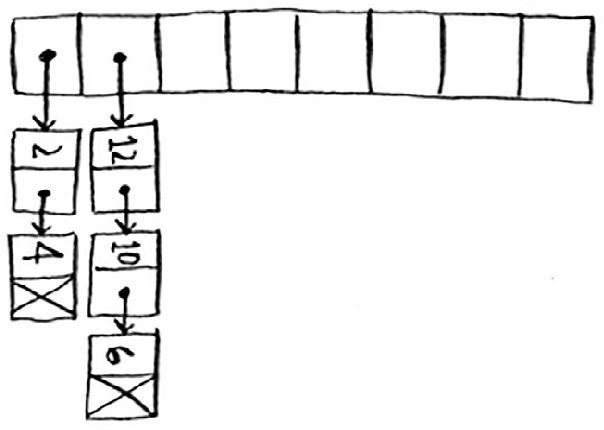

什么样的散列函数是良好的呢？这个问题我们大可不必操心——天塌下来有高个子顶着，早就有大牛帮我们实现了。如果你好奇，可研究一下 SHA 函数，我们可将它用作散列函数。