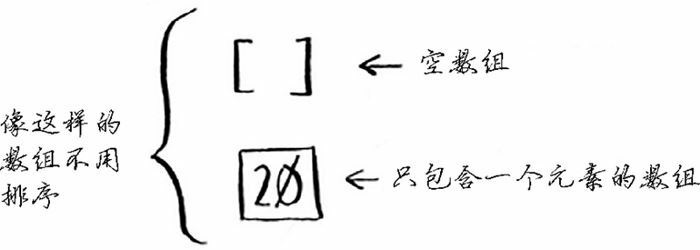
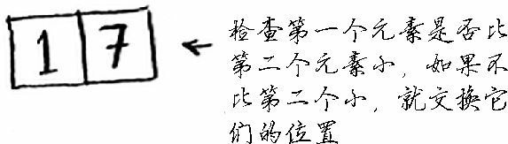
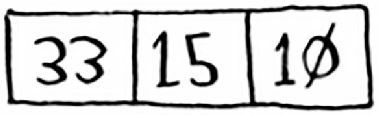
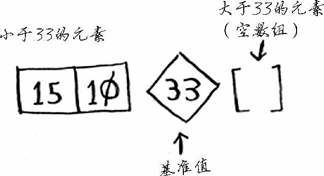
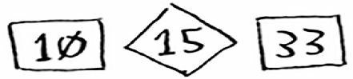
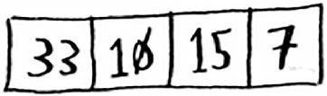
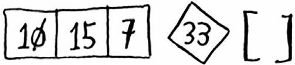
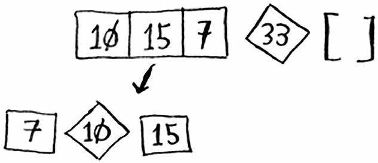
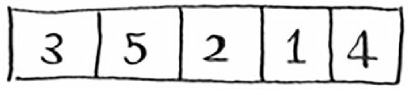
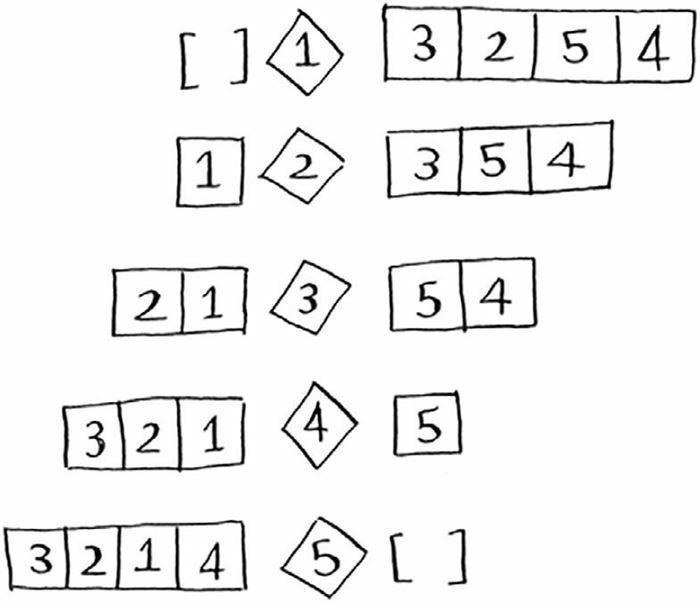

## 快速排序

快速排序是一种常用的排序算法，比选择排序快得多。例如，C 语言标准库中的函数 qsort 实现的就是快速排序。快速排序也使用了 D&C。

对排序算法来说，最简单的数组就是根本不需要排序的数组。



因此，基线条件为数组为空或只包含一个元素。在这种情况下，只需原样返回数组—根本就不用排序。用代码表示就是：

```python
def quick_sort(arr):
    if len(arr) < 2:
        return arr
```

对于两个元素的情况，也很好办，只需要将两个元素相比较即可：



讨论三个和更多元素的情况，就需要找到我们的递归条件，把问题分解，分而治之了。

首先来看只有三个元素的数组：



我们从中任意取出一个元素作为基准值（pivot），比如 33。然后，我们找到比这个基准值大的元素，将其放在左边；比这个基准值小的元素，放在右边：



这被称为分区（partitioning）。现在你有：

- 一个由所有小于基准值的数字组成的子数组
- 基准值
- 一个由所有大于基准值的数组组成的子数组

这里只是进行了分区，得到的两个子数组是无序的。但如果这两个数组已经排好序，我们的任务便已经完成了。

好消息是，含有两个元素的列表和空列表的排序方式刚刚我们已经找到了，直接调用即可。用代码表示就是：

```python
quick_sort([15, 10]) + [33] + quick_sort([])
```

不管使用哪个元素作为基准值都可以。以 10 做基准值的情况和 33 做基准值道理相同。若以 15 做基准值，这个算法也是管用的。



这个子数组都只有一个元素，而你知道如何对这些数组进行排序。

现在你就知道如何对包含三个元素的数组进行排序了，步骤如下：

1. 选择基准值
2. 将数组分成两个子数组：小于基准值的元素和大于基准值的元素
3. 对这两个子数组进行快速排序

同样道理，对于有四个元素的数组排序，已经不是什么麻烦事了。



比如还是以 33 作为基准值。



左边的元素有三个。而你已经直到如何给三个元素进行排序了：对其递归调用快速排序。



你已经直到如何对四个元素的列表进行排序。那么你一定也知道如何对五个元素的列表进行排序了。因为假设有下面这个数组。



你选的基准值和分区情况的可能性如下：



注意，这些子数组的数目都小于四。而你已经知道如何对四个元素以下的数组进行排序了。子数组排序完成，也意味着整个数组排序完成。

同理，对于六个甚至更多元素的排序，都可以这样一层一层地找到解决办法。

用代码表示快速排序算法就是：

```python
def quick_sort(arr: list) -> list:
    if len(arr) < 2:
        return arr    # 基线条件，空列表和单元素列表天然“有序”
    else:
        pivot = arr.pop()    # 递归条件，随意选择基准值
        less = []
        greater = []
        for i in arr:
            if i < pivot:
                less.append(i)    # 小于基准元素的值放到一块
            else:
                greater.append(i)    # 大于基准元素的值放到一块
        return quick_sort(less) + [pivot] + quick_sort(greater)


arr = [10, 5, 2, 3]
print(quick_sort(arr))
```

注：原书给的方法中 less 和 greater 列表分别都是通过列表生成器实现的。但是私以为，这样会使用两个循环，每次循环都要判断大小，会造成重复相同操作的情况。当然，这样做的好处是代码更加简洁，更易读。不过为了效率期间，我还是改成了直接使用循环生成列表的方式。

快速排序的运行时间问题，请移步  [大 O 表示法](grokking-algorithms-big-o.md#排序算法的运行时间) 。