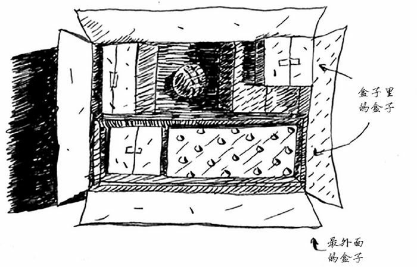
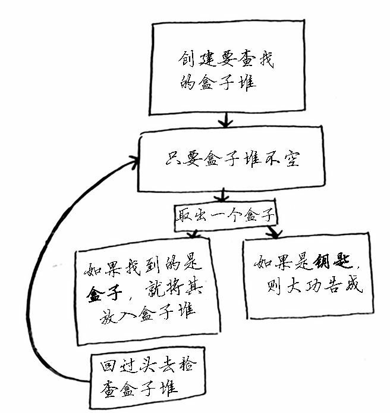
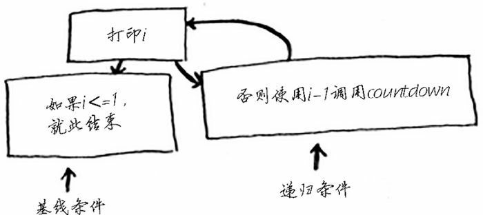

## 递归

有这样一个盒子，盒子里面有很多小盒子。小盒子里面可能还是装着盒子的盒子。在这些盒子中，有一个盒子会装着钥匙。我们要怎么样把钥匙找出来呢？



第一种方法使用下面这个流程：

1. 创建一个要查找的盒子堆；
2. 从盒子堆取出一个盒子，在里面找；
3. 如果找到的是盒子，就将其加入盒子堆中，以便以后再査找；
4. 如果找到钥匙，则大功告成！
5. 回到第二步。



也可以通过第二种方法这个流程：

1. 检查盒子中的每样东西；
2. 如果是盒子，就回到第一步；
3. 如果是钥匙，就大功告成。

如果用每一个列表代表着一个盒子，那么上面的问题可以描述为，如何从下面的列表中找到 `钥匙`：

```python
box = [[[[],[],[],[]],[[[],[],[]],[]],[]], [[],[[[],['钥匙']],[]],[],[[],[]]],[[],[],[[],[]]]]
```

如果是第一种方法，我们可以用 whil 循环实现：

```python
from copy import deepcopy


def look_for_key(main_box: list):
    pile = deepcopy(main_box)    # 创建盒子堆
    while len(pile):    # 只要盒子堆里还有盒子，就继续循环
        box = pile.pop()    # 从盒子堆里拿出一个盒子来
        for item in box:    # 打开盒子，看看里面的东西都有啥
            if isinstance(item, list):    # 如果还是盒子
                pile.append(item)    # 就放到盒子堆里
            elif item == '钥匙':    # 如果是钥匙
                print('找到钥匙了！')    # 就成功了！
                return item    # 这个的作用是终止程序，找到以后就不要继续找了


box = [[[[], [], [], []], [[[], [], []], []], []], [[], [[[], ['钥匙']], []], [], [[], []]], [[], [], [[], []]]]
look_for_key(box)
```

对于第二种方法，我们可以通过函数自己调用自己的方式实现：

```python
def look_for_key(box: list):
    for item in box:    # 把盒子拆开，看看每个东西都是啥
        if isinstance(item, list):    # 如果是盒子，就继续打开
            look_for_key(item)    # 看看里面有没有钥匙
        elif item == '钥匙':    # 如果是钥匙
            print('找到钥匙了！')    # 大功告成
            break    # 不必继续找了


box = [[[[], [], [], []], [[[], [], []], []], []], [[], [[[], ['钥匙']], []], [], [[], []]], [[], [], [[], []]]]
look_for_key(box)
```

这两种方法的作用相同，但在我看来，第二种方法更清晰。递归只是让解决方案更清晰，并没有性能上的优势。实际上，在有些情况下，使用循环的性能更好。我很喜欢 Leigh Caldwell 在 Stack overflow 上说的一句话：“如果使用循环，程序的性能可能更高；如果使用递归，程序可能更容易理解。如何选择要看什么对你来说更重要。”

编写递归函数时，必须告诉它何时停止递归。正因为如此，每个递归函数都有两部分：基线条件（base case）和递归条件（recursive case）。递归条件指的是函数调用自己，而基线条件则指的是函数不再调用自己，从而避免形成无限循环。

比如在下面的递归中：

```python
import time


def countdowm(i):
    print(i)
    if i <= 1:    # 基线条件
        return
    else:    # 递归条件
        time.sleep(1)
        countdowm(i - 1)


countdowm(5)
```

