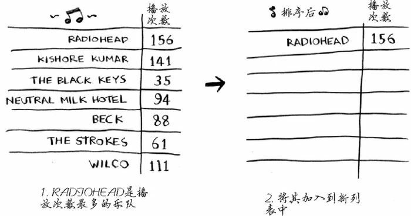
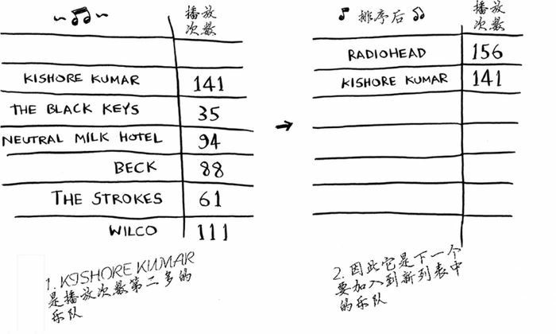
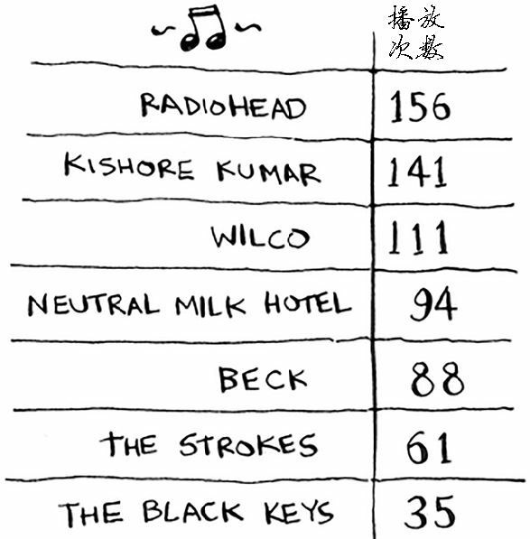
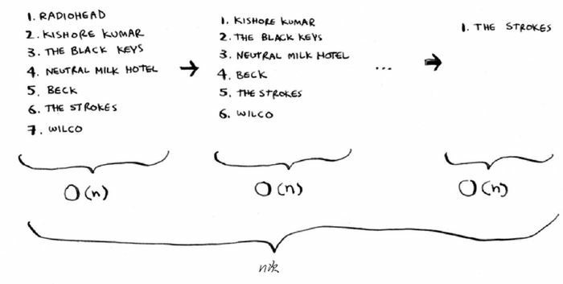

## 选择排序

要理解本节的内容，你必须熟悉数组、链表和大 O 表示法。

选择排序，就是把列表中最大的元素放到新列表中并在原列表中删除。然后在列表中剩下的元素里继续这样做，找到第二大的元素。这样逐次选择查找，最终完成排序的任务。







查找排序需要的时间为 $O(n^2)$。



选择排序的示例代码如下：

```python
from copy import deepcopy


def find_smallest(arr: list) -> int:
    """
    用于查找数组中最小值的索引
    :param arr: 目标数组
    :return: 最小值索引
    """
    smallest = arr[0]
    smallest_index = 0
    for i in range(1, len(arr)):
        if arr[i] < smallest:
            smallest = arr[i]
            smallest_index = i
    return smallest_index


def selection_sort(arr: list) -> list:
    """
    选择排序的主函数，将一个数组升序排列返回
    :param arr: 目标数组
    :return: 升序排列好的数组
    """
    arr = deepcopy(arr)  # 因为后面要进行列表删除操作，这样做是为了避免对原列表造成影响
    new_arr = []
    for i in range(len(arr)):  # 避免循环删除的坑
        smallest_index = find_smallest(arr)
        new_arr.append(arr.pop(smallest_index))  # 将本次最小的元素转移到新列表的最后
    return new_arr


print(selection_sort([5, 3, 6, 2, 10]))    # [2, 3, 5, 6, 10]
```

