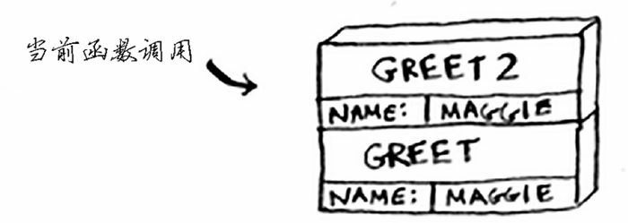
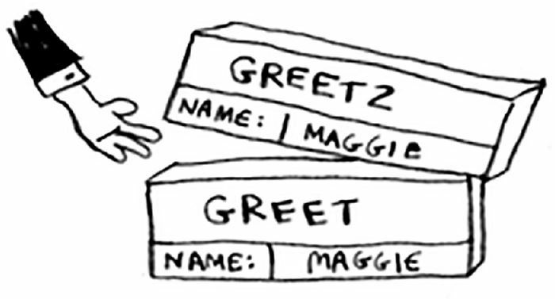
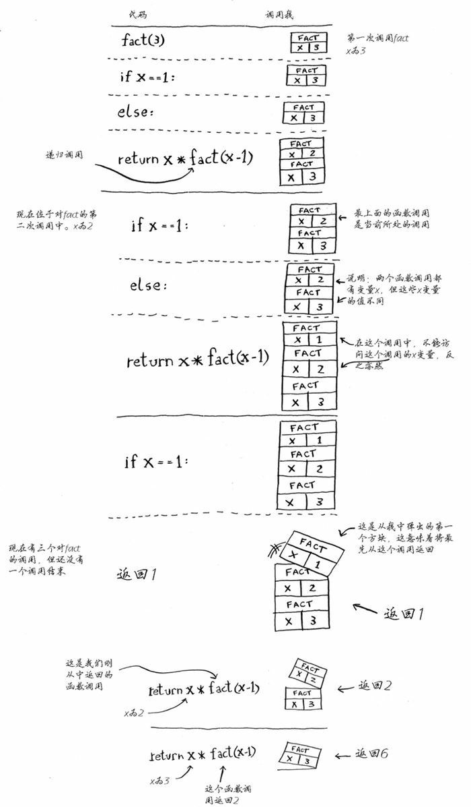

## 栈

本节将介绍一个重要的编程概念—调用栈（call stack）。调用栈不仅对编程来说很重要，使用递归时也必须理解这个概念。

栈是一种后进先出的数据结构，只有弹出和两种操作：


### 调用栈

计算机在内部使用被称作调用栈的栈。

来看下面的函数调用：

```python
def greek(name):
    print('hello, ' + name + '!')
    greek2(name)
    print('getting ready to say bye...')
    bye()


def greek2(name):
    print('how are you, ' + name + '?')


def bye():
    print('ok bye!')


greek('maggie')
```

为简便起见，下面的讨论先不把 print 看作函数了。

当我们调用 `greet('maggie')` 函数时，计算机将首先为该函数调用分配一块内存。我们来使用这些内存。变量name 被设置为 maggle，这需要存储到内存


函数 greet 从上向下执行，只要函数没有执行完，内存就不会被释放。最开始，是打印出一串内容，`hello, maggie!`。随后，调用 greek2 函数，参数 name 还是 maggie。需要注意的是，此时 greek 函数尚未执行完毕，所以内存不会释放，而因为调用了 greek2，还要给它一块内存空间，就放在 greek 空间的上面。这种层叠的空间存储结构，就是调用栈。



此时，greek 暂时被搁置，活跃的是最上方的 greek2 函数。它从上往下执行，打印出 `how are you, maggie?` 后，运行完毕，释放内存空间。栈顶端的 greet2 占用的内存块被弹出。



此时，活跃的函数又是 greek 了。调用 greek2 的步骤已经执行完毕，接着往下走，打印出 `getting ready to say bye...` 之后，又调用了 bye 函数。同样道理，bye 函数的内存块被压倒栈的顶端。


bye 运行，打印出 `ok bye!` 后，释放内存空间，从栈顶段弹出。


greet 的最后一行代码也执行完，它也从栈中弹出。这个栈用于存储多个函数的变量，称为调用栈。

### 递归调用栈

递归函数也使用调用栈！来看看递归函数 factorial 的调用栈。`factorial(5)` 写作 `5!`，其定义如下：`5! = 5 * 4 * 3 * 2 * 1`。同理，`factorial(3)` 为 `3 * 2 * 1`。下面是计算阶乘的递归函数：

```python
def fact(n: int):
    if n == 1:
        return n
    else:
        return n * fact(n - 1)


print(fact(5))    # 120
print(fact(3))    # 6
```

下面来详细分析调用 `fact(3)` 时调用栈是如何变化的。别忘了，栈顶的方框指出了当前执行到了什么地方。



注意，每个 fact 调用都有自己的 x 变量。在一个函数调用中不能访问其他函数的 x 变量。

递归调用栈包含未完成的函数调用，每个函数调用都包含还未检查完的盒子。使用栈很方便，因为你无需自己跟踪盒子堆——栈替你这样做了。

使用栈虽然很方便，但是也要付出代价：存储详尽的信息可能占用大量的内存。每个函数调用都要占用一定的内存，如果栈很高，就意味着计算杋存储了大量函数调用的信息。在这种情况下，你有两种选择：

- 重新编写代码，转而使用循环。
- 使用尾递归。这是一个高级递归主题，不在本书的讨论范围内。另外，并非所有的语言都支持尾递归。