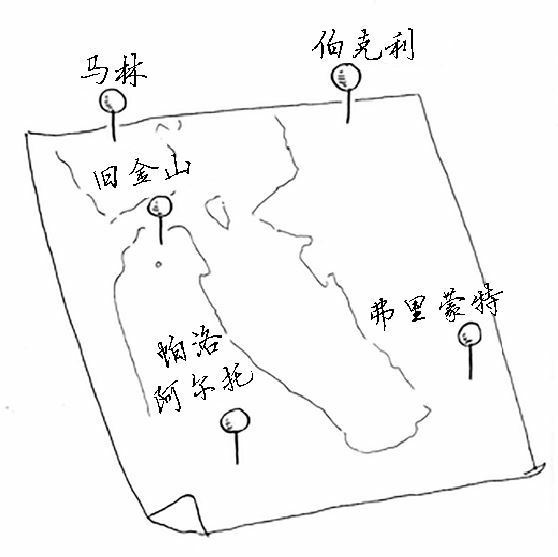
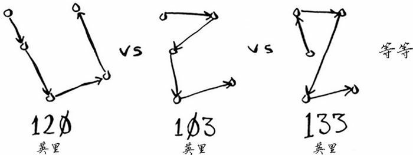
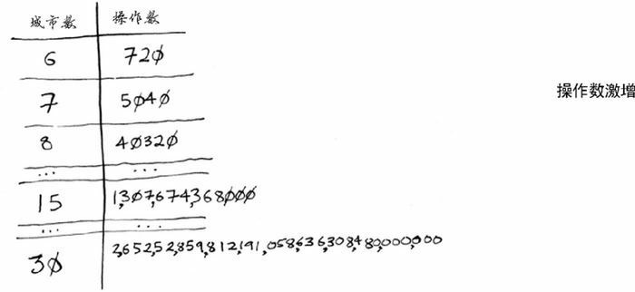

## 旅行商问题简述

旅行商问题， Traveling Salesman Problem，TSP，是一个时间复杂度极高的算法问题。解决起来非常棘手。

有一位旅行商，要前往五个城市。

为了确保他的旅程距离最短，需要列出所有可能的路线。

对于每种顺序，他都要计算总旅程，再挑选岀旅程最短的路线。5 个城市有 120 种不同的排列方式。因此，在涉及 5 个城市时，解决这个问题需要执行 $A_5^5 = 5! = 120$ 次操作。涉及 6 个城市时，需要执行 $6! = 720$ 次操作。涉及 7 个城市时，需要执行 5040 次操作。

推而广之，涉及 n 个城市时，需要执行 $n!$（n 的阶乘）次操作才能计算出结果。因此运行时间为 $O(n!)$，即阶乘时间。除非涉及的城市数很少，否则需要执行非常多的操作。如果涉及的城市数超过 100，根本就不能在合理的时间内计算出结果——等你计算出结果，太阳都没了。

这种算法很糟糕，却别无选择。这是计算机科学领域待解的问题之一。对于这个问题，目前还没有找到更快的算法有些很聪明的人认为这个问题根本就没有更巧妙的算法。面对这个题，我们能做的只是去找出近似答案。

