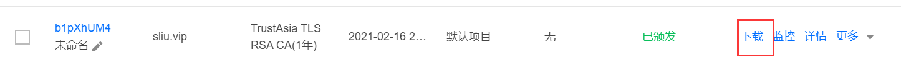
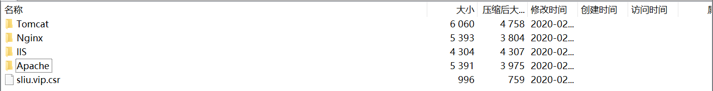
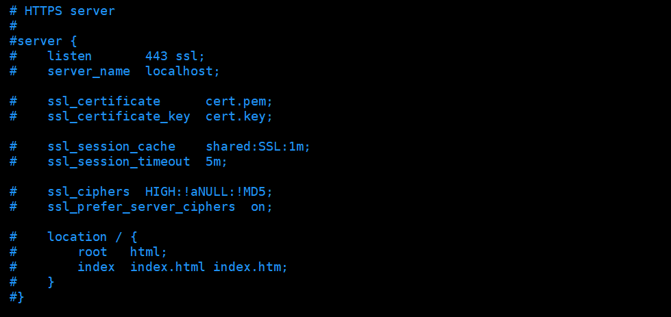
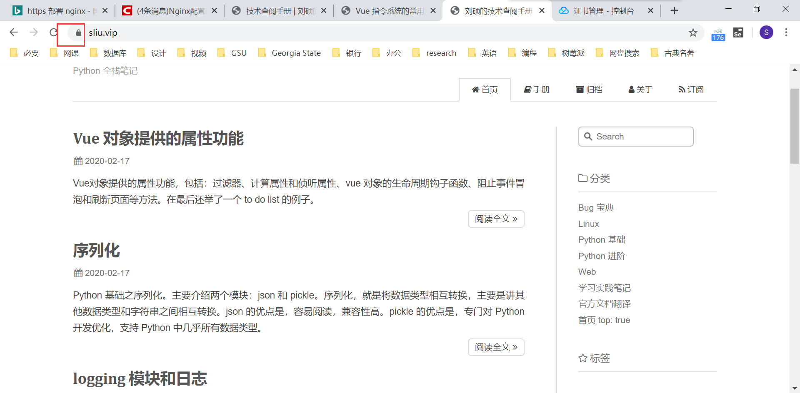

## 部署 HTTPS 网站

[TOC]

### 为什么要升级为 HTTPS？

原因就三条：安全，安全，还是 TMD 安全。

任谁也不喜欢自己的网站在浏览器中会显示出这么个东西的：


所以要升级为 HTTPS。

### 申请 SSL 证书

我去的是 [腾讯云](https://cloud.tencent.com/product/ssl)，个人申请的免费版。

按照提示点点点就完事了。

要审核，说是要一个工作日内就完成，其实十几分钟就能搞定，比域名备案快多了。

### 配置证书到 nginx

在 [腾讯云-证书管理-控制台](https://console.cloud.tencent.com/ssl)，下载证书。



证书加载下来是一个安装包，里面有我们的 csr 文件和适用于各种 web 服务器的文件。



在我们 nginx 的安装路径中的 conf 目录下创建一个文件夹 cert，把压缩包中 Nginx 中的两个文件全都放到这个文件夹里面：

```bash
[root@VM_0_16_centos cert]# pwd
/opt/tengine23/conf/cert
[root@VM_0_16_centos cert]# ls
1_sliu.vip_bundle.crt  2_sliu.vip.key
```

nginx 有些得很详细的 https 虚拟主机配置，我们把它找到，取消注释稍作修改即可：



只需将证书文件输入进入即可，我们没有 .pem 文件，那个 .crt 文件就是证书文件（别的设置也不懂，以后懂了再改吧，都用的默认）：

```java
server {
    listen       443 ssl;
    server_name  localhost;

    ssl_certificate      cert/1_sliu.vip_bundle.crt;
    ssl_certificate_key  cert/2_sliu.vip.key;

    ssl_session_cache    shared:SSL:1m;
    ssl_session_timeout  5m;

    ssl_ciphers  HIGH:!aNULL:!MD5;
    ssl_prefer_server_ciphers  on;

    location / {
        proxy_pass   http://localhost:4000;
    }
}
```

平滑重启 nginx：

```bash
nginx -s reload
```

输入网址 https://sliu.vip 测试一下，成功了，域名旁边也没了不安全的标识：



### 转发 HTTP 至 HTTPS

为了兼容原来 80 端口的 HTTP 方式的访问，可以将 80 端口的访问请求全部转发到 443 端口上，增加配置如下：

```
server {
    listen       80;
    server_name  your-domain.com;

    location = / {
        rewrite ^(.*) https://your-domain.com/$1 permanent;
    }

    location / {
        rewrite ^(.*) https://your-domain.com/$1 permanent;
    }
}
```

### 参考文章

1. [Nginx配置HTTPS](https://blog.csdn.net/cloume/article/details/78252319)