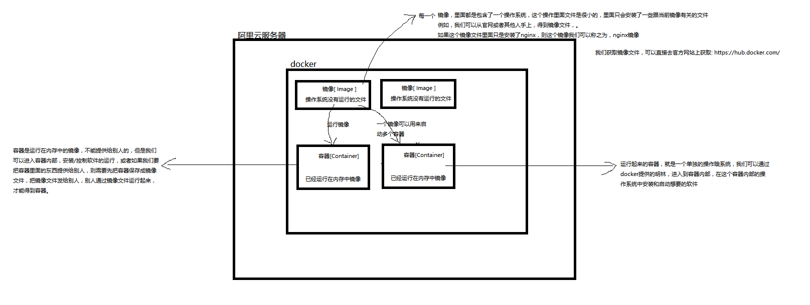
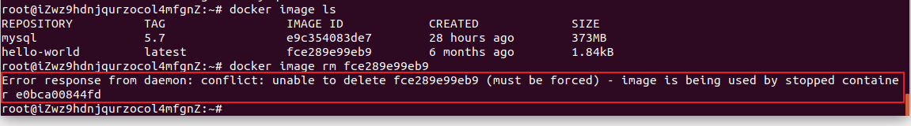

# Docker 介绍和基本使用

Docker 是一款于安装部署项目运营时需要的软件和依赖的工具，类似于 VMware 虚拟机平台。

docker 可以通过 git 从 docker 官网仓库中下载各种各样的镜像到本地，然后可以通过命令，对镜像进行操作。

# Docker 安装

更新 Ubuntu 的 apt 源索引：

```shell
sudo apt-get update
```

安装包允许 apt 通过 HTTPS 使用仓库

```shell
sudo dpkg --configure -a
sudo apt-get install apt-transport-https ca-certificates curl software-properties-common
```

添加 Docker 官方 GPG key（这个是国外服务器地址，所以网路不好的时候，可能会失败！在网路好的情况下，多执行几次就没问题了）

```shell
curl -fsSL https://download.docker.com/linux/ubuntu/gpg | sudo apt-key add -
```

设置 Docker 稳定版仓库

```shell
sudo add-apt-repository "deb [arch=amd64] https://download.docker.com/linux/ubuntu $(lsb_release -cs) stable"
```

添加仓库后，更新 apt 源索引

```shell
sudo apt-get update
```

前面的准备工作完成以后，接下来安装最新版Docker CE（社区版）

```shell
sudo apt-get install docker-ce
```

检查 Docker CE 是否安装正确

```shell
sudo docker run hello-world
```

出现了`helo from Docker`则表示上面的安装成功！




我们获取镜像文件，可以直接去官方网站上获取: https://hub.docker.com/

# Docker 命令

### 通用命令

##### 查看 docker 当前版本

```bash
docker --version  # 查看整个docker的版本。
docker version
```

```bash
# 启动docker
sudo service docker start

# 停止docker
sudo service docker stop

# 重启docker
sudo service docker restart
```

### 镜像操作（image）

##### 列出所有镜像

```bash
sudo docker image ls
# 上面的命令时省略了 --all，有些隐藏文件显示不出来
sudo docker image ls --all
```

##### 拉取镜像

下载镜像，默认从官网镜像库下载镜像的。也可以修改 docker 的源，让 docker 从国内其他镜像库下载镜像回来，这可以达到下载加速的作用。

这可以达到下载加速的作用。

例如，使用阿里云的镜像源（修改完成后，重启才生效）：

```bash
sudo vim /etc/docker/daemon.json   # 文件如果不存在，则创建
# 添加如下内容：

{
  "registry-mirrors": ["https://2xdmrl8d.mirror.aliyuncs.com"]
}

# 重启docker即可。
```

如果不指定版本号，默认拉取最新版本的镜像

```shell
sudo docker image pull <镜像名称:版本号>
# 例如：
sudo docker image pull ubuntu:18.04
```

##### 删除镜像

删除的时候，必须注意是否有容器在运行当前镜像文件，如果在使用，则需要先删除容器，才能删除镜像

```shell
sudo docker image rm <镜像名称/镜像ID>:版本号
```

删除的镜像如果被容器提前使用了，则错误如下：



##### 把 docker 中的镜像打包成文件

用于分享发送给他人，或备份

```shell
sudo docker save -o <文件名.tar.gz>  <镜像名>
# 例如：
sudo docker save -o ubuntu.tar.gz ubuntu:18.04
```

##### 把镜像文件加载到 docker 中

```shell
sudo docker load -i <文件名.tar.gz>
```

### 容器操作（container）

##### 创建容器

必须先有镜像，才能运行创建容器，需要指定使用的镜像名，并且设置创建容器以后，执行对应的第一条命令 

```shell
sudo docker run <参数选项> <镜像名称> <命令>
```

例如：使用 hello-world 镜像，创建一个容器，但没有进行任何操作

```shell
sudo docker run hello-world
```

例如：使用 ubuntu 镜像，创建一个名为 ubuntu1：

```bash
sudo docker pull ubuntu:18.04
sudo docker run -it --name=ubuntu1 ubuntu:18.04 bash
```

注意：必须启动的时候，让容器运行 bash 解析器，才能在接下来的操作让容器不会立刻关闭，而且也能够让我们可以输入linux终端命令。 如果我们一般创建一个容器，选项都是：`-itd`。

##### docker run 的选项

- `-t` 表示容器启动后会进入其 `命令行终端`

- `-i` 表示以 `交互模式` 运行容器

- `--name` 表示设置容器的名称

- `-d` 创建一个守护式容器在后台运行（这样创建容器后不会自动登录容器，如果只加 -i -t 两个参数，创建后就会自动进去容器）

- `-p` 指定端口映射，格式为：`主机（宿主）端口:容器端口`

- `-e 变量名="变量值"` 设置环境变量

- `--network=host` 指定容器的网络连接类型

- `--restart=always` 在 docker 重启的时候，是否要自动重启容器

- `-v` 把 docker 外接的目录和指定容器内部的目录进行映射，共享文件

例如，使用 ubuntu 镜像，创建一个名为 ubuntu2，并且在后台运行的容器像

```bash
sudo docker run -itd --name=ubuntu2 ubuntu<:版本> ubuntu
```

##### 列出所有容器

```shell
sudo docker container ls                      # 所有正在启动运行的容器
sudo docker container ls --all                # 所有容器（不管是否在启动运行中）
```

##### 启动容器（可以同时启动多个容器，容器之间使用空格隔开）

```shell
# 启动一个容器
sudo docker container start <容器名称/容器ID>
# 启动多个容器
sudo docker container start <容器名称/容器ID>  <容器名称/容器ID> <容器名称/容器ID>
```

##### 停止容器

```shell
sudo docker container stop <容器名称/容器ID>
```

##### 杀死容器

在容器无法停止的时使用（强制关机，相当于切断电源）

```shell
sudo docker container kill <容器名称/容器ID>
```

##### 进入容器

要进入容器，必须当前容器是启动状态的

```shell
sudo docker container exec -it <容器名称/容器ID>  <第一个命令>
```

##### 删除容器

```shell
sudo docker  container rm <容器名称/容器ID>
```

##### 复制文件

```bash
sudo docker cp  原地址:新地址
# 从外界复制文件到指定容器中
sudo docker container cp <路径/文件名>  <容器名称/容器ID>:<路径/文件名>
# 从容器内部复制文件到外界来
sudo docker container cp <容器名称/容器ID>:<路径/文件名>  <路径/文件名>
```

##### 把容器保存成镜像

```shell
sudo docker commit <容器名称/容器ID>  <新镜像名>:<版本号>
```

### 扩展

使用docker命令需要管理员权限，如果希望每次输入docker相关命令时，不用sudo，可通过以下命令进行设置

（以下操作不保证有效！）

```shell
sudo usermod -a -G docker $USER
sudo service docker restart
newgrp - docker
```

官方提供的 ubuntu 系统镜像，工具命令很少，如希望内部安装 ping、ifconfig 网卡或者 vim 等工具，可以通过以下命令进行设置（需要联网，而且耗时）

```shell
apt-get update
apt install net-tools        # ifconfig 
apt install iputils-ping     # ping
```