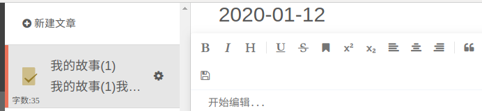

# 荏苒资讯的文章模块开发

创建文章模块的子引用

```bash
cd renranapi/apps
python ../../manage.py startapp article
```

注册子应用

```python
INSTALLED_APPS = [
	# ....
    'article',
]
```

## 模型代码

`aricle/models.py` 代码：

```python
from django.db import models
from renranapi.utils.models import BaseModel
from users.models import User
# create your models here.
class ArticleCollection(BaseModel):
    """文集模型"""
    user = models.ForeignKey(User, on_delete=models.DO_NOTHING, verbose_name="用户")
    class Meta:
        db_table = "rr_article_collection"
        verbose_name = "文集"
        verbose_name_plural = verbose_name

class Special(BaseModel):
    """专题模型"""
    image = models.ImageField(null=True, blank=True, verbose_name="封面图片")
    notice = models.TextField(null=True, blank=True, verbose_name="专题公告")
    article_count = models.IntegerField(default=0, null=True, blank=True, verbose_name="文章总数")
    follow_count = models.IntegerField(default=0, null=True, blank=True, verbose_name="关注数量")
    collect_count = models.IntegerField(default=0, null=True, blank=True, verbose_name="收藏数量")
    user = models.ForeignKey(User, on_delete=models.DO_NOTHING, verbose_name="创建人")
    class Meta:
        db_table = "rr_special"
        verbose_name = "专题"
        verbose_name_plural = verbose_name

class Article(BaseModel):
    """文章模型"""
    content = models.TextField(null=True, blank=True, verbose_name="文章内容")
    user = models.ForeignKey(User, on_delete=models.DO_NOTHING, verbose_name="作者")
    collection = models.ForeignKey(ArticleCollection, on_delete=models.CASCADE, verbose_name="文集")
    pub_date = models.DateTimeField(null=True, default=None, verbose_name="发布时间")
    access_pwd = models.CharField(max_length=15,null=True, blank=True, verbose_name="访问密码")
    read_count = models.IntegerField(default=0, null=True, blank=True, verbose_name="阅读量")
    like_count = models.IntegerField(default=0, null=True, blank=True, verbose_name="点赞量")
    collect_count = models.IntegerField(default=0, null=True, blank=True, verbose_name="收藏量")
    comment_count = models.IntegerField(default=0, null=True, blank=True, verbose_name="评论量")
    reward_count = models.IntegerField(default=0, null=True, blank=True, verbose_name="赞赏量")
    is_public = models.BooleanField(default=False, verbose_name="是否公开")
    class Meta:
        db_table = "rr_article"
        verbose_name = "文章"
        verbose_name_plural = verbose_name

class SpecialArticle(BaseModel):
    """文章和专题的绑定关系"""
    article = models.ForeignKey(Article, on_delete=models.CASCADE, verbose_name="文章")
    special = models.ForeignKey(Special, on_delete=models.CASCADE, verbose_name="专题")
	
    class Meta:
        db_table = "rr_special_article"
        verbose_name = "专题的文章"
        verbose_name_plural = verbose_name


class SpecialManager(BaseModel):
    """专题管理员"""
    user = models.ForeignKey(User, on_delete=models.DO_NOTHING, verbose_name="管理员")
    special = models.ForeignKey(Special, on_delete=models.CASCADE, verbose_name="专题")

    class Meta:
        db_table = "rr_special_manager"
        verbose_name = "专题的管理员"
        verbose_name_plural = verbose_name

class SpecialFocus(BaseModel):
    """专题关注"""
    user = models.ForeignKey(User, on_delete=models.DO_NOTHING, verbose_name="管理员")
    special = models.ForeignKey(Special, on_delete=models.CASCADE, verbose_name="专题")

    class Meta:
        db_table = "rr_special_focus"
        verbose_name = "专题的关注"
        verbose_name_plural = verbose_name

class SpecialCollection(BaseModel):
    """专题收藏"""
    user = models.ForeignKey(User, on_delete=models.DO_NOTHING, verbose_name="管理员")
    special = models.ForeignKey(Special, on_delete=models.CASCADE, verbose_name="专题")

    class Meta:
        db_table = "rr_special_collection"
        verbose_name = "专题收藏"
        verbose_name_plural = verbose_name


class ArticleImage(BaseModel):
    """文章图片"""
    group = models.CharField(max_length=15,null=True, blank=True, verbose_name="组名")
    image = models.ImageField(null=True, blank=True, verbose_name="图片地址")

    class Meta:
        db_table = "rr_article_image"
        verbose_name = "文章图片"
        verbose_name_plural = verbose_name
```

数据迁移

```
python manage.py makemigrations
python manage.py migrate
```

## 相关依赖

### 在 vue 中引入集成 markdown 富文本编辑器

这里我们使用 mavonEditor，链接：https://github.com/hinesboy/mavonEditor

在客户端的根目录下安装：

```bash
cd renran_pc
npm install mavon-editor --save
```

在 `main.js` 中注册编辑器组件

```javascript
import mavonEditor from 'mavon-editor'
import 'mavon-editor/dist/css/index.css'
// 注册mavon-editor组件
Vue.use(mavonEditor);
new Vue({
    'el': '#main'
})
```

## 写文章页面的创建

创建 `Write.vue` 组件，提供给用户编写文章

```vue
 <template>
  <div class="write">
    <div class="_2v5v5">
      <div class="_3zibT"><a href="/">回首页</a></div>
      <div class="_1iZMb">
        <div class="_33Zlg" @click="collection_form=true"><i class="fa fa-plus"></i><span>新建文集</span></div>
        <div class="_2G97m">
          <form class="M8J6Q" :class="collection_form?'_2a1Rp':'_1mU5v'">
            <input type="text" placeholder="请输入文集名..." name="name" class="_1CtV4">
            <button type="submit" class="dwU8Q _3zXcJ _3QfkW"><span>提 交</span></button>
            <button type="button" class="vIzwB _3zXcJ" @click="collection_form=false"><span>取 消</span></button>
          </form>
        </div>
      </div>
      <ul class="_3MbJ4 _3t059">
        <li class="_3DM7w _31PCv" title="日记本">
          <div class="_3P4JX _2VLy-">
            <i class="fa fa-gear"></i>
            <span>
              <ul class="_2V8zt _3FcHm _2w9pn" :class="true?'':'NvfK4'">
                <li class="_2po2r cRfUr" title="">
                  <span class=""><i class="fa fa-pencil-square-o _22XWG"></i>修改文集</span>
                </li>
                <li class="_2po2r cRfUr" title="">
                  <span class=""><i class="fa fa-trash-o _22XWG"></i>删除文集</span>
                </li>
              </ul>
            </span>
          </div>
          <span>日记本</span>
        </li>
        <li class="_3DM7w" title="随笔"><span>随笔</span></li>
      </ul>
      <div style="height: 50px;"></div>
      <div role="button" class="h-5Am">
        <span class="ant-dropdown-trigger"><i class="fa fa-bars"></i><span>设置</span></span>
        <span class="Yv5Zx">遇到问题<i class="fa fa-question-circle-o"></i></span>
      </div>
    </div>
    <div class="rQQG7">
      <div class="_3revO _2mnPN">
        <div class="_3br9T">
          <div>
            <div class="_1GsW5"><i class="fa fa-plus-circle"></i><span> 新建文章</span></div>
            <ul class="_2TxA-">
              <li class="_25Ilv _33nt7" title="ABC">
                <i class="_13kgp _2m93u"></i>
                <div class="_3P4JX poOXI">
                  <i class="fa fa-gear"></i>
                  <span>
                    <ul class="_2V8zt _3FcHm _2w9pn">
                      <li class="_2po2r cRfUr" title=""><span class=""><i class="fa fa-share _22XWG"></i>直接发布</span></li>
                      <li class="_2po2r cRfUr" title=""><span class=""><i class="fa fa-clock-o _22XWG"></i>定时发布</span></li>
                      <li class="_2po2r cRfUr" title=""><span class="_20tIi"><i class="iconfont ic-paid _22XWG"></i>发布为付费文章</span></li>
                      <li class="_2po2r cRfUr" title=""><span class=""><i class="iconfont ic-set _22XWG"></i>设置发布样式</span></li>
                      <li class="_3nZXj _2_WAp _3df2u _2po2r cRfUr" title=""><span class=""><i class="fa fa-folder-open _22XWG"></i>移动文章
                        <div class="_3x4X_">
                          <ul class="_2KzJx oGKRI _3DXDE _2w9pn">
                            <li class="_2po2r cRfUr" title="随笔"><span class="">随笔</span></li>
                          </ul>
                        </div>
                      </span>
                      </li>
                      <li class="_2po2r cRfUr" title=""><span class=""><i class="fa fa-history _22XWG"></i>历史版本</span></li>
                      <li class="_2po2r cRfUr" title=""><span class=""><i class="fa fa-trash-o _22XWG"></i>删除文章</span></li>
                      <li class="_2po2r cRfUr" title=""><span class=""><i class="fa fa-ban _22XWG"></i>设置禁止转载</span></li>
                    </ul>
                  </span>
                </div>
                <span class="NariC">ABC</span>
                <span class="hLzJv">题目：有四个数字：1、2、3、4，能组成多少个互不相同且无重复数字的三位数？各是多少？

题目：企业发放的奖金根据利润提成</span>
                <span class="_29C-V">字数:905</span>
              </li>
              <li class="_25Ilv" title="2020-01-12">
                <i class="_13kgp"></i>
                <span class="NariC">2020-01-12</span>
                <span class="hLzJv">题目：有四个数字：1、2、3、4，能组成多少个互不相同且无重复数字的三位数？各是多少？

题目：企业发放的奖金根据利润提成</span>
              </li>
            </ul>
            <div class="_2cVn3"><i class="fa fa-plus"></i><span> 在下方新建文章</span></div>
          </div>
        </div>
      </div>
      <input type="text" class="_24i7u" value="2020-01-12">
      <div id="editor">
        <mavon-editor
          style="height: 100%"
          v-model="editorContent"
          :ishljs="true"
          ref=md
          @imgAdd="imgAdd"
          @imgDel="imgDel"
        ></mavon-editor>
      </div>
    </div>
  </div>
</template>
<script>
  import { mavonEditor } from 'mavon-editor'
  import 'mavon-editor/dist/css/index.css'
    export default {
        name: "Write",
        data(){
            return {
                editorContent:"",
                img_file:[],
                collection_form:false,
            }
        },
        watch:{
            editorContent(){
                console.log(this.editorContent)
            }
        },
        mounted(){
            document.querySelector("#editor").style.height = document.documentElement.clientHeight-document.querySelector("._24i7u").clientHeight+"px";
        },
        components: {
          mavonEditor
        },
        methods:{
          // 绑定@imgAdd event
          imgAdd(pos, $file){
              // 添加文件
          },
          imgDel(pos) {
              // 删除文件
          }
        }
    }
</script>

<style scoped>
  body *{
    box-sizing: border-box;
  }
  .write{
    position: absolute;
    top: 0;
    right: 0;
    left: 0;
    bottom: 0;
    margin: 0;
  }
  ._2v5v5 {
    position: relative;
    height: 100%;
    overflow-y: auto;
    background-color: #404040;
    color: #f2f2f2;
    z-index: 100;
    width: 16.66666667%;
    display: block;
    flex: 0 0 auto;
    float: left;
    padding-right: 0;
    padding-left: 0;
    min-height: 1px;
  }
  ._3zibT {
    padding: 30px 18px 5px;
    text-align: center;
    font-size: 14px;
  }
  ._3zibT a {
    display: block;
    font-size: 15px;
    padding: 9px 0;
    color: #ec7259;
    border: 1px solid rgba(236,114,89,.8);
    border-radius: 20px;
    -webkit-transition: border-color .2s ease-in;
    -o-transition: border-color .2s ease-in;
    transition: border-color .2s ease-in;
  }
  ._1iZMb {
    padding: 0 15px;
    margin-top: 20px;
    margin-bottom: 10px;
    font-size: 14px;
    line-height: 1.5;
  }
  ._1iZMb ._33Zlg {
    cursor: pointer;
    color: #f2f2f2;
    transition: color .2s cubic-bezier(.645,.045,.355,1);
    font-size: 14px;
  }
  ._1iZMb ._33Zlg .fa+span {
    margin-left: 4px;
  }
  ._1iZMb ._2G97m {
    overflow: hidden;
  }
  ._1iZMb ._2a1Rp {
    height: 85px;
    opacity: 1;
    margin-top: 10px;
    transition: all .2s ease-out;
    overflow: hidden;
  }
  ._1CtV4 {
    width: 100%;
    height: 35px;
    color: #ccc;
    background-color: #595959;
    border: 1px solid #333;
    padding: 4px 6px;
    font-size: 14px;
    line-height: 20px;
    outline: 0;
    overflow: visible;
    margin: 10px 0 0;
    margin-bottom: 10px;
  }
._3zXcJ {
    position: relative;
    display: inline-block;
    text-align: center;
    height: 30px;
    line-height: 20px;
    padding: 4px 12px;
    border: 1px solid transparent;
    border-radius: 15px;
    font-size: 14px;
    font-weight: 500;
    -ms-touch-action: manipulation;
    touch-action: manipulation;
    cursor: pointer;
    background-image: none;
    white-space: nowrap;
    user-select: none;
    transition: all .2s cubic-bezier(.645,.045,.355,1);
    text-transform: none;
    color: #42c02e;
    border-color: #42c02e;
    margin-left: 4px;
    background-color: #404040;
  }
  .vIzwB {
    color: #999;
    outline: 0;
  }
  ._1iZMb ._1mU5v {
    height: 0;
    opacity: 0;
    margin-top: 0;
  }
  ._1iZMb ._2a1Rp {
    height: 85px;
    opacity: 1;
    margin-top: 10px;
  }
  ._1iZMb ._1mU5v, ._1iZMb ._2a1Rp {
    transition: all .2s ease-out;
  }
  .vIzwB, .vIzwB:focus, .vIzwB:hover {
    background-color: #404040;
    border-color: transparent;
  }
  .dwU8Q {
      margin-left: 4px;
      background-color: #404040;
  }
._3t059 {
    position: relative;
    z-index: 0;
    background-color: #8c8c8c;
}
._3MbJ4 {
    margin-bottom: 0;
}
._3DM7w {
    position: relative;
    line-height: 40px;
    list-style: none;
    font-size: 15px;
    color: #f2f2f2;
    background-color: #404040;
    padding: 0 15px;
    cursor: pointer;
    -webkit-user-select: none;
    -moz-user-select: none;
    -ms-user-select: none;
    user-select: none;
}
._31PCv {
    background-color: #666;
    border-left: 3px solid #ec7259;
    padding-left: 12px;

}
._3DM7w ._2VLy- {
    float: right;
}
._3P4JX {
    font-size: 16px;
    width: 40px;
    text-align: center;
    position: relative;
    min-height: 30px;
    max-height: 50px;
}
._3DM7w span {
    display: block;
    margin-right: 20px;
    overflow: hidden;
    text-overflow: ellipsis;
    white-space: nowrap;
}
._2w9pn {
    font-size: 14px;
    -webkit-box-shadow: 0 5px 10px rgba(0,0,0,.2);
    box-shadow: 0 5px 10px rgba(0,0,0,.2);
    list-style: none;
    background-color: #fff;
    color: #595959;
    border-radius: 6px;
}
._3P4JX ul._2V8zt {
    display: none;
    position: absolute;
    z-index: 99;
    right: 0;
}
._3P4JX ul._3FcHm {
    top: 100%;
}
._2po2r {
    padding: 10px 20px;
    line-height: 20px;
    white-space: nowrap;
    text-align: left;
    position: relative;
    border-bottom: 1px solid #d9d9d9;
}
._3DM7w:hover, .JUBSP {
    background-color: #666;
}
.h-5Am {
    display: block;
    width: 16.66666667%;
    position: fixed;
    bottom: 0;
    height: 50px;
    line-height: 50px;
    font-size: 15px;
    padding-left: 15px;
    -webkit-user-select: none;
    -moz-user-select: none;
    -ms-user-select: none;
    user-select: none;
    z-index: 150;
    background-color: #404040;
}
.cRfUr {
    border-bottom: 1px solid #d9d9d9;
}
._2po2r:last-child {
    border-radius: 0 0 4px 4px;
    border-bottom: 0;
}
._2po2r:first-child {
    border-radius: 4px 4px 0 0;
}
._2po2r ._22XWG {
    margin-right: 5px;
}
._2po2r:hover {
    background-color: #666;
    color: #fff;
}
._3DM7w span {
    display: block;
    margin-right: 20px;
    overflow: hidden;
    -o-text-overflow: ellipsis;
    text-overflow: ellipsis;
    white-space: nowrap;
}
._3P4JX ul.NvfK4 {
    display: block;
}
._3P4JX ul._2V8zt:before {
    position: absolute;
    right: 12px;
    content: "";
    display: inline-block;
}
._3P4JX ul._3FcHm:before {
    border-left: 9px solid transparent;
    border-right: 9px solid transparent;
    border-bottom: 9px solid #fff;
    top: -9px;
}
.h-5Am .ant-dropdown-trigger {
    display: inline-block;
    color: #999;
    cursor: pointer;
    -webkit-transition: color .2s cubic-bezier(.645,.045,.355,1);
    -o-transition: color .2s cubic-bezier(.645,.045,.355,1);
    transition: color .2s cubic-bezier(.645,.045,.355,1);
}
.h-5Am .fa+span {
    margin-left: 4px;
}
.h-5Am .Yv5Zx {
    float: right;
    margin-right: 15px;
    color: #999;
    cursor: pointer;
  }
  .h-5Am .Yv5Zx i {
      margin-left: 5px;
  }
  .rQQG7{
    height: 100%;
    display: block;
    width: 33.33333%;
    border-right: 1px solid #d9d9d9;
  }
  ._3revO {
    overflow-y: scroll;
    height: 100%;
    position: relative;
  }
  ._3br9T {
    position: relative;
    transition: opacity .3s cubic-bezier(.645,.045,.355,1);
    opacity: 1;
  }
  ._1GsW5 {
    line-height: 20px;
    font-size: 15px;
    font-weight: 400;
    padding: 20px 0 20px 25px;
    cursor: pointer;
    color: #595959;
  }
  ._1GsW5:hover {
    color: #262626;
  }
  ._2TxA- {
    position: relative;
    margin-bottom: 0;
    background-color: #efe9d9;
    border-top: 1px solid #d9d9d9;
  }
  ._25Ilv {
    position: relative;
    height: 90px;
    color: #595959;
    background-color: #fff;
    margin-bottom: 0;
    padding: 15px 10px 15px 60px;
    box-shadow: 0 0 0 1px #d9d9d9;
    border-left: 5px solid transparent;
    list-style: none;
    line-height: 60px;
    cursor: pointer;
    user-select: none;
  }
  ._25Ilv ._2m93u {
    background: url(/static/image/sprite.9d24217.png) no-repeat -50px -25px;
    background-size: 250px;
    position: absolute;
    top: 30px;
    left: 20px;
    width: 22px;
    height: 30px;
  }
  ._1tqbw, ._25Ilv:hover, ._33nt7 {
    background-color: #e6e6e6;
  }
  ._25Ilv ._2m93u {
    background: url(/static/image/sprite.9d24217.png) no-repeat -50px -25px;
    background-size: 250px;
    position: absolute;
    top: 30px;
    left: 20px;
    width: 22px;
    height: 30px;
  }
  ._3P4JX {
    font-size: 16px;
    width: 40px;
    text-align: center;
    position: relative;
    min-height: 30px;
    max-height: 50px;
}
  ._25Ilv .poOXI {
    float: right;
}
  ._33nt7 {
    border-left-color: #ec7259;
  }
  ._25Ilv .hLzJv, ._25Ilv .NariC {
    display: block;
    height: 30px;
    line-height: 30px;
    margin-right: 40px;
    overflow: hidden;
    -o-text-overflow: ellipsis;
    text-overflow: ellipsis;
    white-space: nowrap;
    font-size: 18px;
    font-family: sans-serif;
}
  ._2TxA- {
    position: relative;
    margin-bottom: 0;
    background-color: #efe9d9;
    border-top: 1px solid #d9d9d9;
}
  ._3P4JX ul._2V8zt {
    display: none;
    position: absolute;
    z-index: 99;
    right: 0;
}
  ._3P4JX ul._3FcHm {
    top: 100%;
}
  ._2w9pn {
    font-size: 14px;
    box-shadow: 0 5px 10px rgba(0,0,0,.2);
    list-style: none;
    background-color: #fff;
    color: #595959;
    border-radius: 6px;
}
  ._3P4JX ul.NvfK4 {
    display: block;
}
  ._3P4JX ul._3FcHm:before {
    border-left: 9px solid transparent;
    border-right: 9px solid transparent;
    border-bottom: 9px solid #fff;
    top: -9px;
}
  ._3P4JX ul._2V8zt:before {
    position: absolute;
    right: 12px;
    content: "";
    display: inline-block;
}
._25Ilv ._13kgp {
    position: absolute;
    top: 30px;
    left: 20px;
    width: 22px;
    height: 30px;
    background: url(/static/image/sprite.9d24217.png) no-repeat 0 -25px;
    background-size: 250px;
}
._25Ilv ._13kgp {
    position: absolute;
    top: 30px;
    left: 20px;
    width: 22px;
    height: 30px;
    background: url(/static/image/sprite.9d24217.png) no-repeat 0 -25px;
    background-size: 250px;
}
._25Ilv ._2m93u {
    background: url(/static/image/sprite.9d24217.png) no-repeat -50px -25px;
    background-size: 250px;
}
._25Ilv ._29C-V {
    position: absolute;
    bottom: 2px;
    left: 5px;
    font-size: 9px;
    line-height: 16px;
    color: #595959;
}
._2cVn3 {
    line-height: 30px;
    padding: 20px 0 20px 25px;
    cursor: pointer;
    color: #999;
    margin-bottom: 80px;
}
._24i7u {
    flex-shrink: 0;
    padding: 0 80px 10px 40px;
    margin-bottom: 0;
    border: none;
    font-size: 30px;
    font-weight: 400;
    line-height: 30px;
    box-shadow: none;
    color: #595959;
    background-color: transparent;
    outline: none;
    border-radius: 0;
    overflow: hidden;
    text-overflow: ellipsis;
    white-space: nowrap;
    position: absolute;
    top: 0;
    right: 0;
    width: 66.666666%;
}
  #editor {
    margin: auto;
    width: 66.666666%;
    position: absolute;
    right: 0;
    top: 44px;
    height: 580px;
  }
</style>
```

把雪碧图 `sprite.9d24217.png` 复制到  `/static/image` 文件夹中

路由代码：

```javascript
// 。。。
import Write from "@/components/Write"


export default new Router({
  mode: "history",
  routes: [
     // ....
      {
       name:"Write",
       path:"/write",
       component: Write,
     },
  ]
})

```

在 `Header.vue` 提供跳转链接

```vue
<router-link class="btn write-btn" to="/write">写文章</router-link>
```

## 判断用户是否已经登录

```vue
<template>
  <div class="write" v-show="is_show_page">
    <div class="_2v5v5">
      <div class="_3zibT"><a href="/">回首页</a></div>
      <div class="_1iZMb">
        <div class="_33Zlg" @click="collection_form=true"><i class="fa fa-plus"></i><span>新建文集</span></div>
        <div class="_2G97m">
          <form class="M8J6Q" :class="collection_form?'_2a1Rp':'_1mU5v'">
            <input type="text" placeholder="请输入文集名..." name="name" class="_1CtV4">
            <button type="submit" class="dwU8Q _3zXcJ _3QfkW"><span>提 交</span></button>
            <button type="button" class="vIzwB _3zXcJ" @click="collection_form=false"><span>取 消</span></button>
          </form>
        </div>
      </div>
      <ul class="_3MbJ4 _3t059">
        <li class="_3DM7w _31PCv" title="日记本">
          <div class="_3P4JX _2VLy-">
            <i class="fa fa-gear"></i>
            <span>
              <ul class="_2V8zt _3FcHm _2w9pn" :class="true?'':'NvfK4'">
                <li class="_2po2r cRfUr" title="">
                  <span class=""><i class="fa fa-pencil-square-o _22XWG"></i>修改文集</span>
                </li>
                <li class="_2po2r cRfUr" title="">
                  <span class=""><i class="fa fa-trash-o _22XWG"></i>删除文集</span>
                </li>
              </ul>
            </span>
          </div>
          <span>日记本</span>
        </li>
        <li class="_3DM7w" title="随笔"><span>随笔</span></li>
      </ul>
      <div style="height: 50px;"></div>
      <div role="button" class="h-5Am">
        <span class="ant-dropdown-trigger"><i class="fa fa-bars"></i><span>设置</span></span>
        <span class="Yv5Zx">遇到问题<i class="fa fa-question-circle-o"></i></span>
      </div>
    </div>
    <div class="rQQG7">
      <div class="_3revO _2mnPN">
        <div class="_3br9T">
          <div>
            <div class="_1GsW5"><i class="fa fa-plus-circle"></i><span> 新建文章</span></div>
            <ul class="_2TxA-">
              <li class="_25Ilv _33nt7" title="ABC">
                <i class="_13kgp _2m93u"></i>
                <div class="_3P4JX poOXI">
                  <i class="fa fa-gear"></i>
                  <span>
                    <ul class="_2V8zt _3FcHm _2w9pn">
                      <li class="_2po2r cRfUr" title=""><span class=""><i class="fa fa-share _22XWG"></i>直接发布</span></li>
                      <li class="_2po2r cRfUr" title=""><span class=""><i class="fa fa-clock-o _22XWG"></i>定时发布</span></li>
                      <li class="_2po2r cRfUr" title=""><span class="_20tIi"><i class="iconfont ic-paid _22XWG"></i>发布为付费文章</span></li>
                      <li class="_2po2r cRfUr" title=""><span class=""><i class="iconfont ic-set _22XWG"></i>设置发布样式</span></li>
                      <li class="_3nZXj _2_WAp _3df2u _2po2r cRfUr" title=""><span class=""><i class="fa fa-folder-open _22XWG"></i>移动文章
                        <div class="_3x4X_">
                          <ul class="_2KzJx oGKRI _3DXDE _2w9pn">
                            <li class="_2po2r cRfUr" title="随笔"><span class="">随笔</span></li>
                          </ul>
                        </div>
                      </span>
                      </li>
                      <li class="_2po2r cRfUr" title=""><span class=""><i class="fa fa-history _22XWG"></i>历史版本</span></li>
                      <li class="_2po2r cRfUr" title=""><span class=""><i class="fa fa-trash-o _22XWG"></i>删除文章</span></li>
                      <li class="_2po2r cRfUr" title=""><span class=""><i class="fa fa-ban _22XWG"></i>设置禁止转载</span></li>
                    </ul>
                  </span>
                </div>
                <span class="NariC">ABC</span>
                <span class="hLzJv">题目：有四个数字：1、2、3、4，能组成多少个互不相同且无重复数字的三位数？各是多少？

题目：企业发放的奖金根据利润提成</span>
                <span class="_29C-V">字数:905</span>
              </li>
              <li class="_25Ilv" title="2020-01-12">
                <i class="_13kgp"></i>
                <span class="NariC">2020-01-12</span>
                <span class="hLzJv">题目：有四个数字：1、2、3、4，能组成多少个互不相同且无重复数字的三位数？各是多少？

题目：企业发放的奖金根据利润提成</span>
              </li>
            </ul>
            <div class="_2cVn3"><i class="fa fa-plus"></i><span> 在下方新建文章</span></div>
          </div>
        </div>
      </div>
      <input type="text" class="_24i7u" value="2020-01-12">
      <div id="editor">
        <mavon-editor
          style="height: 100%"
          v-model="editorContent"
          :ishljs="true"
          ref=md
          @imgAdd="imgAdd"
          @imgDel="imgDel"
        ></mavon-editor>
      </div>
    </div>
  </div>
</template>
<script>
    import { mavonEditor } from 'mavon-editor'
    import 'mavon-editor/dist/css/index.css'
    export default {
        name: "Write",
        data(){
            return {
                is_show_page: false,
                editorContent:"",
                img_file:[],
                collection_form:false,
            }
        },
        watch:{
            editorContent(){
                console.log(this.editorContent);
            }
        },
        created(){
          let token = this.$settings.check_user_login(this);
          if(token){
              this.is_show_page = true;
          }
        },
        mounted(){
            document.querySelector("#editor").style.height = document.documentElement.clientHeight-document.querySelector("._24i7u").clientHeight+"px";
        },
        components: {
          mavonEditor
        },
        methods:{
          // 绑定@imgAdd event
          imgAdd(pos, $file){
              // 添加文件
          },
          imgDel(pos) {
              // 删除文件
          }
        }
    }
</script>

```

`settings.py`，代码：

```python
export default {
  Host:"http://api.renran.cn:8000",
  TC_captcha:{
    app_id: "2072894469",
  },

  save_user(storage, data){
    if(storage === sessionStorage){
      var storage2 = localStorage;
    }else{
      var storage2 = sessionStorage;
    }

    storage2.removeItem("user_token");
    storage2.removeItem("user_name");
    storage2.removeItem("user_id");
    storage2.removeItem("user_nickname");
    storage2.removeItem("user_avatar");

    storage.user_token = data.token;
    storage.user_name = data.username;
    storage.user_id = data.id;
    storage.user_nickname = data.nickname;
    storage.user_avatar = data.avatar;
  },
  jump_page(vm,message, title="登陆成功",confirm_text="个人中心",confirm_url="/user", cancel_text="返回上一页"){
    vm.$confirm(message, title, {
      confirmButtonText: confirm_text,
      cancelButtonText: cancel_text,
      type: 'success'
    }).then(() => {
      // 跳转到个人中心
      vm.$router.push(confirm_url);
    }).catch(() => {
      // 跳转到上一页
      vm.$router.back();
    });
  },
  check_user_login(vm){
    // 判断用户是否已经登陆
    let token = localStorage.user_token || sessionStorage.user_token;
    if(!token){
      // 跳转到登陆页面
      this.jump_page(vm, "尊敬的游客, 您尚未登陆!请登陆后再进行操作!", "警告","去登陆", "/user/login");
    }

    return token;
  }
}

```

> 注意，上面 `settings.py` 里面的 jump_page 函数的第二个参数进行了改动，所以请修改原来在组件中调用此函数的参数！！！

## 文集操作

### 显示当前登录用户的所有文集

视图 `article/views.py`，代码：

```python
from django.shortcuts import render

# Create your views here.
from rest_framework.generics import ListAPIView
from .models import ArticleCollection
from .serializers import CollectionModelSerializer
from rest_framework.permissions import IsAuthenticated
class MyCollectionListAPIView(ListAPIView):
    """我的文集"""
    serializer_class = CollectionModelSerializer
    permission_classes = [IsAuthenticated] # 必须是登陆用户才能访问过来
    def get_queryset(self):
        user = self.request.user
        """重写queryset属性值"""
        ret = ArticleCollection.objects.filter(user=user).order_by("orders","-id")
        if len(ret)<1:
            # 当用户如果没有文集,在默认给用户创建2个文集
            collection1 = ArticleCollection.objects.create(
                user=user,
                name="日记本",
                orders=1,
            )
            collection2 = ArticleCollection.objects.create(
                user=user,
                name="随笔",
                orders=2,
            )
            ret = [
                {"id": collection1.pk, "name": collection1.name},
                {"id": collection2.pk, "name": collection2.name},
           ]

        return ret
```

序列化器，代码：

```python
from rest_framework import serializers
from .models import ArticleCollection
class CollectionModelSerializer(serializers.ModelSerializer):
    class Meta:
        model = ArticleCollection
        fields = ["id","name"]
```

路由，代码：

```python
from django.urls import path
from . import views
urlpatterns = [
    path("collection/", views.MyCollectionListAPIView.as_view()),
]
```

客户端中展示所有文集，代码：

```vue
<template>
  <div class="write" v-show="is_show_page">
    <div class="_2v5v5">
      <div class="_3zibT"><a href="/">回首页</a></div>
      <div class="_1iZMb">
        <div class="_33Zlg" @click="collection_form=true"><i class="fa fa-plus"></i><span>新建文集</span></div>
        <div class="_2G97m">
          <form class="M8J6Q" :class="collection_form?'_2a1Rp':'_1mU5v'">
            <input type="text" placeholder="请输入文集名..." name="name" class="_1CtV4">
            <button type="submit" class="dwU8Q _3zXcJ _3QfkW"><span>提 交</span></button>
            <button type="button" class="vIzwB _3zXcJ" @click="collection_form=false"><span>取 消</span></button>
          </form>
        </div>
      </div>
      <ul class="_3MbJ4 _3t059">
        <li class="_3DM7w" :class="current_collection==key?'_31PCv':''" :title="collection.name" v-for="collection,key in collection_list" :key="key">
          <div class="_3P4JX _2VLy-">
            <i class="fa fa-gear"></i>
            <span>
              <ul class="_2V8zt _3FcHm _2w9pn" :class="true?'':'NvfK4'">
                <li class="_2po2r cRfUr" title="">
                  <span class=""><i class="fa fa-pencil-square-o _22XWG"></i>修改文集</span>
                </li>
                <li class="_2po2r cRfUr" title="">
                  <span class=""><i class="fa fa-trash-o _22XWG"></i>删除文集</span>
                </li>
              </ul>
            </span>
          </div>
          <span @click="current_collection=key">{{collection.name}}</span>
        </li>
      </ul>
      <div style="height: 50px;"></div>
      <div role="button" class="h-5Am">
        <span class="ant-dropdown-trigger"><i class="fa fa-bars"></i><span>设置</span></span>
        <span class="Yv5Zx">遇到问题<i class="fa fa-question-circle-o"></i></span>
      </div>
    </div>
    <div class="rQQG7">
      <div class="_3revO _2mnPN">
        <div class="_3br9T">
          <div>
            <div class="_1GsW5"><i class="fa fa-plus-circle"></i><span> 新建文章</span></div>
            <ul class="_2TxA-">
              <li class="_25Ilv _33nt7" title="ABC">
                <i class="_13kgp _2m93u"></i>
                <div class="_3P4JX poOXI">
                  <i class="fa fa-gear"></i>
                  <span>
                    <ul class="_2V8zt _3FcHm _2w9pn">
                      <li class="_2po2r cRfUr" title=""><span class=""><i class="fa fa-share _22XWG"></i>直接发布</span></li>
                      <li class="_2po2r cRfUr" title=""><span class=""><i class="fa fa-clock-o _22XWG"></i>定时发布</span></li>
                      <li class="_2po2r cRfUr" title=""><span class="_20tIi"><i class="iconfont ic-paid _22XWG"></i>发布为付费文章</span></li>
                      <li class="_2po2r cRfUr" title=""><span class=""><i class="iconfont ic-set _22XWG"></i>设置发布样式</span></li>
                      <li class="_3nZXj _2_WAp _3df2u _2po2r cRfUr" title=""><span class=""><i class="fa fa-folder-open _22XWG"></i>移动文章
                        <div class="_3x4X_">
                          <ul class="_2KzJx oGKRI _3DXDE _2w9pn">
                            <li class="_2po2r cRfUr" title="随笔"><span class="">随笔</span></li>
                          </ul>
                        </div>
                      </span>
                      </li>
                      <li class="_2po2r cRfUr" title=""><span class=""><i class="fa fa-history _22XWG"></i>历史版本</span></li>
                      <li class="_2po2r cRfUr" title=""><span class=""><i class="fa fa-trash-o _22XWG"></i>删除文章</span></li>
                      <li class="_2po2r cRfUr" title=""><span class=""><i class="fa fa-ban _22XWG"></i>设置禁止转载</span></li>
                    </ul>
                  </span>
                </div>
                <span class="NariC">ABC</span>
                <span class="hLzJv">题目：有四个数字：1、2、3、4，能组成多少个互不相同且无重复数字的三位数？各是多少？

题目：企业发放的奖金根据利润提成</span>
                <span class="_29C-V">字数:905</span>
              </li>
              <li class="_25Ilv" title="2020-01-12">
                <i class="_13kgp"></i>
                <span class="NariC">2020-01-12</span>
                <span class="hLzJv">题目：有四个数字：1、2、3、4，能组成多少个互不相同且无重复数字的三位数？各是多少？

题目：企业发放的奖金根据利润提成</span>
              </li>
            </ul>
            <div class="_2cVn3"><i class="fa fa-plus"></i><span> 在下方新建文章</span></div>
          </div>
        </div>
      </div>
      <input type="text" class="_24i7u" value="2020-01-12">
      <div id="editor">
        <mavon-editor
          style="height: 100%"
          v-model="editorContent"
          :ishljs="true"
          ref=md
          @imgAdd="imgAdd"
          @imgDel="imgDel"
        ></mavon-editor>
      </div>
    </div>
  </div>
</template>
<script>
    import { mavonEditor } from 'mavon-editor'
    import 'mavon-editor/dist/css/index.css';
    import "../../static/font-awesome/css/font-awesome.css";
    export default {
        name: "Write",
        data(){
            return {
                is_show_page: false,
                editorContent:"",
                img_file:[],
                collection_form:false,
                token: "",
                collection_list:[],
                current_collection: 0, // 默认让用户选中的文集的下标为0
            }
        },
        watch:{
            editorContent(){
                console.log(this.editorContent);
            }
        },
        created(){
          this.token = this.$settings.check_user_login(this);
          if(this.token){
              this.is_show_page = true;
          }
          this.get_collection();
        },
        mounted(){
            document.querySelector("#editor").style.height = document.documentElement.clientHeight-document.querySelector("._24i7u").clientHeight+"px";
        },
        components: {
          mavonEditor
        },
        methods:{
          // 绑定@imgAdd event
          imgAdd(pos, $file){
              // 添加文件
          },
          imgDel(pos) {
              // 删除文件
          },
          get_collection(){
              // 获取当前登陆用户的文集
              this.$axios.get(`${this.$settings.Host}/article/collection/`,{
                  headers:{
                      Authorization: "jwt " + this.token,
                  }
              }).then(response=>{
                  this.collection_list = response.data;
              }).catch(error=>{
                  this.$message.error("对不起,无法获取当前用户的文集列表!");
              });
          }
        }
    }
</script>
```

对于文集列表中的图标丢失，我们需要把 font-awesome 目录放到项目的 static 目录下即可。

### 添加文集

视图代码：

```python
from rest_framework.generics import ListAPIView, CreateAPIView, UpdateAPIView, DestroyAPIView
from rest_framework.permissions import IsAuthenticated
from . import serializers, models


class CollectionListAPIView(ListAPIView, CreateAPIView, UpdateAPIView, DestroyAPIView):
    permission_classes = [IsAuthenticated]    # 设置权限，仅登录用户可以访问
    def get_queryset(self):
        user = self.request.user
        self.request.data['user'] = user.id
        collection_list = models.Collection.objects.filter(user=user).order_by('orders', '-id')
        # 如果用户没有文集，将会自动创建两个文集
        if not collection_list:
            models.Collection.objects.create(
                user=user,
                name='日记本',
                orders=1,
            )
            models.Collection.objects.create(
                user=user,
                name='随笔',
                orders=2,
            )
            collection_list =  models.Collection.objects.filter(user=user).order_by('orders', '-id')
        return collection_list

    def get_serializer_class(self):
        """将 user 传入到 request.data 中"""
        user = self.request.user
        self.request.data['user'] = user.id
        return serializers.CollectionModelSerializer
```

序列化器，代码：

```python
from rest_framework import serializers
from rest_framework.exceptions import ValidationError
from . import models


class CollectionModelSerializer(serializers.ModelSerializer):
    class Meta:
        model = models.Collection
        fields = ['id', 'name', 'user']
        extra_kwargs = {
            'user': {'write_only': True}
        }

    def validate(self, attrs):
        """验证数据，验证文集名是否重复，其实可以直接使用局部钩子 validate_name"""
        user = self.context.get('request').user
        try:
            models.Collection.objects.get(user=user, name=attrs.get('name'))
        except models.Collection.DoesNotExist:
            pass
        else:
            # 如果前面没报错，说明文集存在，那么我们就要抛出异常，文集不可以同名
            raise ValidationError('文集名已存在！')
        return attrs
```

路由代码：

```python
from django.urls import path
from . import views
urlpatterns = [
    path("collection/", views.MyCollectionListAPIView.as_view()),
]
```

客户端发起请求添加文集：

```vue
<template>
  <div class="write" v-show="show_page">
    <div class="_2v5v5">
      <div class="_3zibT">
        <router-link to="/">回首页</router-link>
      </div>
      <div class="_1iZMb" @click.stop="">
        <div class="_33Zlg" @click="collection_form=!collection_form"><i class="fa fa-plus"></i><span>新建文集</span></div>
        <div class="_2G97m">
          <form class="M8J6Q" :class="collection_form?'_2a1Rp':'_1mU5v'">
            <input type="text" placeholder="请输入文集名..." v-model="collection_name" class="_1CtV4">
            <button type="submit" class="dwU8Q _3zXcJ _3QfkW" @click.prevent="create_collection">
              <span>提 交</span>
            </button>
            <button type="button" class="vIzwB _3zXcJ" @click="collection_form=false"><span>取 消</span></button>
          </form>
        </div>
      </div>
      <ul class="_3MbJ4 _3t059">
        <li class="_3DM7w" :class="{'_31PCv': (key === collection_key)}" :title="collection.name"
            v-for="(collection,key) in collections" :key="key" @click="collection_key=key">
          <div class="_3P4JX _2VLy-" v-if="key === collection_key"
               @click.stop="show_collection_option = !show_collection_option">
            <i class="fa fa-gear"></i>
            <span>
              <ul class="_2V8zt _3FcHm _2w9pn" :class="{'NvfK4': show_collection_option}">
                <li class="_2po2r cRfUr" @click="edit_collection">
                  <span class=""><i class="fa fa-pencil-square-o _22XWG"></i>修改文集</span>
                </li>
                <li class="_2po2r cRfUr" @click="del_collection">
                  <span class=""><i class="fa fa-trash-o _22XWG"></i>删除文集</span>
                </li>
              </ul>
            </span>
          </div>
          <span>{{ collection.name }}</span>
        </li>
      </ul>
      <div style="height: 50px;"></div>
      <div role="button" class="h-5Am">
        <span class="ant-dropdown-trigger"><i class="fa fa-bars"></i><span>设置</span></span>
        <span class="Yv5Zx">遇到问题<i class="fa fa-question-circle-o"></i></span>
      </div>
    </div>
    <div class="rQQG7">
      <div class="_3revO _2mnPN">
        <div class="_3br9T">
          <div>
            <div class="_1GsW5"><i class="fa fa-plus-circle"></i><span> 新建文章</span></div>
            <ul class="_2TxA-">
              <li class="_25Ilv _33nt7" title="ABC">
                <i class="_13kgp _2m93u"></i>
                <div class="_3P4JX poOXI">
                  <i class="fa fa-gear"></i>
                  <span>
                    <ul class="_2V8zt _3FcHm _2w9pn">
                      <li class="_2po2r cRfUr" title=""><span class=""><i
                        class="fa fa-share _22XWG"></i>直接发布</span></li>
                      <li class="_2po2r cRfUr" title=""><span class=""><i
                        class="fa fa-clock-o _22XWG"></i>定时发布</span></li>
                      <li class="_2po2r cRfUr" title=""><span class="_20tIi"><i class="iconfont ic-paid _22XWG"></i>发布为付费文章</span></li>
                      <li class="_2po2r cRfUr" title=""><span class=""><i
                        class="iconfont ic-set _22XWG"></i>设置发布样式</span></li>
                      <li class="_3nZXj _2_WAp _3df2u _2po2r cRfUr" title=""><span class=""><i
                        class="fa fa-folder-open _22XWG"></i>移动文章
                        <div class="_3x4X_">
                          <ul class="_2KzJx oGKRI _3DXDE _2w9pn">
                            <li class="_2po2r cRfUr" title="随笔"><span class="">随笔</span></li>
                          </ul>
                        </div>
                      </span>
                      </li>
                      <li class="_2po2r cRfUr" title=""><span class=""><i
                        class="fa fa-history _22XWG"></i>历史版本</span></li>
                      <li class="_2po2r cRfUr" title=""><span class=""><i
                        class="fa fa-trash-o _22XWG"></i>删除文章</span></li>
                      <li class="_2po2r cRfUr" title=""><span class=""><i
                        class="fa fa-ban _22XWG"></i>设置禁止转载</span></li>
                    </ul>
                  </span>
                </div>
                <span class="NariC">ABC</span>
                <span class="hLzJv">题目：有四个数字：1、2、3、4，能组成多少个互不相同且无重复数字的三位数？各是多少？

题目：企业发放的奖金根据利润提成</span>
                <span class="_29C-V">字数:905</span>
              </li>
              <li class="_25Ilv" title="2020-01-12">
                <i class="_13kgp"></i>
                <span class="NariC">2020-01-12</span>
                <span class="hLzJv">题目：有四个数字：1、2、3、4，能组成多少个互不相同且无重复数字的三位数？各是多少？

题目：企业发放的奖金根据利润提成</span>
              </li>
            </ul>
            <div class="_2cVn3"><i class="fa fa-plus"></i><span> 在下方新建文章</span></div>
          </div>
        </div>
      </div>
      <input type="text" class="_24i7u" value="2020-01-12">
      <div id="editor">
        <mavon-editor
          style="height: 100%"
          v-model="editorContent"
          :ishljs="true"
          ref=md
          @imgAdd="imgAdd"
          @imgDel="imgDel"
        ></mavon-editor>
      </div>
    </div>
  </div>
</template>
<script>
    import {mavonEditor} from 'mavon-editor'
    import 'mavon-editor/dist/css/index.css'

    export default {
        name: "Write",
        data() {
            return {
                editorContent: "",
                img_file: [],
                collection_form: false,
                show_page: false,
                token: '',
                collections: [],
                collection_key: 0,
                collection_name: '',
                show_collection_option: false,
            }
        },
        watch: {
            editorContent() {
                console.log(this.editorContent)
            }
        },
        mounted() {
            document.querySelector("#editor").style.height = document.documentElement.clientHeight - document.querySelector("._24i7u").clientHeight + "px";
            document.onclick = () => {
                this.collection_form = false;
                this.show_collection_option = false;
            }
        },
        components: {
            mavonEditor
        },
        methods: {
            get_collections() {
                this.$axios.get(`${this.$settings.Host}/article/collections/`, {
                    headers: {
                        Authorization: `jwt ${this.token}`
                    }
                }).then(response => {
                    this.$settings.check_this();
                    this.collections = response.data;
                    this.collection_id = this.collections[0].id
                }).catch(errors => {
                    this.$settings.clear_user_info();
                    this.show_page = false;
                    this.$settings.check_login();
                })
            },
            create_collection() {
                if (!this.collection_name) {
                    return
                }
                this.$axios.post(`${this.$settings.Host}/article/collections/`, {name: this.collection_name}, {
                    headers: {
                        Authorization: `jwt ${this.token}`
                    }
                }).then(response => {
                    this.collections.unshift(response.data);
                    this.collection_form = false;
                    this.$message.success('创建成功！')
                }).catch(errors => {
                    this.$message.error('对不起，创建失败，请稍后重试！')
                })
            },
            // 绑定@imgAdd event
            imgAdd(pos, $file) {
                // 添加文件
            },
            imgDel(pos) {
                // 删除文件
            }
        },
        created() {
            this.token = this.$settings.check_login(this);
            this.show_page = !!this.token;
            this.show_page && this.get_collections();
        }
    }
</script>
```

### 删除文集

删除文集的接口上面其实已经写好，只需要在路由中增加一段指明 pk 值的 url：

```python
urlpatterns = [
    path('collections/', views.CollectionListAPIView.as_view()),
    re_path('^collections/(?P<pk>\d+)/$', views.CollectionListAPIView.as_view()),
]
```

在前端，使用 axios 将 pk 和 jwt token 安装格式传递过来即可：

```vue
<template>
  <div class="write" v-show="show_page">
    <div class="_2v5v5">
      <div class="_3zibT">
        <router-link to="/">回首页</router-link>
      </div>
      <div class="_1iZMb" @click.stop="">
        <div class="_33Zlg" @click="collection_form=!collection_form"><i class="fa fa-plus"></i><span>新建文集</span></div>
        <div class="_2G97m">
          <form class="M8J6Q" :class="collection_form?'_2a1Rp':'_1mU5v'">
            <input type="text" placeholder="请输入文集名..." v-model="collection_name" class="_1CtV4">
            <button type="submit" class="dwU8Q _3zXcJ _3QfkW" @click.prevent="create_collection">
              <span>提 交</span>
            </button>
            <button type="button" class="vIzwB _3zXcJ" @click="collection_form=false"><span>取 消</span></button>
          </form>
        </div>
      </div>
      <ul class="_3MbJ4 _3t059">
        <li class="_3DM7w" :class="{'_31PCv': (key === collection_key)}" :title="collection.name"
            v-for="(collection,key) in collections" :key="key" @click="collection_key=key">
          <div class="_3P4JX _2VLy-" v-if="key === collection_key"
               @click.stop="show_collection_option = !show_collection_option">
            <i class="fa fa-gear"></i>
            <span>
              <ul class="_2V8zt _3FcHm _2w9pn" :class="{'NvfK4': show_collection_option}">
                <li class="_2po2r cRfUr" @click="edit_collection">
                  <span class=""><i class="fa fa-pencil-square-o _22XWG"></i>修改文集</span>
                </li>
                <li class="_2po2r cRfUr" @click="del_collection">
                  <span class=""><i class="fa fa-trash-o _22XWG"></i>删除文集</span>
                </li>
              </ul>
            </span>
          </div>
          <span>{{ collection.name }}</span>
        </li>
      </ul>
      <div style="height: 50px;"></div>
      <div role="button" class="h-5Am">
        <span class="ant-dropdown-trigger"><i class="fa fa-bars"></i><span>设置</span></span>
        <span class="Yv5Zx">遇到问题<i class="fa fa-question-circle-o"></i></span>
      </div>
    </div>
    <div class="rQQG7">
      <div class="_3revO _2mnPN">
        <div class="_3br9T">
          <div>
            <div class="_1GsW5"><i class="fa fa-plus-circle"></i><span> 新建文章</span></div>
            <ul class="_2TxA-">
              <li class="_25Ilv _33nt7" title="ABC">
                <i class="_13kgp _2m93u"></i>
                <div class="_3P4JX poOXI">
                  <i class="fa fa-gear"></i>
                  <span>
                    <ul class="_2V8zt _3FcHm _2w9pn">
                      <li class="_2po2r cRfUr" title=""><span class=""><i
                        class="fa fa-share _22XWG"></i>直接发布</span></li>
                      <li class="_2po2r cRfUr" title=""><span class=""><i
                        class="fa fa-clock-o _22XWG"></i>定时发布</span></li>
                      <li class="_2po2r cRfUr" title=""><span class="_20tIi"><i class="iconfont ic-paid _22XWG"></i>发布为付费文章</span></li>
                      <li class="_2po2r cRfUr" title=""><span class=""><i
                        class="iconfont ic-set _22XWG"></i>设置发布样式</span></li>
                      <li class="_3nZXj _2_WAp _3df2u _2po2r cRfUr" title=""><span class=""><i
                        class="fa fa-folder-open _22XWG"></i>移动文章
                        <div class="_3x4X_">
                          <ul class="_2KzJx oGKRI _3DXDE _2w9pn">
                            <li class="_2po2r cRfUr" title="随笔"><span class="">随笔</span></li>
                          </ul>
                        </div>
                      </span>
                      </li>
                      <li class="_2po2r cRfUr" title=""><span class=""><i
                        class="fa fa-history _22XWG"></i>历史版本</span></li>
                      <li class="_2po2r cRfUr" title=""><span class=""><i
                        class="fa fa-trash-o _22XWG"></i>删除文章</span></li>
                      <li class="_2po2r cRfUr" title=""><span class=""><i
                        class="fa fa-ban _22XWG"></i>设置禁止转载</span></li>
                    </ul>
                  </span>
                </div>
                <span class="NariC">ABC</span>
                <span class="hLzJv">题目：有四个数字：1、2、3、4，能组成多少个互不相同且无重复数字的三位数？各是多少？

题目：企业发放的奖金根据利润提成</span>
                <span class="_29C-V">字数:905</span>
              </li>
              <li class="_25Ilv" title="2020-01-12">
                <i class="_13kgp"></i>
                <span class="NariC">2020-01-12</span>
                <span class="hLzJv">题目：有四个数字：1、2、3、4，能组成多少个互不相同且无重复数字的三位数？各是多少？

题目：企业发放的奖金根据利润提成</span>
              </li>
            </ul>
            <div class="_2cVn3"><i class="fa fa-plus"></i><span> 在下方新建文章</span></div>
          </div>
        </div>
      </div>
      <input type="text" class="_24i7u" value="2020-01-12">
      <div id="editor">
        <mavon-editor
          style="height: 100%"
          v-model="editorContent"
          :ishljs="true"
          ref=md
          @imgAdd="imgAdd"
          @imgDel="imgDel"
        ></mavon-editor>
      </div>
    </div>
  </div>
</template>
<script>
    import {mavonEditor} from 'mavon-editor'
    import 'mavon-editor/dist/css/index.css'

    export default {
        name: "Write",
        data() {
            return {
                editorContent: "",
                img_file: [],
                collection_form: false,
                show_page: false,
                token: '',
                collections: [],
                collection_key: 0,
                collection_name: '',
                show_collection_option: false,
            }
        },
        watch: {
            editorContent() {
                console.log(this.editorContent)
            }
        },
        mounted() {
            document.querySelector("#editor").style.height = document.documentElement.clientHeight - document.querySelector("._24i7u").clientHeight + "px";
            document.onclick = () => {
                this.collection_form = false;
                this.show_collection_option = false;
            }
        },
        components: {
            mavonEditor
        },
        methods: {
            get_collections() {
                this.$axios.get(`${this.$settings.Host}/article/collections/`, {
                    headers: {
                        Authorization: `jwt ${this.token}`
                    }
                }).then(response => {
                    this.$settings.check_this();
                    this.collections = response.data;
                    this.collection_id = this.collections[0].id
                }).catch(errors => {
                    this.$settings.clear_user_info();
                    this.show_page = false;
                    this.$settings.check_login();
                })
            },
            create_collection() {
                if (!this.collection_name) {
                    return
                }
                this.$axios.post(`${this.$settings.Host}/article/collections/`, {name: this.collection_name}, {
                    headers: {
                        Authorization: `jwt ${this.token}`
                    }
                }).then(response => {
                    this.collections.unshift(response.data);
                    this.collection_form = false;
                    this.$message.success('创建成功！')
                }).catch(errors => {
                    this.$message.error('对不起，创建失败，请稍后重试！')
                })
            },
            del_collection() {
                let collection_id = this.collections[this.collection_key].id;
                this.$confirm(`此操作将永久删除文集 ${this.collections[this.collection_key].name}，是否继续？`, '提示', {
                    confirmButtonText: '确定',
                    cancelButtonText: '取消',
                    type: 'warning'
                }).then(() => {
                    this.$axios.delete(`${this.$settings.Host}/article/collections/${collection_id}/`, {
                        headers: {
                            Authorization: `jwt ${this.token}`,
                        }
                    }).then(response => {
                        this.collections.splice(this.collection_key, 1);
                        this.$message.info('删除成功！');
                    }).catch(errors => {
                        this.$message.error('删除失败，请稍后重试！');
                    })
                }).catch(() => {
                    this.$message({
                        type: 'info',
                        message: '已取消删除'
                    });
                });
            },
            // 绑定@imgAdd event
            imgAdd(pos, $file) {
                // 添加文件
            },
            imgDel(pos) {
                // 删除文件
            }
        },
        created() {
            this.token = this.$settings.check_login(this);
            this.show_page = !!this.token;
            this.show_page && this.get_collections();
        }
    }
</script>
```

### 修改文集

服务端提供修改文集的 API 接口也已经完成，前端只需要将新文集名和用户的 pk 传递过来即可。

客户端使用 ElementUI 提供的弹窗，提供输入框给用户输入新的文集名称，并发送 ajax 提交数据到服务端。

```vue
<template>
  <div class="write" v-show="show_page">
    <div class="_2v5v5">
      <div class="_3zibT">
        <router-link to="/">回首页</router-link>
      </div>
      <div class="_1iZMb" @click.stop="">
        <div class="_33Zlg" @click="collection_form=!collection_form"><i class="fa fa-plus"></i><span>新建文集</span></div>
        <div class="_2G97m">
          <form class="M8J6Q" :class="collection_form?'_2a1Rp':'_1mU5v'">
            <input type="text" placeholder="请输入文集名..." v-model="collection_name" class="_1CtV4">
            <button type="submit" class="dwU8Q _3zXcJ _3QfkW" @click.prevent="create_collection">
              <span>提 交</span>
            </button>
            <button type="button" class="vIzwB _3zXcJ" @click="collection_form=false"><span>取 消</span></button>
          </form>
        </div>
      </div>
      <ul class="_3MbJ4 _3t059">
        <li class="_3DM7w" :class="{'_31PCv': (key === collection_key)}" :title="collection.name"
            v-for="(collection,key) in collections" :key="key" @click="collection_key=key">
          <div class="_3P4JX _2VLy-" v-if="key === collection_key"
               @click.stop="show_collection_option = !show_collection_option">
            <i class="fa fa-gear"></i>
            <span>
              <ul class="_2V8zt _3FcHm _2w9pn" :class="{'NvfK4': show_collection_option}">
                <li class="_2po2r cRfUr" @click="edit_collection">
                  <span class=""><i class="fa fa-pencil-square-o _22XWG"></i>修改文集</span>
                </li>
                <li class="_2po2r cRfUr" @click="del_collection">
                  <span class=""><i class="fa fa-trash-o _22XWG"></i>删除文集</span>
                </li>
              </ul>
            </span>
          </div>
          <span>{{ collection.name }}</span>
        </li>
      </ul>
      <div style="height: 50px;"></div>
      <div role="button" class="h-5Am">
        <span class="ant-dropdown-trigger"><i class="fa fa-bars"></i><span>设置</span></span>
        <span class="Yv5Zx">遇到问题<i class="fa fa-question-circle-o"></i></span>
      </div>
    </div>
    <div class="rQQG7">
      <div class="_3revO _2mnPN">
        <div class="_3br9T">
          <div>
            <div class="_1GsW5"><i class="fa fa-plus-circle"></i><span> 新建文章</span></div>
            <ul class="_2TxA-">
              <li class="_25Ilv _33nt7" title="ABC">
                <i class="_13kgp _2m93u"></i>
                <div class="_3P4JX poOXI">
                  <i class="fa fa-gear"></i>
                  <span>
                    <ul class="_2V8zt _3FcHm _2w9pn">
                      <li class="_2po2r cRfUr" title=""><span class=""><i
                        class="fa fa-share _22XWG"></i>直接发布</span></li>
                      <li class="_2po2r cRfUr" title=""><span class=""><i
                        class="fa fa-clock-o _22XWG"></i>定时发布</span></li>
                      <li class="_2po2r cRfUr" title=""><span class="_20tIi"><i class="iconfont ic-paid _22XWG"></i>发布为付费文章</span></li>
                      <li class="_2po2r cRfUr" title=""><span class=""><i
                        class="iconfont ic-set _22XWG"></i>设置发布样式</span></li>
                      <li class="_3nZXj _2_WAp _3df2u _2po2r cRfUr" title=""><span class=""><i
                        class="fa fa-folder-open _22XWG"></i>移动文章
                        <div class="_3x4X_">
                          <ul class="_2KzJx oGKRI _3DXDE _2w9pn">
                            <li class="_2po2r cRfUr" title="随笔"><span class="">随笔</span></li>
                          </ul>
                        </div>
                      </span>
                      </li>
                      <li class="_2po2r cRfUr" title=""><span class=""><i
                        class="fa fa-history _22XWG"></i>历史版本</span></li>
                      <li class="_2po2r cRfUr" title=""><span class=""><i
                        class="fa fa-trash-o _22XWG"></i>删除文章</span></li>
                      <li class="_2po2r cRfUr" title=""><span class=""><i
                        class="fa fa-ban _22XWG"></i>设置禁止转载</span></li>
                    </ul>
                  </span>
                </div>
                <span class="NariC">ABC</span>
                <span class="hLzJv">题目：有四个数字：1、2、3、4，能组成多少个互不相同且无重复数字的三位数？各是多少？

题目：企业发放的奖金根据利润提成</span>
                <span class="_29C-V">字数:905</span>
              </li>
              <li class="_25Ilv" title="2020-01-12">
                <i class="_13kgp"></i>
                <span class="NariC">2020-01-12</span>
                <span class="hLzJv">题目：有四个数字：1、2、3、4，能组成多少个互不相同且无重复数字的三位数？各是多少？

题目：企业发放的奖金根据利润提成</span>
              </li>
            </ul>
            <div class="_2cVn3"><i class="fa fa-plus"></i><span> 在下方新建文章</span></div>
          </div>
        </div>
      </div>
      <input type="text" class="_24i7u" value="2020-01-12">
      <div id="editor">
        <mavon-editor
          style="height: 100%"
          v-model="editorContent"
          :ishljs="true"
          ref=md
          @imgAdd="imgAdd"
          @imgDel="imgDel"
        ></mavon-editor>
      </div>
    </div>
  </div>
</template>
<script>
    import {mavonEditor} from 'mavon-editor'
    import 'mavon-editor/dist/css/index.css'

    export default {
        name: "Write",
        data() {
            return {
                editorContent: "",
                img_file: [],
                collection_form: false,
                show_page: false,
                token: '',
                collections: [],
                collection_key: 0,
                collection_name: '',
                show_collection_option: false,
            }
        },
        watch: {
            editorContent() {
                console.log(this.editorContent)
            }
        },
        mounted() {
            document.querySelector("#editor").style.height = document.documentElement.clientHeight - document.querySelector("._24i7u").clientHeight + "px";
            document.onclick = () => {
                this.collection_form = false;
                this.show_collection_option = false;
            }
        },
        components: {
            mavonEditor
        },
        methods: {
            get_collections() {
                this.$axios.get(`${this.$settings.Host}/article/collections/`, {
                    headers: {
                        Authorization: `jwt ${this.token}`
                    }
                }).then(response => {
                    this.$settings.check_this();
                    this.collections = response.data;
                    this.collection_id = this.collections[0].id
                }).catch(errors => {
                    this.$settings.clear_user_info();
                    this.show_page = false;
                    this.$settings.check_login();
                })
            },
            create_collection() {
                if (!this.collection_name) {
                    return
                }
                this.$axios.post(`${this.$settings.Host}/article/collections/`, {name: this.collection_name}, {
                    headers: {
                        Authorization: `jwt ${this.token}`
                    }
                }).then(response => {
                    this.collections.unshift(response.data);
                    this.collection_form = false;
                    this.$message.success('创建成功！')
                }).catch(errors => {
                    this.$message.error('对不起，创建失败，请稍后重试！')
                })
            },
            edit_collection() {
                this.$prompt('请输入新文集名', '提示', {
                    confirmButtonText: '确定',
                    cancelButtonText: '取消',
                    inputValue: this.collections[this.collection_key].name,
                    inputPattern: /.+/,
                    inputErrorMessage: '内容不能为空！'
                }).then(({value}) => {
                    let collection_id = this.collections[this.collection_key].id;
                    this.$axios.put(`${this.$settings.Host}/article/collections/${collection_id}/`, {
                        name: value,
                    }, {
                        headers: {
                            Authorization: `jwt ${this.token}`,
                        }
                    }).then(response => {
                        this.collections[this.collection_key].name = response.data.name;
                        this.$message({
                            type: 'success',
                            message: '文集名已改为：' + value
                        });
                    }).catch(errors => {
                        this.$message.error('修改失败，请稍后重试！')
                    });
                }).catch(() => {
                    this.$message({
                        type: 'info',
                        message: '取消输入'
                    });
                });
            },
            del_collection() {
                let collection_id = this.collections[this.collection_key].id;
                this.$confirm(`此操作将永久删除文集 ${this.collections[this.collection_key].name}，是否继续？`, '提示', {
                    confirmButtonText: '确定',
                    cancelButtonText: '取消',
                    type: 'warning'
                }).then(() => {
                    this.$axios.delete(`${this.$settings.Host}/article/collections/${collection_id}/`, {
                        headers: {
                            Authorization: `jwt ${this.token}`,
                        }
                    }).then(response => {
                        this.collections.splice(this.collection_key, 1);
                        this.$message.info('删除成功！');
                    }).catch(errors => {
                        this.$message.error('删除失败，请稍后重试！');
                    })
                }).catch(() => {
                    this.$message({
                        type: 'info',
                        message: '已取消删除'
                    });
                });
            },
            // 绑定@imgAdd event
            imgAdd(pos, $file) {
                // 添加文件
            },
            imgDel(pos) {
                // 删除文件
            }
        },
        created() {
            this.token = this.$settings.check_login(this);
            this.show_page = !!this.token;
            this.show_page && this.get_collections();
        }
    }
</script>
```

## 文章操作

### 显示当前文集的文章列表

序列化器，代码：

```python
from .models import Article
class ArticleModelSerializer(serializers.ModelSerializer):
    """文章的序列化器"""
    class Meta:
        model = Article
        fields = ["id","name","content"]
```

视图，代码：

```python
class ArticleAPIView(ListAPIView):
    """文章视图"""
    serializer_class = serializers.ArticleModelSerializer
    permission_classes = [IsAuthenticated]

    def get_queryset(self):
        collection_id = self.request.query_params.get('collection_id')
        user = self.request.user
        return models.Article.objects.filter(collection_id=collection_id, user=user).order_by('orders', '-id')
```

路由代码：

```python
urlpatterns = [
    ...
    path('article/', views.ArticleAPIView.as_view()),
]
```

前端展示当前文集的文章列表，代码：

```vue
<template>
  <div class="write" v-show="show_page">
    <div class="_2v5v5">
      <div class="_3zibT">
        <router-link to="/">回首页</router-link>
      </div>
      <div class="_1iZMb" @click.stop="">
        <div class="_33Zlg" @click="collection_form=!collection_form"><i class="fa fa-plus"></i><span>新建文集</span></div>
        <div class="_2G97m">
          <form class="M8J6Q" :class="collection_form?'_2a1Rp':'_1mU5v'">
            <input type="text" placeholder="请输入文集名..." v-model="collection_name" class="_1CtV4">
            <button type="submit" class="dwU8Q _3zXcJ _3QfkW" @click.prevent="create_collection">
              <span>提 交</span>
            </button>
            <button type="button" class="vIzwB _3zXcJ" @click="collection_form=false"><span>取 消</span></button>
          </form>
        </div>
      </div>
      <ul class="_3MbJ4 _3t059">
        <li class="_3DM7w" :class="{'_31PCv': (key === collection_key)}" :title="collection.name"
            v-for="(collection,key) in collections" :key="key" @click="select_collection(key)">
          <div class="_3P4JX _2VLy-" v-if="key === collection_key"
               @click.stop="collection_option">
            <i class="fa fa-gear"></i>
            <span>
              <ul class="_2V8zt _3FcHm _2w9pn" :class="{'NvfK4': show_collection_option}">
                <li class="_2po2r cRfUr" @click="edit_collection">
                  <span class=""><i class="fa fa-pencil-square-o _22XWG"></i>修改文集</span>
                </li>
                <li class="_2po2r cRfUr" @click="del_collection">
                  <span class=""><i class="fa fa-trash-o _22XWG"></i>删除文集</span>
                </li>
              </ul>
            </span>
          </div>
          <span>{{ collection.name }}</span>
        </li>
      </ul>
      <div style="height: 50px;"></div>
      <div role="button" class="h-5Am">
        <span class="ant-dropdown-trigger"><i class="fa fa-bars"></i><span>设置</span></span>
        <span class="Yv5Zx">遇到问题<i class="fa fa-question-circle-o"></i></span>
      </div>
    </div>
    <div class="rQQG7">
      <div class="_3revO _2mnPN">
        <div class="_3br9T">
          <div>
            <div class="_1GsW5"><i class="fa fa-plus-circle"></i><span> 新建文章</span></div>
            <ul class="_2TxA-">
              <li class="_25Ilv" :class="{_33nt7: key === article_key}" :title="article.name"
                  v-for="article,key in article_list" :key="key" @click="article_key = key">
                <i class="_13kgp" :class="{_2m93u: article.is_public}"></i>
                <div class="_3P4JX poOXI" v-if="key === article_key" @click.stop="article_menu">
                  <i class="fa fa-gear"></i>
                  <span>
                    <ul class="_2V8zt _3FcHm _2w9pn" :class="{NvfK4: show_article_menu}">
                      <li class="_2po2r cRfUr" title=""><span class=""><i
                        class="fa fa-share _22XWG"></i>直接发布</span></li>
                      <li class="_2po2r cRfUr" title=""><span class=""><i
                        class="fa fa-clock-o _22XWG"></i>定时发布</span></li>
                      <li class="_2po2r cRfUr" title=""><span class="_20tIi"><i class="iconfont ic-paid _22XWG"></i>发布为付费文章</span></li>
                      <li class="_2po2r cRfUr" title=""><span class=""><i
                        class="iconfont ic-set _22XWG"></i>设置发布样式</span></li>
                      <li class="_3nZXj _2_WAp _3df2u _2po2r cRfUr" title=""><span class=""><i
                        class="fa fa-folder-open _22XWG"></i>移动文章
                        <div class="_3x4X_">
                          <ul class="_2KzJx oGKRI _3DXDE _2w9pn">
                            <li class="_2po2r cRfUr" title="随笔"><span class="">随笔</span></li>
                          </ul>
                        </div>
                      </span>
                      </li>
                      <li class="_2po2r cRfUr" title=""><span class=""><i
                        class="fa fa-history _22XWG"></i>历史版本</span></li>
                      <li class="_2po2r cRfUr" title=""><span class=""><i
                        class="fa fa-trash-o _22XWG"></i>删除文章</span></li>
                      <li class="_2po2r cRfUr" title=""><span class=""><i
                        class="fa fa-ban _22XWG"></i>设置禁止转载</span></li>
                    </ul>
                  </span>
                </div>
                <span class="NariC">{{ article.name }}</span>
                <span class="hLzJv">{{ article.content }}</span>
                <span class="_29C-V">字数： {{ article.content.length }}</span>
              </li>
            </ul>
            <div class="_2cVn3"><i class="fa fa-plus"></i><span> 在下方新建文章</span></div>
          </div>
        </div>
      </div>
      <input type="text" class="_24i7u" value="2020-01-12">
      <div id="editor">
        <mavon-editor
          style="height: 100%"
          v-model="editorContent"
          :ishljs="true"
          ref=md
          @imgAdd="imgAdd"
          @imgDel="imgDel"
        ></mavon-editor>
      </div>
    </div>
  </div>
</template>
<script>
    import {mavonEditor} from 'mavon-editor'
    import 'mavon-editor/dist/css/index.css'

    export default {
        name: "Write",
        data() {
            return {
                editorContent: "",
                img_file: [],
                collection_form: false,
                show_page: false,
                token: '',
                collections: [],
                collection_key: 0,
                collection_name: '',
                show_collection_option: false,
                article_list: [],
                article_key: 0,
                show_article_menu: false,
            }
        },
        watch: {
            editorContent() {
                console.log(this.editorContent)
            }
        },
        mounted() {
            document.querySelector("#editor").style.height = document.documentElement.clientHeight - document.querySelector("._24i7u").clientHeight + "px";
            document.onclick = () => {
                this.collection_form = false;
                this.show_collection_option = false;
                this.show_article_menu = false;
            };
        },
        created() {
            this.token = this.$settings.check_login(this);
            this.show_page = !!this.token;
            this.show_page && this.get_collections();
            console.log(this.collections);

        },
        components: {
            mavonEditor
        },
        methods: {
            get_collections() {
                this.$axios.get(`${this.$settings.Host}/article/collections/`, {
                    headers: {
                        Authorization: `jwt ${this.token}`
                    }
                }).then(response => {
                    this.collections = response.data;
                    // 因为 axios 发送的是异步请求，所以需要把 get_article 方法写到这里
                    // 这样才能确保在获取到 collection 之后去获取文章内容
                    this.get_atricle();
                }).catch(errors => {
                    this.$settings.clear_user_info();
                    this.show_page = false;
                    this.$settings.check_login();
                })
            },
            create_collection() {
                if (!this.collection_name) {
                    this.$message.error('文集名不能为空！');
                    return
                }
                this.$axios.post(`${this.$settings.Host}/article/collections/`, {name: this.collection_name}, {
                    headers: {
                        Authorization: `jwt ${this.token}`
                    }
                }).then(response => {
                    this.collections.unshift(response.data);
                    this.collection_form = false;
                    this.$message.success('创建成功！')
                }).catch(errors => {
                    this.$message.error('对不起，创建失败，请稍后重试！')
                })
            },
            edit_collection() {
                this.$prompt('请输入新文集名', '提示', {
                    confirmButtonText: '确定',
                    cancelButtonText: '取消',
                    inputValue: this.collections[this.collection_key].name,
                    inputPattern: /.+/,
                    inputErrorMessage: '内容不能为空！'
                }).then(({value}) => {
                    let collection_id = this.collections[this.collection_key].id;
                    this.$axios.put(`${this.$settings.Host}/article/collections/${collection_id}/`, {
                        name: value,
                    }, {
                        headers: {
                            Authorization: `jwt ${this.token}`,
                        }
                    }).then(response => {
                        this.collections[this.collection_key].name = response.data.name;
                        this.$message({
                            type: 'success',
                            message: '文集名已改为：' + value
                        });
                    }).catch(errors => {
                        this.$message.error('修改失败，请稍后重试！')
                    });
                }).catch(() => {
                    this.$message({
                        type: 'info',
                        message: '取消输入'
                    });
                });
            },
            del_collection() {
                let collection_id = this.collections[this.collection_key].id;
                this.$confirm(`此操作将永久删除文集 ${this.collections[this.collection_key].name}，是否继续？`, '提示', {
                    confirmButtonText: '确定',
                    cancelButtonText: '取消',
                    type: 'warning'
                }).then(() => {
                    this.$axios.delete(`${this.$settings.Host}/article/collections/${collection_id}/`, {
                        headers: {
                            Authorization: `jwt ${this.token}`,
                        }
                    }).then(response => {
                        this.collections.splice(this.collection_key, 1);
                        this.$message.info('删除成功！');
                    }).catch(errors => {
                        this.$message.error('删除失败，请稍后重试！');
                    })
                }).catch(() => {
                    this.$message({
                        type: 'info',
                        message: '已取消删除'
                    });
                });
            },
            select_collection (key) {
                this.collection_key = key;
                this.get_atricle();
            },
            collection_option () {
                this.show_collection_option = !this.show_collection_option;
                this.show_article_menu = false;
            },
            article_menu () {
                this.show_article_menu = !this.show_article_menu;
                this.show_collection_option = false;
            },
            get_atricle () {
                this.$axios.get(`${this.$settings.Host}/article/article/`, {
                    params: {
                        'collection_id': this.collections[this.collection_key].id,
                    },
                    headers: {
                        Authorization: `jwt ${this.token}`
                    }
                }).then(response=>{
                    this.article_list = response.data
                }).catch(errors=>{
                    this.$message.error('获取文章信息失败，请稍后再试！')
                })
            },
            // 绑定@imgAdd event
            imgAdd(pos, $file) {
                // 添加文件
            },
            imgDel(pos) {
                // 删除文件
            }
        },
    }
</script>
```

### 添加文章

视图代码：

```python
class ArticleAPIView(ListAPIView, CreateAPIView):
    """文章视图"""
    serializer_class = serializers.ArticleModelSerializer
    permission_classes = [IsAuthenticated]

    def get_queryset(self):
        collection_id = self.request.query_params.get('collection_id')
        user = self.request.user
        return models.Article.objects.filter(collection_id=collection_id, user=user).order_by('orders', '-id')
```

序列化器，代码：

```python
class ArticleModelSerializer(serializers.ModelSerializer):
    """文章序列化器"""
    position = serializers.BooleanField(default=True, write_only=True, label='添加文章位置')
    class Meta:
        model = models.Article
        fields = ['id', 'name', 'content', 'is_public', 'collection', 'position']
        read_only_fields = ['id', 'name', 'is_public', 'content']

    def create(self, validated_data):
        user = self.context.get('request').user
        collection = validated_data.get('collection')
        name = datetime.now().strftime('%Y-%m-%d')
        article = self.Meta.model.objects.create(
            name=name,
            collection=collection,
            user=user,
            orders=0,
        )
        if validated_data.get('position'):
            """如果是下方添加,则把orders设置为id"""
            article.orders = article.id
            article.save()
        return article
```

路由，代码：

```python
urlpatterns = [
    path('collections/', views.CollectionAPIView.as_view()),
    re_path('^collections/(?P<pk>\d+)/$', views.CollectionAPIView.as_view()),
    path('article/', views.ArticleAPIView.as_view()),
    re_path('^article/(?P<pk>\d+)/$', views.ArticleAPIView.as_view()),
]
```

客户端发送 ajax，代码：

```vue
<template>
  <div class="write" v-show="show_page">
    <div class="_2v5v5">
      <div class="_3zibT">
        <router-link to="/">回首页</router-link>
      </div>
      <div class="_1iZMb" @click.stop="">
        <div class="_33Zlg" @click="collection_form=!collection_form"><i class="fa fa-plus"></i><span>新建文集</span></div>
        <div class="_2G97m">
          <form class="M8J6Q" :class="collection_form?'_2a1Rp':'_1mU5v'">
            <input type="text" placeholder="请输入文集名..." v-model="collection_name" class="_1CtV4">
            <button type="submit" class="dwU8Q _3zXcJ _3QfkW" @click.prevent="create_collection">
              <span>提 交</span>
            </button>
            <button type="button" class="vIzwB _3zXcJ" @click="collection_form=false"><span>取 消</span></button>
          </form>
        </div>
      </div>
      <ul class="_3MbJ4 _3t059">
        <li class="_3DM7w" :class="{'_31PCv': (key === collection_key)}" :title="collection.name"
            v-for="(collection,key) in collections" :key="key" @click="select_collection(key)">
          <div class="_3P4JX _2VLy-" v-if="key === collection_key"
               @click.stop="collection_option">
            <i class="fa fa-gear"></i>
            <span>
              <ul class="_2V8zt _3FcHm _2w9pn" :class="{'NvfK4': show_collection_option}">
                <li class="_2po2r cRfUr" @click="edit_collection">
                  <span class=""><i class="fa fa-pencil-square-o _22XWG"></i>修改文集</span>
                </li>
                <li class="_2po2r cRfUr" @click="del_collection">
                  <span class=""><i class="fa fa-trash-o _22XWG"></i>删除文集</span>
                </li>
              </ul>
            </span>
          </div>
          <span>{{ collection.name }}</span>
        </li>
      </ul>
      <div style="height: 50px;"></div>
      <div role="button" class="h-5Am">
        <span class="ant-dropdown-trigger"><i class="fa fa-bars"></i><span>设置</span></span>
        <span class="Yv5Zx">遇到问题<i class="fa fa-question-circle-o"></i></span>
      </div>
    </div>
    <div class="rQQG7">
      <div class="_3revO _2mnPN">
        <div class="_3br9T">
          <div>
            <div class="_1GsW5" @click="create_article(false)"><i class="fa fa-plus-circle"></i><span> 新建文章</span></div>
            <ul class="_2TxA-">
              <li class="_25Ilv" :class="{_33nt7: key === article_key}" :title="article.name"
                  v-for="article,key in article_list" :key="key" @click="article_key = key">
                <i class="_13kgp" :class="{_2m93u: article.is_public}"></i>
                <div class="_3P4JX poOXI" v-if="key === article_key" @click.stop="article_menu">
                  <i class="fa fa-gear"></i>
                  <span>
                    <ul class="_2V8zt _3FcHm _2w9pn" :class="{NvfK4: show_article_menu}">
                      <li class="_2po2r cRfUr" title=""><span class=""><i
                        class="fa fa-share _22XWG"></i>直接发布</span></li>
                      <li class="_2po2r cRfUr" title=""><span class=""><i
                        class="fa fa-clock-o _22XWG"></i>定时发布</span></li>
                      <li class="_2po2r cRfUr" title=""><span class="_20tIi"><i class="iconfont ic-paid _22XWG"></i>发布为付费文章</span></li>
                      <li class="_2po2r cRfUr" title=""><span class=""><i
                        class="iconfont ic-set _22XWG"></i>设置发布样式</span></li>
                      <li class="_3nZXj _2_WAp _3df2u _2po2r cRfUr" title=""><span class=""><i
                        class="fa fa-folder-open _22XWG"></i>移动文章
                        <div class="_3x4X_">
                          <ul class="_2KzJx oGKRI _3DXDE _2w9pn">
                            <li class="_2po2r cRfUr" title="随笔"><span class="">随笔</span></li>
                          </ul>
                        </div>
                      </span>
                      </li>
                      <li class="_2po2r cRfUr" title=""><span class=""><i
                        class="fa fa-history _22XWG"></i>历史版本</span></li>
                      <li class="_2po2r cRfUr" title=""><span class=""><i
                        class="fa fa-trash-o _22XWG"></i>删除文章</span></li>
                      <li class="_2po2r cRfUr" title=""><span class=""><i
                        class="fa fa-ban _22XWG"></i>设置禁止转载</span></li>
                    </ul>
                  </span>
                </div>
                <span class="NariC">{{ article.name }}</span>
                <span class="hLzJv">{{ article.content }}</span>
                <span class="_29C-V">字数： {{ article.content?article.content.length:0 }}</span>
              </li>
            </ul>
            <div class="_2cVn3" @click="create_article(true)"><i class="fa fa-plus"></i><span> 在下方新建文章</span></div>
          </div>
        </div>
      </div>
      <input type="text" class="_24i7u" value="2020-01-12">
      <div id="editor">
        <mavon-editor
          style="height: 100%"
          v-model="editorContent"
          :ishljs="true"
          ref=md
          @imgAdd="imgAdd"
          @imgDel="imgDel"
        ></mavon-editor>
      </div>
    </div>
  </div>
</template>
<script>
    import {mavonEditor} from 'mavon-editor'
    import 'mavon-editor/dist/css/index.css'

    export default {
        name: "Write",
        data() {
            return {
                editorContent: "",
                img_file: [],
                collection_form: false,
                show_page: false,
                token: '',
                collections: [],
                collection_key: 0,
                collection_name: '',
                show_collection_option: false,
                article_list: [],
                article_key: 0,
                show_article_menu: false,
            }
        },
        watch: {
            editorContent() {
                console.log(this.editorContent)
            }
        },
        mounted() {
            document.querySelector("#editor").style.height = document.documentElement.clientHeight - document.querySelector("._24i7u").clientHeight + "px";
            document.onclick = () => {
                this.collection_form = false;
                this.show_collection_option = false;
                this.show_article_menu = false;
            };
        },
        created() {
            this.token = this.$settings.check_login(this);
            this.show_page = !!this.token;
            this.show_page && this.get_collections();
            console.log(this.collections);

        },
        components: {
            mavonEditor
        },
        methods: {
            get_collections() {
                this.$axios.get(`${this.$settings.Host}/article/collections/`, {
                    headers: {
                        Authorization: `jwt ${this.token}`
                    }
                }).then(response => {
                    this.collections = response.data;
                    // 因为 axios 发送的是异步请求，所以需要把 get_article 方法写到这里
                    // 这样才能确保在获取到 collection 之后去获取文章内容
                    this.get_atricle();
                }).catch(errors => {
                    this.$settings.clear_user_info();
                    this.show_page = false;
                    this.$settings.check_login();
                })
            },
            create_collection() {
                if (!this.collection_name) {
                    this.$message.error('文集名不能为空！');
                    return
                }
                this.$axios.post(`${this.$settings.Host}/article/collections/`, {name: this.collection_name}, {
                    headers: {
                        Authorization: `jwt ${this.token}`
                    }
                }).then(response => {
                    this.collections.unshift(response.data);
                    this.collection_form = false;
                    this.$message.success('创建成功！')
                }).catch(errors => {
                    this.$message.error('对不起，创建失败，请稍后重试！')
                })
            },
            edit_collection() {
                this.$prompt('请输入新文集名', '提示', {
                    confirmButtonText: '确定',
                    cancelButtonText: '取消',
                    inputValue: this.collections[this.collection_key].name,
                    inputPattern: /.+/,
                    inputErrorMessage: '内容不能为空！'
                }).then(({value}) => {
                    let collection_id = this.collections[this.collection_key].id;
                    this.$axios.put(`${this.$settings.Host}/article/collections/${collection_id}/`, {
                        name: value,
                    }, {
                        headers: {
                            Authorization: `jwt ${this.token}`,
                        }
                    }).then(response => {
                        this.collections[this.collection_key].name = response.data.name;
                        this.$message({
                            type: 'success',
                            message: '文集名已改为：' + value
                        });
                    }).catch(errors => {
                        this.$message.error('修改失败，请稍后重试！')
                    });
                }).catch(() => {
                    this.$message({
                        type: 'info',
                        message: '取消输入'
                    });
                });
            },
            del_collection() {
                let collection_id = this.collections[this.collection_key].id;
                this.$confirm(`此操作将永久删除文集 ${this.collections[this.collection_key].name}，是否继续？`, '提示', {
                    confirmButtonText: '确定',
                    cancelButtonText: '取消',
                    type: 'warning'
                }).then(() => {
                    this.$axios.delete(`${this.$settings.Host}/article/collections/${collection_id}/`, {
                        headers: {
                            Authorization: `jwt ${this.token}`,
                        }
                    }).then(response => {
                        this.collections.splice(this.collection_key, 1);
                        this.$message.info('删除成功！');
                    }).catch(errors => {
                        this.$message.error('删除失败，请稍后重试！');
                    })
                }).catch(() => {
                    this.$message({
                        type: 'info',
                        message: '已取消删除'
                    });
                });
            },
            select_collection (key) {
                this.collection_key = key;
                this.get_atricle();
            },
            collection_option () {
                this.show_collection_option = !this.show_collection_option;
                this.show_article_menu = false;
            },
            article_menu () {
                this.show_article_menu = !this.show_article_menu;
                this.show_collection_option = false;
            },
            get_atricle () {
                this.$axios.get(`${this.$settings.Host}/article/article/`, {
                    params: {
                        'collection_id': this.collections[this.collection_key].id,
                    },
                    headers: {
                        Authorization: `jwt ${this.token}`
                    }
                }).then(response=>{
                    this.article_list = response.data
                }).catch(errors=>{
                    this.$message.error('获取文章信息失败，请稍后再试！')
                })
            },
            create_article (position) {
                this.$axios.post(`${this.$settings.Host}/article/article/`, {
                    collection: this.collections[this.collection_key].id,
                    position: position,
                }, {
                    headers: {
                        Authorization: `jwt ${this.token}`
                    }
                }).then(response=>{
                    if (position) {
                        this.article_list.push(response.data)
                    } else {
                        this.article_list.unshift(response.data)
                    }
                }).catch(errors=>{
                    this.$message.error('添加文章失败，请稍后重试！')
                })
            },
            // 绑定@imgAdd event
            imgAdd(pos, $file) {
                // 添加文件
            },
            imgDel(pos) {
                // 删除文件
            }
        },
    }
</script>
```

### 删除文章

方法都不用动，视图中多继承一个 DestroyAPIView 就行：

```python
class ArticleAPIView(ListAPIView, CreateAPIView, DestroyAPIView):
    """文章视图"""
    serializer_class = serializers.ArticleModelSerializer
    permission_classes = [IsAuthenticated]

    def get_queryset(self):
        collection_id = self.request.query_params.get('collection_id')
        user = self.request.user
        return models.Article.objects.filter(collection_id=collection_id, user=user).order_by('orders', '-id')
```

然后在前端，多写一个 axios 请求即可。需要注意的是，一定要把文集的 collection_id 传递过来。搭配视图函数中的筛选过程，可以确保只能删除用户自己的文章，别人的不能删。

前端代码：

```vue
<template>
  <div class="write" v-show="show_page">
    <div class="_2v5v5">
      <div class="_3zibT">
        <router-link to="/">回首页</router-link>
      </div>
      <div class="_1iZMb" @click.stop="">
        <div class="_33Zlg" @click="collection_form=!collection_form"><i class="fa fa-plus"></i><span>新建文集</span></div>
        <div class="_2G97m">
          <form class="M8J6Q" :class="collection_form?'_2a1Rp':'_1mU5v'">
            <input type="text" placeholder="请输入文集名..." v-model="collection_name" class="_1CtV4">
            <button type="submit" class="dwU8Q _3zXcJ _3QfkW" @click.prevent="create_collection">
              <span>提 交</span>
            </button>
            <button type="button" class="vIzwB _3zXcJ" @click="collection_form=false"><span>取 消</span></button>
          </form>
        </div>
      </div>
      <ul class="_3MbJ4 _3t059">
        <li class="_3DM7w" :class="{'_31PCv': (key === collection_key)}" :title="collection.name"
            v-for="(collection,key) in collections" :key="key" @click="select_collection(key)">
          <div class="_3P4JX _2VLy-" v-if="key === collection_key"
               @click.stop="collection_option">
            <i class="fa fa-gear"></i>
            <span>
              <ul class="_2V8zt _3FcHm _2w9pn" :class="{'NvfK4': show_collection_option}">
                <li class="_2po2r cRfUr" @click="edit_collection">
                  <span class=""><i class="fa fa-pencil-square-o _22XWG"></i>修改文集</span>
                </li>
                <li class="_2po2r cRfUr" @click="del_collection">
                  <span class=""><i class="fa fa-trash-o _22XWG"></i>删除文集</span>
                </li>
              </ul>
            </span>
          </div>
          <span>{{ collection.name }}</span>
        </li>
      </ul>
      <div style="height: 50px;"></div>
      <div role="button" class="h-5Am">
        <span class="ant-dropdown-trigger"><i class="fa fa-bars"></i><span>设置</span></span>
        <span class="Yv5Zx">遇到问题<i class="fa fa-question-circle-o"></i></span>
      </div>
    </div>
    <div class="rQQG7">
      <div class="_3revO _2mnPN">
        <div class="_3br9T">
          <div>
            <div class="_1GsW5" @click="create_article(false)"><i class="fa fa-plus-circle"></i><span> 新建文章</span></div>
            <ul class="_2TxA-">
              <li class="_25Ilv" :class="{_33nt7: key === article_key}" :title="article.name"
                  v-for="article,key in article_list" :key="key" @click="article_key = key">
                <i class="_13kgp" :class="{_2m93u: article.is_public}"></i>
                <div class="_3P4JX poOXI" v-if="key === article_key" @click.stop="article_menu">
                  <i class="fa fa-gear"></i>
                  <span>
                    <ul class="_2V8zt _3FcHm _2w9pn" :class="{NvfK4: show_article_menu}">
                      <li class="_2po2r cRfUr" title=""><span class=""><i
                        class="fa fa-share _22XWG"></i>直接发布</span></li>
                      <li class="_2po2r cRfUr" title=""><span class=""><i
                        class="fa fa-clock-o _22XWG"></i>定时发布</span></li>
                      <li class="_2po2r cRfUr" title=""><span class="_20tIi"><i class="iconfont ic-paid _22XWG"></i>发布为付费文章</span></li>
                      <li class="_2po2r cRfUr" title=""><span class=""><i
                        class="iconfont ic-set _22XWG"></i>设置发布样式</span></li>
                      <li class="_3nZXj _2_WAp _3df2u _2po2r cRfUr" title=""><span class=""><i
                        class="fa fa-folder-open _22XWG"></i>移动文章
                        <div class="_3x4X_">
                          <ul class="_2KzJx oGKRI _3DXDE _2w9pn">
                            <li class="_2po2r cRfUr" title="随笔"><span class="">随笔</span></li>
                          </ul>
                        </div>
                      </span>
                      </li>
                      <li class="_2po2r cRfUr" title=""><span class=""><i
                        class="fa fa-history _22XWG"></i>历史版本</span></li>
                      <li class="_2po2r cRfUr" title="" @click="del_article"><span class=""><i
                        class="fa fa-trash-o _22XWG"></i>删除文章</span></li>
                      <li class="_2po2r cRfUr" title=""><span class=""><i
                        class="fa fa-ban _22XWG"></i>设置禁止转载</span></li>
                    </ul>
                  </span>
                </div>
                <span class="NariC">{{ article.name }}</span>
                <span class="hLzJv">{{ article.content }}</span>
                <span class="_29C-V">字数： {{ article.content?article.content.length:0 }}</span>
              </li>
            </ul>
            <div class="_2cVn3" @click="create_article(true)"><i class="fa fa-plus"></i><span> 在下方新建文章</span></div>
          </div>
        </div>
      </div>
      <input type="text" class="_24i7u" value="2020-01-12">
      <div id="editor">
        <mavon-editor
          style="height: 100%"
          v-model="editorContent"
          :ishljs="true"
          ref=md
          @imgAdd="imgAdd"
          @imgDel="imgDel"
        ></mavon-editor>
      </div>
    </div>
  </div>
</template>
<script>
    import {mavonEditor} from 'mavon-editor'
    import 'mavon-editor/dist/css/index.css'

    export default {
        name: "Write",
        data() {
            return {
                editorContent: "",
                img_file: [],
                collection_form: false,
                show_page: false,
                token: '',
                collections: [],
                collection_key: 0,
                collection_name: '',
                show_collection_option: false,
                article_list: [],
                article_key: 0,
                show_article_menu: false,
            }
        },
        watch: {
            editorContent() {
                console.log(this.editorContent)
            }
        },
        mounted() {
            document.querySelector("#editor").style.height = document.documentElement.clientHeight - document.querySelector("._24i7u").clientHeight + "px";
            document.onclick = () => {
                this.collection_form = false;
                this.show_collection_option = false;
                this.show_article_menu = false;
            };
        },
        created() {
            this.token = this.$settings.check_login(this);
            this.show_page = !!this.token;
            this.show_page && this.get_collections();
            console.log(this.collections);

        },
        components: {
            mavonEditor
        },
        methods: {
            get_collections() {
                this.$axios.get(`${this.$settings.Host}/article/collections/`, {
                    headers: {
                        Authorization: `jwt ${this.token}`
                    }
                }).then(response => {
                    this.collections = response.data;
                    // 因为 axios 发送的是异步请求，所以需要把 get_article 方法写到这里
                    // 这样才能确保在获取到 collection 之后去获取文章内容
                    this.get_atricle();
                }).catch(errors => {
                    this.$settings.clear_user_info();
                    this.show_page = false;
                    this.$settings.check_login();
                })
            },
            create_collection() {
                if (!this.collection_name) {
                    this.$message.error('文集名不能为空！');
                    return
                }
                this.$axios.post(`${this.$settings.Host}/article/collections/`, {name: this.collection_name}, {
                    headers: {
                        Authorization: `jwt ${this.token}`
                    }
                }).then(response => {
                    this.collections.unshift(response.data);
                    this.collection_form = false;
                    this.$message.success('创建成功！')
                }).catch(errors => {
                    this.$message.error('对不起，创建失败，请稍后重试！')
                })
            },
            edit_collection() {
                this.$prompt('请输入新文集名', '提示', {
                    confirmButtonText: '确定',
                    cancelButtonText: '取消',
                    inputValue: this.collections[this.collection_key].name,
                    inputPattern: /.+/,
                    inputErrorMessage: '内容不能为空！'
                }).then(({value}) => {
                    let collection_id = this.collections[this.collection_key].id;
                    this.$axios.put(`${this.$settings.Host}/article/collections/${collection_id}/`, {
                        name: value,
                    }, {
                        headers: {
                            Authorization: `jwt ${this.token}`,
                        }
                    }).then(response => {
                        this.collections[this.collection_key].name = response.data.name;
                        this.$message({
                            type: 'success',
                            message: '文集名已改为：' + value
                        });
                    }).catch(errors => {
                        this.$message.error('修改失败，请稍后重试！')
                    });
                }).catch(() => {
                    this.$message({
                        type: 'info',
                        message: '取消输入'
                    });
                });
            },
            del_collection() {
                let collection_id = this.collections[this.collection_key].id;
                this.$confirm(`此操作将永久删除文集 ${this.collections[this.collection_key].name}，是否继续？`, '提示', {
                    confirmButtonText: '确定',
                    cancelButtonText: '取消',
                    type: 'warning'
                }).then(() => {
                    this.$axios.delete(`${this.$settings.Host}/article/collections/${collection_id}/`, {
                        headers: {
                            Authorization: `jwt ${this.token}`,
                        }
                    }).then(response => {
                        this.collections.splice(this.collection_key, 1);
                        this.$message.info('删除成功！');
                    }).catch(errors => {
                        this.$message.error('删除失败，请稍后重试！');
                    })
                }).catch(() => {
                    this.$message({
                        type: 'info',
                        message: '已取消删除'
                    });
                });
            },
            select_collection (key) {
                this.collection_key = key;
                this.get_atricle();
            },
            collection_option () {
                this.show_collection_option = !this.show_collection_option;
                this.show_article_menu = false;
            },
            article_menu () {
                this.show_article_menu = !this.show_article_menu;
                this.show_collection_option = false;
            },
            get_atricle () {
                this.$axios.get(`${this.$settings.Host}/article/article/`, {
                    params: {
                        'collection_id': this.collections[this.collection_key].id,
                    },
                    headers: {
                        Authorization: `jwt ${this.token}`
                    }
                }).then(response=>{
                    this.article_list = response.data
                }).catch(errors=>{
                    this.$message.error('获取文章信息失败，请稍后再试！')
                })
            },
            create_article (position) {
                this.$axios.post(`${this.$settings.Host}/article/article/`, {
                    collection: this.collections[this.collection_key].id,
                    position: position,
                }, {
                    headers: {
                        Authorization: `jwt ${this.token}`
                    }
                }).then(response=>{
                    if (position) {
                        this.article_list.push(response.data)
                    } else {
                        this.article_list.unshift(response.data)
                    }
                }).catch(errors=>{
                    this.$message.error('添加文章失败，请稍后重试！')
                })
            },
            del_article () {
                let article_id = this.article_list[this.article_key].id;
                this.$confirm(`此操作将永久删除文章 ${this.article_list[this.article_key].name}，是否继续？`, '提示', {
                    confirmButtonText: '确定',
                    cancelButtonText: '取消',
                    type: 'warning'
                }).then(() => {
                    this.$axios.delete(`${this.$settings.Host}/article/article/${article_id}/`, {
                        params: {
                            collection_id: this.collections[this.collection_key].id
                        },
                        headers: {
                            Authorization: `jwt ${this.token}`,
                        }
                    }).then(response => {
                        this.article_list.splice(this.article_key, 1);
                        this.$message.info('删除成功！');
                    }).catch(errors => {
                        this.$message.error('删除失败，请稍后重试！');
                    })
                }).catch(() => {
                    this.$message({
                        type: 'info',
                        message: '已取消删除'
                    });
                });
            },
            // 绑定@imgAdd event
            imgAdd(pos, $file) {
                // 添加文件
            },
            imgDel(pos) {
                // 删除文件
            }
        },
    }
</script>
```

### 文章发布

默认情况下，我们的文章属于未发布状态下的，这时候除了作者本人和后台管理员，其他人看不到的。

1. 在写文章页面，我们需要给用户区分哪些文章已经发布了，哪些文章没有发布。
2. 在写文章页面，提供一个 api，用于修改发布状态。同时，需要提供发布后的文章页面。

文章的发布状态，是通过文章的图标来进行区分的。所以我们需要修改当前文集的文章列表时需要新增返回一个字段 is_public，接着在客户端中根据 is_public 来显示不同图标即可。

文章发布状态我们前面的代码已经实现，接下来我们要做的是切换文章的发布状态。

服务端提供切换文章发布状态的功能。

视图代码：

```python
class ArticlePublishAPIView(APIView):
    permission_classes = [IsAuthenticated]
    def put(self, request):
        """切换文章的发布状态"""
        user = request.user
        article_id = request.data.get('article_id')
        is_public = request.data.get('is_public')
        try:
            article = models.Article.objects.get(user=user, id=article_id)
        except models.Article.DoesNotExist:
            return Response({'error_msg': '要发布的文章不存在！'}, status=status.HTTP_400_BAD_REQUEST)
        article.is_public = is_public
        article.save()
        return Response({'error_msg': '发布成功！'})
```

路由代码：

```python
urlpatterns = [
    ...
    path('article/publish/', views.ArticlePublishAPIView.as_view()),
]
```

前端代码：

```vue
<template>
  <div class="write" v-show="show_page">
    <div class="_2v5v5">
      <div class="_3zibT">
        <router-link to="/">回首页</router-link>
      </div>
      <div class="_1iZMb" @click.stop="">
        <div class="_33Zlg" @click="collection_form=!collection_form"><i class="fa fa-plus"></i><span>新建文集</span></div>
        <div class="_2G97m">
          <form class="M8J6Q" :class="collection_form?'_2a1Rp':'_1mU5v'">
            <input type="text" placeholder="请输入文集名..." v-model="collection_name" class="_1CtV4">
            <button type="submit" class="dwU8Q _3zXcJ _3QfkW" @click.prevent="create_collection">
              <span>提 交</span>
            </button>
            <button type="button" class="vIzwB _3zXcJ" @click="collection_form=false"><span>取 消</span></button>
          </form>
        </div>
      </div>
      <ul class="_3MbJ4 _3t059">
        <li class="_3DM7w" :class="{'_31PCv': (key === collection_key)}" :title="collection.name"
            v-for="(collection,key) in collections" :key="key" @click="select_collection(key)">
          <div class="_3P4JX _2VLy-" v-if="key === collection_key"
               @click.stop="collection_option">
            <i class="fa fa-gear"></i>
            <span>
              <ul class="_2V8zt _3FcHm _2w9pn" :class="{'NvfK4': show_collection_option}">
                <li class="_2po2r cRfUr" @click="edit_collection">
                  <span class=""><i class="fa fa-pencil-square-o _22XWG"></i>修改文集</span>
                </li>
                <li class="_2po2r cRfUr" @click="del_collection">
                  <span class=""><i class="fa fa-trash-o _22XWG"></i>删除文集</span>
                </li>
              </ul>
            </span>
          </div>
          <span>{{ collection.name }}</span>
        </li>
      </ul>
      <div style="height: 50px;"></div>
      <div role="button" class="h-5Am">
        <span class="ant-dropdown-trigger"><i class="fa fa-bars"></i><span>设置</span></span>
        <span class="Yv5Zx">遇到问题<i class="fa fa-question-circle-o"></i></span>
      </div>
    </div>
    <div class="rQQG7">
      <div class="_3revO _2mnPN">
        <div class="_3br9T">
          <div>
            <div class="_1GsW5" @click="create_article(false)"><i class="fa fa-plus-circle"></i><span> 新建文章</span></div>
            <ul class="_2TxA-">
              <li class="_25Ilv" :class="{_33nt7: key === article_key}" :title="article.name"
                  v-for="article,key in article_list" :key="key" @click="article_key = key">
                <i class="_13kgp" :class="{_2m93u: article.is_public}"></i>
                <div class="_3P4JX poOXI" v-if="key === article_key" @click.stop="article_menu">
                  <i class="fa fa-gear"></i>
                  <span>
                    <ul class="_2V8zt _3FcHm _2w9pn" :class="{NvfK4: show_article_menu}">
                      <li class="_2po2r cRfUr" title="" @click="publish_article(true)" v-if="!article.is_public">
                        <span class=""><i class="fa fa-share _22XWG"></i>直接发布</span></li>
                      <li class="_2po2r cRfUr" title="" @click="publish_article(false)" v-else><span class=""><i
                        class="fa fa-lock _22XWG"></i>设为私密</span></li>
                      <li class="_2po2r cRfUr" title="" v-if="!article.is_public"><span class=""><i
                        class="fa fa-clock-o _22XWG"></i>定时发布</span></li>
                      <li class="_2po2r cRfUr" title=""><span class="_20tIi"><i class="iconfont ic-paid _22XWG"></i>发布为付费文章</span></li>
                      <li class="_2po2r cRfUr" title=""><span class=""><i
                        class="iconfont ic-set _22XWG"></i>设置发布样式</span></li>
                      <li class="_3nZXj _2_WAp _3df2u _2po2r cRfUr" title=""><span class=""><i
                        class="fa fa-folder-open _22XWG"></i>移动文章
                        <div class="_3x4X_">
                          <ul class="_2KzJx oGKRI _3DXDE _2w9pn">
                            <li class="_2po2r cRfUr" title="随笔"><span class="">随笔</span></li>
                          </ul>
                        </div>
                      </span>
                      </li>
                      <li class="_2po2r cRfUr" title=""><span class=""><i
                        class="fa fa-history _22XWG"></i>历史版本</span></li>
                      <li class="_2po2r cRfUr" title="" @click="del_article"><span class=""><i
                        class="fa fa-trash-o _22XWG"></i>删除文章</span></li>
                      <li class="_2po2r cRfUr" title=""><span class=""><i
                        class="fa fa-ban _22XWG"></i>设置禁止转载</span></li>
                    </ul>
                  </span>
                </div>
                <span class="NariC">{{ article.name }}</span>
                <span class="hLzJv">{{ article.content }}</span>
                <span class="_29C-V">字数： {{ article.content?article.content.length:0 }}</span>
              </li>
            </ul>
            <div class="_2cVn3" @click="create_article(true)"><i class="fa fa-plus"></i><span> 在下方新建文章</span></div>
          </div>
        </div>
      </div>
      <input type="text" class="_24i7u" value="2020-01-12">
      <div id="editor">
        <mavon-editor
          style="height: 100%"
          v-model="editorContent"
          :ishljs="true"
          ref=md
          @imgAdd="imgAdd"
          @imgDel="imgDel"
        ></mavon-editor>
      </div>
    </div>
  </div>
</template>
<script>
    import {mavonEditor} from 'mavon-editor'
    import 'mavon-editor/dist/css/index.css'

    export default {
        name: "Write",
        data() {
            return {
                editorContent: "",
                img_file: [],
                collection_form: false,
                show_page: false,
                token: '',
                collections: [],
                collection_key: 0,
                collection_name: '',
                show_collection_option: false,
                article_list: [],
                article_key: 0,
                show_article_menu: false,
            }
        },
        watch: {
            editorContent() {
                console.log(this.editorContent)
            }
        },
        mounted() {
            document.querySelector("#editor").style.height = document.documentElement.clientHeight - document.querySelector("._24i7u").clientHeight + "px";
            document.onclick = () => {
                this.collection_form = false;
                this.show_collection_option = false;
                this.show_article_menu = false;
            };
        },
        created() {
            this.token = this.$settings.check_login(this);
            this.show_page = !!this.token;
            this.show_page && this.get_collections();
            console.log(this.collections);

        },
        components: {
            mavonEditor
        },
        methods: {
            get_collections() {
                this.$axios.get(`${this.$settings.Host}/article/collections/`, {
                    headers: {
                        Authorization: `jwt ${this.token}`
                    }
                }).then(response => {
                    this.collections = response.data;
                    // 因为 axios 发送的是异步请求，所以需要把 get_article 方法写到这里
                    // 这样才能确保在获取到 collection 之后去获取文章内容
                    this.get_atricle();
                }).catch(errors => {
                    this.$settings.clear_user_info();
                    this.show_page = false;
                    this.$settings.check_login();
                })
            },
            create_collection() {
                if (!this.collection_name) {
                    this.$message.error('文集名不能为空！');
                    return
                }
                this.$axios.post(`${this.$settings.Host}/article/collections/`, {name: this.collection_name}, {
                    headers: {
                        Authorization: `jwt ${this.token}`
                    }
                }).then(response => {
                    this.collections.unshift(response.data);
                    this.collection_form = false;
                    this.$message.success('创建成功！')
                }).catch(errors => {
                    this.$message.error('对不起，创建失败，请稍后重试！')
                })
            },
            edit_collection() {
                this.$prompt('请输入新文集名', '提示', {
                    confirmButtonText: '确定',
                    cancelButtonText: '取消',
                    inputValue: this.collections[this.collection_key].name,
                    inputPattern: /.+/,
                    inputErrorMessage: '内容不能为空！'
                }).then(({value}) => {
                    let collection_id = this.collections[this.collection_key].id;
                    this.$axios.put(`${this.$settings.Host}/article/collections/${collection_id}/`, {
                        name: value,
                    }, {
                        headers: {
                            Authorization: `jwt ${this.token}`,
                        }
                    }).then(response => {
                        this.collections[this.collection_key].name = response.data.name;
                        this.$message({
                            type: 'success',
                            message: '文集名已改为：' + value
                        });
                    }).catch(errors => {
                        this.$message.error('修改失败，请稍后重试！')
                    });
                }).catch(() => {
                    this.$message({
                        type: 'info',
                        message: '取消输入'
                    });
                });
            },
            del_collection() {
                let collection_id = this.collections[this.collection_key].id;
                this.$confirm(`此操作将永久删除文集 ${this.collections[this.collection_key].name}，是否继续？`, '提示', {
                    confirmButtonText: '确定',
                    cancelButtonText: '取消',
                    type: 'warning'
                }).then(() => {
                    this.$axios.delete(`${this.$settings.Host}/article/collections/${collection_id}/`, {
                        headers: {
                            Authorization: `jwt ${this.token}`,
                        }
                    }).then(response => {
                        this.collections.splice(this.collection_key, 1);
                        this.$message.info('删除成功！');
                    }).catch(errors => {
                        this.$message.error('删除失败，请稍后重试！');
                    })
                }).catch(() => {
                    this.$message({
                        type: 'info',
                        message: '已取消删除'
                    });
                });
            },
            select_collection (key) {
                this.collection_key = key;
                this.get_atricle();
            },
            collection_option () {
                this.show_collection_option = !this.show_collection_option;
                this.show_article_menu = false;
            },
            article_menu () {
                this.show_article_menu = !this.show_article_menu;
                this.show_collection_option = false;
            },
            get_atricle () {
                this.$axios.get(`${this.$settings.Host}/article/article/`, {
                    params: {
                        'collection_id': this.collections[this.collection_key].id,
                    },
                    headers: {
                        Authorization: `jwt ${this.token}`
                    }
                }).then(response=>{
                    this.article_list = response.data
                }).catch(errors=>{
                    this.$message.error('获取文章信息失败，请稍后再试！')
                })
            },
            create_article (position) {
                this.$axios.post(`${this.$settings.Host}/article/article/`, {
                    collection: this.collections[this.collection_key].id,
                    position: position,
                }, {
                    headers: {
                        Authorization: `jwt ${this.token}`
                    }
                }).then(response=>{
                    if (position) {
                        this.article_list.push(response.data)
                    } else {
                        this.article_list.unshift(response.data)
                    }
                }).catch(errors=>{
                    this.$message.error('添加文章失败，请稍后重试！')
                })
            },
            del_article () {
                let article_id = this.article_list[this.article_key].id;
                this.$confirm(`此操作将永久删除文章 ${this.article_list[this.article_key].name}，是否继续？`, '提示', {
                    confirmButtonText: '确定',
                    cancelButtonText: '取消',
                    type: 'warning'
                }).then(() => {
                    this.$axios.delete(`${this.$settings.Host}/article/article/${article_id}/`, {
                        params: {
                            collection_id: this.collections[this.collection_key].id
                        },
                        headers: {
                            Authorization: `jwt ${this.token}`,
                        }
                    }).then(response => {
                        this.article_list.splice(this.article_key, 1);
                        this.$message.info('删除成功！');
                    }).catch(errors => {
                        this.$message.error('删除失败，请稍后重试！');
                    })
                }).catch(() => {
                    this.$message({
                        type: 'info',
                        message: '已取消删除'
                    });
                });
            },
            publish_article (is_public) {
                this.$axios.put(`${this.$settings.Host}/article/article/publish/`, {
                    'article_id': this.article_list[this.article_key].id,
                    'is_public': is_public,
                },{
                    headers: {
                        Authorization: `jwt ${this.token}`
                    }
                }).then(response=>{
                    this.article_list[this.article_key].is_public = is_public;
                    if (is_public) {
                        this.$message.success('发布成功！');
                    } else {
                        this.$message.success('成功设为私密！')
                    }
                }).catch(errors=>{
                    this.$message.error('发布失败，请稍后再试！')
                })
            },
            // 绑定@imgAdd event
            imgAdd(pos, $file) {
                // 添加文件
            },
            imgDel(pos) {
                // 删除文件
            }
        },
    }
</script>
```



### 移动文章

首先修复文章菜单中的文集列表，在 css 代码中这个位置放置以下代码：

```css
._2_WAp ._2KzJx, ._2_WAp ._3x4X_ {
    position: absolute;
    right: 100%;
    top: 0;
    display: none;
}
._2_WAp:hover ._2KzJx, ._2_WAp:hover ._3x4X_ {
    display: block;
}

# 修改组件的316和511代码中的宽度从16.66666667%改成13.6666667%：
.h-5Am {
    display: block;
    width: 13.66666667%;
    ....
}
```

服务端提供修改文章的文集 ID 的接口，代码：

```python
class ArticleMoveAPIView(APIView):
    permission_classes = [IsAuthenticated]
    def put(self, request):
        """移动文章所属文集"""
        user = request.user
        article_id = request.data.get('article_id')
        collection_id = request.data.get('collection_id')
        try:
            article = models.Article.objects.get(user=user, id=article_id)
        except models.Article.DoesNotExist:
            return Response({'error_msg': '要移动的文章不存在！'}, status=status.HTTP_400_BAD_REQUEST)
        # 不能把自己的文章移动到别人的文集里面去
        try:
            collection = models.Collection.objects.get(user=user, id=collection_id)
        except models.Collection.DoesNotExist:
            return Response({'error_msg': '目标文集不存在！'}, status=status.HTTP_400_BAD_REQUEST)
        article.collection = collection
        article.save()
        return Response({'error_msg': '移动成功！'})
```

路由代码：

```python
urlpatterns = [
    path('collections/', views.CollectionAPIView.as_view()),
    re_path('^collections/(?P<pk>\d+)/$', views.CollectionAPIView.as_view()),
    path('article/', views.ArticleAPIView.as_view()),
    re_path('^article/(?P<pk>\d+)/$', views.ArticleAPIView.as_view()),
    path('article/publish/', views.ArticlePublishAPIView.as_view()),
    path('article/move/', views.ArticleMoveAPIView.as_view()),
]
```

客户端实现切换文集代码效果：

```vue
<template>
  <div class="write" v-show="show_page">
    <div class="_2v5v5">
      <div class="_3zibT">
        <router-link to="/">回首页</router-link>
      </div>
      <div class="_1iZMb" @click.stop="">
        <div class="_33Zlg" @click="collection_form=!collection_form"><i class="fa fa-plus"></i><span>新建文集</span></div>
        <div class="_2G97m">
          <form class="M8J6Q" :class="collection_form?'_2a1Rp':'_1mU5v'">
            <input type="text" placeholder="请输入文集名..." v-model="collection_name" class="_1CtV4">
            <button type="submit" class="dwU8Q _3zXcJ _3QfkW" @click.prevent="create_collection">
              <span>提 交</span>
            </button>
            <button type="button" class="vIzwB _3zXcJ" @click="collection_form=false"><span>取 消</span></button>
          </form>
        </div>
      </div>
      <ul class="_3MbJ4 _3t059">
        <li class="_3DM7w" :class="{'_31PCv': (key === collection_key)}" :title="collection.name"
            v-for="(collection,key) in collections" :key="key" @click="select_collection(key)">
          <div class="_3P4JX _2VLy-" v-if="key === collection_key"
               @click.stop="collection_option">
            <i class="fa fa-gear"></i>
            <span>
              <ul class="_2V8zt _3FcHm _2w9pn" :class="{'NvfK4': show_collection_option}">
                <li class="_2po2r cRfUr" @click="edit_collection">
                  <span class=""><i class="fa fa-pencil-square-o _22XWG"></i>修改文集</span>
                </li>
                <li class="_2po2r cRfUr" @click="del_collection">
                  <span class=""><i class="fa fa-trash-o _22XWG"></i>删除文集</span>
                </li>
              </ul>
            </span>
          </div>
          <span>{{ collection.name }}</span>
        </li>
      </ul>
      <div style="height: 50px;"></div>
      <div role="button" class="h-5Am">
        <span class="ant-dropdown-trigger"><i class="fa fa-bars"></i><span>设置</span></span>
        <span class="Yv5Zx">遇到问题<i class="fa fa-question-circle-o"></i></span>
      </div>
    </div>
    <div class="rQQG7">
      <div class="_3revO _2mnPN">
        <div class="_3br9T">
          <div>
            <div class="_1GsW5" @click="create_article(false)"><i class="fa fa-plus-circle"></i><span> 新建文章</span></div>
            <ul class="_2TxA-">
              <li class="_25Ilv" :class="{_33nt7: key === article_key}" :title="article.name"
                  v-for="article,key in article_list" :key="key" @click="article_key = key">
                <i class="_13kgp" :class="{_2m93u: article.is_public}"></i>
                <div class="_3P4JX poOXI" v-if="key === article_key" @click.stop="article_menu">
                  <i class="fa fa-gear"></i>
                  <span>
                    <ul class="_2V8zt _3FcHm _2w9pn" :class="{NvfK4: show_article_menu}">
                      <li class="_2po2r cRfUr" title="" @click="publish_article(true)" v-if="!article.is_public">
                        <span class=""><i class="fa fa-share _22XWG"></i>直接发布</span></li>
                      <li class="_2po2r cRfUr" title="" @click="publish_article(false)" v-else><span class=""><i
                        class="fa fa-lock _22XWG"></i>设为私密</span></li>
                      <li class="_2po2r cRfUr" title="" v-if="!article.is_public"><span class=""><i
                        class="fa fa-clock-o _22XWG"></i>定时发布</span></li>
                      <li class="_2po2r cRfUr" title=""><span class="_20tIi"><i class="iconfont ic-paid _22XWG"></i>发布为付费文章</span></li>
                      <li class="_2po2r cRfUr" title=""><span class=""><i
                        class="iconfont ic-set _22XWG"></i>设置发布样式</span></li>
                      <li class="_3nZXj _2_WAp _3df2u _2po2r cRfUr" title=""><span class=""><i
                        class="fa fa-folder-open _22XWG"></i>移动文章
                        <div class="_3x4X_">
                          <ul class="_2KzJx oGKRI _3DXDE _2w9pn">
                            <li class="_2po2r cRfUr" :title="collection.name" v-for="collection,key in collections"
                                :key="key" v-if="key !== collection_key" @click="move_article(key)">
                              <span class="">{{ collection.name }}</span>
                            </li>
                          </ul>
                        </div>
                      </span>
                      </li>
                      <li class="_2po2r cRfUr" title=""><span class=""><i
                        class="fa fa-history _22XWG"></i>历史版本</span></li>
                      <li class="_2po2r cRfUr" title="" @click="del_article"><span class=""><i
                        class="fa fa-trash-o _22XWG"></i>删除文章</span></li>
                      <li class="_2po2r cRfUr" title=""><span class=""><i
                        class="fa fa-ban _22XWG"></i>设置禁止转载</span></li>
                    </ul>
                  </span>
                </div>
                <span class="NariC">{{ article.name }}</span>
                <span class="hLzJv">{{ article.content }}</span>
                <span class="_29C-V">字数： {{ article.content?article.content.length:0 }}</span>
              </li>
            </ul>
            <div class="_2cVn3" @click="create_article(true)"><i class="fa fa-plus"></i><span> 在下方新建文章</span></div>
          </div>
        </div>
      </div>
      <input type="text" class="_24i7u" value="2020-01-12" v-show="show_editor">
      <div id="editor" v-show="show_editor">
        <mavon-editor
          style="height: 100%"
          v-model="editorContent"
          :ishljs="true"
          ref=md
          @imgAdd="imgAdd"
          @imgDel="imgDel"
        ></mavon-editor>
      </div>
    </div>
  </div>
</template>
<script>
    import {mavonEditor} from 'mavon-editor'
    import 'mavon-editor/dist/css/index.css'

    export default {
        name: "Write",
        data() {
            return {
                editorContent: "",
                img_file: [],
                collection_form: false,
                show_page: false,
                token: '',
                collections: [],
                collection_key: 0,
                collection_name: '',
                show_collection_option: false,
                article_list: [],
                article_key: 0,
                show_article_menu: false,
                show_editor: true,
            }
        },
        watch: {
            editorContent() {
                console.log(this.editorContent)
            }
        },
        mounted() {
            document.querySelector("#editor").style.height = document.documentElement.clientHeight - document.querySelector("._24i7u").clientHeight + "px";
            document.onclick = () => {
                this.collection_form = false;
                this.show_collection_option = false;
                this.show_article_menu = false;
            };
        },
        created() {
            this.token = this.$settings.check_login(this);
            this.show_page = !!this.token;
            this.show_page && this.get_collections();
        },
        components: {
            mavonEditor
        },
        methods: {
            get_collections() {
                this.$axios.get(`${this.$settings.Host}/article/collections/`, {
                    headers: {
                        Authorization: `jwt ${this.token}`
                    }
                }).then(response => {
                    this.collections = response.data;
                    // 因为 axios 发送的是异步请求，所以需要把 get_article 方法写到这里
                    // 这样才能确保在获取到 collection 之后去获取文章内容
                    this.get_atricle();
                }).catch(errors => {
                    this.$settings.clear_user_info();
                    this.show_page = false;
                    this.$settings.check_login();
                })
            },
            create_collection() {
                if (!this.collection_name) {
                    this.$message.error('文集名不能为空！');
                    return
                }
                this.$axios.post(`${this.$settings.Host}/article/collections/`, {name: this.collection_name}, {
                    headers: {
                        Authorization: `jwt ${this.token}`
                    }
                }).then(response => {
                    this.collections.unshift(response.data);
                    this.collection_form = false;
                    this.$message.success('创建成功！')
                }).catch(errors => {
                    this.$message.error('对不起，创建失败，请稍后重试！')
                })
            },
            edit_collection() {
                this.$prompt('请输入新文集名', '提示', {
                    confirmButtonText: '确定',
                    cancelButtonText: '取消',
                    inputValue: this.collections[this.collection_key].name,
                    inputPattern: /.+/,
                    inputErrorMessage: '内容不能为空！'
                }).then(({value}) => {
                    let collection_id = this.collections[this.collection_key].id;
                    this.$axios.put(`${this.$settings.Host}/article/collections/${collection_id}/`, {
                        name: value,
                    }, {
                        headers: {
                            Authorization: `jwt ${this.token}`,
                        }
                    }).then(response => {
                        this.collections[this.collection_key].name = response.data.name;
                        this.$message({
                            type: 'success',
                            message: '文集名已改为：' + value
                        });
                    }).catch(errors => {
                        this.$message.error('修改失败，请稍后重试！')
                    });
                }).catch(() => {
                    this.$message({
                        type: 'info',
                        message: '取消输入'
                    });
                });
            },
            del_collection() {
                let collection_id = this.collections[this.collection_key].id;
                this.$confirm(`此操作将永久删除文集 ${this.collections[this.collection_key].name}，是否继续？`, '提示', {
                    confirmButtonText: '确定',
                    cancelButtonText: '取消',
                    type: 'warning'
                }).then(() => {
                    this.$axios.delete(`${this.$settings.Host}/article/collections/${collection_id}/`, {
                        headers: {
                            Authorization: `jwt ${this.token}`,
                        }
                    }).then(response => {
                        this.collections.splice(this.collection_key, 1);
                        this.$message.info('删除成功！');
                    }).catch(errors => {
                        this.$message.error('删除失败，请稍后重试！');
                    })
                }).catch(() => {
                    this.$message({
                        type: 'info',
                        message: '已取消删除'
                    });
                });
            },
            select_collection (key) {
                this.collection_key = key;
                this.get_atricle();
            },
            collection_option () {
                this.show_collection_option = !this.show_collection_option;
                this.show_article_menu = false;
            },
            article_menu () {
                this.show_article_menu = !this.show_article_menu;
                this.show_collection_option = false;
            },
            get_atricle () {
                this.$axios.get(`${this.$settings.Host}/article/article/`, {
                    params: {
                        'collection_id': this.collections[this.collection_key].id,
                    },
                    headers: {
                        Authorization: `jwt ${this.token}`
                    }
                }).then(response=>{
                    this.article_list = response.data;
                    this.article_key = 0;
                    this.show_editor = !!response.data.length;
                }).catch(errors=>{
                    this.$message.error('获取文章信息失败，请稍后再试！')
                })
            },
            create_article (position) {
                this.$axios.post(`${this.$settings.Host}/article/article/`, {
                    collection: this.collections[this.collection_key].id,
                    position: position,
                }, {
                    headers: {
                        Authorization: `jwt ${this.token}`
                    }
                }).then(response=>{
                    if (position) {
                        this.article_list.push(response.data)
                    } else {
                        this.article_list.unshift(response.data)
                    }
                    this.show_editor = !!this.article_list.length;
                }).catch(errors=>{
                    this.$message.error('添加文章失败，请稍后重试！')
                })
            },
            del_article () {
                let article_id = this.article_list[this.article_key].id;
                this.$confirm(`此操作将永久删除文章 ${this.article_list[this.article_key].name}，是否继续？`, '提示', {
                    confirmButtonText: '确定',
                    cancelButtonText: '取消',
                    type: 'warning'
                }).then(() => {
                    this.$axios.delete(`${this.$settings.Host}/article/article/${article_id}/`, {
                        params: {
                            collection_id: this.collections[this.collection_key].id
                        },
                        headers: {
                            Authorization: `jwt ${this.token}`,
                        }
                    }).then(response => {
                        this.article_list.splice(this.article_key, 1);
                        this.show_editor = !!this.article_list.length;
                        this.$message.info('删除成功！');
                    }).catch(errors => {
                        this.$message.error('删除失败，请稍后重试！');
                    })
                }).catch(() => {
                    this.$message({
                        type: 'info',
                        message: '已取消删除'
                    });
                });
            },
            publish_article (is_public) {
                this.$axios.put(`${this.$settings.Host}/article/article/publish/`, {
                    'article_id': this.article_list[this.article_key].id,
                    'is_public': is_public,
                },{
                    headers: {
                        Authorization: `jwt ${this.token}`
                    }
                }).then(response=>{
                    this.article_list[this.article_key].is_public = is_public;
                    if (is_public) {
                        this.$message.success('发布成功！');
                    } else {
                        this.$message.success('成功设为私密！')
                    }
                }).catch(errors=>{
                    this.$message.error('发布失败，请稍后再试！')
                })
            },
            move_article (key) {
                this.$axios.put(`${this.$settings.Host}/article/article/move/`, {
                    'collection_id': this.collections[key].id,
                    'article_id': this.article_list[this.article_key].id,
                }, {
                    headers: {
                        Authorization: `jwt ${this.token}`
                    }
                }).then(response=>{
                    this.article_list.splice(this.article_key, 1);
                    this.article_key = 0;
                    this.$message.success('文章移动成功！');
                    this.show_editor = !!this.article_list.length;
                }).catch(errors=>{
                    this.$message.error('文章移动失败，请稍后重试！')
                })
            },
            // 绑定@imgAdd event
            imgAdd(pos, $file) {
                // 添加文件
            },
            imgDel(pos) {
                // 删除文件
            }
        },
    }
</script>
```

### 定时发布（扩展知识点）

原理：使用 celery 完成定时任务
步骤：

1. 当用户点选了定时发布，页面中弹出一个选择时间的窗口
2. 当用户设置完成发布时间以后，点击 `确认` 以后，把这个时间和文章 id 发送到服务端
3. 服务端中文章模型的 pub_date 记录这个定时发布时间
4. 在 celery 中创建一个定时任务，在每个固定时间段，检查文章表中对应时间段的 pub_date，把对应的文章进行发布

前端增加一个选择时间的弹窗，点击后像后端发送 axios 请求，代码；

```vue
<template>
  <div class="write" v-show="show_page">
    <div class="_2v5v5">
      <div class="_3zibT">
        <router-link to="/">回首页</router-link>
      </div>
      <div class="_1iZMb" @click.stop="">
        <div class="_33Zlg" @click="collection_form=!collection_form"><i class="fa fa-plus"></i><span>新建文集</span></div>
        <div class="_2G97m">
          <form class="M8J6Q" :class="collection_form?'_2a1Rp':'_1mU5v'">
            <input type="text" placeholder="请输入文集名..." v-model="collection_name" class="_1CtV4">
            <button type="submit" class="dwU8Q _3zXcJ _3QfkW" @click.prevent="create_collection">
              <span>提 交</span>
            </button>
            <button type="button" class="vIzwB _3zXcJ" @click="collection_form=false"><span>取 消</span></button>
          </form>
        </div>
      </div>
      <ul class="_3MbJ4 _3t059">
        <li class="_3DM7w" :class="{'_31PCv': (key === collection_key)}" :title="collection.name"
            v-for="(collection,key) in collections" :key="key" @click="select_collection(key)">
          <div class="_3P4JX _2VLy-" v-if="key === collection_key"
               @click.stop="collection_option">
            <i class="fa fa-gear"></i>
            <span>
              <ul class="_2V8zt _3FcHm _2w9pn" :class="{'NvfK4': show_collection_option}">
                <li class="_2po2r cRfUr" @click="edit_collection">
                  <span class=""><i class="fa fa-pencil-square-o _22XWG"></i>修改文集</span>
                </li>
                <li class="_2po2r cRfUr" @click="del_collection">
                  <span class=""><i class="fa fa-trash-o _22XWG"></i>删除文集</span>
                </li>
              </ul>
            </span>
          </div>
          <span>{{ collection.name }}</span>
        </li>
      </ul>
      <div style="height: 50px;"></div>
      <div role="button" class="h-5Am">
        <span class="ant-dropdown-trigger"><i class="fa fa-bars"></i><span>设置</span></span>
        <span class="Yv5Zx">遇到问题<i class="fa fa-question-circle-o"></i></span>
      </div>
    </div>
    <div class="rQQG7">
      <div class="_3revO _2mnPN">
        <div class="_3br9T">
          <div>
            <div class="_1GsW5" @click="create_article(false)"><i class="fa fa-plus-circle"></i><span> 新建文章</span></div>
            <ul class="_2TxA-">
              <li class="_25Ilv" :class="{_33nt7: key === article_key}" :title="article.name"
                  v-for="article,key in article_list" :key="key" @click="article_key = key">
                <i class="_13kgp" :class="{_2m93u: article.is_public}"></i>
                <div class="_3P4JX poOXI" v-if="key === article_key" @click.stop="article_menu">
                  <i class="fa fa-gear"></i>
                  <span>
                    <ul class="_2V8zt _3FcHm _2w9pn" :class="{NvfK4: show_article_menu}">
                      <li class="_2po2r cRfUr" title="" @click="publish_article(true)" v-if="!article.is_public">
                        <span class=""><i class="fa fa-share _22XWG"></i>直接发布</span></li>
                      <li class="_2po2r cRfUr" title="" @click="publish_article(false)" v-else><span class=""><i
                        class="fa fa-lock _22XWG"></i>设为私密</span></li>
                      <li class="_2po2r cRfUr" title="" v-if="!article.is_public" @click="time_dialog_visible = true">
                        <span class=""><i class="fa fa-clock-o _22XWG"></i>定时发布</span>
                      </li>
                      <li class="_2po2r cRfUr" title=""><span class="_20tIi"><i class="iconfont ic-paid _22XWG"></i>发布为付费文章</span></li>
                      <li class="_2po2r cRfUr" title=""><span class=""><i
                        class="iconfont ic-set _22XWG"></i>设置发布样式</span></li>
                      <li class="_3nZXj _2_WAp _3df2u _2po2r cRfUr" title=""><span class=""><i
                        class="fa fa-folder-open _22XWG"></i>移动文章
                        <div class="_3x4X_">
                          <ul class="_2KzJx oGKRI _3DXDE _2w9pn">
                            <li class="_2po2r cRfUr" :title="collection.name" v-for="collection,key in collections"
                                :key="key" v-if="key !== collection_key" @click="move_article(key)">
                              <span class="">{{ collection.name }}</span>
                            </li>
                          </ul>
                        </div>
                      </span>
                      </li>
                      <li class="_2po2r cRfUr" title=""><span class=""><i
                        class="fa fa-history _22XWG"></i>历史版本</span></li>
                      <li class="_2po2r cRfUr" title="" @click="del_article"><span class=""><i
                        class="fa fa-trash-o _22XWG"></i>删除文章</span></li>
                      <li class="_2po2r cRfUr" title=""><span class=""><i
                        class="fa fa-ban _22XWG"></i>设置禁止转载</span></li>
                    </ul>
                  </span>
                </div>
                <span class="NariC">{{ article.name }}</span>
                <span class="hLzJv">{{ article.content }}</span>
                <span class="_29C-V">字数： {{ article.content?article.content.length:0 }}</span>
              </li>
            </ul>
            <div class="_2cVn3" @click="create_article(true)"><i class="fa fa-plus"></i><span> 在下方新建文章</span></div>
          </div>
        </div>
      </div>
      <input type="text" class="_24i7u" value="2020-01-12" v-show="show_editor">
      <div id="editor" v-show="show_editor">
        <mavon-editor
          style="height: 100%"
          v-model="editorContent"
          :ishljs="true"
          ref=md
          @imgAdd="imgAdd"
          @imgDel="imgDel"
        ></mavon-editor>
        <el-dialog
          title="选择定时发文的时间："
          :visible.sync="time_dialog_visible"
          width="20%">
          <el-date-picker
            v-model="schedule_datetime"
            type="datetime"
            placeholder="选择日期时间"
            align="center"
            :picker-options="pickerOptions1">
          </el-date-picker>
          <span slot="footer" class="dialog-footer">
            <el-button @click="time_dialog_visible = false">取 消</el-button>
            <el-button type="primary" @click="shedule_publish_article">确 定</el-button>
          </span>
        </el-dialog>
      </div>
    </div>
  </div>
</template>
<script>
    import {mavonEditor} from 'mavon-editor'
    import 'mavon-editor/dist/css/index.css'

    export default {
        name: "Write",
        data() {
            return {
                editorContent: "",
                img_file: [],
                collection_form: false,
                show_page: false,
                token: '',
                collections: [],
                collection_key: 0,
                collection_name: '',
                show_collection_option: false,
                article_list: [],
                article_key: 0,
                show_article_menu: false,
                show_editor: true,
                time_dialog_visible: false,
                schedule_datetime: '',
                pickerOptions1: {
                    disabledDate(time) {
                        return time.getTime() < Date.now();
                    },
                    shortcuts: [{
                        text: '今天',
                        onClick(picker) {
                            picker.$emit('pick', new Date());
                        }
                    }, {
                        text: '明天',
                        onClick(picker) {
                            const date = new Date();
                            date.setTime(date.getTime() + 3600 * 1000 * 24);
                            picker.$emit('pick', date);
                        }
                    }, {
                        text: '一周后',
                        onClick(picker) {
                            const date = new Date();
                            date.setTime(date.getTime() + 3600 * 1000 * 24 * 7);
                            picker.$emit('pick', date);
                        }
                    }]
                },
                value1: '',
                value2: '',
            }
        },
        watch: {
            editorContent() {
                console.log(this.editorContent)
            }
        },
        mounted() {
            document.querySelector("#editor").style.height = document.documentElement.clientHeight - document.querySelector("._24i7u").clientHeight + "px";
            document.onclick = () => {
                this.collection_form = false;
                this.show_collection_option = false;
                this.show_article_menu = false;
            };
        },
        created() {
            this.token = this.$settings.check_login(this);
            this.show_page = !!this.token;
            this.show_page && this.get_collections();
        },
        components: {
            mavonEditor
        },
        methods: {
            get_collections() {
                this.$axios.get(`${this.$settings.Host}/article/collections/`, {
                    headers: {
                        Authorization: `jwt ${this.token}`
                    }
                }).then(response => {
                    this.collections = response.data;
                    // 因为 axios 发送的是异步请求，所以需要把 get_article 方法写到这里
                    // 这样才能确保在获取到 collection 之后去获取文章内容
                    this.get_atricle();
                }).catch(errors => {
                    this.$settings.clear_user_info();
                    this.show_page = false;
                    this.$settings.check_login();
                })
            },
            create_collection() {
                if (!this.collection_name) {
                    this.$message.error('文集名不能为空！');
                    return
                }
                this.$axios.post(`${this.$settings.Host}/article/collections/`, {name: this.collection_name}, {
                    headers: {
                        Authorization: `jwt ${this.token}`
                    }
                }).then(response => {
                    this.collections.unshift(response.data);
                    this.collection_form = false;
                    this.$message.success('创建成功！')
                }).catch(errors => {
                    this.$message.error('对不起，创建失败，请稍后重试！')
                })
            },
            edit_collection() {
                this.$prompt('请输入新文集名', '提示', {
                    confirmButtonText: '确定',
                    cancelButtonText: '取消',
                    inputValue: this.collections[this.collection_key].name,
                    inputPattern: /.+/,
                    inputErrorMessage: '内容不能为空！'
                }).then(({value}) => {
                    let collection_id = this.collections[this.collection_key].id;
                    this.$axios.put(`${this.$settings.Host}/article/collections/${collection_id}/`, {
                        name: value,
                    }, {
                        headers: {
                            Authorization: `jwt ${this.token}`,
                        }
                    }).then(response => {
                        this.collections[this.collection_key].name = response.data.name;
                        this.$message({
                            type: 'success',
                            message: '文集名已改为：' + value
                        });
                    }).catch(errors => {
                        this.$message.error('修改失败，请稍后重试！')
                    });
                }).catch(() => {
                    this.$message({
                        type: 'info',
                        message: '取消输入'
                    });
                });
            },
            del_collection() {
                let collection_id = this.collections[this.collection_key].id;
                this.$confirm(`此操作将永久删除文集 ${this.collections[this.collection_key].name}，是否继续？`, '提示', {
                    confirmButtonText: '确定',
                    cancelButtonText: '取消',
                    type: 'warning'
                }).then(() => {
                    this.$axios.delete(`${this.$settings.Host}/article/collections/${collection_id}/`, {
                        headers: {
                            Authorization: `jwt ${this.token}`,
                        }
                    }).then(response => {
                        this.collections.splice(this.collection_key, 1);
                        this.$message.info('删除成功！');
                    }).catch(errors => {
                        this.$message.error('删除失败，请稍后重试！');
                    })
                }).catch(() => {
                    this.$message({
                        type: 'info',
                        message: '已取消删除'
                    });
                });
            },
            select_collection(key) {
                this.collection_key = key;
                this.get_atricle();
            },
            collection_option() {
                this.show_collection_option = !this.show_collection_option;
                this.show_article_menu = false;
            },
            article_menu() {
                this.show_article_menu = !this.show_article_menu;
                this.show_collection_option = false;
            },
            get_atricle() {
                this.$axios.get(`${this.$settings.Host}/article/article/`, {
                    params: {
                        'collection_id': this.collections[this.collection_key].id,
                    },
                    headers: {
                        Authorization: `jwt ${this.token}`
                    }
                }).then(response => {
                    this.article_list = response.data;
                    this.article_key = 0;
                    this.show_editor = !!response.data.length;
                }).catch(errors => {
                    this.$message.error('获取文章信息失败，请稍后再试！')
                })
            },
            create_article(position) {
                this.$axios.post(`${this.$settings.Host}/article/article/`, {
                    collection: this.collections[this.collection_key].id,
                    position: position,
                }, {
                    headers: {
                        Authorization: `jwt ${this.token}`
                    }
                }).then(response => {
                    if (position) {
                        this.article_list.push(response.data)
                    } else {
                        this.article_list.unshift(response.data)
                    }
                    this.show_editor = !!this.article_list.length;
                }).catch(errors => {
                    this.$message.error('添加文章失败，请稍后重试！')
                })
            },
            del_article() {
                let article_id = this.article_list[this.article_key].id;
                this.$confirm(`此操作将永久删除文章 ${this.article_list[this.article_key].name}，是否继续？`, '提示', {
                    confirmButtonText: '确定',
                    cancelButtonText: '取消',
                    type: 'warning'
                }).then(() => {
                    this.$axios.delete(`${this.$settings.Host}/article/article/${article_id}/`, {
                        params: {
                            collection_id: this.collections[this.collection_key].id
                        },
                        headers: {
                            Authorization: `jwt ${this.token}`,
                        }
                    }).then(response => {
                        this.article_list.splice(this.article_key, 1);
                        this.show_editor = !!this.article_list.length;
                        this.$message.info('删除成功！');
                    }).catch(errors => {
                        this.$message.error('删除失败，请稍后重试！');
                    })
                }).catch(() => {
                    this.$message({
                        type: 'info',
                        message: '已取消删除'
                    });
                });
            },
            publish_article(is_public) {
                this.$axios.put(`${this.$settings.Host}/article/article/publish/`, {
                    'article_id': this.article_list[this.article_key].id,
                    'is_public': is_public,
                }, {
                    headers: {
                        Authorization: `jwt ${this.token}`
                    }
                }).then(response => {
                    this.article_list[this.article_key].is_public = is_public;
                    if (is_public) {
                        this.$message.success('发布成功！');
                    } else {
                        this.$message.success('成功设为私密！')
                    }
                }).catch(errors => {
                    this.$message.error('发布失败，请稍后再试！')
                })
            },
            move_article(key) {
                this.$axios.put(`${this.$settings.Host}/article/article/move/`, {
                    'collection_id': this.collections[key].id,
                    'article_id': this.article_list[this.article_key].id,
                }, {
                    headers: {
                        Authorization: `jwt ${this.token}`
                    }
                }).then(response => {
                    this.article_list.splice(this.article_key, 1);
                    this.article_key = 0;
                    this.$message.success('文章移动成功！');
                    this.show_editor = !!this.article_list.length;
                }).catch(errors => {
                    this.$message.error('文章移动失败，请稍后重试！')
                })
            },
            shedule_publish_article() {
                this.$axios.put(`${this.$settings.Host}/article/schedule/publish/`, {
                    pub_date: this.schedule_datetime,
                    article_id: this.article_list[this.article_key].id,
                }, {
                    headers: {
                        Authorization: `jwt ${this.token}`
                    }
                }).then(response=>{
                    this.$message.success('定时发布成功！');
                }).catch(errors=>{
                    this.$message.error('定时发送失败，请稍后重试！')
                });
                this.schedule_datetime = '';
                this.time_dialog_visible = false
            },
            // 绑定@imgAdd event
            imgAdd(pos, $file) {
                // 添加文件
            },
            imgDel(pos) {
                // 删除文件
            }
        },
    }
</script>
```

服务端提供修改 pub_date 发布时间的 api 接口

配置文件中， 调整时区，代码：

```python
# 必须设置为 True，否则后面提交发布时间到服务端会报错！
USE_TZ = True
```

视图代码：

```python
class SchedulePublishAPIView(APIView):
    permission_classes = [IsAuthenticated]
    def put(self, request):
        user = request.user
        pub_date = request.data.get('pub_date')
        article_id = request.data.get('article_id')
        try:
            article = models.Article.objects.get(id=article_id, user=user)
        except models.Article.DoesNotExist:
            return Response({'error_msg': '要发布的文章不存在！'}, status=status.HTTP_400_BAD_REQUEST)
        article.pub_date = pub_date
        article.save()
        return Response('ok')
```

路由，代码：

```python
urlpatterns = [
    ...
    path('article/move/', views.ArticleMoveAPIView.as_view()),
]
```

同时，给发布文章的试图代码加上一个清空定时发布时间的代码，这样当用户设置了定时任务后，如果点击直接发布，可以直接发表文章：

```python
from rest_framework.views import APIView
from rest_framework import status
class ArticlePublicStatusAPIView(APIView):
    """切换文章的发布状态"""
    permission_classes = [IsAuthenticated]
    def put(self,request,pk):
        try:
            article = Article.objects.get(pk=pk)
        except Article.DoesNotExist:
            return Response("对不起,当前文章不存在!", status=status.HTTP_400_BAD_REQUEST)

        is_public = request.data.get("is_public")
        article.is_public = not not is_public
        article.pub_date  = None
        article.save()
        return Response("操作成功!")
```

使用 celery 的定时任务，每分钟执行一次定时发布操作，让 pub_date 时间到了，则更新对应文章的发布状态。

在 mycelery 中创建 article 任务目录，在目录下创建任务文件 tasks.py，编写异步任务：

```python
from datetime import datetime

from article.models import Article
from mycelery.main import app

# @app.task(name='schedule_publish_article')
def schedule_publish_article():
    """定时发布文章"""
    article_list = Article.objects.filter(pub_date__isnull=False, pub_date__lte=datetime.now())
    print(article_list)
    for article in article_list:
        article.pub_date = None
        article.is_public = True
        article.save()
```

注册异步任务到 main.py 中。并重启 celery，代码：

```python
import os

import django
from celery import Celery


# 创建celery实例对象
app = Celery("renran")

# 通过app对象加载配置
app.config_from_object("mycelery.config")

# 把celery和django进行组合，识别和加载django的配置文件
os.environ.setdefault('DJANGO_SETTINGS_MODULE', 'renranapi.settings.dev')
# 对django框架执行初始化
django.setup()

# 自动搜索并加载任务
# 参数必须必须是一个列表，里面的每一个任务都是任务的路径名称
# app.autodiscover_tasks(["任务1","任务2",....])
app.autodiscover_tasks(["mycelery.sms", "mycelery.article"])

# 在终端下面运行 celery，将来在线上服务器中，可以使用supervisor以守护进程的方式启动
# 建议在项目根目录下运行
# celery -A mycelery.main worker --loglevel=info
```

接下来，我们就可以使用 celery 的定时任务调度器，让 celery 定时执行异步任务。

Celery 官方文档中关于定时任务使用的说明：http://docs.celeryproject.org/en/latest/userguide/periodic-tasks.html

在 mycelery 中 `config.py` 配置异步任务定时执行，代码：

```python
from celery.schedules import crontab
from django.conf import settings
from .main import app

# 任务队列的链接地址
broker_url = 'redis://127.0.0.1:6379/15'
# 结果队列的链接地址
result_backend = 'redis://127.0.0.1:6379/14'

# 定时任务调度器相关配置
app.conf.beat_schedule = {
    # 定时任务字典
    'pub-article-every-minute': {
        'task': 'schedule_publish_article',    # 指定要执行的异步任务
        # 'schedule': crontab(),    # 时间间隔，参照Linux定时任务格式，默认每分钟执行一次
        'schedule': 10.0,    # 时间间隔，默认单位：秒
        # 'args': (16, 16)    # 如果任务有固定参数，则可以写在args里面
    }
}

# 和django框架同步时区
app.conf.timezone = settings.TIME_ZONE

# 完成上面的配置以后，重启celery并在新的终端窗口执行命令，运行定时任务的调度器
# 注意要在项目的根路径下运行
# celery -A mycelery.main beat  # mycelery.main 是celery的主应用文件
```

接下来，我们就可以重启 Celery 并启用 Celery 的定时任务调度器。

先在终端下，运行 celery 的定时任务程序，以下命令（注意切换到项目根目录）：

```bash
celery -A mycelery.main beat  # mycelery.main 是celery的主应用文件
```

然后再新建一个终端，运行以下命令，上面的命令必须先指定（同样要切换到项目根目录）：

```python
celery -A mycelery.main worker --loglevel=info
```

注意，使用的时候，如果有时区必须先配置好系统时区。

