# 项目开发基础概念和需求分析

## 项目开发基础概念

### 企业的 web 项目类型

1. 商城
2. 门户网站（企业站和门户站）
3. 社交网络
4. 资讯论坛
5. 内部系统 
6. 个人博客
7. 内容收费站

### 企业项目开发流程


### 立项申请阶段

立项其实就是对产品项目能不能做和怎么做，提出理论基础。大的互联网公司都有比较正规的立项流程。


通常公司内部要研发一款软硬件的产品之前，都要经过市场评估和调研分析，产生一份`产品项目立项报告`给公司。

产品项目立项报告一般包含以下内容：

```
项目概述
需求市场
需求分析和项目建设的必要性
业务分析
总体建设方案
项目风险和风险管理
可行性分析阶段
```

参考资料：<https://blog.csdn.net/m0_37370820/article/details/81077886>

## 需求分析

### 登录注册

功能：

- 用户登录、多条件登录、jwt 认证、记住密码、QQ 第三方登录

- 用户注册、短信发送、短信冷却倒计时、腾讯防水墙验证码、Celery 异步发送短信和邮件

- 邮箱找回重置密码、使用 itsdangerous 对数据进行加密解密

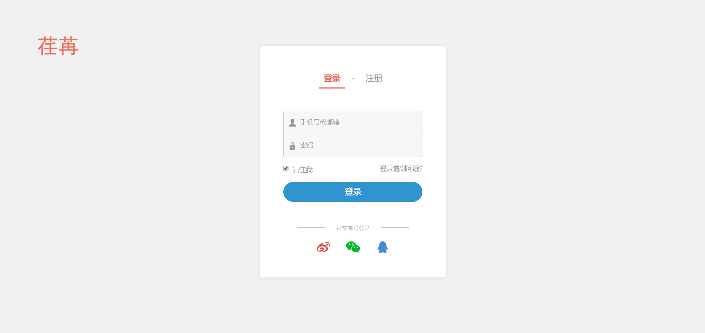

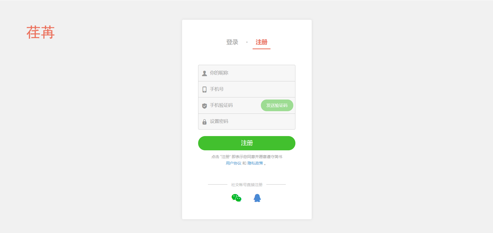

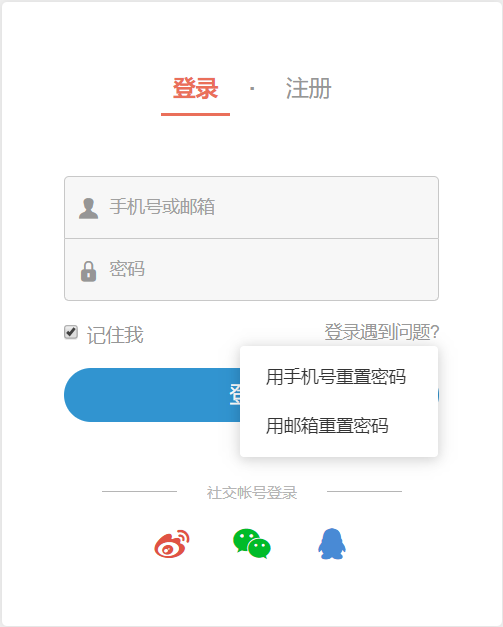

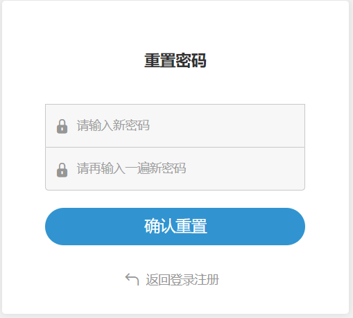


### 首页

功能：

- 无限级别导航菜单、轮播图、退出登录、内容列表下拉刷新

- 采用分布式存储系统 FastDFS 存储网站内容图片，基于 docker 进行安装部署 FastDFS

- feed 流内容推送（feed 是将用户主动订阅的内容组合在一起形成内容聚合器，帮助用户持续地获取最新内容）

- 智能推荐原创作者、关注作者和取消关注

- Django 集成 markdown 富文本编辑器

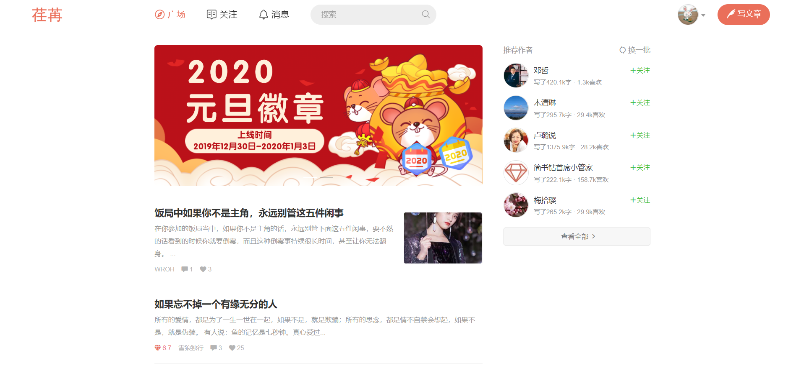

### 内容详情

功能：

- 文章内容实现专题、文集等归纳类目

- 内容基本展示、作者信息展示、作者热门文章展示、同类专题内容推荐

- 文章评论，无限级别评论回复、评论分页、评论排序、分享内容、收藏内容、评论点赞和踩

- 点赞内容、赞赏支持

- 基于 redis 保存我的浏览历史记录

- 内容购买

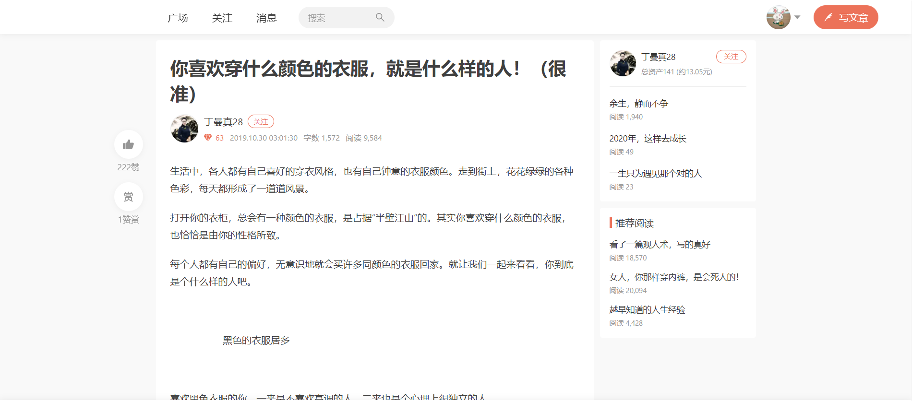

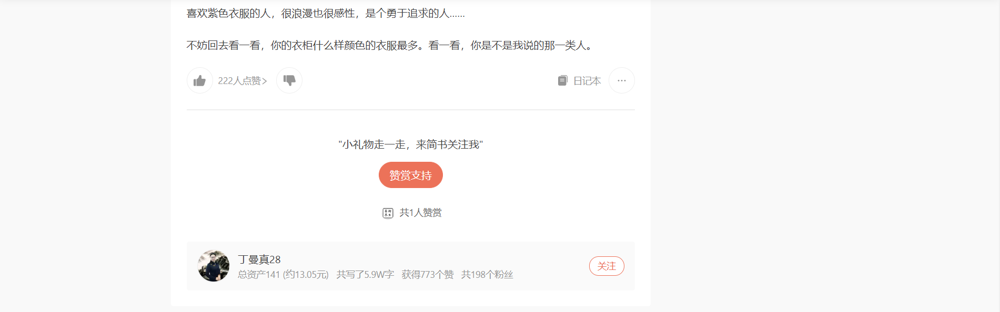

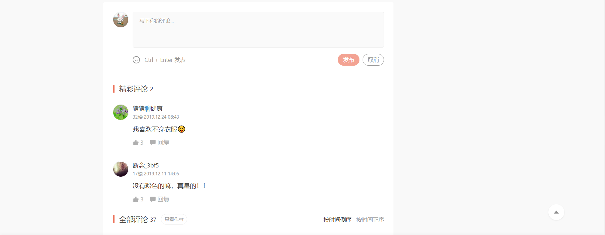

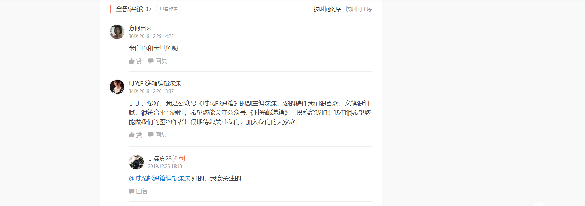

### 内容搜索页

功能：

- 基于 ElasticSearch 实现中文分词，使用 django-haystack 配合完成内容搜索。

- 搜索内容结果实现分页展示

- 按不同条件筛选展示内容

- 搜索历史记录

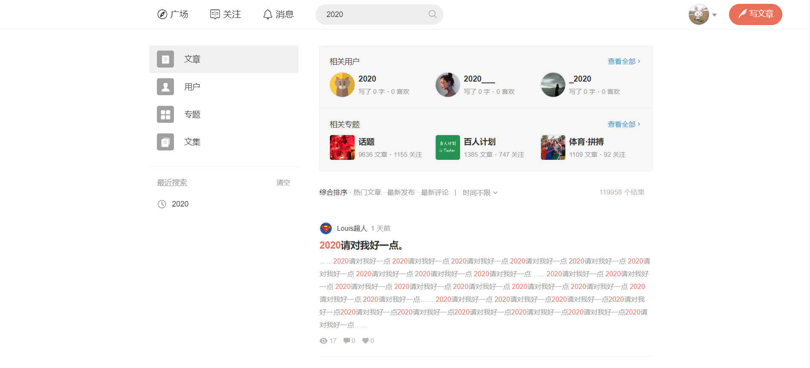

### 个人中心

#### 我的首页

功能：

- 个人信息基本展示，采用 timeline 模式展示我的动态、展示最新评论、展示我的热门内容、展示我的文集

- 基于 ajax 实现鱼书功能（在线聊天）

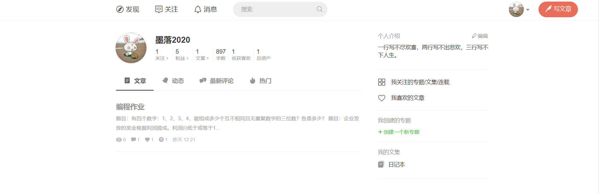

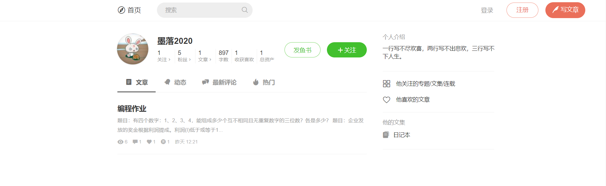

#### 收藏和喜欢的文章

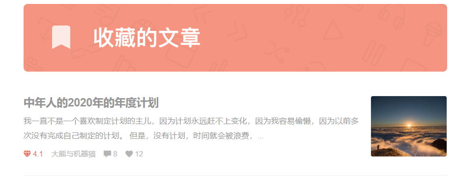

#### 我的钱包

功能：基于支付宝转账到个人账户接口实现余额提现、资金流水记录

​	    

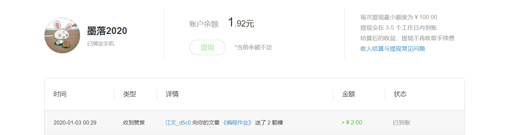


#### 我的基本信息设置

功能：基本信息修改、用户地址信息功能修改、账户所有内容打包下载

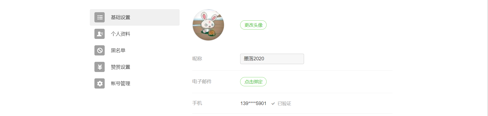

#### 我的粉丝

功能：关注和取消关注

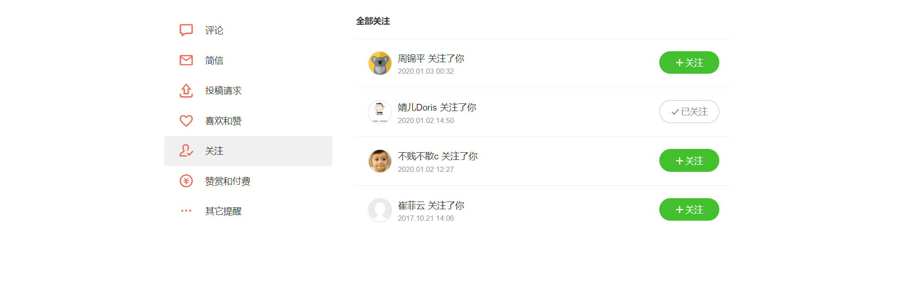

# 