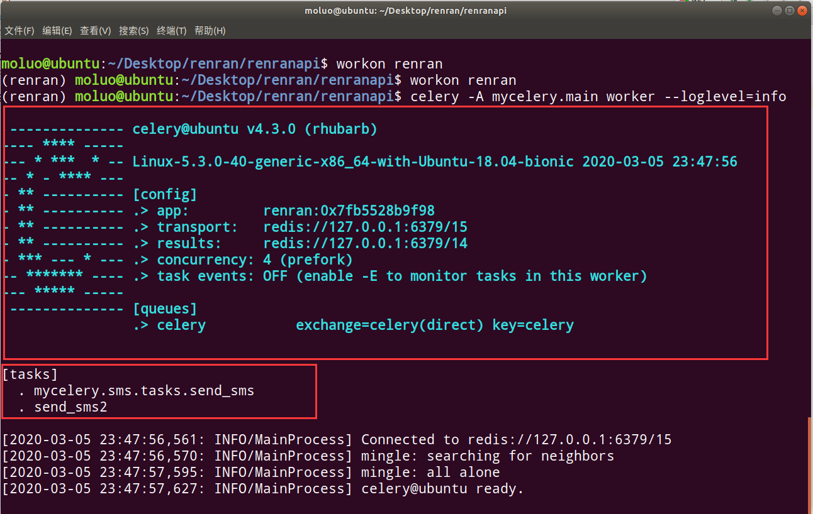

## 使用 Celery 完成异步任务

### Celery 初识

不知道你有没有发现，当点击获取验证码按钮后，要等一小段时间，才能获得响应。这是因为处理短信验证码需要花费一段时间。但其实，我们没必要等验证码发送完成才给用户响应。我们可以调用了发送短信的接口之后，就告诉用户，准备接收短信吧。如果发送短信失败，也没什么，用户等待冷却时间过后，再点击一次就好了。这也比每次点击了之后，要等好一会儿才有反应强。

要实现上面的功能，就要发起异步任务，这时就可以用到 Celery。

Celery 是一个功能完备的即插即用的异步任务队列系统。它适用于异步处理问题，当发送邮件、或者文件上传, 图像处理等等一些比较耗时的操作，我们可将其异步执行，这样用户不需要等待很久，提高用户体验。

文档：http://docs.jinkan.org/docs/celery/getting-started/index.html

Celery 的特点是：

- 简单，易于使用和维护，有丰富的文档。
- 高效，单个 Celery 进程每分钟可以处理数百万个任务。
- 灵活，Celery 中几乎每个部分都可以自定义扩展。

任务队列是一种跨线程、跨机器工作的一种机制。任务队列中包含称作任务的工作单元。有专门的工作进程持续不断的监视任务队列，并从中获得新的任务并处理。Celery 通过消息进行通信，通常使用一个 Broker（中间人）来协助 client（任务的发出者）和 worker（任务的处理者）。clients 发出消息到队列中，broker 将队列中的信息派发给 worker 来处理。

Celery 的运作流程：

Celery 的架构由三部分组成，消息队列（message broker），任务执行单元（worker）和任务执行结果存储（task result store）组成。


- 一个 Celery 系统可以包含很多的 worker 和 broker

- Celery 本身不提供消息队列功能，但是可以很方便地和第三方提供的任务队列进行集成，包括 RabbitMQ、Redis、MongoDB 等

### Celery 的安装

```bash
pip install -U celery==4.3.0
```

提醒：因为 Celery 默认使用了多进程，所以在 Celery 4.0.0版本以后，不支持windows系统的。

在windows下面即便安装了celery4.0.0以前的版本，其实也有兼容问题的。

也可从官方直接下载安装包： https://pypi.python.org/pypi/celery/

```bash
tar xvfz celery-0.0.0.tar.gz
cd celery-0.0.0
python setup.py build
python setup.py install
```

安装完成了 Celery以后，接下来要确保服务器下有任务队列，可以是 Redis，也可以是 RabbitMQ。在这里，我们已经安装了 Redis，可以直接使用 Redis作为任务队列，也可以使用 RabbitMQ（注意，我们提供的 Ubuntu 下是没有 RBMQ 的，安装文档： [消息队列和 RabbitMQ](..\python-advanced\queue-rabbitmq.md)）

### Celery 的使用

使用 Celery 第一件要做的最为重要的事情是需要先创建一个 Celery 实例，我们一般叫做 Celery 应用，或者更简单直接叫做一个 app。app 应用是我们使用 Celery 所有功能的入口，比如创建任务，管理任务等，在使用 Celery 的时候，app 必须能够被其他的模块导入。

一般 Celery 任务目录直接放在项目的根目录下即可，路径:

```python
renranapi/
├── mycelery/
    ├── config.py     # 配置文件
    ├── __init__.py   
    ├── main.py       # 主程序,导入celery并进行任务注册和加载配置
    └── sms/          # 一个目录可以放置多个任务,该目录下存放当前任务执行时需要的模块或依赖
        └── tasks.py  # 任务的文件，名称必须是这个!!!
```

`main.py`，代码：

```python
# 主程序
from celery import Celery
# 创建celery实例对象
app = Celery("renran")

# 通过app对象加载配置
app.config_from_object("mycelery.config")

# 自动搜索并加载任务
# 参数必须必须是一个列表，里面的每一个任务都是任务的路径名称
# app.autodiscover_tasks(["任务1","任务2",....])
app.autodiscover_tasks(["mycelery.sms","mycelery.cache"])
```

启动 Celery 的命令，强烈建议切换目录到项目的根目录下启动 Celery：

```bash
celery -A mycelery.main worker --loglevel=info
```

Celery 的配置项文档：https://docs.celeryproject.org/en/stable/userguide/configuration.html

配置文件 `config.py`，代码：

```python
# 任务队列的链接地址
broker_url = 'redis://127.0.0.1:6379/15'
# 结果队列的链接地址
result_backend = 'redis://127.0.0.1:6379/14'
```

创建一个任务文件 `sms/tasks.py`，并创建任务，代码:

```python
# celery的任务必须写在tasks.py的文件中，别的文件名称不识别!!!
from mycelery.main import app

@app.task  # name表示设置任务的名称，如果不填写，则默认使用函数名做为任务名
def send_sms():
    print("发送短信!!!")

@app.task(name="send_sms2")  # name表示设置任务的名称，如果不填写，则默认使用函数名做为任务名
def send_sms2():
    print("发送短信任务2!!!")
```

接下来，我们运行 Celery，效果如下：



在程序中调用上面的异步任务，拿 Django 进行举例：

```python
# 调用celery执行异步任务
from mycelery.sms.tasks import send_sms
send_sms.delay(mobile)
```

其他参考文档：

http://docs.celeryproject.org/en/latest/getting-started/introduction.html

https://github.com/celery/celery/tree/master/examples/django/

https://www.jianshu.com/p/1840035cb510

https://flower.readthedocs.io/en/latest/screenshots.html

接下来，我们需要把 Celery 和Django 组合起来一起使用。

### Celery 实现短信的异步发送

在 `main.py` 主程序中对 Django 的配置文件进行加载

```python
# 主程序
import os
from celery import Celery
# 创建celery实例对象
app = Celery("renran")

# 把celery和django进行组合，识别和加载django的配置文件
os.environ.setdefault('DJANGO_SETTINGS_MODULE', 'renranapi.settings.dev')

# 对django框架执行初始化
import django
django.setup()

# 通过app对象加载配置
app.config_from_object("mycelery.config")

# 加载任务
# 参数必须必须是一个列表，里面的每一个任务都是任务的路径名称
# app.autodiscover_tasks(["任务1","任务2"])
app.autodiscover_tasks(["mycelery.sms"])

# 启动Celery的命令
# 强烈建议切换目录到mycelery根目录下启动
# celery -A mycelery.main worker --loglevel=info
```

在需要使用 Django 配置的任务中，直接加载配置。所以我们把注册的短信发送功能，整合成一个任务函数，并将其放到 `task.py` 文件中。代码：

```python
from mycelery.main import app
from .yuntongxun.sms import CCP
from . import constants
import logging

log = logging.getLogger("django")

# @app.task(name="send_sms")
# def send_sms(mobile):
#     print("发送短信给%s的异步任务执行了" % mobile)
#     return "任务结果！"


@app.task(name="send_sms")
def send_sms(mobile, sms_code):
    """异步发送短信"""
    ccp = CCP()
    try:
        result = ccp.send_template_sms(mobile, [sms_code, constants.SMS_EXPIRE_TIME//60 ], constants.SMS_TEMPLATE_ID)
        return result
    except:
        log.error("发送短信验证码失败！手机号：%s" % mobile)
```

在这个任务中，我们需要加载短信发送的 sdk 和相关的配置常量，所以我们可以直接把 Django 中的短信发送模块和相关的常量配置文件直接剪切到当前 sms 任务目录中

```
mycelery/
├── config.py
├── __init__.py
├── main.py
└── sms/
    ├── constant.py
    ├── __init__.py
    ├── tasks.py
    └── yuntongxun
        ├── CCPRestSDK.py
        ├── __init__.py
        ├── sms.py
        └── xmltojson.py
```

再次启动项目即可。

最终在 Django 的视图 `views.py` 里面，我们调用 Celery 来异步执行任务。需要完成 2 个步骤，将下面两行代码覆盖掉原来的发送验证码的代码即可：

```python
# 1. 声明一个和celery一模一样的任务函数，但是我们可以导包来解决
from mycelery.sms.tasks import send_sms

# 2. 调用任务函数，发布任务
send_sms.delay(mobile=mobile,sms_code=sms_code)
# send_sms.delay() 如果调用的任务函数没有参数，则不需要填写任何内容
```

视图函数的完整视图类代码为：

```python
class SMSCodeAPIView(APIView):
    """
    短信验证码
    """
    def get(self,request,mobile):
        # 1. 验证数据[短信发送间隔]
        redis = get_redis_connection("sms_code")
        result = redis.get("interval_%s" % mobile)
        if result:
            return Response({"error_msg": "短信已经发送中，请留意您的手机，不要频繁点击！"}, status=status.HTTP_400_BAD_REQUEST)

        # 2. 生成随机短信验证码
        sms_code = "%04d" % random.randint(0,9999)

        # 3. 发送短信验证码
        # 声明一个和celery一模一样的任务函数，我们可以导包来解决
        from mycelery.sms.tasks import send_sms
        # 调用任务函数，发布任务
        send_sms.delay(mobile=mobile, sms_code=sms_code)

        # 4. 保存短信验证码到redis中，因为涉及两条数据库操作，最好还是加上事务
        pipe = redis.pipeline()    # 创建管道对象
        pipe.multi()    # 开启事务
        # 设置事务的相关操作命令
        pipe.setex("sms_%s" % mobile, constants.SMS_EXPIRE_TIME, sms_code)
        pipe.setex("interval_%s" % mobile, constants.SMS_INTERVAL_TIME, "_")
        # 提交事务
        pipe.execute()

        # 5. 返回操作结果
        return Response({"message":"短信已经发送,请留意您的手机"})
```

