## 通过 CORS 解决跨域问题

### 配置 hosts 文件

我们现在为前端和后端分别设置两个不同的域名：

| 位置 | 域名            |
| ---- | --------------- |
| 前端 | `www.moluo.net` |
| 后端 | `api.renran.cn` |

对于 macOS 和 Linux 系统，通过编辑 `/etc/hosts` 文件，可以设置本地域名。

```bash
sudo vim /etc/hosts
```

对于 Windows 系统，使用快捷键 `Windows + R`，调出 `运行`，输入 drivers 点确定，即可打开 drivers 文件夹。hosts 文件就在 drivers 文件夹的 etc 目录中。

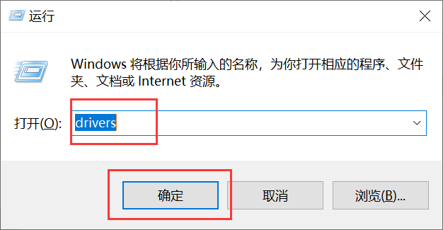

在 hosts 文件中增加两条信息

```shell
127.0.0.1   api.renran.cn
127.0.0.1   www.moluo.net
```

### 解决前端 Vue 项目的监听问题

启动前端项目，通过浏览器访问 `http://www.moluo.net:8080` 网址，会出现如下效果：

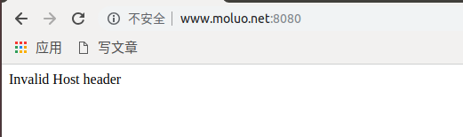

上面并不是错误，而是没人在监听这个地址和端口。解决方法：

暂停运行前端项目，并修改前端 renran_pc 项目的配置文件 `config/index.js`

```javascript
host: 'www.moluo.net',
port: 8080,
autoOpenBrowser: true,
```

保存修改信息，并重启项目

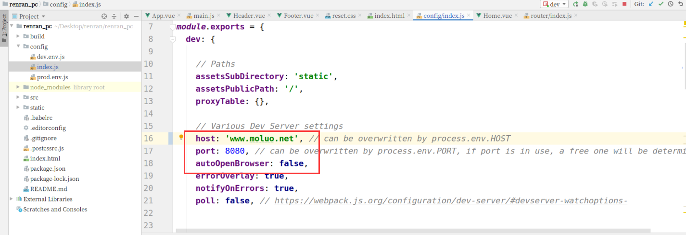

重新访问，即可顺利获得我们的前端页面了：

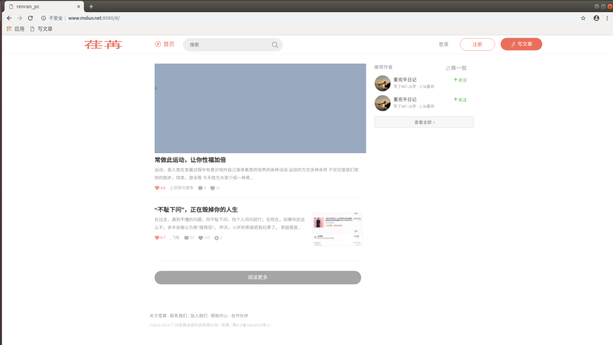

如果不喜欢 URL 中的 `#` 号，可以在路由配置 `/src/router/index.js` 中，添加 `mode: 'history'` 属性：

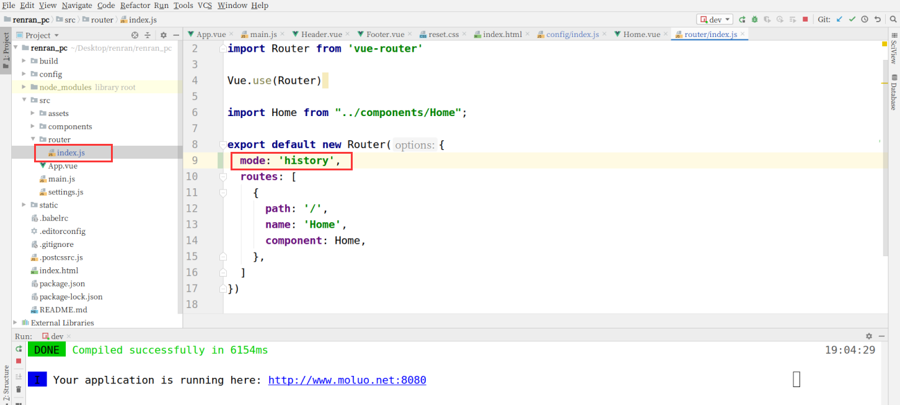

### 解决后端的访问权限问题

运行后端 renranapi 项目，通过浏览器访问 `api.renran.cn:8000`，会出现以下错误信息：

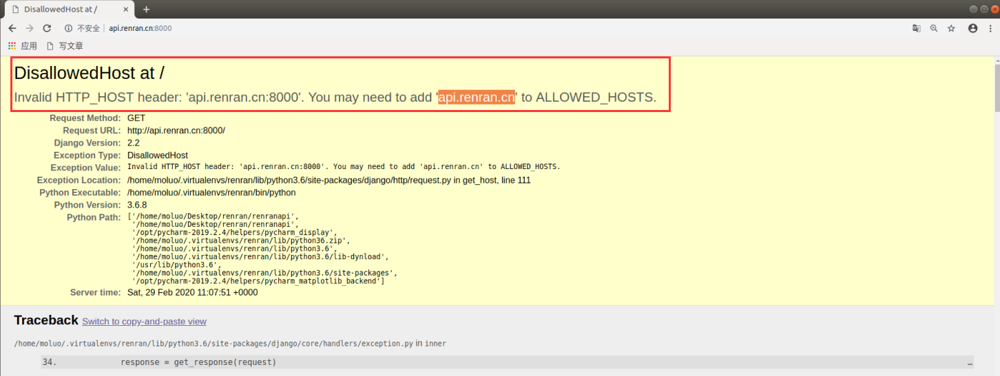

可以通过 `settings/dev.py` 的 ALLOWED_HOSTS，设置允许访问

```python
# 设置哪些客户端可以通过地址访问到后端
ALLOWED_HOSTS = [
    'api.renran.cn',
]
```

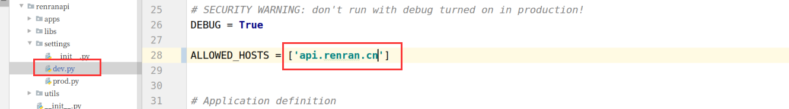

我们以可通过 PyCharm 的 manage.py 运行的配置参数，设置后端项目运行着 api.renran.cn:8000

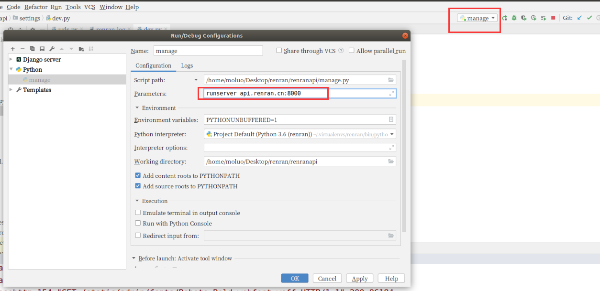

重启项目，浏览器访问 api.renran.cn:8000 即可访问到 Django 的初始页面：

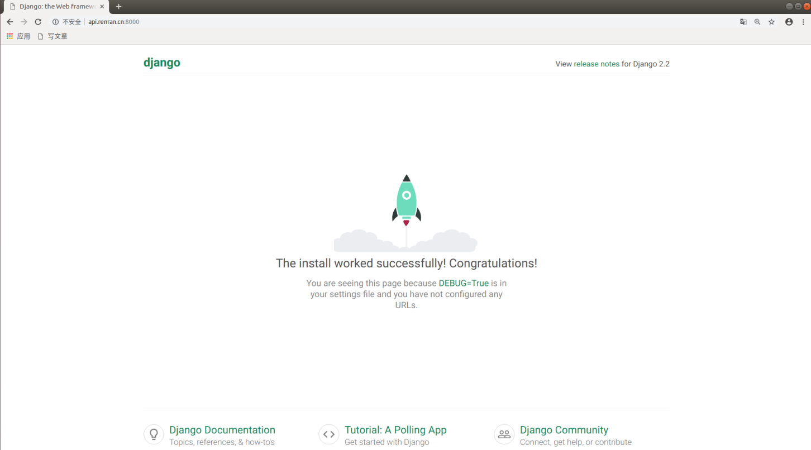

### 解决后端的跨域问题

现在，前端与后端分处不同的域名，使用不同的端口，所以很显然是不同源的。我们于是需要为后端添加跨域访问的支持，否则前端无法使用 axios 请求后端提供的 api 数据，我们使用 CORS 来实现后端对跨域访问的支持。

我们当然可以手写中间件，在每次响应时都加上响应头，允许指定主机域名的跨域访问：

```python
Response(headers={"Access-Control-Allow-Origin":'客户端地址/*'})
```

不过并不推荐这样写，更合理的方式是使用 django-cors-headers 扩展。

官方文档：https://github.com/ottoyiu/django-cors-headers/

安装

```bash
pip3 install django-cors-headers -i https://pypi.douban.com/simple
```

settings/dev.py，添加应用

```python
INSTALLED_APPS = (
    ...
    'corsheaders',
    ...
)
```

中间层设置（必须写在第一个位置，注意加上结尾的逗号）

```python
MIDDLEWARE = [
    'corsheaders.middleware.CorsMiddleware',
    ...
]
```

添加白名单

```python
# CORS组的配置信息
CORS_ORIGIN_WHITELIST = (
    'http://www.moluo.net:8080',
)

# 允许ajax跨域请求时携带cookie
CORS_ALLOW_CREDENTIALS = False
```

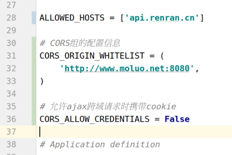

完成了上面的步骤，我们就可以通过后端提供数据给前端使用 ajax 访问了。

前端使用 axios 就可以访问到后端提供给的数据接口，但是如果要附带 cookie 信息，前端还要设置一下。

前端引入 axios 插件并配置不允许 axios 发送 cookie 信息（axios 本身也不允许 ajax 发送 cookie 到后端）。

```
npm i axios -S
```

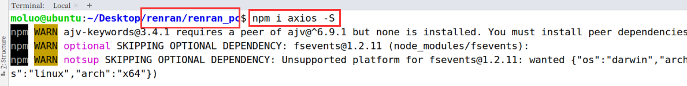

在 `main.js` 中引用 axios 插件

```javascript
import axios from 'axios'; // 从node_modules目录中导入包

// 允许ajax发送请求时附带cookie，设置为不允许
axios.defaults.withCredentials = false;

Vue.prototype.$axios = axios; // 把对象挂载vue中
```

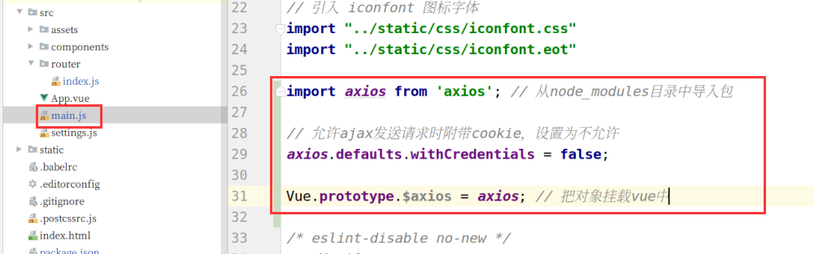