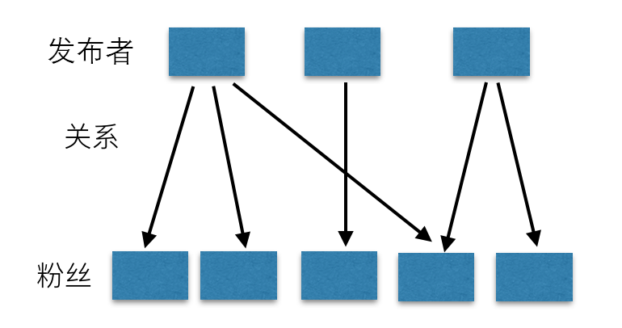

# Feed 流系统概述

## Feed 流的定义

Feed 流这个词可拆分成两部分来看，即 `Feed` 和 `流`。Feed 的本意是饲料，Feed 流的的本意就是有人一直在往一个地方投递新鲜的饲料。如果需要饲料，只需要盯着投递点就可以了，这样就能源源不断获取到新鲜的饲料。

在信息工程中，Feed 其实是一个信息单元，比如一条朋友圈状态、一条微博、一条咨询或一条短视频等。Feed 流就是不停更新的信息单元，只要关注某些发布者就能获取到源源不断的新鲜信息，我们的用户也就可以在移动设备上逐条去浏览这些信息单元。

当前最流行的 Feed 流产品有微博、微信朋友圈、头条的资讯推荐、快手抖音的视频推荐等。还有一些变种，比如私信、通知等，这些系统都是 Feed 流系统。接下来我们将介绍如何设计一个 Feed 流系统架构。

## Feed 流系统特点

Feed 流本质上是数据流，是服务端系统将多个发布者的信息内容通过关注收藏等关系推送给多个接收者。

Feed 流系统的特点：

- 多账号内容流：Feed 流系统中肯定会存在成千上万的账号，账号之间可以关注，取关，加好友和拉黑等操作。只要满足这一条，那么就可以当做 Feed 流系统来设计。
- 非稳定的账号关系：由于存在关注，取关等操作，所以系统中的用户之间的关系就会一直在变化，是一种非稳定的状态。
- 读写比例 `100:1`：读写严重不平衡，读多写少。
- 消息必达性要求高：比如发送了一条朋友圈后，结果部分朋友看到了，部分朋友没看到。如果偏偏女朋友没看到，那么可能会产生很严重的感情矛盾，后果很严重。

## Feed 流系统分类

Feed 流的分类有很多种，但最常见的分类有两种：

- Timeline：按发布的时间顺序排序，先发布的先看到，后发布的排列在最顶端，例如微信朋友圈，微博等。这也是一种最常见的形式。产品如果选择 Timeline 类型，那么就是认为 Feed 流中的 Feed 不多，但是每个 Feed 都很重要，都需要用户看到。
- Rank：按某个非时间的因子排序，一般是按照用户的喜好度排序，用户最喜欢的排在最前面，次喜欢的排在后面。这种一般假定用户可能看到的 Feed 非常多，而用户花费在这里的时间有限，那么就为用户选择出用户最想看的 Top N 结果，场景的应用场景有图片分享、新闻推荐类、商品推荐等。

上面两种是最典型，也是最常见的分类方式。除此之外，也有其他的分类标准。在其他的分类标准中，还有两种类型比较常见：

- Aggregate：聚合类型。比如好几个朋友都看了同一场电影，这个就可以聚合为一条 Feed：A，B，C 看了电影《你的名字》，这种聚合功能比较适合在客户端做。一般的 Aggregate 类型是 Timeline 类型 + 客户端聚合。比如豆瓣电影的 `喜欢这部电影的人也喜欢` 部分。
- Notice：通知类型。这种其实已经是功能类型了。通知类型一般用于 APP 中的各种通知，私信等。这种也是 Timeline 类型，或者是 Aggregate 类型。

## 设计 Feed 流系统的 2 个核心

### Feed 数据

Feed 流系统是一个数据流系统。如果要设计一个 Feed 流系统，最关键的两个核心：一个是数据存储（发布 Feed），一个是数据推送（读取 Feed）。

这两个核心我们稍后再谈，我们先从数据层面看。Feed 流中的数据主要可分为三类，分别是：

- 发布者的数据：发布者发布数据，然后数据需要按照关注者进行组织，需要根据关注者查到所有数据，比如微博的个人页面、朋友圈的个人相册等。
- 关注关系：系统中个体间的关系。微博中是关注，是单向流，朋友圈是好友，是双向流。不管是单向还是双向，当发布者发布一条信息时，该条信息的流动永远是单向的。
- 粉丝的数据：从不同发布者那里获取到的数据，然后通过某种顺序（一般为时间 timeline）组织到一起，比如微博首页、朋友圈首页等。这些数据具有时间热度属性，越新的数据越有价值，越新的数据就要排在最前面。

针对这三类数据，我们可以定义为三个数据库：

- 存储库：存储发布者的 Feed 数据，永久保存。我们已经存放到 MySQL 中
- 关注表：用户关系表，永久保存。
- 同步库（未读池）：存储接收者的时间热度数据，只需要保留最近一段时间的数据即可。

### 数据存储（发布 Feed）

Feed 消息的特点：

- Feed 信息的最大特点就是数据量大。而且在 Feed 流系统里面很多时候都会选择写扩散（推模式）模式，这时候数据量会再膨胀几个数量级，这里的数据量很容易达到 100TB，甚至 PB 级别。
- 数据格式简单。
- 数据不能丢失，可靠性要求高。
- 自增主键功能，保证个人发的 Feed 的消息 ID 在个人发件箱中都是严格递增的，这样读取时只需要一个范围读取即可。由于个人发布的 Feed 并发度很低，这里用时间戳也能满足基本需求，但是当应用层队列堵塞，网络延迟变大或时间回退时，用时间戳还是无法保证严格递增。这里最好是有自增功能。

根据上述这些 Feed 数据的特征，最佳的系统应该是具有主键自增功能的分布式 NoSQL 数据库。但是这样的数据库在开源系统里面没有，所以常用的做法有两种：

- 关系型数据库 + 分库分表
- 关系型数据库 + 分布式 NoSQL 数据库，其中关系型数据库提供主键自增功能。

目前业界大部分著名的 Feed 流产品，早期都是上面的 2 种模式之一。但是这会存在一个非常大的问题就是关系型数据库，比如开源 MySQL 数据库的主键自增功能性能差。不管是用 MyISAM，还是 InnoDB 引擎，要保证自增 ID 严格递增，必须使用表锁。这个粒度非常大，会严重限制并发度，影响性能。

基于上述原因，部分技术公司早已经开始考虑使用表格存储（TableStore）。

表格存储是一个具有自增主键功能的分布式 NoSQL 数据库，这样就只需要使用一种系统即可。除此之外表格存储还有以下的特点：

- 天然分布式数据库，无需分库分表，单表可达 10PB，10 万亿行，可支持千万级 TPS/QPS。
- 号称 SLA 可用性可达到 10 个 9，Feed 内容不容易丢失。
- 主键自增功能性能极佳，其他所有系统在做自增功能的时候都需要加锁，但是表格存储的主键自增功能在写入自增列行的时候，完全不需要锁，既不需要表锁，也不需要行锁。

### 数据推送（读取 Feed）

数据推送的实现有 3 种方案，分别是：

- 拉方案：也称为读扩散。很多 Feed 流产品的第一版会采用这种方案，但很快就抛弃了。
- 推方案：也成为写扩散。Feed 流系统中最常用、有效的模式。用户关系数比较均匀，或者有上限，比较出名的有微信朋友圈。
- 推拉组合：大部分用户的账号关系都是几百个，但是有个别用户是 1000 万以上，比如微博。

|     类型     |    推模式    |                拉模式                | 推拉结合模式 |
| :----------: | :----------: | :----------------------------------: | :----------: |
|    写放大    |      高      |                  无                  |      中      |
|    读放大    |      无      |                  高                  |      中      |
| 用户读取延时 |     毫秒     |                  秒                  |      秒      |
|   读写比例   |     1:99     |                 99:1                 |    50:50     |
|   系统要求   |   写能力强   |               读能力强               |  读写都适中  |
|   常见系统   | 分布式 NoSQL | 内存缓存或搜索系统 (推荐排序场景) |   两者结合   |
|  架构复杂度  |     简单     |                 复杂                 |    更复杂    |

数据推送方式的选择依据：

- 如果产品中是双向关系，那么就采用推模式。
- 如果产品中是单向关系，且用户数少于 1000 万，那么也采用推模式，足够了。
- 如果产品是单向关系，单用户数大于 1000 万，那么采用推拉结合模式，这时候可以从推模式演进过来，不需要额外重新推翻重做。
- 永远不要只用拉模式。
- 如果是一个初创企业，先用推模式，快速把系统设计出来，然后让产品去验证、迭代，等客户数大幅上涨到 1000 万后，再考虑升级为推拉集合模式。

所以，接下来我们选择的先是写扩散，然后推拉组合。

### 表结构设计

同步库表设计结构：

Table：user_message_table

| 主键列 | 第1列主键 | 第2列主键               | 第3列主键       | 第4列主键                                                    | 属性列                                     |
| :----- | :-------- | :---------------------- | :-------------- | :----------------------------------------------------------- | :----------------------------------------- |
| 列名   | user_id   | sequence_id             | sender_id       | message_id                                                   | other                                      |
| 解释   | 接收者 ID | 消息顺序 ID，要求自增。 | 发送者的用户 ID | 消息 ID。通过 sender_id 和 message_id 可以到存储库中查询到消息内容 | 其他字段内容，同步库中不需要包括消息内容。 |

关注或好友关系表设计结构：

Table：user_relation_table

| 主键顺序     | 第1列主键 | 第2列主键      | 属性列    | 属性列     |
| :----------- | :-------- | :------------- | :-------- | :--------- |
| Table 字段名 | user_id   | follow_user_id | timestamp | other      |
| 备注         | 用户 ID   | 粉丝用户 ID    | 关注时间  | 其他属性列 |

未读池表设计结构：

Table: user_message_session_table

| 主键列顺序 | 第一列主键    | 属性列                                  |
| :--------- | :------------ | :-------------------------------------- |
| 列名       | user_id       | last_sequence_id                        |
| 备注       | 接收者用户 ID | 该接收者已经推送给客户端的最新的顺序 ID |

