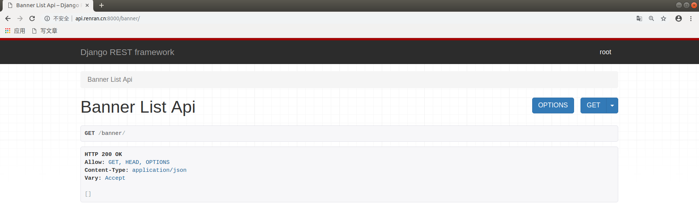
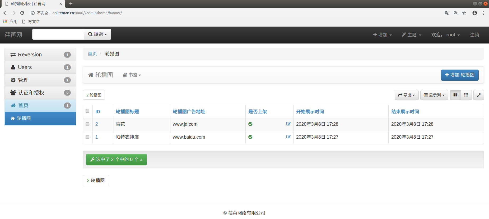
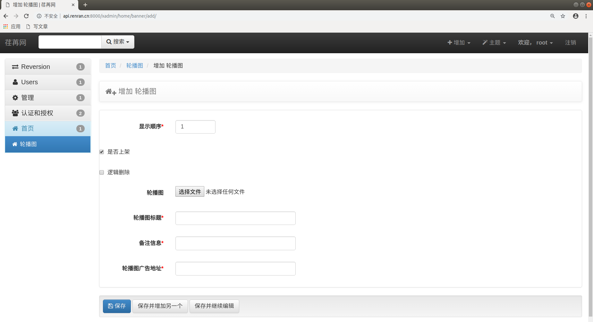
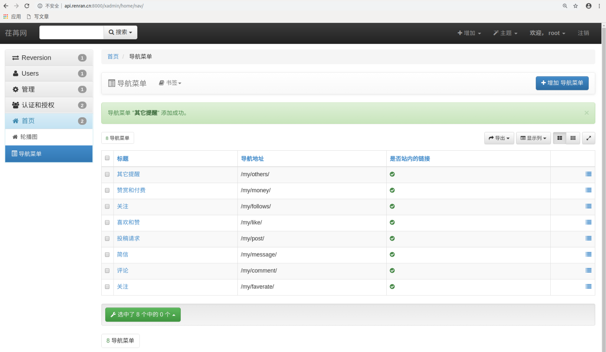

# 荏苒资讯首页配置

对于首页要展示的数据和功能，我们先创建一个单独的字应用来完成。

```bash
cd renranapi/apps/
python ../../manage.py startapp home
```

注册子应用，settings/dev.py，代码：

```python
INSTALLED_APPS = [
    ...
    'home',
]
```

## 轮播图功能实现

### 安装依赖模块和配置

#### 图片处理模块

前面已经安装了，如果没有安装则需要安装

```shell
pip install pillow
```

#### 上传文件相关配置

在 `settings/dev.py` 中增加如下设置：

```python
# 访问静态文件的url地址前缀
STATIC_URL = '/static/'
# 设置django的静态文件目录
STATICFILES_DIRS = [
    os.path.join(BASE_DIR,"static")
]

# 项目中存储上传文件的根目录[暂时配置]，注意，uploads目录需要手动创建否则上传文件时报错
MEDIA_ROOT=os.path.join(BASE_DIR,"uploads")
# 访问上传文件的url地址前缀
MEDIA_URL ="/media/"
```

在 xadmin 中输出上传文件的 url 地址

总路由 `urls.py` 新增代码：

```python
from django.urls import re_path
from django.conf import settings
from django.views.static import serve

urlpatterns = [
  	...
    # serve用来管理上传文件
    re_path(r'^media/(?P<path>.*)', serve, {"document_root": settings.MEDIA_ROOT}),
]
```

### 创建轮播图的模型

在新创建的 home 应用 `home/models.py` 文件中创建新的 Banner 模型类：

```python
from django.db import models

# Create your models here.
class Banner(models.Model):
    """
    轮播图
    """
    # upload_to 存储子目录，真实存放地址会使用配置中的MADIE_ROOT+upload_to
    image = models.ImageField(upload_to='banner', verbose_name='轮播图', null=True,blank=True)
    name = models.CharField(max_length=150, verbose_name='轮播图名称')
    note = models.CharField(max_length=150, verbose_name='备注信息')
    link = models.CharField(max_length=150, verbose_name='轮播图广告地址')
    orders = models.IntegerField(verbose_name='显示顺序')
    is_show=models.BooleanField(verbose_name="是否上架",default=False)
    is_delete=models.BooleanField(verbose_name="逻辑删除",default=False)
    start_time = models.DateTimeField(verbose_name="开始展示时间", auto_now_add=True)
    end_time = models.DateTimeField(verbose_name="结束展示时间", auto_now_add=True)

    class Meta:
        db_table = 'rr_banner'
        verbose_name = '轮播图'
        verbose_name_plural = verbose_name

    def __str__(self):
        return self.name
```

数据迁移

```bash
python manage.py makemigrations
python manage.py migrate
```

### 序列化器

在 home 应用中创建 `home/serializers.py` 序列化器，并添加轮播图模型序列化器：

```python
from rest_framework import serializers
from .models import Banner
class BannerModelSerializer(serializers.ModelSerializer):
    """轮播图序列化器"""
    class Meta:
        model = Banner
        fields = ["image","link"]
```

### 视图代码

轮播图只会查询，且一般都是批量查询，所以只需要使用 ListAPIView 即可。在 home 应用下的 `views.py` 编写试图代码如下：

```python
from rest_framework.generics import ListAPIView
from .models import Banner
from datetime import datetime
from .serializers import BannerModelSerializer
class BannerListAPIView(ListAPIView):
    queryset = Banner.objects.filter(is_show=True, is_delete=False,start_time__lte=datetime.now(), end_time__gte=datetime.now()).order_by("orders","-id")[:5]
    serializer_class = BannerModelSerializer
```

### 路由代码

在 home 子应用中创建路由文件 `home/urls.py`，并加上路由代码：

```python
from django.urls import path
from . import views
urlpatterns = [
    path("banner/", views.BannerListAPIView.as_view()),
]
```

别忘了还要把 home 的路由 `home/urls.py` 注册到总路由：

```python
from django.contrib import admin
from django.urls import path,include,re_path

import xadmin
xadmin.autodiscover()

# version模块自动注册需要版本控制的 Model
from xadmin.plugins import xversion
xversion.register_models()

# 上文文件资源
from django.conf import settings
from django.views.static import serve

urlpatterns = [
    re_path(r'media/(?P<path>.*)', serve, {"document_root": settings.MEDIA_ROOT}),
    path(r'xadmin/', xadmin.site.urls),
    # path('admin/', admin.site.urls),
    path('stu/', include("students.urls")),
    path('users/', include("users.urls")),
    path('', include("home.urls")),
]
```

然后别忘了在 `dev.py` 中注册 rest_framework 应用。

访问 http://api.renran.cn:8000/banner/ 的效果：



在配置文件中注册如下应用

```python
# 修改使用中文界面
LANGUAGE_CODE = 'zh-Hans'

# 修改时区
TIME_ZONE = 'Asia/Shanghai'

# 关闭时区转换
USE_TZ = False
```

### 注册轮播图模型到 xadmin 中

在 home 子应用中创建 adminx.py 文件，配置 xadmin 相关内容：

```python
import xadmin

from .models import Banner
class BannerModelAdmin(object):
    list_display = ["id","name","link","is_show","start_time","end_time"]
    list_editable = ["is_show","start_time","end_time"]
    model_icon = 'fa fa-clone'
xadmin.site.register(Banner,BannerModelAdmin)
```

#### 修改后端 xadmin 中子应用名称

`home/apps.py`

```python
class HomeConfig(AppConfig):
    name = 'home'
    verbose_name = '首页'
```

``__init__.py``

```python
default_app_config = "home.apps.HomeConfig"
```



给轮播图添加测试数据



经过上面的操作,我们就完成了轮播图的 API 接口。接下来，可以考虑提交一个代码版本。

但是，我们前面创建了一个本地开发分支,所以我们如果直接提交代码,默认是在dev分支提交的.

所以就不能直接使用`git push`,而是采用以下命令提交

```bash
git add .
git commit -m "服务端实现轮播图的API接口"
```

### 客户端代码获取数据

Banner.vue 代码：

```vue
<template>
<div id="home">
    <Header></Header>
    <div class="container">
      <div class="row">
        <div class="main">
          <!-- Banner -->
          <div class="banner">
            <el-carousel height="272px" indicator-position="none" :interval="2000">
              <el-carousel-item v-for="banner,key in banner_list" :key="item">
                <a :href="banner.link"></a>
              </el-carousel-item>
            </el-carousel>
          </div>
          <div id="list-container">
            <!-- 文章列表模块 -->
            <ul class="note-list">
              <li class="">
                <div class="content">
                  <a class="title" target="_blank" href="">常做此运动，让你性福加倍</a>
                  <p class="abstract">运动，是人类在发展过程中有意识地对自己身体素质的培养的各种活动 运动的方式多种多样 不仅仅是我们常知的跑步，球类，游泳等 今天就为大家介绍一种男...</p>
                  <div class="meta">
                    <span class="jsd-meta">
                       4.8
                    </span>
                    <a class="nickname" target="_blank" href="">上班族也健身</a>
                    <a target="_blank" href="">
                       4
                    </a>
                    <span> 31</span>
                  </div>
                </div>
              </li>
              <li class="have-img">
                <a class="wrap-img" href="" target="_blank">
                  
                </a>
                <div class="content">
                  <a class="title" target="_blank" href="">“不耻下问”，正在毁掉你的人生</a>
                  <p class="abstract">
                    在过去，遇到不懂的问题，你不耻下问，找个人问问就行；在现在，如果你还这么干，多半会被认为是“搜商低”。 昨天，35岁的表姐把我拉黑了。 表姐是医...
                  </p>
                  <div class="meta">
                    <span class="jsd-meta">
                       6.7
                    </span>
                    <a class="nickname" target="_blank" href="">_飞鱼</a>
                    <a target="_blank" href="">
                       33
                    </a>
                    <span> 113</span>
                    <span> 2</span>
                  </div>
                </div>
              </li>
            </ul>
            <!-- 文章列表模块 -->
          </div>
        <a href="" class="load-more">阅读更多</a></div>
        <div class="aside">
          <!-- 推荐作者 -->
          <div class="recommended-author-wrap">
            <!---->
            <div class="recommended-authors">
              <div class="title">
                <span>推荐作者</span>
                <a class="page-change">换一批</a>
              </div>
              <ul class="list">
                <li>
                  <a href="" target="_blank" class="avatar">
                    
                  </a>
                  <a class="follow" state="0">关注</a>
                  <a href="" target="_blank" class="name">董克平日记</a>
                  <p>写了807.1k字 · 2.5k喜欢</p>
                </li>
                <li>
                  <a href="" target="_blank" class="avatar">
                    
                  </a>
                  <a class="follow" state="0">关注</a>
                  <a href="" target="_blank" class="name">董克平日记</a>
                  <p>写了807.1k字 · 2.5k喜欢</p>
                </li>

              </ul>
              <a href="" target="_blank" class="find-more">查看全部 ></a>
              <!---->
            </div>
          </div>
        </div>
      </div>
    </div>
    <Footer></Footer>
  </div>
</template>

<script>
  import Header from "./common/Header";
  import Footer from "./common/Footer";
  export default {
      name:"Home",
      data(){
          return {
            banner_list: [],  // 轮播图广告
          }
      },
      components:{
        Header,
        Footer,
      },
      created(){
         this.get_banner();
      },
      methods:{
          get_banner(){
              // 获取轮播广告
              this.$axios.get(`${this.$settings.Host}/banner/`).then(response=>{
                  this.banner_list = response.data;
              }).catch(error=>{
                  this.$message.error("无法获取服务端的轮播广告信息!");
              })
          }
      }
  }
</script>

<style>
.banner img{
  max-height: 100%;
  max-width: 100%;
}
</style>
```

## 导航功能实现

调整首页头部子组件的页面，`Header.vue`，效果：

```vue
<template>
  <div class="header">
    <nav class="navbar">
      <div class="width-limit">
        <!-- 左上方 Logo -->
        <a class="logo" href="/"></a>

        <!-- 右上角 -->
        <!-- 未登录显示登录/注册/写文章 -->
        <a class="btn write-btn" target="_blank" href="/writer">写文章</a>
        <router-link class="btn sign-up" id="sign_up" to="/user/register">注册</router-link>
        <router-link class="btn log-in" id="sign_in" to="/user/login">登录</router-link>
        <div class="container">
          <div class="collapse navbar-collapse" id="menu">
            <ul class="nav navbar-nav">
              <li class="tab active">
                <a href="/">
                  <i class="iconfont ic-navigation-discover menu-icon"></i>
                  <span class="menu-text">首页</span>
                </a>
              </li>
              <li class="tab">
                <a href="/">
                  <i class="iconfont ic-navigation-follow menu-icon"></i>
                  <span class="menu-text">关注</span>
                </a>
                <ul class="dropdown-menu">
                  <li><a href=""><i class="iconfont ic-comments"></i> <span>评论</span></a></li>
                  <li><a href=""><i class="iconfont ic-chats"></i> <span>简信</span></a></li>
                  <li><a href=""><i class="iconfont ic-requests"></i> <span>投稿请求</span></a></li>
                  <li><a href=""><i class="iconfont ic-likes"></i> <span>喜欢和赞</span></a></li>
                  <li><a href=""><i class="iconfont ic-follows"></i> <span>关注</span></a></li>
                  <li><a href=""><i class="iconfont ic-money"></i> <span>赞赏和付费</span></a></li>
                  <li><a href=""><i class="iconfont ic-others"></i> <span>其它提醒</span></a></li>
                </ul>
              </li>
              <li class="tab">
                <a href="/">
                  <i class="iconfont ic-navigation-notification menu-icon"></i>
                  <span class="menu-text">消息</span>
                </a>
              </li>
              <li class="search">
                <form target="_blank" action="/search" accept-charset="UTF-8" method="get">
                  <input type="text" name="q" id="q" value="" autocomplete="off" placeholder="搜索" class="search-input">
                  <a class="search-btn" href="javascript:void(0)"></a>
                </form>
              </li>
            </ul>
          </div>
        </div>

        <!-- 如果用户登录，显示下拉菜单 -->
      </div>
    </nav>
  </div>
</template>

<script>
    export default {
        name: "Header"
    }
</script>


<style scoped>
.header{
  height: 56px;
}
.container {
    width: 960px;
    margin-right: auto;
    margin-left: auto;
    padding-left: 15px;
    padding-right: 15px;
}
.container:after, .container:before {
    content: " ";
    display: table;
}
.container:after {
    clear: both;
}
.navbar {
    background-color: #fff;
    border-color: #f0f0f0;
    top: 0;
    border-width: 0 0 1px;
    border-radius: 0;
}
.navbar-nav {
    float: left;
    margin: 0;
}
.navbar:after, .navbar:before {
    content: " ";
    display: table;
    box-sizing: border-box;
}
.nav:after, .nav:before {
    content: " ";
    display: table;
}
nav .width-limit {
    min-width: 768px;
    max-width: 1440px;
    margin: 0 auto;
}
nav .logo {
    float: left;
    height: 56px;
    padding: 0;
}
nav .logo img {
    height: 100%;
    vertical-align: middle;
    border: 0;
}
.btn {
    display: inline-block;
    margin-bottom: 0;
    font-weight: 400;
    text-align: center;
    vertical-align: middle;
    touch-action: manipulation;
    cursor: pointer;
    background-image: none;
    border: 1px solid transparent;
    white-space: nowrap;
    padding: 6px 12px;
    font-size: 14px;
    line-height: 1.42857;
    border-radius: 4px;
}
nav .write-btn {
    float: right;
    width: 100px;
    height: 24px;
    line-height: 24px;
    margin: 8px 12px 0;
    border-radius: 20px;
    font-size: 15px;
    color: #fff;
    background-color: #ea6f5a;
    text-decoration: none;
}
nav .log-in, nav .log-in:hover {
    color: #969696;
}
nav .log-in {
    float: right;
    margin: 11px 6px 0 10px;
    font-size: 15px;
}
nav .sign-up {
    float: right;
    width: 80px;
    height: 24px;
    line-height: 24px;
    margin: 9px 5px 0 15px;
    border: 1px solid rgba(236,97,73,.7);
    border-radius: 20px;
    font-size: 15px;
    color: #ea6f5a;
    background-color: transparent;
}
nav .icon-write {
    margin-right: 3px;
    width: 19px;
    height: 19px;
    vertical-align: middle;
}
nav .menu-text{
    font-size: 17px;
}
nav .active a{
  color: #ea6f5a;
}
nav .menu-icon {
    width: 20px;
    height: 20px;
    vertical-align: baseline;
    margin-right: 3px;
}
.dropdown-menu{position:absolute;top:100%;left:0;z-index:1000;display:none;
  float:left;min-width:160px;padding:5px 0;margin:2px 0 0;list-style:none;
  font-size:14px;text-align:left;background-color:#fff;border:1px solid #ccc;
  border:1px solid rgba(0,0,0,.15);border-radius:4px;
  box-shadow:0 6px 12px rgba(0,0,0,.175);
  background-clip:padding-box}
.dropdown-menu.pull-right{right:0;left:auto}
.dropdown-menu .divider{
  height:1px;margin:9px 0;overflow:hidden;background-color:#e5e5e5}
.dropdown-menu>li>a{display:block;padding:3px 20px;clear:both;font-weight:400;
  line-height:1.42857;color:#333;white-space:nowrap}
.dropdown-menu>li>a:focus,.dropdown-menu>li>a:hover{
  text-decoration:none;color:#262626;background-color:#f5f5f5}
.dropdown-menu>.active>a,.dropdown-menu>.active>a:focus,.dropdown-menu>.active>a:hover{
  color:#fff;text-decoration:none;outline:0;background-color:#337ab7}
.dropdown-menu>.disabled>a,.dropdown-menu>.disabled>a:focus,.dropdown-menu>.disabled>a:hover{
  color:#777
}
.dropdown-menu>.disabled>a:focus,.dropdown-menu>.disabled>a:hover{
  text-decoration:none;background-color:transparent;background-image:none;filter:progid:DXImageTransform.Microsoft.gradient(enabled = false);cursor:not-allowed}
.open>.dropdown-menu{display:block}.open>a{outline:0}.dropdown-menu-right{left:auto;right:0}.dropdown-menu-left{left:0;right:auto}.dropdown-header{display:block;padding:3px 20px;font-size:12px;line-height:1.42857;color:#777;white-space:nowrap}.dropdown-backdrop{position:fixed;left:0;right:0;bottom:0;top:0;z-index:990}.pull-right>.dropdown-menu{right:0;left:auto}.dropup .caret,.navbar-fixed-bottom .dropdown .caret{border-top:0;border-bottom:4px dashed;border-bottom:4px solid\9;content:""}.dropup .dropdown-menu,.navbar-fixed-bottom .dropdown .dropdown-menu{top:auto;bottom:100%;margin-bottom:2px}
@media (min-width:768px){.navbar-right .dropdown-menu{right:0;left:auto}
.navbar-right .dropdown-menu-left{left:0;right:auto}}
.dropdown-menu{
  width:200px;margin-top:-1px;border-radius:0 0 4px 4px;
}
.dropdown-menu li{margin:0}
.dropdown-menu a{height:auto;padding:10px 20px;line-height:30px}
.dropdown-menu a:hover{background-color:#f5f5f5}
.dropdown-menu i{margin-right:15px;font-size:22px;color:#ea6f5a;
  vertical-align:middle
}
.dropdown-menu span{vertical-align:middle}
.dropdown-menu .badge{position:absolute;right:15px;margin-top:7px}

nav .nav .tab a {
    height: 56px;
    line-height: 26px;
    padding: 15px;
    background: none;
}
nav .navbar-nav li {
    margin-right: 10px;
    float: left;
    position: relative;
    display: block;
    box-sizing: border-box;
    height: 56px;
    line-height: 56px;
}
nav .tab:hover .dropdown-menu{
  display: block;
}
.navbar-nav {
    float: left;
    margin: 0;
}
nav form {
    position: relative;
    top: 9px;
    margin: 0 0 20px;
    box-sizing: border-box;
    line-height: 20px;
}
nav form .search-input {
    padding: 0 40px 0 20px;
    height: 38px;
    font-size: 14px;
    border: 1px solid #eee;
    border-radius: 40px;
    background: #eee;
    transition: width .5s;
    width: 240px;
    outline: none;
}
nav form .search-input:focus {
    width: 320px;
    outline: none;
}
.navbar-default .navbar-collapse, .navbar-default .navbar-form {
    border-color: #e7e7e7;
    padding-left: 0;
    padding-right: 0;
    box-sizing: border-box;
    width: auto;
    border-top: 0;
    box-shadow: none;
}
.navbar {
    background-color: #fff;
    top: 0;
    border-radius: 0;
    position: fixed;
    right: 0;
    left: 0;
    z-index: 1030;
    min-height: 50px;
    margin-bottom: 20px;
    border-bottom: 1px solid #f0f0f0;
}
nav {
    height: 56px;
}
.navbar:after, .navbar:before {
    content: " ";
    display: table;
}
nav form .search-btn {
    position: absolute;
    display: block;
    top: 0;
    right: 10px;
    width: 30px;
    height: 30px;
    padding: 0;
    margin: 5px -1px 0 0;
    background: transparent url("../../../static/image/search-focus.svg") no-repeat 6px 6px;
    background-size: 20px;
}
nav form .search-input:focus~a{
    border-radius: 50%;
    background-color: #696969;
    background-image: url("../../../static/image/search-blur.svg");
}
nav .sign-up:hover {
    color: #ec6149;
    border-color: #ec6149;
    background-color: rgba(236,97,73,.05);
}
nav .write-btn:focus, nav .write-btn:hover {
    color: #fff;
    background-color: #ec6149;
}
</style>
```

### 创建模型

| id   | name | pid  |
| ---- | ---- | ---- |
| 1    | 消息 | 0    |
| 2    | 广场 | 0    |
| 3    | 评论 | 1    |
| 4    | 留言 | 1    |

引入一个公共模型（抽象模型，在数据迁移的时候不会为它创建表）

```python
from django.db import models
from renranapi.utils.models import BaseModel
# Create your models here.
class Banner(BaseModel):
    """
    轮播图
    """
    # upload_to 存储子目录，真实存放地址会使用配置中的MADIE_ROOT+upload_to
    image = models.ImageField(upload_to='banner', verbose_name='轮播图', null=True,blank=True)
    name = models.CharField(max_length=150, verbose_name='轮播图标题')
    note = models.CharField(max_length=500, verbose_name='备注信息')
    link = models.CharField(max_length=150, verbose_name='轮播图广告地址')
    # auto_now_add 在创建数据时,把当前时间戳作为默认值保存到字段中.
    start_time = models.DateTimeField(verbose_name="开始展示时间")
    end_time = models.DateTimeField(verbose_name="结束展示时间")
    class Meta:
        db_table = 'rr_banner'
        verbose_name = '轮播图'
        verbose_name_plural = verbose_name

class Nav(BaseModel):
    """导航菜单"""
    POSITION = (
        (1,"头部导航"),
        (2,"脚部导航"),
    )
    is_http= models.BooleanField(default=True, verbose_name="是否站内的链接", help_text="如果是站内地址,则默认勾选")
    link   = models.CharField(max_length=500, verbose_name='导航地址', help_text="如果是站外链接,必须加上协议, 格式如: http://www.renran.cn")
    pid    = models.ForeignKey("Nav", related_name="son", null=True, blank=True, on_delete=models.DO_NOTHING, verbose_name="父亲导航",)
    option = models.SmallIntegerField(choices=POSITION, default=1, verbose_name="导航位置")

    class Meta:
        db_table = 'rr_nav'
        verbose_name = '导航菜单'
        verbose_name_plural = verbose_name

    @property
    def son_list(self):
        """子导航列表"""
        result = self.son.filter(is_show=True,is_delete=False).order_by("orders","-id")[:8]
        data = []
        for nav in result:
            data.append({
                "name": nav.name,
                "link": nav.link,
                "is_http": nav.is_http,
            })
        return data
```

公共模型，保存项目的公共代码库目录下 `renranapi/utils.py` 文件中。

```python
from django.db import models
class BaseModel(models.Model):
    name = models.CharField(max_length=150, verbose_name='标题')
    orders = models.IntegerField(verbose_name='显示顺序')
    is_show=models.BooleanField(verbose_name="是否上架",default=True)
    is_delete=models.BooleanField(verbose_name="逻辑删除",default=False)
    created_time = models.DateTimeField(auto_now_add=True, verbose_name="创建时间")
    updated_time = models.DateTimeField(auto_now=True, verbose_name="更新时间")
    
    class Meta:
        # 设置当前模型在数据迁移的时候不要为它创建表
        abstract = True

    def __str__(self):
        return self.name
```

数据迁移

```python
python manage.py makemigrations
python manage.py migrate
```

### 注册导航模型到 xadmin 中

在 home 子应用 `adminx.py`，添加如下代码

```python
# 导航
from .models import Nav
class NavModelAdmin(object):
    list_display=["name","link","is_http"]
xadmin.site.register(Nav, NavModelAdmin)
```

添加测试数据



### 序列化器代码

序列化器 `home/serializers.py`，代码：

```python
from .models import Nav
class NavModelSerializer(serializers.ModelSerializer):
    """导航菜单序列化器"""
    class Meta:
        model = Nav
        fields = ["name","link","is_http","son_list"]
```

### 模型代码

在 home 子应用的模型 `home/models.py` 文件中的导航代码：

```python
class Nav(BaseModel):
    """导航菜单"""
    POSITION = (
        (1,"头部导航"),
        (2,"脚部导航"),
    )
    is_http = models.BooleanField(default=True, verbose_name="是否站内的链接", help_text="如果是站内地址，则默认勾选")
    link = models.CharField(max_length=500, verbose_name='导航地址', help_text="如果是站外链接，必须加上协议，格式如：http://www.renran.cn")
    pid = models.ForeignKey("self", related_name="son", null=True, blank=True, on_delete=models.DO_NOTHING, verbose_name="父亲导航",)
    option = models.SmallIntegerField(choices=POSITION, default=1, verbose_name="导航位置")
    icon = models.CharField(max_length=100, verbose_name='菜单图标', help_text='支持bootstrap图标', null=True, blank=True)

    class Meta:
        db_table = 'rr_nav'
        verbose_name = '导航菜单'
        verbose_name_plural = verbose_name


    @property
    def son_list(self):
        """子导航列表"""
        result = self.son.filter(is_show=True,is_delete=False).order_by("orders","-id")[:8]
        data = []
        for nav in result:
            data.append({
                "name": nav.name,
                "link": nav.link,
                "is_http": nav.is_http,
            })
        return data
```

### 视图代码

子应用 home 的视图 `home/views.py` 代码：

```python
from .models import Nav
from .serializers import NavModelSerializer
class NavHeaderListAPIView(ListAPIView):
    queryset = Nav.objects.filter(is_show=True, is_delete=False, option=1,pid=None).order_by("orders","-id")[:8]
    serializer_class = NavModelSerializer

class NavFooterListAPIView(ListAPIView):
    queryset = Nav.objects.filter(is_show=True, is_delete=False, option=2,pid=None).order_by("orders","-id")[:8]
    serializer_class = NavModelSerializer
```

### 路由代码

urls.py

```python
from django.urls import path
from . import views
urlpatterns = [
    path("banner/", views.BannerListAPIView.as_view()),
    path("nav/header/", views.NavHeaderListAPIView.as_view()),
    path("nav/footer/", views.NavFooterListAPIView.as_view()),
]
```

### 客户端获取导航数据

Header.vue代码：

```vue
<template>
  <div class="header">
    <nav class="navbar">
      <div class="width-limit">
        <!-- 左上方 Logo -->
        <a class="logo" href="/"></a>

        <!-- 右上角 -->
        <!-- 未登录显示登录/注册/写文章 -->
        <a class="btn write-btn" target="_blank" href="/writer">写文章</a>
        <router-link class="btn sign-up" id="sign_up" to="/user/register">注册</router-link>
        <router-link class="btn log-in" id="sign_in" to="/user/login">登录</router-link>
        <div class="container">
          <div class="collapse navbar-collapse" id="menu">
            <ul class="nav navbar-nav">
              <li class="tab active">
                <a href="/">
                  <i class="iconfont ic-navigation-discover menu-icon"></i>
                  <span class="menu-text">首页</span>
                </a>
              </li>
              <li class="tab" :key="key" v-for="nav,key in nav_list">
                <router-link :to="nav.link" v-if="nav.is_http">
                  <i class="iconfont ic-navigation-follow menu-icon"></i>
                  <span class="menu-text">{{nav.name}}</span>
                </router-link>
                <a :href="nav.link" v-else>
                  <i class="iconfont ic-navigation-follow menu-icon"></i>
                  <span class="menu-text">{{nav.name}}</span>
                </a>
                <ul class="dropdown-menu" v-if="nav.son_list.length>1">
                  <li :key="key" v-for="son in nav.son_list">
                    <router-link :to="son.link" v-if="son.is_http">
                      <i class="iconfont ic-comments"></i>
                      <span>{{son.name}}</span>
                    </router-link>
                    <a :href="son.link" v-else>
                      <i class="iconfont ic-comments"></i>
                      <span>{{son.name}}</span>
                    </a>
                  </li>
                </ul>
              </li>
<!--              <li class="tab">-->
<!--                <a href="/">-->
<!--                  <i class="iconfont ic-navigation-notification menu-icon"></i>-->
<!--                  <span class="menu-text">消息</span>-->
<!--                </a>-->
<!--              </li>-->
              <li class="search">
                <form target="_blank" action="/search" accept-charset="UTF-8" method="get">
                  <input type="text" name="q" id="q" value="" autocomplete="off" placeholder="搜索" class="search-input">
                  <a class="search-btn" href="javascript:void(0)"></a>
                </form>
              </li>
            </ul>
          </div>
        </div>

        <!-- 如果用户登录，显示下拉菜单 -->
      </div>
    </nav>
  </div>
</template>

<script>
    export default {
        name: "Header",
        data(){
            return {
                nav_list:[],
            }
        },
        created(){
            this.get_nav();
        },
        methods:{
            get_nav(){
                this.$axios.get(`${this.$settings.Host}/nav/header/`).then(response=>{
                    this.nav_list = response.data;
                }).catch(error=>{
                    this.$message.error("无法获取头部导航信息");
                })
            }
        }
    }
</script>

<style scoped>
.header{
  height: 56px;
}
.container {
    width: 960px;
    margin-right: auto;
    margin-left: auto;
    padding-left: 15px;
    padding-right: 15px;
}
.container:after, .container:before {
    content: " ";
    display: table;
}
.container:after {
    clear: both;
}
.navbar {
    background-color: #fff;
    border-color: #f0f0f0;
    top: 0;
    border-width: 0 0 1px;
    border-radius: 0;
}
.navbar-nav {
    float: left;
    margin: 0;
}
.navbar:after, .navbar:before {
    content: " ";
    display: table;
    box-sizing: border-box;
}
.nav:after, .nav:before {
    content: " ";
    display: table;
}
nav .width-limit {
    min-width: 768px;
    max-width: 1440px;
    margin: 0 auto;
}
nav .logo {
    float: left;
    height: 56px;
    padding: 0;
}
nav .logo img {
    height: 100%;
    vertical-align: middle;
    border: 0;
}
.btn {
    display: inline-block;
    margin-bottom: 0;
    font-weight: 400;
    text-align: center;
    vertical-align: middle;
    touch-action: manipulation;
    cursor: pointer;
    background-image: none;
    border: 1px solid transparent;
    white-space: nowrap;
    padding: 6px 12px;
    font-size: 14px;
    line-height: 1.42857;
    border-radius: 4px;
}
nav .write-btn {
    float: right;
    width: 100px;
    height: 24px;
    line-height: 24px;
    margin: 8px 12px 0;
    border-radius: 20px;
    font-size: 15px;
    color: #fff;
    background-color: #ea6f5a;
    text-decoration: none;
}
nav .log-in, nav .log-in:hover {
    color: #969696;
}
nav .log-in {
    float: right;
    margin: 11px 6px 0 10px;
    font-size: 15px;
}
nav .sign-up {
    float: right;
    width: 80px;
    height: 24px;
    line-height: 24px;
    margin: 9px 5px 0 15px;
    border: 1px solid rgba(236,97,73,.7);
    border-radius: 20px;
    font-size: 15px;
    color: #ea6f5a;
    background-color: transparent;
}
nav .icon-write {
    margin-right: 3px;
    width: 19px;
    height: 19px;
    vertical-align: middle;
}
nav .menu-text{
    font-size: 17px;
}
nav .active a{
  color: #ea6f5a;
}
nav .menu-icon {
    width: 20px;
    height: 20px;
    vertical-align: baseline;
    margin-right: 3px;
}
.dropdown-menu{position:absolute;top:100%;left:0;z-index:1000;display:none;
  float:left;min-width:160px;padding:5px 0;margin:2px 0 0;list-style:none;
  font-size:14px;text-align:left;background-color:#fff;border:1px solid #ccc;
  border:1px solid rgba(0,0,0,.15);border-radius:4px;
  box-shadow:0 6px 12px rgba(0,0,0,.175);
  background-clip:padding-box}
.dropdown-menu.pull-right{right:0;left:auto}
.dropdown-menu .divider{
  height:1px;margin:9px 0;overflow:hidden;background-color:#e5e5e5}
.dropdown-menu>li>a{display:block;padding:3px 20px;clear:both;font-weight:400;
  line-height:1.42857;color:#333;white-space:nowrap}
.dropdown-menu>li>a:focus,.dropdown-menu>li>a:hover{
  text-decoration:none;color:#262626;background-color:#f5f5f5}
.dropdown-menu>.active>a,.dropdown-menu>.active>a:focus,.dropdown-menu>.active>a:hover{
  color:#fff;text-decoration:none;outline:0;background-color:#337ab7}
.dropdown-menu>.disabled>a,.dropdown-menu>.disabled>a:focus,.dropdown-menu>.disabled>a:hover{
  color:#777
}
.dropdown-menu>.disabled>a:focus,.dropdown-menu>.disabled>a:hover{
  text-decoration:none;background-color:transparent;background-image:none;filter:progid:DXImageTransform.Microsoft.gradient(enabled = false);cursor:not-allowed}
.open>.dropdown-menu{display:block}.open>a{outline:0}.dropdown-menu-right{left:auto;right:0}.dropdown-menu-left{left:0;right:auto}.dropdown-header{display:block;padding:3px 20px;font-size:12px;line-height:1.42857;color:#777;white-space:nowrap}.dropdown-backdrop{position:fixed;left:0;right:0;bottom:0;top:0;z-index:990}.pull-right>.dropdown-menu{right:0;left:auto}.dropup .caret,.navbar-fixed-bottom .dropdown .caret{border-top:0;border-bottom:4px dashed;border-bottom:4px solid\9;content:""}.dropup .dropdown-menu,.navbar-fixed-bottom .dropdown .dropdown-menu{top:auto;bottom:100%;margin-bottom:2px}
@media (min-width:768px){.navbar-right .dropdown-menu{right:0;left:auto}
.navbar-right .dropdown-menu-left{left:0;right:auto}}
.dropdown-menu{
  width:200px;margin-top:-1px;border-radius:0 0 4px 4px;
}
.dropdown-menu li{margin:0}
.dropdown-menu a{height:auto;padding:10px 20px;line-height:30px}
.dropdown-menu a:hover{background-color:#f5f5f5}
.dropdown-menu i{margin-right:15px;font-size:22px;color:#ea6f5a;
  vertical-align:middle
}
.dropdown-menu span{vertical-align:middle}
.dropdown-menu .badge{position:absolute;right:15px;margin-top:7px}

nav .nav .tab a {
    height: 56px;
    line-height: 26px;
    padding: 15px;
    background: none;
}
nav .navbar-nav li {
    margin-right: 10px;
    float: left;
    position: relative;
    display: block;
    box-sizing: border-box;
    height: 56px;
    line-height: 56px;
}
nav .tab:hover .dropdown-menu{
  display: block;
}
.navbar-nav {
    float: left;
    margin: 0;
}
nav form {
    position: relative;
    top: 9px;
    margin: 0 0 20px;
    box-sizing: border-box;
    line-height: 20px;
}
nav form .search-input {
    padding: 0 40px 0 20px;
    height: 38px;
    font-size: 14px;
    border: 1px solid #eee;
    border-radius: 40px;
    background: #eee;
    transition: width .5s;
    width: 240px;
    outline: none;
}
nav form .search-input:focus {
    width: 320px;
    outline: none;
}
.navbar-default .navbar-collapse, .navbar-default .navbar-form {
    border-color: #e7e7e7;
    padding-left: 0;
    padding-right: 0;
    box-sizing: border-box;
    width: auto;
    border-top: 0;
    box-shadow: none;
}
.navbar {
    background-color: #fff;
    top: 0;
    border-radius: 0;
    position: fixed;
    right: 0;
    left: 0;
    z-index: 1030;
    min-height: 50px;
    margin-bottom: 20px;
    border-bottom: 1px solid #f0f0f0;
}
nav {
    height: 56px;
}
.navbar:after, .navbar:before {
    content: " ";
    display: table;
}
nav form .search-btn {
    position: absolute;
    display: block;
    top: 0;
    right: 10px;
    width: 30px;
    height: 30px;
    padding: 0;
    margin: 5px -1px 0 0;
    background: transparent url("../../../static/image/search-focus.svg") no-repeat 6px 6px;
    background-size: 20px;
}
nav form .search-input:focus~a{
    border-radius: 50%;
    background-color: #696969;
    background-image: url("../../../static/image/search-blur.svg");
}
nav .sign-up:hover {
    color: #ec6149;
    border-color: #ec6149;
    background-color: rgba(236,97,73,.05);
}
nav .write-btn:focus, nav .write-btn:hover {
    color: #fff;
    background-color: #ec6149;
}
</style>

```

Footer.vue

```vue
<template>
<footer class="container">
  <div class="row">
    <div class="main">
      <span :key="key" v-for="nav,key in nav_list">
        <router-link target="_blank" :to="nav.link" v-if="nav.is_http">{{nav.name}}</router-link>
        <a target="_blank" :href="nav.link" v-else>{{nav.name}}</a>
        <em> · </em>
      </span>
      <div class="icp">©2016-2019 广州荏苒信息科技有限公司 / 荏苒 / 粤ICP备16018329号-5 /</div>
    </div>
  </div>
</footer>
</template>

<script>
    export default {
        name: "Footer",
        data(){
            return {
                nav_list:[],
            }
        },
        created(){
            this.get_nav();
        },
        methods:{
            get_nav(){
                this.$axios.get(`${this.$settings.Host}/nav/footer/`).then(response=>{
                    this.nav_list = response.data;
                }).catch(error=>{
                    this.$message.error("无法获取脚步导航信息");
                })
            }
        }
    }
</script>

<style scoped>
.container {
    width: 960px;
    margin-right: auto;
    margin-left: auto;
    padding-left: 15px;
    padding-right: 15px;
    margin-bottom: 20px;
    box-sizing: border-box;
}
.container:after, .container:before {
    content: " ";
    display: table;
}
footer .row {
    padding-top: 25px;
    box-sizing: border-box;
    margin-left: -15px;
    margin-right: -15px;
}
footer .main {
    padding-right: 0;
    font-size: 13px;
    color: #969696;
  width: 70.83333%;
}
footer .icp, footer .icp a {
    color: #c8c8c8;
}
footer .icp {
    margin-top: 10px;
    font-size: 12px;
}
footer .main a {
    color: #969696;
    display: inline-block;
}
.row:after {
    clear: both;
}
</style>

```