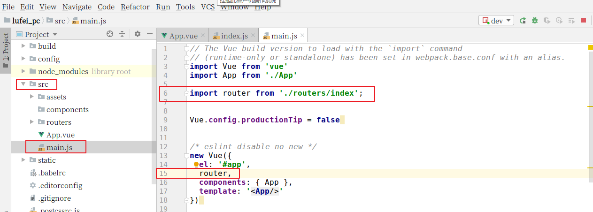
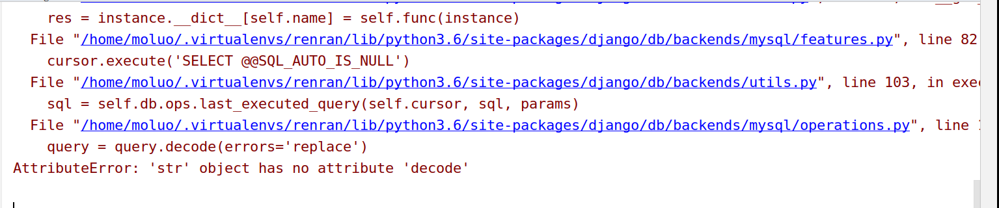

# 荏苒资讯前端项目搭建

## 创建项目目录

```bash
cd 项目根目录
vue init webpack 客户端项目目录
```

例如，我要把项目保存在 `~/Desktop/renran` 目录中，可以如下操作：

```bash
cd ~/Desktop/renran
vue init webpack renran_pc
```

这次在选择 vue-router 时，我们可以选择直接安装。

```bash
? Project name renran_pc
? Project description A Vue.js project
? Author Shuo Liu <liushuo432@outlook.com>
? Vue build standalone
? Install vue-router? Yes
? Use ESLint to lint your code? No
? Set up unit tests No
? Setup e2e tests with Nightwatch? No
? Should we run `npm install` for you after the project has been created? (recom
mended) npm
```

把 vue 项目构建好了，运行测试服务器。


打开项目已经，在 Python 的终端下运行 vue 项目，查看效果。

```bash
npm run dev
```

接下来，我们根据终端上效果显示的对应地址来访问项目（如果有多个vue项目在运行，8080端口被占据了，服务器会自动改端口，所以根据自己实际在操作中看到的地址来访问）。

访问：`http://localost:8080`，效果：


我们也可以把我们的前端项目进行 git 源代码管。

## 初始化前端项目

清除默认的 HelloWorld 组件和 `APP.vue` 中的默认样式


还有 router 中导入进来的组件：


接下来，我们可以查看效果了，一张白纸~


## 安装路由 vue-router

### 下载路由组件

如果前面没有选择安装 vue-router，则使用以下命令安装路由组件：

```bash
npm i vue-router -S
```

执行效果：


### 配置路由

#### 初始化路由对象

在 src 目录下创建 routers 路由目录，在 routers 目录下创建 `index.js` 路由文件

`index.js` 路由文件中，编写初始化路由对象的代码 .

```javascript
import Vue from "vue"
import Router from "vue-router"

// 这里导入可以让让用户访问的组件

Vue.use(Router);

export default new Router({
  // 设置路由模式为‘history’，去掉默认的#
  mode: "history",
  routes:[
    // 路由列表
    {
      path: '/',
    }
  ]
})
```


#### 注册路由信息

打开 `main.js` 文件，把 router 对象注册到 vue中。代码：

```javascript
// The Vue build version to load with the `import` command
// (runtime-only or standalone) has been set in webpack.base.conf with an alias.
import Vue from 'vue'
import App from './App'
import router from './routers/index';

Vue.config.productionTip = false

/* eslint-disable no-new */
new Vue({
  el: '#app',
  router,
  components: { App },
  template: '<App/>'
});
```



#### 在视图中显示路由对应的内容

在 `App.vue` 组件中，添加显示路由对应的内容。


代码：

```vue
<template>
  <div id="app">
    <router-view/>
  </div>
</template>

<script>
export default {
  name: 'App',
  components: {

  }
}
</script>

<style>

</style>
```

#### 创建并提供前端首页的组件

`routers/index.js` 代码：

```javascript
import Vue from "vue"
import Router from "vue-router"


// 这里导入可以让让用户访问的组件
import Home from "../components/Home"
Vue.use(Router);
//
export default new Router({
  // 设置路由模式为‘history’，去掉默认的#
  mode: "history",
  routes:[
    // 路由列表
     {
       path:"/",
       name:"Home",
       component:Home,
     },
   ]
})
```

##### 创建 Home 组件

`components/Home.vue` 代码：

```vue
<template>
  <div id="home">
    前端首页
  </div>
</template>
<script>
  export default {
      name:"Home",
      data(){
          return {
              
          }
      }
  }
</script>

<style scoped>

</style>
```


## 前端初始化全局变量和全局方法

在 src 目录下创建 `settings.js` 站点开发配置文件：

```javascript
export default {
  Host:"http://127.0.0.1",
}
```

在 `main.js` 中引入新创建的 `settings.py`：

```javascript
// The Vue build version to load with the `import` command
// (runtime-only or standalone) has been set in webpack.base.conf with an alias.
import Vue from 'vue'
import App from './App'
import router from './router'

Vue.config.productionTip = false

// 项目配置和公共代码
import settings from "./settings";
Vue.prototype.$settings = settings

/* eslint-disable no-new */
new Vue({
  el: '#app',
  router,
  components: { App },
  template: '<App/>'
})
```

## 引入 ElementUI

先在 renran_pc 目录下安装 ElementUI，使用命令：

```bash
npm i element-ui -S
```

上面的命令等同于 

```bash
npm install element-ui --save
```

执行命令效果：


### 配置 ElementUI 到项目中

在 `main.js` 中导入 ElementUI，并调用。代码：

```javascript
// elementUI 导入
import ElementUI from 'element-ui';
import "element-ui/lib/theme-chalk/index.css";
// 调用插件
Vue.use(ElementUI);
```

效果：


## 首页代码导入

成功引入了 ElementUI 以后，接下来我们就可以开始进入前端页面开发，首先是首页。

接下来我们把之前完成的首页，直接拿过来使用（注意除了组件以外，还有静态文件也需要拿过来，包括 `App.vue` 里面的公共样式），并运行项目。

创建 `static/css/reset.css`，全局 css 初始化代码：

```css
body,h1,h2,h3,h4,h5,ul,p{
  padding: 0;
  margin:0;
  font-weight: normal;
}
a{
  text-decoration: none;
  color: #4a4a4a;
}
a:hover{
  color: #000;
}
input{
  outline: none;
}
ul{
  list-style: none;
}

img{
  width: 100%;
}

.header .el-menu li .el-submenu__title{
  height: 26px!important;
  line-height: 26px!important;
}
.el-menu--popup{
  min-width: 140px;
}
.el-checkbox__inner{
  width:16px;
  height: 16px;
  border: 1px solid #999;
}
.el-checkbox__inner:after{
  width: 6px;
  height: 8px;
}
.el-form-item__content{
  margin-left:0px!important;
  width: 50px;
}
.full-left{
  float: left;
}
.full-right{
  float: right;
}
```

`main.js` 中将重置样式的 `reset.css` 引入进来：

```javascript
...
// 调用插件
Vue.use(ElementUI);

// 重置样式
import "../static/css/reset.css";
```

`Home.vue` 中添加首页模板代码：

```vue
<template>
  <div id="home">
    <Header></Header>
    <div class="container">
      <div class="row">
        <div class="main">
          <!-- Banner -->
          <div class="banner">
            <el-carousel height="272px" indicator-position="none" :interval="2000">
              <el-carousel-item v-for="item in 4" :key="item">
                <h3 class="small">{{ item }}</h3>
              </el-carousel-item>
            </el-carousel>
          </div>
          <div id="list-container">
            <!-- 文章列表模块 -->
            <ul class="note-list">
              <li class="">
                <div class="content">
                  <a class="title" target="_blank" href="">常做此运动，让你性福加倍</a>
                  <p class="abstract">运动，是人类在发展过程中有意识地对自己身体素质的培养的各种活动 运动的方式多种多样 不仅仅是我们常知的跑步，球类，游泳等 今天就为大家介绍一种男...</p>
                  <div class="meta">
                    <span class="jsd-meta">
                       4.8
                    </span>
                    <a class="nickname" target="_blank" href="">上班族也健身</a>
                    <a target="_blank" href="">
                       4
                    </a>
                    <span> 31</span>
                  </div>
                </div>
              </li>
              <li class="have-img">
                <a class="wrap-img" href="" target="_blank">
                  
                </a>
                <div class="content">
                  <a class="title" target="_blank" href="">“不耻下问”，正在毁掉你的人生</a>
                  <p class="abstract">
                    在过去，遇到不懂的问题，你不耻下问，找个人问问就行；在现在，如果你还这么干，多半会被认为是“搜商低”。 昨天，35岁的表姐把我拉黑了。 表姐是医...
                  </p>
                  <div class="meta">
                    <span class="jsd-meta">
                       6.7
                    </span>
                    <a class="nickname" target="_blank" href="">_飞鱼</a>
                    <a target="_blank" href="">
                       33
                    </a>
                    <span> 113</span>
                    <span> 2</span>
                  </div>
                </div>
              </li>
            </ul>
            <!-- 文章列表模块 -->
          </div>
        <a href="" class="load-more">阅读更多</a></div>
        <div class="aside">
          <!-- 推荐作者 -->
          <div class="recommended-author-wrap">
            <!---->
            <div class="recommended-authors">
              <div class="title">
                <span>推荐作者</span>
                <a class="page-change">换一批</a>
              </div>
              <ul class="list">
                <li>
                  <a href="" target="_blank" class="avatar">
                    
                  </a>
                  <a class="follow" state="0">关注</a>
                  <a href="" target="_blank" class="name">董克平日记</a>
                  <p>写了807.1k字 · 2.5k喜欢</p>
                </li>
                <li>
                  <a href="" target="_blank" class="avatar">
                    
                  </a>
                  <a class="follow" state="0">关注</a>
                  <a href="" target="_blank" class="name">董克平日记</a>
                  <p>写了807.1k字 · 2.5k喜欢</p>
                </li>

              </ul>
              <a href="" target="_blank" class="find-more">查看全部 ></a>
              <!---->
            </div>
          </div>
        </div>
      </div>
    </div>
    <Footer></Footer>
  </div>
</template>
<script>
  import Header from "./common/Header";
  import Footer from "./common/Footer";
  export default {
      name:"Home",
      data(){
          return {

          }
      },
      components:{
        Header,
        Footer,
      }
  }
</script>

<style scoped>
.container{
    width: 960px;
    margin-right: auto;
    margin-left: auto;
    padding-left: 15px;
    padding-right: 15px;
    box-sizing: border-box;
}
.container:after, .container:before {
    content: " ";
    display: table;
}
.row {
    margin-left: -15px;
    margin-right: -15px;
}
.row:after, .row:before {
    content: " ";
    display: table;
}
.main {
    padding-top: 30px;
    padding-right: 0;
    position: relative;
    min-height: 1px;
    padding-left: 15px;
    width: 66.66667%;
    float: left;
    box-sizing: border-box;
}
.main .banner{
    width: 640px;
    height: 272px;
}
.note-list {
    margin: 0;
    padding: 0;
    list-style: none;
}
.note-list li {
    position: relative;
    width: 100%;
    margin: 0 0 15px;
    padding: 15px 2px 20px 0;
    border-bottom: 1px solid #f0f0f0;
    word-wrap: break-word;
    line-height: 20px;
}
.note-list li.have-img {
    min-height: 140px;
}
.note-list .have-img .wrap-img {
    position: absolute;
    top: 50%;
    margin-top: -60px;
    right: 0;
    width: 150px;
    height: 100px;
}
.note-list .have-img .wrap-img img {
    width: 100%;
    height: 100%;
    border-radius: 4px;
    border: 1px solid #f0f0f0;
    vertical-align: middle;
}
.main .note-list .have-img .content {
    padding-right: 165px;
    box-sizing: border-box;
}
.note-list .title {
    margin: -7px 0 4px;
    display: inherit;
    font-size: 18px;
    font-weight: 700;
    line-height: 1.5;
    color: #333;
}
.note-list .title:hover{
    text-decoration: underline;
}
.note-list .abstract {
    margin: 0 0 8px;
    font-size: 13px;
    line-height: 24px;
    color: #999;
}
.note-list .meta {
    padding-right: 0!important;
    font-size: 12px;
    font-weight: 400;
    line-height: 20px;
}
.note-list .meta span {
    margin-right: 10px;
    color: #b4b4b4;
}

.jsd-meta {
    color: #ea6f5a!important;
}
.note-list .meta a, .note-list .meta a:hover {
    transition: .1s ease-in;
}
.note-list .meta a {
    margin-right: 10px;
    color: #b4b4b4;
}
.note-list .meta img{
    width: 15px;
    vertical-align: middle;
}

.main .load-more {
    width: 100%;
    border-radius: 20px;
    background-color: #a5a5a5;
    margin: 30px auto 60px;
    padding: 10px 15px;
    text-align: center;
    font-size: 15px;
    color: #fff;
    display: block;
    line-height: 1.42857;
    box-sizing: border-box;
}
.main .load-more:hover {
    background-color: #9b9b9b;
}
.aside {
    padding: 30px 0 0;
    margin-left: 4.16667%;
    width: 29.16667%;
    float: left;
    position: relative;
    min-height: 1px;
    box-sizing: border-box;
}
.recommended-authors {
    margin-bottom: 20px;
    padding-top: 0;
    font-size: 13px;
    text-align: center;
}
.recommended-authors .title {
    text-align: left;
}
.recommended-authors .title span {
    font-size: 14px;
    color: #969696;
}
.recommended-authors .title .page-change {
    float: right;
    display: inline-block;
    font-size: 16px;
    color: #969696;
}
.icon-change{
    width: 16px;
    vertical-align: middle;
}
.recommended-authors .list {
    margin: 0 0 20px;
    text-align: left;
    list-style: none;
}
.recommended-authors .list li {
    margin-top: 15px;
    line-height: 20px;
}
.recommended-authors .list .avatar {
    float: left;
    width: 48px;
    height: 48px;
    margin-right: 10px;
}

.avatar {
    width: 24px;
    height: 24px;
    display: block;
    cursor: pointer;
}
.avatar img {
    width: 100%;
    height: 100%;
    border: 1px solid #ddd;
    border-radius: 50%;
}
.follow{
    font-size: 14px;
    color: #42c02e;
    border-color: #42c02e;
    font-weight: 400;
    line-height: normal;
}
.follow img{
    width: 14px;
}
.recommended-authors .list .follow, .recommended-authors .list .follow-cancel, .recommended-authors .list .follow-each, .recommended-authors .list .following {
    float: right;
    margin-top: 5px;
    padding: 0;
    font-size: 13px;
    color: #42c02e;
    box-sizing: border-box;
}
.recommended-authors .list .name {
    padding-top: 5px;
    margin-right: 60px;
    font-size: 14px;
    display: block;
    box-sizing: border-box;
}
.recommended-authors .list p {
    font-size: 12px;
    color: #969696;
    margin: 0 0 10px;
    box-sizing: border-box;
}
.recommended-authors .find-more {
    position: absolute;
    padding: 7px 7px 7px 12px;
    left: 0;
    width: 100%;
    font-size: 13px;
    color: #787878;
    background-color: #f7f7f7;
    border: 1px solid #dcdcdc;
    border-radius: 4px;
}
.row:after {
    clear: both;
}
.el-carousel__item h3 {
    color: #475669;
    font-size: 14px;
    opacity: 0.75;
    line-height: 150px;
    margin: 0;
}

.el-carousel__item:nth-child(2n) {
    background-color: #99a9bf;
}

.el-carousel__item:nth-child(2n+1) {
    background-color: #d3dce6;
}
</style>
```

将 `iconfont.css` 和 `iconfont.eot` 两个图标文件放到 `static/css` 目录下，并在 `main.js` 将它们引入进来：

```javascript
// 重置样式
import "../static/css/reset.css";

// 引入 iconfont 图标字体
import "../static/css/iconfont.css"
import "../static/css/iconfont.eot"

/* eslint-disable no-new */
```

创建 `components/common/Header.vue` 头部组件：

```vue
<template>
  <div class="header">
    <nav class="navbar">
      <div class="width-limit">
        <!-- 左上方 Logo -->
        <a class="logo" href="/"></a>

        <!-- 右上角 -->
        <!-- 未登录显示登录/注册/写文章 -->
        <a class="btn write-btn" target="_blank" href="/writer">写文章</a>
        <a class="btn sign-up" id="sign_up" href="/register">注册</a>
        <a class="btn log-in" id="sign_in" href="/login">登录</a>
        <div class="container">
          <div class="collapse navbar-collapse" id="menu">
            <ul class="nav navbar-nav">
              <li class="tab active">
                <a href="/">
                  
                  <span class="menu-text">首页</span>
                </a>
              </li>
              <li class="search">
                <form target="_blank" action="/search" accept-charset="UTF-8" method="get">
                  <input type="text" name="q" id="q" value="" autocomplete="off" placeholder="搜索" class="search-input">
                  <a class="search-btn" href="javascript:void(0)"></a>
                </form>
              </li>
            </ul>
          </div>
        </div>

        <!-- 如果用户登录，显示下拉菜单 -->
      </div>
    </nav>
  </div>
</template>

<script>
    export default {
        name: "Header"
    }
</script>

<style scoped>
.header{
  height: 56px;
}
.container {
    width: 960px;
    margin-right: auto;
    margin-left: auto;
    padding-left: 15px;
    padding-right: 15px;
}
.container:after, .container:before {
    content: " ";
    display: table;
}
.container:after {
    clear: both;
}
.navbar {
    background-color: #fff;
    border-color: #f0f0f0;
    top: 0;
    border-width: 0 0 1px;
    border-radius: 0;
}
.navbar-nav {
    float: left;
    margin: 0;
}
.navbar:after, .navbar:before {
    content: " ";
    display: table;
    box-sizing: border-box;
}
.nav:after, .nav:before {
    content: " ";
    display: table;
}
nav .width-limit {
    min-width: 768px;
    max-width: 1440px;
    margin: 0 auto;
}
nav .logo {
    float: left;
    height: 56px;
    padding: 0;
}
nav .logo img {
    height: 100%;
    vertical-align: middle;
    border: 0;
}
.btn {
    display: inline-block;
    margin-bottom: 0;
    font-weight: 400;
    text-align: center;
    vertical-align: middle;
    touch-action: manipulation;
    cursor: pointer;
    background-image: none;
    border: 1px solid transparent;
    white-space: nowrap;
    padding: 6px 12px;
    font-size: 14px;
    line-height: 1.42857;
    border-radius: 4px;
}
nav .write-btn {
    float: right;
    width: 100px;
    height: 24px;
    line-height: 24px;
    margin: 8px 12px 0;
    border-radius: 20px;
    font-size: 15px;
    color: #fff;
    background-color: #ea6f5a;
    text-decoration: none;
}
nav .log-in, nav .log-in:hover {
    color: #969696;
}
nav .log-in {
    float: right;
    margin: 11px 6px 0 10px;
    font-size: 15px;
}
nav .sign-up {
    float: right;
    width: 80px;
    height: 24px;
    line-height: 24px;
    margin: 9px 5px 0 15px;
    border: 1px solid rgba(236,97,73,.7);
    border-radius: 20px;
    font-size: 15px;
    color: #ea6f5a;
    background-color: transparent;
}
nav .icon-write {
    margin-right: 3px;
    width: 19px;
    height: 19px;
    vertical-align: middle;
}
nav .menu-text{
    font-size: 17px;
    color: #ea6f5a;
}
nav .menu-icon {
    width: 20px;
    height: 20px;
    vertical-align: sub;
    margin-right: 3px;
}
nav .nav .tab a {
    height: 56px;
    line-height: 26px;
    padding: 15px;
    color: #ea6f5a;
    background: none;
}
nav .navbar-nav li {
    margin-right: 10px;
    float: left;
    position: relative;
    display: block;
    box-sizing: border-box;
    height: 56px;
    line-height: 56px;
}
.navbar-nav {
    float: left;
    margin: 0;
}
nav form {
    position: relative;
    top: 9px;
    margin: 0 0 20px;
    box-sizing: border-box;
    line-height: 20px;
}
nav form .search-input {
    padding: 0 40px 0 20px;
    height: 38px;
    font-size: 14px;
    border: 1px solid #eee;
    border-radius: 40px;
    background: #eee;
    transition: width .5s;
    width: 240px;
    outline: none;
}
nav form .search-input:focus {
    width: 320px;
    outline: none;
}
.navbar-default .navbar-collapse, .navbar-default .navbar-form {
    border-color: #e7e7e7;
    padding-left: 0;
    padding-right: 0;
    box-sizing: border-box;
    width: auto;
    border-top: 0;
    box-shadow: none;
}
.navbar {
    background-color: #fff;
    top: 0;
    border-radius: 0;
    position: fixed;
    right: 0;
    left: 0;
    z-index: 1030;
    min-height: 50px;
    margin-bottom: 20px;
    border-bottom: 1px solid #f0f0f0;
}
nav {
    height: 56px;
}
.navbar:after, .navbar:before {
    content: " ";
    display: table;
}
nav form .search-btn {
    position: absolute;
    display: block;
    top: 0;
    right: 10px;
    width: 30px;
    height: 30px;
    padding: 0;
    margin: 5px -1px 0 0;
    background: transparent url("../../../static/image/search-focus.svg") no-repeat 6px 6px;
    background-size: 20px;
}
nav form .search-input:focus~a{
    border-radius: 50%;
    background-color: #696969;
    background-image: url("../../../static/image/search-blur.svg");
}
nav .sign-up:hover {
    color: #ec6149;
    border-color: #ec6149;
    background-color: rgba(236,97,73,.05);
}
nav .write-btn:focus, nav .write-btn:hover {
    color: #fff;
    background-color: #ec6149;
}
</style>

```

再创建 `components/common/Footer.vue` 脚部组件：

```vue
<template>
<footer class="container">
  <div class="row">
    <div class="main">
      <a target="_blank" href="">关于荏苒</a>
      <em> · </em>
      <a target="_blank" href="">联系我们</a>
      <em> · </em>
      <a target="_blank" href="">加入我们</a>
      <em> · </em>
      <a target="_blank" href="">帮助中心</a>
      <em> · </em>
      <a target="_blank" href="http://www.jianshu.com/p/cabc8fa39830">合作伙伴</a>
      <div class="icp">©2016-2019 广州荏苒信息科技有限公司 / 荏苒 / 粤ICP备16018329号-5 /</div>
    </div>
  </div>
</footer>
</template>

<script>
    export default {
        name: "Footer"
    }
</script>

<style scoped>
.container {
    width: 960px;
    margin-right: auto;
    margin-left: auto;
    padding-left: 15px;
    padding-right: 15px;
    margin-bottom: 20px;
    box-sizing: border-box;
}
.container:after, .container:before {
    content: " ";
    display: table;
}
footer .row {
    padding-top: 25px;
    box-sizing: border-box;
    margin-left: -15px;
    margin-right: -15px;
}
footer .main {
    padding-right: 0;
    font-size: 13px;
    color: #969696;
  width: 70.83333%;
}
footer .icp, footer .icp a {
    color: #c8c8c8;
}
footer .icp {
    margin-top: 10px;
    font-size: 12px;
}
footer .main a {
    color: #969696;
    display: inline-block;
}
.row:after {
    clear: both;
}
</style>
```

然后将图片添加到 `static/images` 目录下，即可初见成效：


## 编写开发文档

使用 git 提交代码修改后，即可编写今天的开发文档，在 `renran/docs` 目录下，创建名为 `开发文档.md` 的文件。参考内容如下：

### 2020-02-27 版本：8bf86c5

开发人员：刘硕

提交版本代码需要修复 2 个 BUG

因为我们用的是 Django 2.2.0 版本，执行数据库迁移命令会导致错误，所以需要修改一下源代码。

数据库版本检测导致的错误：


数据库的版本检测代码注释掉：


重启项目，又出现了另一个关于 bytes 转换编码的问题，错误如下：



第二个错误也是因为数据库版本的默认编码导致，query 返回的内容格式使用有误。

修改一行代码，把 query 查询结果转换格式改为 bytes类型

```python
query = query.decode(errors='replace')
# 改为下面：
query = query.encode(errors='replace')
```

执行数据库迁移指令：

```bash
python manage.py makemigrations
python manage.py migrate
```

